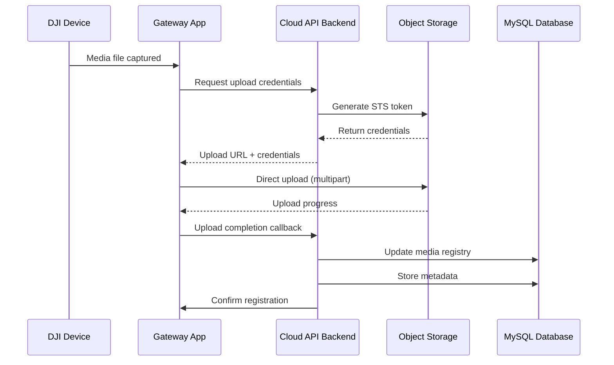

# DJI Cloud API Demo - Product Specification & Technical Documentation

**Version:** 1.10.0  
**Last Updated:** December 2025  
**Project Status:** Deprecated (as of April 10, 2025)  

---

## Table of Contents

1. [Executive Summary & Product Overview](#executive-summary--product-overview)
2. [Complete Technology Stack Analysis](#complete-technology-stack-analysis)
3. [Architecture Deep Dive](#architecture-deep-dive)
4. [API Endpoints Comprehensive Documentation](#api-endpoints-comprehensive-documentation)
5. [Function Sets Analysis](#function-sets-analysis)
6. [Component Interaction Diagrams](#component-interaction-diagrams)
7. [Data Models and Domain Architecture](#data-models-and-domain-architecture)
8. [Integration Points and Extension Architecture](#integration-points-and-extension-architecture)
9. [Security and Authentication Architecture](#security-and-authentication-architecture)
10. [Deployment and Configuration](#deployment-and-configuration)

---

## 1. Executive Summary & Product Overview

### What is DJI Cloud API?

The DJI Cloud API is a comprehensive cloud platform integration solution that enables third-party developers to integrate DJI enterprise drones and dock systems with their cloud platforms without developing custom mobile applications. It eliminates the need for MSDK-based custom app development by utilizing DJI Pilot 2 as the gateway for cloud communication.

### Target Audience and Use Cases

**Primary Users:**
- Enterprise cloud platform developers
- System integrators
- Fleet management companies
- Government agencies
- Industrial automation providers

**Key Use Cases:**
- Remote drone fleet management
- Automated dock operations
- Real-time telemetry and monitoring
- Live video streaming integration
- Wayline mission automation
- Health monitoring and maintenance
- Media management and analysis

### Key Value Propositions

1. **Accelerated Development**: Skip custom app development; focus on cloud platform features
2. **Standardized Integration**: Consistent API across all supported DJI devices
3. **Industrial Grade**: Support for M30/M300/M350/M3E/M3D/M400 aircraft and dock systems
4. **Real-time Capabilities**: MQTT, WebSocket, and HTTP protocols for comprehensive communication
5. **Comprehensive Feature Set**: Complete pilot and dock function sets covering all operational scenarios

### Project Status & Deprecation Notice

**Important Notice**: As of April 10, 2025, DJI officially discontinued maintenance and support for this demo project. Key implications:

- **Security Warning**: The demo may contain unpatched security vulnerabilities
- **Production Use**: Not recommended for production deployments without security audit
- **Support**: No official technical support available
- **Alternatives**: Developers should evaluate newer DJI SDK offerings

---

## 2. Complete Technology Stack Analysis

### Backend Architecture


**Core Technologies:**
- **Framework**: Spring Boot 2.7.12 with Java 11
- **Build Tool**: Apache Maven 3.x
- **Database**: MySQL 8.0+ with connection pooling (Druid 1.2.6)
- **ORM**: MyBatis Plus 3.4.2 with automatic pagination
- **Cache**: Redis with Lettuce client
- **Authentication**: JWT (Auth0 library 3.12.1)
- **Documentation**: Swagger/OpenAPI 3

### Frontend Architecture (Vue.js)

**Technology Stack:**
- **Framework**: Vue 3.2.26 with Composition API
- **Build Tool**: Vite 2.4.0
- **Language**: TypeScript 4.5.4
- **UI Library**: Ant Design Vue 2.2.8
- **State Management**: Vuex 4.0.2
- **Routing**: Vue Router 4
- **Real-time**: MQTT.js 4.3.7 + ReconnectingWebSocket 4.4.0

**Key Features:**
- Real-time device monitoring dashboard
- Interactive map integration (AMap)
- Live video streaming (Agora RTC SDK NG 4.12.1)
- Multi-language support (Vue I18n)
- Responsive design with mobile support

### Communication Protocols


---

## 3. Architecture Deep Dive

### High-Level System Architecture


### Service Layer Architecture


### Data Flow Architecture


---

## 4. API Endpoints Comprehensive Documentation

### Authentication & User Management

#### Authentication Flow
```http
POST /manage/api/v1/login
Content-Type: application/json

{
    "username": "adminPC",
    "password": "adminPC", 
    "flag": 1
}

Response:
{
    "code": 0,
    "message": "success",
    "data": {
        "token": "eyJhbGciOiJIUzI1NiJ9...",
        "expires_in": 86400
    }
}
```

#### Token Refresh
```http
POST /manage/api/v1/token/refresh
Authorization: Bearer {token}

Response:
{
    "code": 0,
    "data": {
        "token": "eyJhbGciOiJIUzI1NiJ9...",
        "expires_in": 86400
    }
}
```

### Device Management APIs

#### Get Device Topology
```http
GET /manage/api/v1/devices/{workspace_id}/devices
Authorization: Bearer {token}

Response:
{
    "code": 0,
    "data": [
        {
            "device_sn": "1ZNDH7D0010078",
            "device_name": "RC-Survey-001", 
            "device_type": 119,
            "domain": 0,
            "status": true,
            "children": [
                {
                    "device_sn": "1234567890ABCDEF",
                    "device_type": 89,
                    "domain": 1,
                    "status": true
                }
            ]
        }
    ]
}
```

#### Device Binding
```http
POST /manage/api/v1/devices/{device_sn}/binding
Authorization: Bearer {token}
Content-Type: application/json

{
    "device_name": "Survey Drone 001",
    "workspace_id": "workspace_123",
    "bound_time": "2023-12-01T10:00:00Z"
}
```

#### Device Unbinding
```http
DELETE /manage/api/v1/devices/{device_sn}/unbinding
Authorization: Bearer {token}
```

### Live Streaming APIs

#### Get Live Stream Capacity
```http
GET /manage/api/v1/live/capacity
Authorization: Bearer {token}

Response:
{
    "code": 0,
    "data": {
        "available_video_number": 5,
        "device_list": [
            {
                "device_sn": "1ZNDH7D0010078",
                "available_video_number": 2,
                "camera_list": [
                    {
                        "camera_index": "52-0-0",
                        "camera_name": "Main Camera",
                        "video_list": [
                            {
                                "video_id": "1ZNDH7D0010078/52-0-0/normal-0",
                                "video_type": "normal",
                                "switchable_video_types": ["normal", "ir", "zoom"]
                            }
                        ]
                    }
                ]
            }
        ]
    }
}
```

#### Start Live Stream
```http
POST /manage/api/v1/live/streams/start
Authorization: Bearer {token}
Content-Type: application/json

{
    "url": "rtmp://192.168.1.1/live/stream001",
    "url_type": 1,
    "video_id": "1ZNDH7D0010078/52-0-0/normal-0",
    "video_quality": 0
}
```

#### Stop Live Stream
```http
POST /manage/api/v1/live/streams/stop
Authorization: Bearer {token}
Content-Type: application/json

{
    "video_id": "1ZNDH7D0010078/52-0-0/normal-0"
}
```

### Wayline Management APIs

#### Create Wayline Job
```http
POST /wayline/api/v1/workspaces/{workspace_id}/jobs
Authorization: Bearer {token}
Content-Type: application/json

{
    "file_id": "wayline_file_123",
    "job_name": "Survey Mission Alpha",
    "dock_sn": "DOCK_001_ABC123",
    "scheduled_start_time": "2023-12-01T10:00:00Z",
    "task_type": 1,
    "way_line_id": 12345,
    "executable_conditions": {
        "battery_capacity": 90,
        "weather_acceptable": true
    }
}
```

#### Execute Wayline Job
```http
POST /wayline/api/v1/workspaces/{workspace_id}/jobs/{job_id}/execute
Authorization: Bearer {token}
```

### Device Control APIs

#### DRC (Direct Remote Control) Connect
```http
POST /control/api/v1/workspaces/{workspace_id}/drc/connect
Authorization: Bearer {token}
Content-Type: application/json

{
    "device_sn": "1ZNDH7D0010078",
    "drc_mode": 1
}

Response:
{
    "code": 0,
    "data": {
        "mqtt_broker": "mqtt://192.168.1.100:1883",
        "username": "drc_user_123",
        "password": "drc_password_456",
        "client_id": "drc_client_789"
    }
}
```

#### Enter DRC Mode
```http
POST /control/api/v1/workspaces/{workspace_id}/drc/enter
Authorization: Bearer {token}
Content-Type: application/json

{
    "device_sn": "1ZNDH7D0010078"
}
```

#### Exit DRC Mode
```http
POST /control/api/v1/workspaces/{workspace_id}/drc/exit
Authorization: Bearer {token}
Content-Type: application/json

{
    "device_sn": "1ZNDH7D0010078"
}
```

### Firmware Management APIs

#### Get Device Firmware Info
```http
GET /manage/api/v1/devices/{device_sn}/firmware
Authorization: Bearer {token}

Response:
{
    "code": 0,
    "data": {
        "current_version": "02.04.10.15",
        "available_versions": [
            {
                "version": "02.04.11.20",
                "release_notes": "Bug fixes and performance improvements",
                "mandatory": false
            }
        ]
    }
}
```

#### Start Firmware Upgrade
```http
POST /manage/api/v1/devices/{device_sn}/firmware/upgrade
Authorization: Bearer {token}
Content-Type: application/json

{
    "firmware_version": "02.04.11.20",
    "force_upgrade": false
}
```

### Media Management APIs

#### Get Media Files
```http
GET /media/api/v1/workspaces/{workspace_id}/files?device_sn={device_sn}&page=1&page_size=20
Authorization: Bearer {token}

Response:
{
    "code": 0,
    "data": {
        "list": [
            {
                "file_id": "media_file_123",
                "file_name": "IMG_20231201_100000.jpg",
                "file_size": 1024000,
                "created_time": "2023-12-01T10:00:00Z",
                "file_type": "photo",
                "thumbnail_url": "https://...",
                "download_url": "https://..."
            }
        ],
        "pagination": {
            "page": 1,
            "page_size": 20,
            "total": 150
        }
    }
}
```

### MQTT Topics Structure

#### Device Status Topics
```
# RC/Dock Status
thing/product/{device_sn}/state
├── battery_info
├── network_status  
├── gps_position
├── flight_mode
└── error_status

# Aircraft Status  
thing/product/{aircraft_sn}/state
├── flight_status
├── battery_info
├── gps_position
├── gimbal_attitude
├── camera_status
└── payload_status

# System Events
sys/product/{device_sn}/status
├── device_online
├── device_offline  
├── topology_update
└── capability_update
```

#### Command Topics
```
# Device Commands
thing/product/{device_sn}/services
├── takeoff
├── land
├── return_home
├── wayline_execute
├── camera_control
├── gimbal_control
└── live_stream_control

# Property Settings
thing/product/{device_sn}/property/set
├── flight_height_limit
├── return_home_altitude
├── obstacle_avoidance
├── night_lights
└── battery_maintenance
```

---

## 5. Function Sets Analysis

### Pilot Function Set

The Pilot Function Set encompasses all capabilities available when using DJI Pilot 2 on remote controllers to interface with cloud platforms.

#### 5.1 Access to Cloud Server

**Overview**: Establishes secure connection between DJI Pilot 2 and third-party cloud platforms.

**Key Components**:
- Device authentication and registration
- JWT token management  
- MQTT connection establishment
- WebSocket real-time communication
- Heartbeat and health monitoring

**Implementation Mapping**:
```java
// File: /Users/xicao/Avcrm/DJI-Cloud-API-Demo/sample/src/main/java/com/dji/sample/manage/service/impl/SDKDeviceService.java
@Override
public TopicStatusResponse<MqttReply> updateTopoOnline(
        TopicStatusRequest<UpdateTopo> request, MessageHeaders headers) {
    // Process device registration and topology updates
    // Map to specs/pilot-function-set/01-access-to-cloud-server.md
}
```

#### 5.2 Situation Awareness

**Overview**: Real-time monitoring of device status, location, and operational parameters.

**Key Features**:
- Device topology management
- Real-time telemetry streaming
- Status change notifications
- Multi-device coordination

**API Endpoints**:
- `GET /manage/api/v1/devices/{workspace_id}/devices` - Device topology
- WebSocket events for real-time updates
- MQTT topics: `thing/product/+/state`

#### 5.3 Live Stream Capabilities

**Overview**: Real-time video streaming from aircraft cameras to cloud platforms and web clients.

**Supported Protocols**:
- RTMP streaming
- RTSP streaming  
- Agora WebRTC
- GB28181 standard
- WHIP (WebRTC HTTP Ingestion Protocol)

**Implementation**:
```java
// File: /Users/xicao/Avcrm/DJI-Cloud-API-Demo/sample/src/main/java/com/dji/sample/manage/service/impl/SDKLivestreamService.java
@Override
public TopicStatusResponse<MqttReply> liveLensChange(
        TopicStatusRequest<LiveLensChangeRequest> request, MessageHeaders headers) {
    // Handle lens switching during live stream
    // Map to specs/pilot-function-set/03-live-stream.md
}
```

#### 5.4 Map Elements Management

**Overview**: Create, update, and manage map elements for flight planning and visualization.

**Element Types**:
- Points of Interest (POI)
- Flight boundaries
- No-fly zones
- Waypoint markers
- Custom geometric shapes

**REST API Operations**:
- `POST /map/api/v1/workspaces/{workspace_id}/elements` - Create elements
- `PUT /map/api/v1/workspaces/{workspace_id}/elements/{element_id}` - Update elements
- `GET /map/api/v1/workspaces/{workspace_id}/elements` - Retrieve elements
- `DELETE /map/api/v1/workspaces/{workspace_id}/elements/{element_id}` - Delete elements

#### 5.5 Media Management

**Overview**: Upload, download, and manage media files captured during flights.

**Features**:
- Fast upload with fingerprint checking
- Batch operations
- Thumbnail generation
- Metadata extraction
- Cloud storage integration (MinIO/OSS/S3)

**Upload Flow**:


#### 5.6 Wayline Management

**Overview**: Create, upload, and execute flight missions with predefined waypoints.

**Wayline Types**:
- Survey missions
- Inspection routes  
- Mapping flights
- Custom waypoint sequences

**Mission States**:
- `PENDING` - Awaiting execution
- `EXECUTING` - In progress
- `PAUSED` - Temporarily stopped
- `COMPLETED` - Successfully finished
- `FAILED` - Error occurred
- `CANCELED` - User canceled

#### 5.7 Log Extraction via JSBridge

**Overview**: Extract device logs through JavaScript bridge interface in DJI Pilot 2.

**JSBridge Methods**:
```javascript
// Device log extraction
window.djiBridge.startLogUpload({
    logTypes: ['flight', 'system', 'camera'],
    timeRange: {
        start: '2023-12-01T00:00:00Z',
        end: '2023-12-01T23:59:59Z'
    }
});

// Progress monitoring
window.djiBridge.onLogUploadProgress((progress) => {
    console.log('Upload progress:', progress);
});
```

#### 5.8 Third-Party App Integration

**Overview**: Enable third-party applications to integrate with DJI Pilot 2 through web view embedding.

**Integration Methods**:
- WebView H5 page embedding
- JSBridge API access
- Custom business logic implementation
- OAuth authentication support

#### 5.9 Live Flight Controls/Remote Control

**Overview**: Direct remote control capabilities through cloud interface.

**Control Types**:
- Flight commands (takeoff, land, RTH)
- Camera controls (zoom, focus, capture)
- Gimbal control
- Payload operations

### Dock Function Set

The Dock Function Set covers all capabilities for autonomous dock operations and fleet management.

#### 5.1 Access to Cloud Server (Dock)

**Overview**: Persistent connection management for 24/7 dock operations.

**Key Differences from Pilot**:
- Always-on connectivity
- Multiple network failover (4G/5G + Ethernet + WiFi)
- Enhanced security with certificate-based auth
- Automated reconnection with exponential backoff

**Implementation**:
```java
// File: /Users/xicao/Avcrm/DJI-Cloud-API-Demo/sample/src/main/java/com/dji/sample/manage/service/impl/SDKDeviceService.java
// Dock-specific connection handling with failover logic
private void handleDockConnection(String dockSn) {
    // Enhanced connection logic for dock systems
    // Map to specs/dock-function-set/01-access-to-cloud-server.md
}
```

#### 5.2 Device Management

**Overview**: Comprehensive management of dock and docked aircraft.

**Management Scope**:
- Dock system health monitoring
- Aircraft battery management
- Environmental sensor data
- Power system monitoring
- Security system status

#### 5.3 Firmware Upgrades

**Overview**: Remote firmware update capabilities for dock and aircraft.

**Update Types**:
- Dock system firmware
- Aircraft firmware
- Payload firmware
- Emergency patches

**Update Flow**:


#### 5.4 HMS (Health Management System)

**Overview**: Proactive health monitoring and maintenance alerts.

**Health Indicators**:
- Battery health and cycles
- Motor temperature and wear
- Sensor calibration status
- Communication link quality
- Environmental conditions

**Alert Levels**:
- `INFO` - Informational messages
- `NOTICE` - Attention required
- `WARNING` - Action recommended
- `ERROR` - Immediate attention needed

#### 5.5 Remote Debug

**Overview**: Remote troubleshooting and diagnostic capabilities.

**Debug Features**:
- Log collection and analysis
- Parameter adjustment
- Calibration procedures
- Network diagnostics
- Performance monitoring

#### 5.6 Custom Flight Area

**Overview**: Define custom flight boundaries and no-fly zones.

**Area Types**:
- Circular boundaries
- Polygon boundaries
- Altitude restrictions
- Time-based restrictions

#### 5.7 Multi-Dock Task Coordination

**Overview**: Coordinate missions across multiple dock installations.

**Coordination Features**:
- Task scheduling and prioritization
- Resource conflict resolution
- Load balancing across docks
- Centralized mission management

---

## 6. Component Interaction Diagrams

### Real-Time Telemetry Flow


### File Upload Workflow



### Command Execution Flow


### Authentication & Authorization Flow


---

## 7. Data Models and Domain Architecture

### Core Domain Entities

#### Device Hierarchy


#### Device Data Transfer Objects

```java
// File: /Users/xicao/Avcrm/DJI-Cloud-API-Demo/sample/src/main/java/com/dji/sample/manage/model/dto/DeviceDTO.java
public class DeviceDTO {
    private String deviceSn;           // Unique device identifier
    private String deviceName;         // User-friendly name
    private String workspaceId;        // Associated workspace
    private Integer deviceType;        // Type enum value
    private Integer domain;            // Domain enum value
    private Boolean status;            // Online/offline status
    private Date loginTime;           // Last connection time
    private List<DeviceDTO> children; // Sub-devices (aircraft, payloads)
    
    // Device capabilities and properties
    private DeviceCapabilityDTO capacity;
    private List<DevicePropertyDTO> properties;
}
```

### MQTT Message Schemas

#### Device State Message
```json
{
    "tid": "transaction_001",
    "bid": "business_001", 
    "timestamp": 1640995200000,
    "method": "state",
    "data": {
        "battery": {
            "capacity_percent": 85,
            "voltage": 22.8,
            "temperature": 25.5,
            "remain_flight_time": 1800,
            "return_home_power": 30
        },
        "position": {
            "latitude": 40.123456,
            "longitude": 116.123456,
            "altitude": 120.5,
            "height": 100.0
        },
        "flight_mode": "P-GPS",
        "rc_lost_action": "return_home",
        "home_point": {
            "latitude": 40.120000,
            "longitude": 116.120000,
            "altitude": 20.0
        }
    }
}
```

#### Service Command Message
```json
{
    "tid": "cmd_001",
    "bid": "business_001",
    "timestamp": 1640995200000,
    "method": "flight_takeoff",
    "data": {
        "security_takeoff_height": 1.2,
        "rth_altitude": 100,
        "is_forced": false
    }
}
```

### Database Schema

#### Device Management Tables

```sql
-- Device registry table
CREATE TABLE device (
    id BIGINT PRIMARY KEY AUTO_INCREMENT,
    device_sn VARCHAR(255) UNIQUE NOT NULL,
    device_name VARCHAR(255),
    workspace_id VARCHAR(255) NOT NULL,
    device_type INT NOT NULL,
    domain INT NOT NULL,
    device_desc TEXT,
    status TINYINT(1) DEFAULT 0,
    bound_time TIMESTAMP,
    login_time TIMESTAMP,
    created_time TIMESTAMP DEFAULT CURRENT_TIMESTAMP,
    updated_time TIMESTAMP DEFAULT CURRENT_TIMESTAMP ON UPDATE CURRENT_TIMESTAMP,
    INDEX idx_workspace_id (workspace_id),
    INDEX idx_device_sn (device_sn),
    INDEX idx_status (status)
);

-- Device firmware tracking
CREATE TABLE device_firmware (
    id BIGINT PRIMARY KEY AUTO_INCREMENT,
    device_sn VARCHAR(255) NOT NULL,
    firmware_version VARCHAR(255),
    upgrade_status INT DEFAULT 0,
    upgrade_progress INT DEFAULT 0,
    upgrade_start_time TIMESTAMP,
    upgrade_end_time TIMESTAMP,
    created_time TIMESTAMP DEFAULT CURRENT_TIMESTAMP,
    updated_time TIMESTAMP DEFAULT CURRENT_TIMESTAMP ON UPDATE CURRENT_TIMESTAMP,
    INDEX idx_device_sn (device_sn),
    INDEX idx_status (upgrade_status)
);

-- Wayline job management
CREATE TABLE wayline_job (
    id BIGINT PRIMARY KEY AUTO_INCREMENT,
    job_id VARCHAR(255) UNIQUE NOT NULL,
    workspace_id VARCHAR(255) NOT NULL,
    device_sn VARCHAR(255) NOT NULL,
    file_id VARCHAR(255) NOT NULL,
    job_name VARCHAR(255),
    task_type INT NOT NULL,
    status INT DEFAULT 0,
    execute_time TIMESTAMP,
    completed_time TIMESTAMP,
    created_time TIMESTAMP DEFAULT CURRENT_TIMESTAMP,
    updated_time TIMESTAMP DEFAULT CURRENT_TIMESTAMP ON UPDATE CURRENT_TIMESTAMP,
    INDEX idx_workspace_id (workspace_id),
    INDEX idx_device_sn (device_sn),
    INDEX idx_status (status)
);
```

### Configuration Data Models

#### MQTT Configuration
```yaml
# File: /Users/xicao/Avcrm/DJI-Cloud-API-Demo/sample/src/main/resources/application.yml
mqtt:
  BASIC:
    protocol: MQTT
    host: ${MQTT_HOST:localhost}
    port: ${MQTT_PORT:1883} 
    username: ${MQTT_USERNAME:JavaServer}
    password: ${MQTT_PASSWORD:123456}
    client-id: ${MQTT_CLIENT_ID:cloud-api-demo}
  DRC:
    protocol: WS
    host: ${DRC_MQTT_HOST:localhost}
    port: ${DRC_MQTT_PORT:8083}
    path: /mqtt
```

#### Object Storage Configuration
```yaml
oss:
  enable: ${OSS_ENABLE:false}
  provider: ${OSS_PROVIDER:ALIYUN} # ALIYUN, AWS, MINIO
  endpoint: ${OSS_ENDPOINT:https://oss-cn-hangzhou.aliyuncs.com}
  access-key: ${OSS_ACCESS_KEY}
  secret-key: ${OSS_SECRET_KEY}
  bucket: ${OSS_BUCKET:cloudapi-bucket}
  region: ${OSS_REGION:cn-hangzhou}
  expire: ${OSS_TOKEN_EXPIRE:3600}
```

### Enumeration Definitions

#### Device Operation States
```java
public enum DeviceStatusEnum {
    OFFLINE(0, "Offline"),
    ONLINE(1, "Online"), 
    MAINTENANCE(2, "Maintenance"),
    ERROR(3, "Error"),
    UPGRADING(4, "Firmware Upgrading");
}

public enum FlightModeEnum {
    MANUAL("Manual"),
    ATTI("Attitude"),
    P_GPS("P-GPS"),
    SPORT("Sport"),
    TRIPOD("Tripod"),
    CINEMATIC("Cinematic");
}

public enum MissionStatusEnum {
    PENDING(0, "Pending"),
    EXECUTING(1, "Executing"),
    PAUSED(2, "Paused"), 
    COMPLETED(3, "Completed"),
    FAILED(4, "Failed"),
    CANCELED(5, "Canceled");
}
```

---

## 8. Integration Points and Extension Architecture

### Abstract Service Layer

The Cloud SDK provides abstract base classes that enable customization and extension of functionality:

```java
// File: /Users/xicao/Avcrm/DJI-Cloud-API-Demo/cloud-sdk/src/main/java/com/dji/sdk/cloudapi/device/api/AbstractDeviceService.java
public abstract class AbstractDeviceService {
    
    /**
     * Handle device topology updates (online/offline events)
     */
    public abstract TopicStatusResponse<MqttReply> updateTopoOnline(
            TopicStatusRequest<UpdateTopo> request, MessageHeaders headers);
    
    /**
     * Process device state changes
     */
    public abstract TopicStatusResponse<MqttReply> updateTopoState(
            TopicStatusRequest<UpdateTopoState> request, MessageHeaders headers);
    
    /**
     * Handle device property set requests
     */
    public abstract TopicStatusResponse<MqttReply> propertySet(
            TopicStatusRequest<PropertySetRequest> request, MessageHeaders headers);
}
```

### Extension Implementation Pattern

```java
// File: /Users/xicao/Avcrm/DJI-Cloud-API-Demo/sample/src/main/java/com/dji/sample/manage/service/impl/SDKDeviceService.java
@Service
public class SDKDeviceService extends AbstractDeviceService {
    
    @Autowired
    private IDeviceService deviceService;
    
    @Autowired
    private IWebSocketMessageService webSocketService;
    
    @Override
    public TopicStatusResponse<MqttReply> updateTopoOnline(
            TopicStatusRequest<UpdateTopo> request, MessageHeaders headers) {
        
        // Custom business logic
        UpdateTopo topology = request.getData();
        String deviceSn = topology.getGatewaySn();
        
        // Process device registration
        DeviceDTO device = processDeviceRegistration(deviceSn, topology);
        
        // Broadcast real-time updates
        broadcastDeviceOnline(device);
        
        // Return standardized response
        return TopicStatusResponse.<MqttReply>builder()
                .tid(request.getTid())
                .bid(request.getBid()) 
                .timestamp(System.currentTimeMillis())
                .data(MqttReply.success())
                .build();
    }
    
    private void broadcastDeviceOnline(DeviceDTO device) {
        WebSocketMessageResponse<?> message = WebSocketMessageResponse.builder()
                .bizCode(BizCodeEnum.DEVICE_ONLINE.getCode())
                .timestamp(System.currentTimeMillis())
                .data(device)
                .build();
                
        webSocketService.sendMessageToAll(message);
    }
}
```

### Plugin Architecture for Storage

The system supports multiple object storage providers through a plugin architecture:

```java
// File: /Users/xicao/Avcrm/DJI-Cloud-API-Demo/sample/src/main/java/com/dji/sample/component/oss/service/IOssService.java
public interface IOssService {
    
    /**
     * Generate pre-signed upload URL
     */
    StsCredentialsResponse getCredentials(String dir, Long expire);
    
    /**
     * Upload file to object storage
     */
    String uploadFile(String bucketName, String objectName, InputStream inputStream);
    
    /**
     * Generate download URL
     */
    String generateDownloadUrl(String objectName, Long expire);
    
    /**
     * Delete file from storage
     */
    boolean deleteFile(String objectName);
}
```

#### Storage Provider Implementations

**MinIO Implementation**:
```java
// File: /Users/xicao/Avcrm/DJI-Cloud-API-Demo/sample/src/main/java/com/dji/sample/component/oss/service/impl/MinIOServiceImpl.java
@Service
@ConditionalOnProperty(name = "oss.provider", havingValue = "MINIO")
public class MinIOServiceImpl implements IOssService {
    
    @Autowired
    private MinioClient minioClient;
    
    @Override
    public StsCredentialsResponse getCredentials(String dir, Long expire) {
        // MinIO-specific STS token generation
        return generateMinioCredentials(dir, expire);
    }
}
```

**AWS S3 Implementation**:
```java
// File: /Users/xicao/Avcrm/DJI-Cloud-API-Demo/sample/src/main/java/com/dji/sample/component/oss/service/impl/AmazonS3ServiceImpl.java
@Service
@ConditionalOnProperty(name = "oss.provider", havingValue = "AWS")
public class AmazonS3ServiceImpl implements IOssService {
    
    @Autowired
    private AmazonS3 s3Client;
    
    @Override
    public StsCredentialsResponse getCredentials(String dir, Long expire) {
        // AWS S3-specific STS token generation
        return generateS3Credentials(dir, expire);
    }
}
```

### WebSocket Integration Points

```java
// File: /Users/xicao/Avcrm/DJI-Cloud-API-Demo/sample/src/main/java/com/dji/sample/component/websocket/service/impl/WebSocketMessageServiceImpl.java
@Service
public class WebSocketMessageServiceImpl implements IWebSocketMessageService {
    
    /**
     * Broadcast message to all connected clients
     */
    @Override
    public void sendMessageToAll(WebSocketMessageResponse<?> message) {
        ConcurrentWebSocketSession.send(message);
    }
    
    /**
     * Send message to specific workspace users
     */
    @Override
    public void sendMessageByWorkspace(String workspaceId, WebSocketMessageResponse<?> message) {
        ConcurrentWebSocketSession.sendByWorkspace(workspaceId, message);
    }
    
    /**
     * Send message to specific user
     */
    @Override
    public void sendMessageByUserId(String userId, WebSocketMessageResponse<?> message) {
        ConcurrentWebSocketSession.sendByUserId(userId, message);
    }
}
```

### Third-Party Integration Hooks

#### Custom Event Handlers
```java
@Component
public class CustomEventHandler {
    
    @EventListener
    public void handleDeviceOnline(DeviceOnlineEvent event) {
        // Custom logic when device comes online
        // E.g., notify external systems, trigger workflows
    }
    
    @EventListener  
    public void handleMissionComplete(MissionCompleteEvent event) {
        // Custom logic when mission completes
        // E.g., trigger data processing, send notifications
    }
    
    @EventListener
    public void handleAlarmGenerated(AlarmEvent event) {
        // Custom logic for alarm handling
        // E.g., escalation, external monitoring system integration
    }
}
```

#### External API Integration
```java
@Service
public class ExternalSystemIntegration {
    
    /**
     * Integration with external fleet management system
     */
    public void syncDeviceStatus(DeviceDTO device) {
        // Call external API to sync device status
        ExternalApiClient.updateDeviceStatus(device);
    }
    
    /**
     * Integration with external data analytics platform
     */
    public void sendTelemetryData(TelemetryData data) {
        // Stream telemetry to analytics platform
        AnalyticsClient.ingestTelemetryData(data);
    }
    
    /**
     * Integration with external notification system
     */
    public void sendAlert(AlertData alert) {
        // Send alert to external notification system
        NotificationClient.sendAlert(alert);
    }
}
```

### Configuration Extension Points

#### Custom Property Sources
```java
@Configuration
public class CustomConfigurationProperties {
    
    @Value("${custom.integration.enabled:false}")
    private boolean integrationEnabled;
    
    @Value("${custom.external.api.endpoint}")
    private String externalApiEndpoint;
    
    @Value("${custom.notification.webhook.url}")
    private String webhookUrl;
    
    @Bean
    @ConditionalOnProperty(name = "custom.integration.enabled", havingValue = "true")
    public ExternalSystemIntegration externalSystemIntegration() {
        return new ExternalSystemIntegration(externalApiEndpoint, webhookUrl);
    }
}
```

---

## 9. Security and Authentication Architecture

### JWT-Based Authentication

#### Token Structure
```json
{
    "header": {
        "alg": "HS256",
        "typ": "JWT"
    },
    "payload": {
        "iss": "DJI",
        "sub": "CloudApiSample", 
        "aud": "cloud-api-users",
        "exp": 1640995200,
        "iat": 1640908800,
        "user_id": "user_123",
        "username": "adminPC",
        "workspace_id": "workspace_456",
        "roles": ["ADMIN", "OPERATOR"],
        "permissions": ["DEVICE_CONTROL", "WAYLINE_EXECUTE"]
    },
    "signature": "signature_hash"
}
```

#### Authentication Flow
```java
// File: /Users/xicao/Avcrm/DJI-Cloud-API-Demo/sample/src/main/java/com/dji/sample/common/util/JwtUtil.java
@Component
public class JwtUtil {
    
    @Value("${jwt.secret}")
    private String secret;
    
    @Value("${jwt.age}")
    private Long tokenAge;
    
    /**
     * Generate JWT token with custom claims
     */
    public String generateToken(String userId, String username, String workspaceId) {
        return JWT.create()
                .withIssuer("DJI")
                .withSubject("CloudApiSample")
                .withClaim("user_id", userId)
                .withClaim("username", username)
                .withClaim("workspace_id", workspaceId)
                .withExpiresAt(new Date(System.currentTimeMillis() + tokenAge * 1000))
                .sign(Algorithm.HMAC256(secret));
    }
    
    /**
     * Validate and decode JWT token
     */
    public CustomClaim verifyToken(String token) {
        try {
            JWTVerifier verifier = JWT.require(Algorithm.HMAC256(secret)).build();
            DecodedJWT jwt = verifier.verify(token);
            
            return CustomClaim.builder()
                    .id(jwt.getClaim("user_id").asString())
                    .username(jwt.getClaim("username").asString())
                    .workspaceId(jwt.getClaim("workspace_id").asString())
                    .build();
        } catch (JWTVerificationException e) {
            throw new UnauthorizedException("Invalid token");
        }
    }
}
```

### API Security Interceptor

```java
// File: /Users/xicao/Avcrm/DJI-Cloud-API-Demo/sample/src/main/java/com/dji/sample/component/AuthInterceptor.java
@Component
public class AuthInterceptor implements HandlerInterceptor {
    
    @Autowired
    private JwtUtil jwtUtil;
    
    @Override
    public boolean preHandle(HttpServletRequest request, 
                           HttpServletResponse response, 
                           Object handler) throws Exception {
        
        // Skip authentication for login endpoint
        if (request.getRequestURI().contains("/login")) {
            return true;
        }
        
        // Extract JWT token from header
        String token = extractToken(request);
        if (token == null) {
            response.setStatus(HttpStatus.UNAUTHORIZED.value());
            return false;
        }
        
        try {
            // Validate token and extract claims
            CustomClaim claims = jwtUtil.verifyToken(token);
            request.setAttribute("TOKEN_CLAIM", claims);
            
            // Optional: Check permissions for specific endpoints
            validatePermissions(request.getRequestURI(), claims);
            
            return true;
        } catch (Exception e) {
            response.setStatus(HttpStatus.UNAUTHORIZED.value());
            return false;
        }
    }
    
    private String extractToken(HttpServletRequest request) {
        String authHeader = request.getHeader("Authorization");
        if (authHeader != null && authHeader.startsWith("Bearer ")) {
            return authHeader.substring(7);
        }
        return null;
    }
    
    private void validatePermissions(String uri, CustomClaim claims) {
        // Implement role-based access control
        if (uri.contains("/control/") && !hasControlPermission(claims)) {
            throw new ForbiddenException("Insufficient permissions for control operations");
        }
    }
}
```

### MQTT Security

#### MQTT ACL (Access Control List)

```java
// File: /Users/xicao/Avcrm/DJI-Cloud-API-Demo/sample/src/main/java/com/dji/sample/control/model/dto/JwtAclDTO.java
@Data
public class JwtAclDTO {
    private String username;     // MQTT username
    private String password;     // MQTT password  
    private String clientId;     // MQTT client ID
    private List<String> publishTopics;   // Allowed publish topics
    private List<String> subscribeTopics; // Allowed subscribe topics
    private Long expiresAt;      // Token expiration
}
```

#### DRC (Direct Remote Control) Authentication

```java
// File: /Users/xicao/Avcrm/DJI-Cloud-API-Demo/sample/src/main/java/com/dji/sample/control/service/impl/DrcServiceImpl.java
@Service
public class DrcServiceImpl implements IDrcService {
    
    @Override
    public DrcModeMqttBroker userDrcAuth(String workspaceId, String userId, 
                                        String username, DrcConnectParam param) {
        
        // Validate user permissions for DRC
        if (!hasControlPermission(userId, param.getDeviceSn())) {
            throw new ForbiddenException("User not authorized for device control");
        }
        
        // Generate temporary MQTT credentials for DRC session
        String drcUsername = generateDrcUsername(userId, param.getDeviceSn());
        String drcPassword = generateDrcPassword();
        
        // Set ACL permissions for DRC topics
        List<String> allowedTopics = Arrays.asList(
            "thing/product/" + param.getDeviceSn() + "/services",
            "thing/product/" + param.getDeviceSn() + "/services_reply"
        );
        
        return DrcModeMqttBroker.builder()
                .host(drcMqttConfig.getHost())
                .port(drcMqttConfig.getPort())
                .username(drcUsername)
                .password(drcPassword)
                .clientId(generateClientId(userId))
                .publishTopics(allowedTopics)
                .subscribeTopics(allowedTopics)
                .build();
    }
}
```

### Data Encryption and Transport Security

#### TLS Configuration

```yaml
# Application configuration for production deployment
server:
  port: 6789
  ssl:
    enabled: true
    key-store: classpath:keystore.p12
    key-store-password: ${SSL_KEYSTORE_PASSWORD}
    key-store-type: PKCS12
    key-alias: cloud-api

# MQTT SSL configuration
mqtt:
  BASIC:
    protocol: MQTTS  # Use TLS
    port: 8883       # TLS port
    ssl:
      ca-cert: ${MQTT_CA_CERT_PATH}
      client-cert: ${MQTT_CLIENT_CERT_PATH}
      client-key: ${MQTT_CLIENT_KEY_PATH}
```

#### Data Masking and Sanitization

```java
@Component
public class DataSanitizer {
    
    /**
     * Mask sensitive information in logs
     */
    public Object maskSensitiveData(Object data) {
        if (data instanceof Map) {
            Map<String, Object> map = (Map<String, Object>) data;
            map.replaceAll((key, value) -> {
                if (SENSITIVE_FIELDS.contains(key.toLowerCase())) {
                    return maskValue(value);
                }
                return value;
            });
        }
        return data;
    }
    
    private static final Set<String> SENSITIVE_FIELDS = Set.of(
        "password", "token", "secret", "key", "credential"
    );
    
    private Object maskValue(Object value) {
        if (value instanceof String) {
            String str = (String) value;
            return str.substring(0, Math.min(str.length(), 3)) + "***";
        }
        return "***";
    }
}
```

### Security Best Practices Implementation

#### Rate Limiting

```java
@Component
public class RateLimitFilter implements Filter {
    
    private final Map<String, TokenBucket> buckets = new ConcurrentHashMap<>();
    
    @Override
    public void doFilter(ServletRequest request, ServletResponse response, 
                        FilterChain chain) throws IOException, ServletException {
        
        HttpServletRequest httpRequest = (HttpServletRequest) request;
        String clientId = extractClientId(httpRequest);
        
        TokenBucket bucket = buckets.computeIfAbsent(clientId, 
            k -> new TokenBucket(100, Duration.ofMinutes(1))); // 100 requests per minute
        
        if (!bucket.tryConsume(1)) {
            ((HttpServletResponse) response).setStatus(429); // Too Many Requests
            return;
        }
        
        chain.doFilter(request, response);
    }
}
```

#### Input Validation

```java
@RestController
@Validated
public class DeviceController {
    
    @PostMapping("/{device_sn}/binding")
    public HttpResultResponse bindDevice(
            @Valid @RequestBody DeviceBindingRequest request,
            @PathVariable("device_sn") @Pattern(regexp = "^[A-Z0-9]{10,20}$") String deviceSn) {
        
        // Input validation performed by Spring Validation
        return deviceService.bindDevice(request);
    }
}

@Data
public class DeviceBindingRequest {
    
    @NotBlank(message = "Device name is required")
    @Size(min = 1, max = 100, message = "Device name must be between 1 and 100 characters")
    private String deviceName;
    
    @NotBlank(message = "Workspace ID is required")
    @Pattern(regexp = "^workspace_[a-zA-Z0-9]+$", message = "Invalid workspace ID format")
    private String workspaceId;
}
```

---

## 10. Deployment and Configuration

### Docker Deployment Architecture


### Docker Compose Configuration

```yaml
# File: /Users/xicao/Avcrm/DJI-Cloud-API-Demo/docker-compose.yml
version: '3.8'

services:
  # MySQL Database
  cloud_api_sample_mysql:
    image: mysql:8.0
    container_name: cloud_api_sample_mysql
    environment:
      MYSQL_ROOT_PASSWORD: root
      MYSQL_DATABASE: cloud_sample
      MYSQL_USER: cloudapi
      MYSQL_PASSWORD: cloudapi123
    ports:
      - "3306:3306"
    volumes:
      - mysql_data:/var/lib/mysql
      - ./sql:/docker-entrypoint-initdb.d
    command: >
      --character-set-server=utf8mb4
      --collation-server=utf8mb4_unicode_ci
      --default-time-zone='+08:00'
      --max_connections=1000
      --innodb_buffer_pool_size=256M
    restart: unless-stopped

  # Redis Cache
  cloud_api_sample_redis:
    image: redis:6.0-alpine
    container_name: cloud_api_sample_redis
    ports:
      - "6379:6379"
    volumes:
      - redis_data:/data
    command: >
      redis-server 
      --appendonly yes
      --maxmemory 256mb
      --maxmemory-policy allkeys-lru
    restart: unless-stopped

  # MQTT Broker
  cloud_api_sample_mqtt:
    image: eclipse-mosquitto:2.0
    container_name: cloud_api_sample_mqtt
    ports:
      - "1883:1883"
      - "9001:9001"
    volumes:
      - ./mqtt/config:/mosquitto/config
      - mqtt_data:/mosquitto/data
      - mqtt_logs:/mosquitto/log
    restart: unless-stopped

  # MinIO Object Storage
  cloud_api_sample_minio:
    image: minio/minio:latest
    container_name: cloud_api_sample_minio
    ports:
      - "9000:9000"
      - "9001:9001"
    environment:
      MINIO_ROOT_USER: minioadmin
      MINIO_ROOT_PASSWORD: minioadmin123
    volumes:
      - minio_data:/data
    command: server /data --console-address ":9001"
    restart: unless-stopped

  # Spring Boot Application
  cloud_api_sample:
    build:
      context: .
      dockerfile: Dockerfile
    container_name: cloud_api_sample
    ports:
      - "6789:6789"
    environment:
      - SPRING_PROFILES_ACTIVE=docker
      - DB_HOST=cloud_api_sample_mysql
      - REDIS_HOST=cloud_api_sample_redis
      - MQTT_HOST=cloud_api_sample_mqtt
    depends_on:
      - cloud_api_sample_mysql
      - cloud_api_sample_redis
      - cloud_api_sample_mqtt
      - cloud_api_sample_minio
    restart: unless-stopped

  # Vue.js Web Application
  cloud_api_web:
    build:
      context: ./Cloud-API-Demo-Web
      dockerfile: Dockerfile
    container_name: cloud_api_web
    ports:
      - "80:80"
    environment:
      - VUE_APP_API_BASE_URL=http://localhost:6789
      - VUE_APP_MQTT_URL=ws://localhost:9001
    depends_on:
      - cloud_api_sample
    restart: unless-stopped

volumes:
  mysql_data:
  redis_data:
  mqtt_data:
  mqtt_logs:
  minio_data:
```

### Application Configuration

#### Production Configuration Template

```yaml
# File: /Users/xicao/Avcrm/DJI-Cloud-API-Demo/sample/src/main/resources/application-prod.yml
server:
  port: ${SERVER_PORT:6789}
  
spring:
  profiles:
    active: prod
    
  datasource:
    druid:
      driver-class-name: com.mysql.cj.jdbc.Driver
      url: jdbc:mysql://${DB_HOST:localhost}:${DB_PORT:3306}/${DB_NAME:cloud_sample}?useSSL=true&allowPublicKeyRetrieval=true&serverTimezone=UTC
      username: ${DB_USERNAME:root}
      password: ${DB_PASSWORD:root}
      initial-size: ${DB_POOL_INITIAL:20}
      min-idle: ${DB_POOL_MIN:20}
      max-active: ${DB_POOL_MAX:100}
      max-wait: 60000
      
  redis:
    host: ${REDIS_HOST:localhost}
    port: ${REDIS_PORT:6379}
    database: ${REDIS_DB:0}
    username: ${REDIS_USERNAME:}
    password: ${REDIS_PASSWORD:}
    timeout: ${REDIS_TIMEOUT:5000ms}
    lettuce:
      pool:
        max-active: ${REDIS_POOL_MAX:20}
        max-idle: ${REDIS_POOL_MAX_IDLE:10}
        min-idle: ${REDIS_POOL_MIN_IDLE:5}

# JWT Configuration
jwt:
  issuer: ${JWT_ISSUER:DJI}
  subject: ${JWT_SUBJECT:CloudApiSample}
  secret: ${JWT_SECRET:your-strong-secret-key}
  age: ${JWT_AGE:86400}

# MQTT Configuration  
mqtt:
  BASIC:
    protocol: ${MQTT_PROTOCOL:MQTT}
    host: ${MQTT_HOST:localhost}
    port: ${MQTT_PORT:1883}
    username: ${MQTT_USERNAME:JavaServer}
    password: ${MQTT_PASSWORD:secure-password}
    client-id: ${MQTT_CLIENT_ID:cloud-api-server}
    
  DRC:
    protocol: ${DRC_PROTOCOL:WS}
    host: ${DRC_HOST:localhost}
    port: ${DRC_PORT:8083}
    path: ${DRC_PATH:/mqtt}
    username: ${DRC_USERNAME:JavaServer}
    password: ${DRC_PASSWORD:secure-password}

# Object Storage Configuration
oss:
  enable: ${OSS_ENABLE:true}
  provider: ${OSS_PROVIDER:ALIYUN}
  endpoint: ${OSS_ENDPOINT}
  access-key: ${OSS_ACCESS_KEY}
  secret-key: ${OSS_SECRET_KEY}
  bucket: ${OSS_BUCKET}
  region: ${OSS_REGION}
  expire: ${OSS_TOKEN_EXPIRE:3600}
  role-arn: ${OSS_ROLE_ARN}
  role-session-name: ${OSS_SESSION_NAME:cloudapi}

# DJI Cloud API Configuration
cloud-api:
  app:
    id: ${DJI_APP_ID}
    key: ${DJI_APP_KEY}
    license: ${DJI_APP_LICENSE}

# Live Stream Configuration
livestream:
  url:
    agora:
      channel: ${AGORA_CHANNEL}
      token: ${AGORA_TOKEN}
      uid: ${AGORA_UID:654321}
    rtmp:
      url: ${RTMP_URL}
    rtsp:
      username: ${RTSP_USERNAME}
      password: ${RTSP_PASSWORD}
      port: ${RTSP_PORT:8554}
    gb28181:
      serverIP: ${GB28181_SERVER_IP}
      serverPort: ${GB28181_SERVER_PORT}
      serverID: ${GB28181_SERVER_ID}
      agentID: ${GB28181_AGENT_ID}
      agentPassword: ${GB28181_AGENT_PASSWORD}
      localPort: ${GB28181_LOCAL_PORT}
      channel: ${GB28181_CHANNEL}

# Logging Configuration
logging:
  level:
    com.dji: ${LOG_LEVEL:info}
    org.springframework: warn
    org.apache.catalina: warn
  file:
    name: /app/logs/cloud-api-sample.log
    max-size: 100MB
    max-history: 30
  pattern:
    file: "%d{ISO8601} [%thread] %-5level %logger{36} - %msg%n"
    console: "%d{HH:mm:ss.SSS} [%thread] %-5level %logger{36} - %msg%n"
```

### Database Initialization

#### Schema Creation Scripts

```sql
-- File: /Users/xicao/Avcrm/DJI-Cloud-API-Demo/sql/cloud_sample.sql
CREATE DATABASE IF NOT EXISTS cloud_sample DEFAULT CHARACTER SET utf8mb4 COLLATE utf8mb4_unicode_ci;
USE cloud_sample;

-- User management
CREATE TABLE IF NOT EXISTS user (
    id BIGINT PRIMARY KEY AUTO_INCREMENT,
    username VARCHAR(255) UNIQUE NOT NULL,
    password VARCHAR(255) NOT NULL,
    user_type TINYINT DEFAULT 1,
    mqtt_username VARCHAR(255),
    mqtt_password VARCHAR(255),
    workspace_id VARCHAR(255),
    created_time TIMESTAMP DEFAULT CURRENT_TIMESTAMP,
    updated_time TIMESTAMP DEFAULT CURRENT_TIMESTAMP ON UPDATE CURRENT_TIMESTAMP,
    INDEX idx_username (username),
    INDEX idx_workspace (workspace_id)
);

-- Initial admin user
INSERT IGNORE INTO user (username, password, user_type, mqtt_username, mqtt_password, workspace_id)
VALUES ('adminPC', '$2a$10$7JB720yubVSLqJy2qLe5S.rJ6zGhGTRSMl.bMON8lZF8pY5cZRBCS', 1, 'adminPC', 'adminPC', 'admin_workspace');

-- Workspace management  
CREATE TABLE IF NOT EXISTS workspace (
    id BIGINT PRIMARY KEY AUTO_INCREMENT,
    workspace_id VARCHAR(255) UNIQUE NOT NULL,
    workspace_name VARCHAR(255) NOT NULL,
    workspace_desc TEXT,
    created_time TIMESTAMP DEFAULT CURRENT_TIMESTAMP,
    updated_time TIMESTAMP DEFAULT CURRENT_TIMESTAMP ON UPDATE CURRENT_TIMESTAMP,
    INDEX idx_workspace_id (workspace_id)
);

INSERT IGNORE INTO workspace (workspace_id, workspace_name, workspace_desc)
VALUES ('admin_workspace', 'Admin Workspace', 'Default administrative workspace');
```

### Environment-Specific Configurations

#### Development Environment

```bash
# .env.development
DB_HOST=localhost
DB_PORT=3306
DB_NAME=cloud_sample_dev
DB_USERNAME=root
DB_PASSWORD=root

REDIS_HOST=localhost
REDIS_PORT=6379

MQTT_HOST=localhost
MQTT_PORT=1883
MQTT_USERNAME=dev_server
MQTT_PASSWORD=dev123

OSS_ENABLE=false

LOG_LEVEL=debug
```

#### Production Environment

```bash
# .env.production
DB_HOST=prod-mysql.internal
DB_PORT=3306
DB_NAME=cloud_sample
DB_USERNAME=cloudapi_user
DB_PASSWORD=${DB_PASSWORD_SECRET}

REDIS_HOST=prod-redis.internal
REDIS_PORT=6379
REDIS_PASSWORD=${REDIS_PASSWORD_SECRET}

MQTT_HOST=prod-mqtt.internal
MQTT_PORT=1883
MQTT_USERNAME=${MQTT_USERNAME_SECRET}
MQTT_PASSWORD=${MQTT_PASSWORD_SECRET}

JWT_SECRET=${JWT_SECRET_KEY}

OSS_ENABLE=true
OSS_PROVIDER=ALIYUN
OSS_ACCESS_KEY=${OSS_ACCESS_KEY_SECRET}
OSS_SECRET_KEY=${OSS_SECRET_KEY_SECRET}

DJI_APP_ID=${DJI_APP_ID_SECRET}
DJI_APP_KEY=${DJI_APP_KEY_SECRET}
DJI_APP_LICENSE=${DJI_APP_LICENSE_SECRET}

LOG_LEVEL=info
```

### Health Monitoring and Observability

#### Application Health Checks

```java
@Component
public class CustomHealthIndicator implements HealthIndicator {
    
    @Autowired
    private DataSource dataSource;
    
    @Autowired
    private RedisTemplate<String, Object> redisTemplate;
    
    @Override
    public Health health() {
        Health.Builder builder = Health.up();
        
        // Database health check
        try {
            Connection connection = dataSource.getConnection();
            connection.close();
            builder.withDetail("database", "Available");
        } catch (Exception e) {
            builder.down().withDetail("database", "Unavailable: " + e.getMessage());
        }
        
        // Redis health check
        try {
            redisTemplate.opsForValue().set("health_check", "ok");
            String result = (String) redisTemplate.opsForValue().get("health_check");
            builder.withDetail("redis", "Available");
        } catch (Exception e) {
            builder.down().withDetail("redis", "Unavailable: " + e.getMessage());
        }
        
        return builder.build();
    }
}
```

#### Metrics Endpoint

```http
GET /manage/api/v1/health

Response:
{
    "status": "UP",
    "components": {
        "database": {
            "status": "UP",
            "details": {
                "database": "Available"
            }
        },
        "redis": {
            "status": "UP", 
            "details": {
                "redis": "Available"
            }
        },
        "mqtt": {
            "status": "UP",
            "details": {
                "connected_devices": 25,
                "last_heartbeat": "2023-12-01T10:00:00Z"
            }
        }
    }
}
```

### Performance Tuning Recommendations

#### JVM Configuration

```bash
# Production JVM settings
JAVA_OPTS="-Xms2g -Xmx4g \
    -XX:+UseG1GC \
    -XX:MaxGCPauseMillis=200 \
    -XX:+UnlockExperimentalVMOptions \
    -XX:+UseCGroupMemoryLimitForHeap \
    -Dspring.profiles.active=prod \
    -Duser.timezone=UTC \
    -Djava.security.egd=file:/dev/./urandom"
```

#### Database Optimization

```sql
-- MySQL production configuration
[mysqld]
innodb_buffer_pool_size = 2G
innodb_log_file_size = 512M
innodb_log_buffer_size = 64M
innodb_flush_log_at_trx_commit = 2
innodb_flush_method = O_DIRECT
query_cache_type = 1
query_cache_size = 256M
max_connections = 1000
thread_cache_size = 50
table_open_cache = 2000
```

#### Redis Configuration

```conf
# Redis production configuration
maxmemory 2gb
maxmemory-policy allkeys-lru
save 900 1
save 300 10
save 60 10000
tcp-keepalive 300
timeout 0
tcp-backlog 511
```

---

## Conclusion

The DJI Cloud API Demo represents a comprehensive solution for integrating DJI enterprise drones with third-party cloud platforms. Despite its deprecation status, it provides valuable architectural insights and implementation patterns for drone fleet management systems.

### Key Architectural Strengths

1. **Modular Design**: Clear separation between SDK abstraction and implementation
2. **Protocol Diversity**: Support for MQTT, WebSocket, and REST APIs
3. **Real-time Capabilities**: Efficient real-time communication for telemetry and control
4. **Extensible Framework**: Plugin architecture for storage providers and custom services
5. **Comprehensive Feature Set**: Complete coverage of pilot and dock operational scenarios

### Production Considerations

Given the deprecation notice, organizations considering this solution should:

1. **Conduct Security Audit**: Thoroughly review and patch potential vulnerabilities
2. **Evaluate Alternatives**: Consider newer DJI SDK offerings or custom development
3. **Isolate Network Access**: Deploy in secure, isolated network environments
4. **Implement Additional Security**: Add extra authentication and monitoring layers
5. **Plan Migration Path**: Develop strategy for transitioning to supported solutions

### Technical Evolution

The architecture demonstrates several important patterns for drone fleet management:

- **Gateway-based Integration**: Using existing pilot apps as gateways rather than custom development
- **Thing Model Abstraction**: Standardized device capabilities across different hardware models  
- **Multi-tenant Architecture**: Workspace-based isolation for enterprise deployments
- **Real-time Event Processing**: Efficient handling of high-frequency telemetry data
- **Command and Control Patterns**: Reliable command execution with feedback mechanisms

This specification serves as both a reference implementation and a foundation for understanding enterprise drone integration architectures.

---

**Document Information:**
- **Author**: Generated by Claude Code Assistant
- **Date**: December 2025
- **Version**: 1.0
- **Target Audience**: System Architects, Integration Engineers, Product Managers
- **Classification**: Technical Specification Document