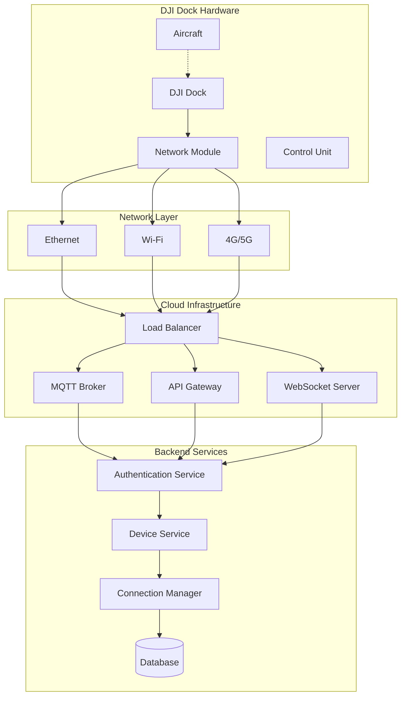
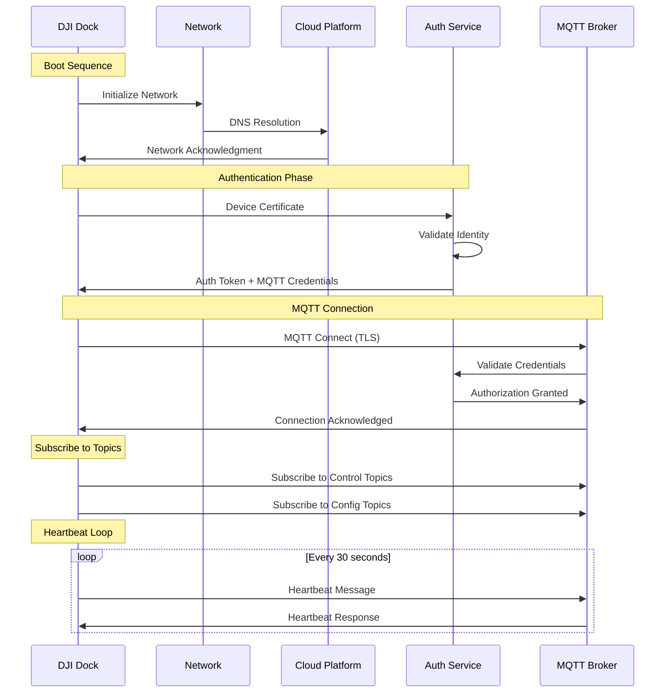
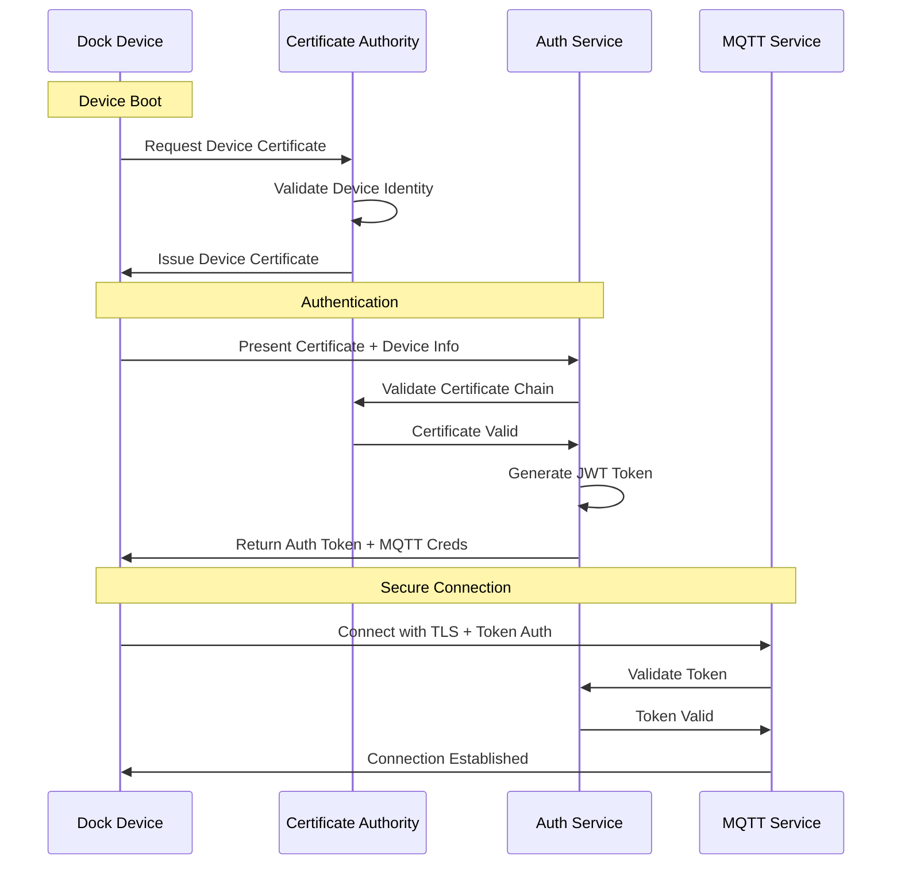

# Dock Access to Cloud Server

## Overview & Purpose

The Dock Access to Cloud Server functionality provides 24/7 automated connectivity between DJI Dock systems and third-party cloud platforms. This critical infrastructure enables autonomous drone operations, remote monitoring, and centralized fleet management without human intervention.

### Key Capabilities
- **24/7 Continuous Connectivity**: Persistent connection with automatic reconnection
- **Multi-Protocol Support**: MQTT, HTTPS, and WebSocket communication
- **Certificate Management**: Automated SSL/TLS certificate handling
- **Network Resilience**: Automatic failover and network adaptation
- **Device Authentication**: Secure device identity and authorization

### Supported Devices
- **DJI Dock**: Primary dock hardware with integrated connectivity
- **DJI Dock 2**: Enhanced dock with improved networking capabilities
- **M30/M300/M350 Series**: Compatible aircraft for dock operations
- **Network Infrastructure**: Ethernet, 4G/5G, Wi-Fi connectivity options

## Technical Architecture



### Connection Workflow



## API Documentation

### Device Registration API

**Endpoint**: `POST /api/v1/manage/device/register`

```json
// Request
{
    "sn": "DOCK123456789",
    "device_type": "dock",
    "model": "DJI Dock",
    "firmware_version": "1.2.3",
    "network_info": {
        "ip_address": "192.168.1.100",
        "mac_address": "00:11:22:33:44:55",
        "connection_type": "ethernet"
    },
    "certificate": "-----BEGIN CERTIFICATE-----..."
}

// Response
{
    "code": 0,
    "message": "success",
    "data": {
        "device_id": "1001",
        "auth_token": "eyJhbGciOiJIUzI1NiIsInR5cCI6IkpXVCJ9...",
        "mqtt_config": {
            "broker": "mqtt.example.com",
            "port": 8883,
            "client_id": "dock_1001",
            "username": "dock_user",
            "password": "secure_password"
        },
        "heartbeat_interval": 30
    }
}
```

### Device Status API

**Endpoint**: `GET /api/v1/manage/device/{device_sn}/status`

```json
// Response
{
    "code": 0,
    "data": {
        "device_sn": "DOCK123456789",
        "online_status": true,
        "last_seen": "2024-01-15T10:30:00Z",
        "connection_quality": "excellent",
        "network_info": {
            "signal_strength": -45,
            "connection_type": "ethernet",
            "ip_address": "192.168.1.100"
        },
        "firmware_version": "1.2.3"
    }
}
```

### MQTT Topics Structure

#### Device Status Topic
- **Topic**: `sys/product/{gateway_sn}/status`
- **QoS**: 1
- **Retained**: true

```json
{
    "bid": "unique_message_id",
    "tid": "timestamp",
    "timestamp": 1642248600000,
    "data": {
        "online_status": 1,
        "network_quality": 4,
        "firmware_version": "1.2.3",
        "system_health": "normal"
    }
}
```

#### Command Topic
- **Topic**: `thing/product/{gateway_sn}/requests`
- **QoS**: 1

```json
{
    "bid": "command_id",
    "tid": "transaction_id",
    "timestamp": 1642248600000,
    "method": "device_reboot",
    "data": {
        "force": false,
        "delay_seconds": 10
    }
}
```

## Frontend Implementation

### Device Connection Component

```typescript
// types/device.ts
export interface DockDevice {
  sn: string;
  name: string;
  type: 'dock' | 'aircraft';
  online_status: boolean;
  connection_quality: 'poor' | 'good' | 'excellent';
  network_info: {
    type: 'ethernet' | 'wifi' | '4g' | '5g';
    signal_strength: number;
    ip_address: string;
  };
  last_seen: string;
}

// components/DeviceConnectionStatus.vue
<template>
  <div class="device-connection-panel">
    <div class="connection-header">
      <h3>Device Connectivity</h3>
      <div class="connection-stats">
        <span class="online-count">{{ onlineDevices }}/{{ totalDevices }} Online</span>
      </div>
    </div>
    
    <div class="device-list">
      <div 
        v-for="device in devices" 
        :key="device.sn"
        class="device-item"
        :class="{ 'online': device.online_status, 'offline': !device.online_status }"
      >
        <div class="device-info">
          <div class="device-name">{{ device.name }}</div>
          <div class="device-sn">{{ device.sn }}</div>
        </div>
        
        <div class="connection-info">
          <ConnectionQualityIndicator :quality="device.connection_quality" />
          <NetworkTypeIndicator :network="device.network_info" />
        </div>
        
        <div class="device-actions">
          <button 
            @click="reconnectDevice(device.sn)"
            :disabled="device.online_status"
            class="btn-reconnect"
          >
            Reconnect
          </button>
        </div>
      </div>
    </div>
  </div>
</template>

<script setup lang="ts">
import { ref, computed, onMounted, onUnmounted } from 'vue';
import { useWebSocket } from '@/hooks/use-connect-websocket';
import { deviceApi } from '@/api/manage';

const devices = ref<DockDevice[]>([]);
const wsConnection = useWebSocket();

const onlineDevices = computed(() => 
  devices.value.filter(d => d.online_status).length
);
const totalDevices = computed(() => devices.value.length);

// WebSocket event handling for real-time updates
const handleDeviceStatusUpdate = (message: any) => {
  const { device_sn, online_status, connection_quality } = message.data;
  const deviceIndex = devices.value.findIndex(d => d.sn === device_sn);
  
  if (deviceIndex >= 0) {
    devices.value[deviceIndex].online_status = online_status;
    devices.value[deviceIndex].connection_quality = connection_quality;
    devices.value[deviceIndex].last_seen = new Date().toISOString();
  }
};

const reconnectDevice = async (deviceSn: string) => {
  try {
    await deviceApi.reconnectDevice(deviceSn);
    // Show success notification
  } catch (error) {
    // Show error notification
  }
};

onMounted(() => {
  // Subscribe to device status updates
  wsConnection.subscribe('device_status', handleDeviceStatusUpdate);
  loadDevices();
});

onUnmounted(() => {
  wsConnection.unsubscribe('device_status', handleDeviceStatusUpdate);
});
</script>
```

### API Integration Service

```typescript
// api/device-connection.ts
import { http } from '@/api/http';
import type { DockDevice } from '@/types/device';

export const deviceConnectionApi = {
  // Get all devices with connection status
  async getDeviceList(): Promise<DockDevice[]> {
    const response = await http.get('/manage/device/list');
    return response.data;
  },

  // Register new dock device
  async registerDevice(deviceInfo: any) {
    return await http.post('/manage/device/register', deviceInfo);
  },

  // Force device reconnection
  async reconnectDevice(deviceSn: string) {
    return await http.post(`/manage/device/${deviceSn}/reconnect`);
  },

  // Update device configuration
  async updateDeviceConfig(deviceSn: string, config: any) {
    return await http.put(`/manage/device/${deviceSn}/config`, config);
  },

  // Get device connection history
  async getConnectionHistory(deviceSn: string) {
    return await http.get(`/manage/device/${deviceSn}/connection-history`);
  }
};
```

## Backend Implementation

### Device Service Implementation

```java
// DeviceServiceImpl.java
@Service
public class DeviceServiceImpl implements IDeviceService {
    
    @Autowired
    private IDeviceMapper deviceMapper;
    
    @Autowired
    private MqttTopicServiceImpl mqttTopicService;
    
    @Autowired
    private RedisOpsUtils redisOpsUtils;
    
    private static final String DEVICE_ONLINE_KEY = "device:online:";
    private static final int HEARTBEAT_TIMEOUT = 90; // seconds
    
    /**
     * Register dock device and establish cloud connection
     */
    @Override
    public CommonResult<DeviceRegistrationResponse> registerDevice(
            DeviceRegistrationRequest request) {
        
        // Validate device certificate
        if (!validateDeviceCertificate(request.getCertificate())) {
            throw new CloudSDKException("Invalid device certificate");
        }
        
        // Create or update device record
        DeviceEntity device = createDeviceRecord(request);
        deviceMapper.insertOrUpdate(device);
        
        // Generate MQTT credentials
        MqttCredentials mqttConfig = generateMqttCredentials(device.getSn());
        
        // Create authentication token
        String authToken = JwtUtil.createToken(device.getSn(), "dock");
        
        // Initialize device in Redis for online tracking
        initializeDeviceTracking(device.getSn());
        
        DeviceRegistrationResponse response = DeviceRegistrationResponse.builder()
                .deviceId(device.getId().toString())
                .authToken(authToken)
                .mqttConfig(mqttConfig)
                .heartbeatInterval(30)
                .build();
                
        return CommonResult.success(response);
    }
    
    /**
     * Handle device heartbeat and maintain online status
     */
    @Override
    public void processDeviceHeartbeat(String deviceSn, DeviceHeartbeat heartbeat) {
        // Update last seen timestamp
        String onlineKey = DEVICE_ONLINE_KEY + deviceSn;
        redisOpsUtils.set(onlineKey, heartbeat, HEARTBEAT_TIMEOUT, TimeUnit.SECONDS);
        
        // Update device status in database
        DeviceEntity device = new DeviceEntity();
        device.setSn(deviceSn);
        device.setLastSeen(new Date());
        device.setOnlineStatus(1);
        deviceMapper.updateByDeviceSn(device);
        
        // Broadcast status update via WebSocket
        broadcastDeviceStatus(deviceSn, true);
        
        // Process additional heartbeat data
        processHeartbeatData(deviceSn, heartbeat);
    }
    
    /**
     * Monitor device connectivity and handle disconnections
     */
    @Scheduled(fixedDelay = 30000) // Check every 30 seconds
    public void monitorDeviceConnectivity() {
        List<DeviceEntity> onlineDevices = deviceMapper.getOnlineDevices();
        
        for (DeviceEntity device : onlineDevices) {
            String onlineKey = DEVICE_ONLINE_KEY + device.getSn();
            
            if (!redisOpsUtils.hasKey(onlineKey)) {
                // Device is offline
                handleDeviceDisconnection(device.getSn());
            }
        }
    }
    
    private void handleDeviceDisconnection(String deviceSn) {
        // Update device status to offline
        DeviceEntity device = new DeviceEntity();
        device.setSn(deviceSn);
        device.setOnlineStatus(0);
        deviceMapper.updateByDeviceSn(device);
        
        // Broadcast offline status
        broadcastDeviceStatus(deviceSn, false);
        
        // Log disconnection event
        log.warn("Device {} disconnected", deviceSn);
        
        // Trigger reconnection procedures if needed
        initiateReconnectionProcedure(deviceSn);
    }
    
    private void broadcastDeviceStatus(String deviceSn, boolean online) {
        WebSocketMessage message = WebSocketMessage.builder()
                .bizCode(BizCodeEnum.DEVICE_STATUS_UPDATE.getCode())
                .timestamp(System.currentTimeMillis())
                .data(Map.of(
                    "device_sn", deviceSn,
                    "online_status", online,
                    "timestamp", System.currentTimeMillis()
                ))
                .build();
                
        webSocketMessageService.sendToAll(message);
    }
}
```

### MQTT Configuration

```java
// MqttConfiguration.java
@Configuration
public class MqttConfiguration {
    
    @Bean
    public MessageChannel mqttInputChannel() {
        return MessageChannels.direct().get();
    }
    
    @Bean
    public MqttPahoMessageDrivenChannelAdapter dockStatusAdapter() {
        MqttPahoMessageDrivenChannelAdapter adapter = 
            new MqttPahoMessageDrivenChannelAdapter(
                "cloud-server",
                mqttClientFactory(),
                "sys/product/+/status"
            );
        adapter.setCompletionTimeout(5000);
        adapter.setConverter(new DefaultPahoMessageConverter());
        adapter.setQos(1);
        adapter.setOutputChannel(mqttInputChannel());
        return adapter;
    }
    
    @Bean
    public DefaultMqttPahoClientFactory mqttClientFactory() {
        DefaultMqttPahoClientFactory factory = new DefaultMqttPahoClientFactory();
        MqttConnectOptions options = new MqttConnectOptions();
        
        options.setServerURIs(new String[] { "ssl://mqtt.example.com:8883" });
        options.setUserName("cloud_server");
        options.setPassword("secure_password".toCharArray());
        options.setCleanSession(true);
        options.setKeepAliveInterval(60);
        options.setConnectionTimeout(30);
        options.setAutomaticReconnect(true);
        
        factory.setConnectionOptions(options);
        return factory;
    }
    
    @ServiceActivator(inputChannel = "mqttInputChannel")
    public void handleDockMessage(
            @Payload String payload,
            @Header(MqttHeaders.RECEIVED_TOPIC) String topic) {
        
        try {
            // Parse device SN from topic
            String deviceSn = extractDeviceSnFromTopic(topic);
            
            // Process message based on topic pattern
            if (topic.contains("/status")) {
                processDeviceStatusMessage(deviceSn, payload);
            } else if (topic.contains("/heartbeat")) {
                processDeviceHeartbeat(deviceSn, payload);
            }
            
        } catch (Exception e) {
            log.error("Error processing MQTT message: {}", e.getMessage());
        }
    }
}
```

## Device Integration

### Supported Hardware Matrix

| Device Model | Connectivity | Authentication | Features |
|-------------|-------------|----------------|----------|
| DJI Dock | Ethernet, 4G | Certificate | Full automation |
| DJI Dock 2 | Ethernet, 5G, Wi-Fi | Certificate + Cloud Auth | Enhanced networking |
| M30 Series | Via Dock | Inherited | Integrated operations |
| M300 RTK | Via Dock | Inherited | Professional mapping |

### Network Requirements

```yaml
# Network Configuration Requirements
networking:
  primary_connection: ethernet
  backup_connections: 
    - 4g_lte
    - wifi
  
  bandwidth_requirements:
    minimum: "1 Mbps"
    recommended: "10 Mbps"
    video_streaming: "50+ Mbps"
  
  ports:
    mqtt_secure: 8883
    https: 443
    websocket: 443
    
  latency_requirements:
    control_commands: "< 500ms"
    telemetry: "< 1000ms"
    video_streaming: "< 2000ms"
```

## Security Considerations

### Device Authentication Flow



### Security Implementation

```java
// SecurityConfiguration.java
@EnableWebSecurity
public class SecurityConfiguration {
    
    @Bean
    public JwtAuthenticationFilter jwtAuthenticationFilter() {
        return new JwtAuthenticationFilter();
    }
    
    @Bean
    public DeviceCertificateValidator certificateValidator() {
        return new DeviceCertificateValidator(trustedCertificateStore());
    }
    
    @Bean
    public SecurityFilterChain filterChain(HttpSecurity http) throws Exception {
        http.authorizeHttpRequests(authz -> authz
                .requestMatchers("/api/v1/device/register").permitAll()
                .requestMatchers("/api/v1/device/**").hasRole("DEVICE")
                .anyRequest().authenticated()
            )
            .addFilterBefore(jwtAuthenticationFilter(), 
                           UsernamePasswordAuthenticationFilter.class)
            .csrf(csrf -> csrf.disable())
            .sessionManagement(session -> 
                session.sessionCreationPolicy(SessionCreationPolicy.STATELESS)
            );
            
        return http.build();
    }
}
```

## Configuration & Deployment

### Application Configuration

```yaml
# application.yml - Dock Connection Configuration
cloud-api:
  device:
    registration:
      auto_approve: false
      certificate_validation: true
      max_devices_per_organization: 100
    
    heartbeat:
      interval_seconds: 30
      timeout_seconds: 90
      max_missed_heartbeats: 3
    
    reconnection:
      enabled: true
      initial_delay_seconds: 30
      max_delay_seconds: 300
      max_attempts: 10

mqtt:
  broker:
    url: "ssl://mqtt.example.com:8883"
    client_id_prefix: "dock_"
    keepalive_seconds: 60
    connection_timeout_seconds: 30
    automatic_reconnect: true
  
  topics:
    device_status: "sys/product/{device_sn}/status"
    device_commands: "thing/product/{device_sn}/requests"
    heartbeat: "sys/product/{device_sn}/heartbeat"

security:
  certificates:
    ca_certificate_path: "/etc/ssl/certs/ca-certificate.pem"
    device_certificate_validation: true
    certificate_expiry_warning_days: 30
  
  jwt:
    secret: "${JWT_SECRET}"
    expiration_hours: 24
    device_token_expiration_hours: 168 # 7 days
```

### Docker Deployment

```dockerfile
# Dockerfile for dock connectivity service
FROM openjdk:11-jre-slim

COPY target/cloud-api-sample-*.jar app.jar
COPY ssl-certificates/ /etc/ssl/certs/

EXPOSE 6789

ENV JAVA_OPTS="-Xmx2g -Xms1g"
ENV SPRING_PROFILES_ACTIVE=production

CMD java $JAVA_OPTS -jar app.jar
```

```yaml
# docker-compose.yml
version: '3.8'
services:
  cloud-api:
    build: .
    ports:
      - "6789:6789"
    environment:
      - MYSQL_URL=jdbc:mysql://mysql:3306/cloud_sample
      - REDIS_HOST=redis
      - MQTT_BROKER_URL=ssl://mqtt.example.com:8883
    depends_on:
      - mysql
      - redis
    volumes:
      - ./ssl-certificates:/etc/ssl/certs
    restart: unless-stopped
    
  mysql:
    image: mysql:8.0
    environment:
      - MYSQL_ROOT_PASSWORD=root
      - MYSQL_DATABASE=cloud_sample
    volumes:
      - mysql_data:/var/lib/mysql
    ports:
      - "3306:3306"
      
  redis:
    image: redis:7-alpine
    ports:
      - "6379:6379"
    volumes:
      - redis_data:/data

volumes:
  mysql_data:
  redis_data:
```

## Troubleshooting

### Common Connection Issues

1. **Certificate Validation Failures**
   - Verify certificate chain validity
   - Check system time synchronization
   - Validate certificate expiration dates

2. **Network Connectivity Problems**
   - Test DNS resolution for MQTT broker
   - Verify firewall rules for required ports
   - Check network quality and stability

3. **Authentication Errors**
   - Validate JWT token generation
   - Check device registration status
   - Verify MQTT credentials

### Monitoring and Diagnostics

```java
// HealthCheckController.java
@RestController
@RequestMapping("/health")
public class HealthCheckController {
    
    @GetMapping("/device-connectivity")
    public ResponseEntity<Map<String, Object>> checkDeviceConnectivity() {
        Map<String, Object> health = new HashMap<>();
        
        // Check MQTT broker connectivity
        boolean mqttHealthy = mqttHealthCheck();
        health.put("mqtt_broker", mqttHealthy ? "UP" : "DOWN");
        
        // Check database connectivity
        boolean dbHealthy = databaseHealthCheck();
        health.put("database", dbHealthy ? "UP" : "DOWN");
        
        // Count online devices
        int onlineDevices = getOnlineDeviceCount();
        health.put("online_devices", onlineDevices);
        
        // Check Redis connectivity
        boolean redisHealthy = redisHealthCheck();
        health.put("redis", redisHealthy ? "UP" : "DOWN");
        
        boolean overallHealthy = mqttHealthy && dbHealthy && redisHealthy;
        
        return ResponseEntity
            .status(overallHealthy ? HttpStatus.OK : HttpStatus.SERVICE_UNAVAILABLE)
            .body(health);
    }
}
```

The Dock Access to Cloud Server functionality forms the foundation for all other dock operations, providing reliable, secure, and continuous connectivity that enables autonomous drone operations and remote fleet management.