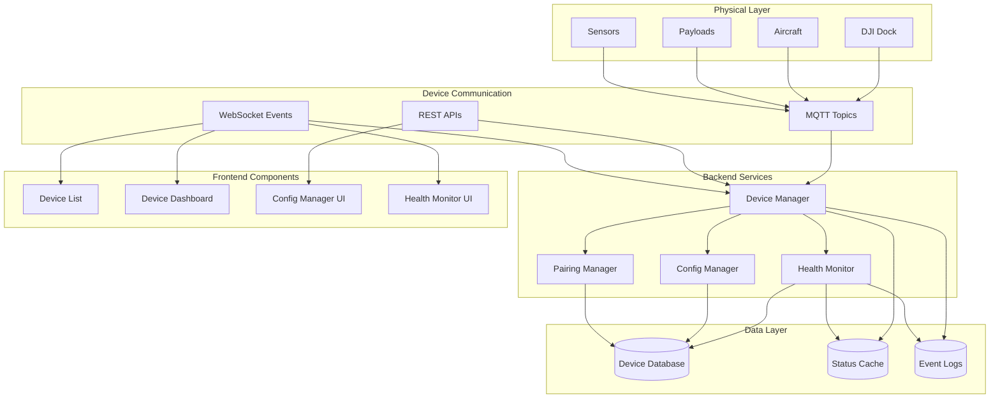
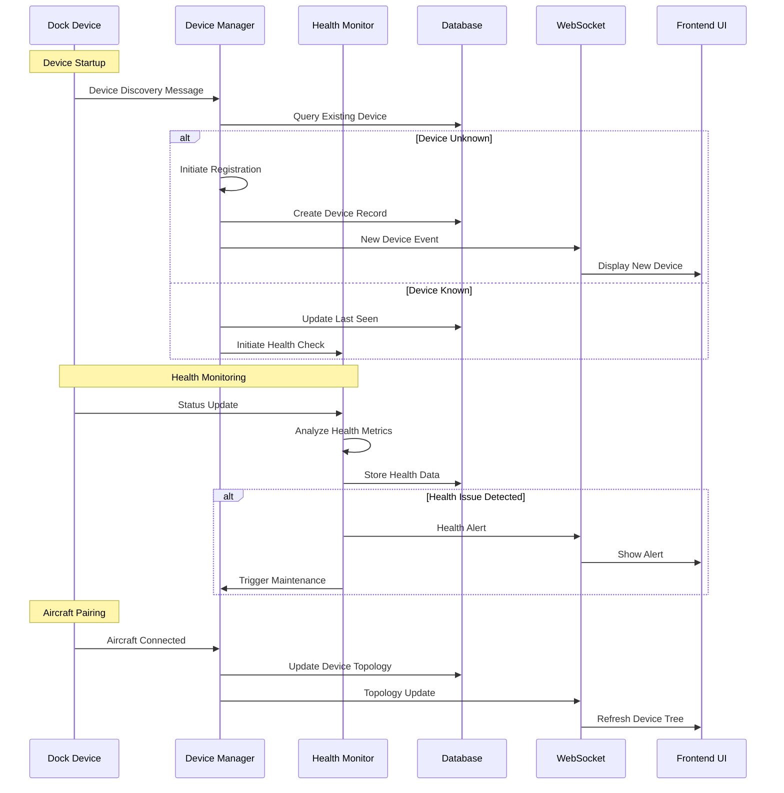

# Dock Device Management

## Overview & Purpose

Dock Device Management provides comprehensive lifecycle management for DJI Dock systems and their associated aircraft. This functionality enables automated device discovery, pairing, health monitoring, configuration management, and operational status tracking for autonomous drone operations.

### Key Capabilities
- **Device Lifecycle Management**: Registration, pairing, decommissioning
- **Health Monitoring**: Real-time status tracking and predictive maintenance
- **Configuration Management**: Remote device settings and parameter updates
- **Fleet Coordination**: Multi-device synchronization and resource allocation
- **Automated Operations**: Seamless device handoff and task delegation

### Supported Devices
- **DJI Dock**: Standard dock with M300 RTK compatibility
- **DJI Dock 2**: Enhanced dock supporting M30/M350 series
- **Aircraft Integration**: M30, M300, M350, M3E, M3D, M400 series
- **Payload Support**: Various camera and sensor payloads
- **Gateway Devices**: Remote controllers and bridge devices

## Technical Architecture



### Device Management Workflow



## API Documentation

### Device Registration API

**Endpoint**: `POST /api/v1/manage/device/register`

```json
// Request
{
    "sn": "DOCK123456789",
    "device_type": "dock",
    "model": "DJI Dock 2",
    "firmware_version": "1.2.3",
    "hardware_version": "2.0.0",
    "location": {
        "latitude": 40.7128,
        "longitude": -74.0060,
        "altitude": 10.5,
        "address": "New York, NY"
    },
    "network_info": {
        "ip_address": "192.168.1.100",
        "mac_address": "00:11:22:33:44:55",
        "connection_type": "ethernet"
    },
    "capabilities": [
        "autonomous_flight",
        "weather_monitoring",
        "battery_management"
    ]
}

// Response
{
    "code": 0,
    "message": "Device registered successfully",
    "data": {
        "device_id": "1001",
        "workspace_id": "ws_001",
        "device_name": "Dock_NYC_001",
        "status": "registered",
        "created_at": "2024-01-15T10:30:00Z"
    }
}
```

### Device Status API

**Endpoint**: `GET /api/v1/manage/device/{device_sn}`

```json
// Response
{
    "code": 0,
    "data": {
        "device_sn": "DOCK123456789",
        "device_name": "Dock_NYC_001",
        "device_type": "dock",
        "online_status": 1,
        "work_status": "standby",
        "last_seen": "2024-01-15T10:30:00Z",
        
        "basic_info": {
            "model": "DJI Dock 2",
            "firmware_version": "1.2.3",
            "hardware_version": "2.0.0",
            "manufacture_date": "2024-01-01"
        },
        
        "location_info": {
            "latitude": 40.7128,
            "longitude": -74.0060,
            "altitude": 10.5,
            "address": "New York, NY"
        },
        
        "health_status": {
            "overall_health": "healthy",
            "battery_level": 95,
            "temperature": 25.5,
            "humidity": 60.2,
            "system_load": 15.5,
            "storage_usage": 45.2
        },
        
        "sub_devices": [
            {
                "sn": "M30T123456789",
                "type": "aircraft",
                "model": "M30T",
                "online_status": 1,
                "battery_level": 85,
                "position": "docked"
            }
        ],
        
        "payloads": [
            {
                "index": "0-0",
                "type": "camera",
                "model": "Z30",
                "status": "normal",
                "firmware_version": "1.1.0"
            }
        ]
    }
}
```

### Device Configuration API

**Endpoint**: `PUT /api/v1/manage/device/{device_sn}/config`

```json
// Request
{
    "config_scope": "device",
    "config_data": {
        "device_name": "Dock_NYC_001_Updated",
        "location": {
            "latitude": 40.7130,
            "longitude": -74.0058
        },
        "operational_settings": {
            "auto_return_battery_threshold": 25,
            "max_flight_altitude": 120,
            "geofence_enabled": true,
            "night_operations_enabled": false
        },
        "maintenance_settings": {
            "auto_battery_maintenance": true,
            "system_health_checks": true,
            "log_retention_days": 30
        }
    }
}

// Response
{
    "code": 0,
    "message": "Configuration updated successfully",
    "data": {
        "config_id": "cfg_001",
        "applied_at": "2024-01-15T10:35:00Z",
        "pending_reboot": false
    }
}
```

### Health Monitoring API

**Endpoint**: `GET /api/v1/manage/device/{device_sn}/health`

```json
// Response
{
    "code": 0,
    "data": {
        "device_sn": "DOCK123456789",
        "health_score": 95,
        "status": "healthy",
        "last_check": "2024-01-15T10:30:00Z",
        
        "system_metrics": {
            "cpu_usage": 15.5,
            "memory_usage": 45.2,
            "disk_usage": 60.1,
            "network_quality": 4,
            "uptime_hours": 2352
        },
        
        "environmental_metrics": {
            "internal_temperature": 25.5,
            "external_temperature": 18.2,
            "humidity": 60.2,
            "wind_speed": 5.5,
            "weather_condition": "clear"
        },
        
        "hardware_status": {
            "landing_platform": "normal",
            "charging_contacts": "normal",
            "cover_mechanism": "normal",
            "positioning_system": "normal",
            "communication_module": "normal"
        },
        
        "alerts": [
            {
                "level": "warning",
                "component": "battery_system",
                "message": "Battery cycle count approaching maintenance threshold",
                "timestamp": "2024-01-15T09:45:00Z"
            }
        ],
        
        "maintenance_schedule": {
            "next_maintenance": "2024-02-15T00:00:00Z",
            "maintenance_type": "routine",
            "estimated_downtime": 2.5
        }
    }
}
```

### MQTT Topics

#### Device Status Updates
- **Topic**: `sys/product/{gateway_sn}/status`
- **QoS**: 1

```json
{
    "bid": "status_update_001",
    "tid": "1642248600",
    "timestamp": 1642248600000,
    "data": {
        "capacity_percent": 95,
        "landing_platform": 1,
        "position_state": {
            "latitude": 40.7128,
            "longitude": -74.0060,
            "altitude": 10.5
        },
        "storage": {
            "total": 512000,
            "used": 231424
        },
        "wireless_link": {
            "link_state": 1,
            "quality": 4
        },
        "sub_device": {
            "aircraft": {
                "sn": "M30T123456789",
                "online_status": 1,
                "position": "docked"
            }
        }
    }
}
```

#### Device Commands
- **Topic**: `thing/product/{gateway_sn}/requests`
- **QoS**: 1

```json
{
    "bid": "cmd_reboot_001",
    "tid": "1642248700",
    "timestamp": 1642248700000,
    "method": "device_reboot",
    "data": {
        "reboot_type": "soft",
        "delay_seconds": 30,
        "force": false
    }
}
```

## Frontend Implementation

### Device Management Dashboard

```typescript
// types/device-management.ts
export interface DeviceManagementState {
  devices: DockDevice[];
  selectedDevice: DockDevice | null;
  healthMetrics: HealthMetrics;
  loading: boolean;
  filters: DeviceFilters;
}

export interface DockDevice {
  sn: string;
  name: string;
  type: 'dock' | 'aircraft';
  model: string;
  online_status: boolean;
  work_status: 'idle' | 'working' | 'maintenance' | 'error';
  health_score: number;
  location: LocationInfo;
  sub_devices: SubDevice[];
  payloads: PayloadInfo[];
  last_maintenance: string;
  next_maintenance: string;
}

export interface HealthMetrics {
  overall_score: number;
  system_metrics: SystemMetrics;
  environmental_metrics: EnvironmentalMetrics;
  alerts: HealthAlert[];
}

// components/DeviceManagementDashboard.vue
<template>
  <div class="device-management-container">
    <div class="dashboard-header">
      <h1>Device Management</h1>
      <div class="dashboard-stats">
        <StatCard 
          title="Total Devices" 
          :value="totalDevices" 
          icon="device"
        />
        <StatCard 
          title="Online" 
          :value="onlineDevices" 
          icon="status-online"
          :color="onlineDevices === totalDevices ? 'green' : 'orange'"
        />
        <StatCard 
          title="Health Score" 
          :value="averageHealthScore + '%'" 
          icon="health"
          :color="getHealthColor(averageHealthScore)"
        />
      </div>
    </div>

    <div class="device-grid">
      <div class="device-filters">
        <DeviceFilters 
          v-model:filters="filters"
          @filter-change="applyFilters"
        />
      </div>

      <div class="device-list-container">
        <DeviceList 
          :devices="filteredDevices"
          :loading="loading"
          @device-selected="selectDevice"
          @device-action="handleDeviceAction"
        />
      </div>

      <div class="device-details" v-if="selectedDevice">
        <DeviceDetailsPanel 
          :device="selectedDevice"
          :health-metrics="healthMetrics"
          @config-update="updateDeviceConfig"
          @health-refresh="refreshHealthData"
        />
      </div>
    </div>

    <!-- Health Monitoring Modal -->
    <HealthMonitorModal 
      v-model:visible="healthModalVisible"
      :device="selectedDevice"
      :metrics="healthMetrics"
    />

    <!-- Configuration Modal -->
    <DeviceConfigModal 
      v-model:visible="configModalVisible"
      :device="selectedDevice"
      @config-saved="handleConfigSaved"
    />
  </div>
</template>

<script setup lang="ts">
import { ref, computed, onMounted, onUnmounted } from 'vue';
import { useWebSocket } from '@/hooks/use-connect-websocket';
import { useDeviceManagement } from '@/hooks/use-device-management';
import { deviceManagementApi } from '@/api/device-management';

// State management
const { 
  devices, 
  selectedDevice, 
  healthMetrics,
  loading,
  filters,
  selectDevice,
  applyFilters,
  updateDevice 
} = useDeviceManagement();

const wsConnection = useWebSocket();
const healthModalVisible = ref(false);
const configModalVisible = ref(false);

// Computed properties
const totalDevices = computed(() => devices.value.length);
const onlineDevices = computed(() => 
  devices.value.filter(d => d.online_status).length
);
const averageHealthScore = computed(() => {
  const scores = devices.value.map(d => d.health_score).filter(s => s > 0);
  return scores.length > 0 ? Math.round(scores.reduce((a, b) => a + b) / scores.length) : 0;
});
const filteredDevices = computed(() => {
  return devices.value.filter(device => {
    if (filters.value.status && device.work_status !== filters.value.status) return false;
    if (filters.value.type && device.type !== filters.value.type) return false;
    if (filters.value.health && device.health_score < filters.value.health) return false;
    return true;
  });
});

// WebSocket event handlers
const handleDeviceStatusUpdate = (message: any) => {
  const { device_sn, data } = message;
  updateDevice(device_sn, data);
};

const handleHealthAlert = (message: any) => {
  const { device_sn, alert } = message.data;
  // Show health alert notification
  showHealthAlert(device_sn, alert);
};

const handleDeviceAction = async (action: string, device: DockDevice) => {
  try {
    switch (action) {
      case 'reboot':
        await deviceManagementApi.rebootDevice(device.sn);
        break;
      case 'maintenance':
        await deviceManagementApi.scheduleMaintenanc(device.sn);
        break;
      case 'config':
        configModalVisible.value = true;
        break;
      case 'health':
        await refreshHealthData(device.sn);
        healthModalVisible.value = true;
        break;
    }
  } catch (error) {
    // Handle error
  }
};

const refreshHealthData = async (deviceSn: string) => {
  try {
    const health = await deviceManagementApi.getDeviceHealth(deviceSn);
    healthMetrics.value = health.data;
  } catch (error) {
    // Handle error
  }
};

const updateDeviceConfig = async (deviceSn: string, config: any) => {
  try {
    await deviceManagementApi.updateDeviceConfig(deviceSn, config);
    // Refresh device data
    await loadDevices();
  } catch (error) {
    // Handle error
  }
};

// Lifecycle hooks
onMounted(() => {
  // Subscribe to real-time updates
  wsConnection.subscribe('device_status', handleDeviceStatusUpdate);
  wsConnection.subscribe('health_alert', handleHealthAlert);
  
  // Load initial data
  loadDevices();
});

onUnmounted(() => {
  wsConnection.unsubscribe('device_status', handleDeviceStatusUpdate);
  wsConnection.unsubscribe('health_alert', handleHealthAlert);
});
</script>
```

### Device Health Monitoring Component

```typescript
// components/DeviceHealthMonitor.vue
<template>
  <div class="health-monitor">
    <div class="health-overview">
      <div class="health-score">
        <CircularProgress 
          :value="healthMetrics.overall_score"
          :color="getHealthColor(healthMetrics.overall_score)"
          size="large"
        />
        <div class="score-label">Overall Health</div>
      </div>
      
      <div class="health-indicators">
        <HealthIndicator 
          label="System"
          :value="healthMetrics.system_metrics.cpu_usage"
          :threshold="80"
          unit="%"
          type="cpu"
        />
        <HealthIndicator 
          label="Memory"
          :value="healthMetrics.system_metrics.memory_usage"
          :threshold="90"
          unit="%"
          type="memory"
        />
        <HealthIndicator 
          label="Temperature"
          :value="healthMetrics.environmental_metrics.internal_temperature"
          :threshold="40"
          unit="°C"
          type="temperature"
        />
        <HealthIndicator 
          label="Network"
          :value="healthMetrics.system_metrics.network_quality"
          :threshold="2"
          :max="5"
          type="signal"
        />
      </div>
    </div>
    
    <div class="health-charts">
      <div class="chart-container">
        <h3>System Performance</h3>
        <SystemPerformanceChart :data="systemMetricsHistory" />
      </div>
      
      <div class="chart-container">
        <h3>Environmental Conditions</h3>
        <EnvironmentalChart :data="environmentalHistory" />
      </div>
    </div>
    
    <div class="health-alerts" v-if="healthMetrics.alerts?.length">
      <h3>Active Alerts</h3>
      <div class="alert-list">
        <AlertItem 
          v-for="alert in healthMetrics.alerts"
          :key="alert.id"
          :alert="alert"
          @acknowledge="acknowledgeAlert"
          @resolve="resolveAlert"
        />
      </div>
    </div>
  </div>
</template>

<script setup lang="ts">
import { ref, computed, watch } from 'vue';
import type { HealthMetrics, HealthAlert } from '@/types/device-management';

const props = defineProps<{
  deviceSn: string;
  healthMetrics: HealthMetrics;
}>();

const emit = defineEmits<{
  alertAction: [action: string, alertId: string];
}>();

const systemMetricsHistory = ref([]);
const environmentalHistory = ref([]);

const getHealthColor = (score: number): string => {
  if (score >= 90) return 'green';
  if (score >= 70) return 'orange';
  return 'red';
};

// Watch for health metric updates
watch(() => props.healthMetrics, (newMetrics) => {
  updateMetricsHistory(newMetrics);
}, { deep: true });

const acknowledgeAlert = (alertId: string) => {
  emit('alertAction', 'acknowledge', alertId);
};

const resolveAlert = (alertId: string) => {
  emit('alertAction', 'resolve', alertId);
};
</script>
```

## Backend Implementation

### Device Management Service

```java
// DeviceManagementServiceImpl.java
@Service
@Transactional
public class DeviceManagementServiceImpl implements IDeviceManagementService {
    
    @Autowired
    private IDeviceMapper deviceMapper;
    
    @Autowired
    private IDevicePayloadMapper payloadMapper;
    
    @Autowired
    private RedisOpsUtils redisOpsUtils;
    
    @Autowired
    private IWebSocketMessageService webSocketMessageService;
    
    private static final String DEVICE_HEALTH_KEY = "device:health:";
    private static final String DEVICE_CONFIG_KEY = "device:config:";
    
    /**
     * Register new dock device
     */
    @Override
    public CommonResult<DeviceRegistrationResponse> registerDevice(
            DeviceRegistrationRequest request) {
        
        try {
            // Validate device information
            validateDeviceRegistration(request);
            
            // Check for existing device
            DeviceEntity existingDevice = deviceMapper.selectByDeviceSn(request.getSn());
            if (existingDevice != null && existingDevice.getOnlineStatus() == 1) {
                throw new CloudSDKException("Device already registered and online");
            }
            
            // Create device entity
            DeviceEntity device = buildDeviceEntity(request);
            
            if (existingDevice == null) {
                deviceMapper.insert(device);
            } else {
                deviceMapper.updateByDeviceSn(device);
            }
            
            // Initialize device health monitoring
            initializeHealthMonitoring(device.getSn());
            
            // Create workspace binding if specified
            if (request.getWorkspaceId() != null) {
                bindDeviceToWorkspace(device.getId(), request.getWorkspaceId());
            }
            
            // Broadcast device registration event
            broadcastDeviceEvent("device_registered", device);
            
            DeviceRegistrationResponse response = DeviceRegistrationResponse.builder()
                    .deviceId(device.getId().toString())
                    .deviceName(device.getDeviceName())
                    .workspaceId(device.getWorkspaceId())
                    .status("registered")
                    .createdAt(device.getCreateTime())
                    .build();
                    
            return CommonResult.success(response);
            
        } catch (Exception e) {
            log.error("Device registration failed: {}", e.getMessage(), e);
            throw new CloudSDKException("Device registration failed: " + e.getMessage());
        }
    }
    
    /**
     * Get comprehensive device information
     */
    @Override
    public CommonResult<DeviceDetailResponse> getDeviceDetail(String deviceSn) {
        
        DeviceEntity device = deviceMapper.selectByDeviceSn(deviceSn);
        if (device == null) {
            throw new CloudSDKException("Device not found");
        }
        
        // Get sub-devices (aircraft, payloads)
        List<DeviceEntity> subDevices = deviceMapper.selectSubDevicesByGatewaySn(deviceSn);
        List<DevicePayloadEntity> payloads = payloadMapper.selectByDeviceSn(deviceSn);
        
        // Get real-time health data from Redis
        HealthMetrics healthData = getDeviceHealthFromCache(deviceSn);
        
        // Get configuration data
        DeviceConfiguration configData = getDeviceConfiguration(deviceSn);
        
        DeviceDetailResponse response = DeviceDetailResponse.builder()
                .deviceSn(device.getDeviceSn())
                .deviceName(device.getDeviceName())
                .deviceType(device.getDeviceType())
                .onlineStatus(device.getOnlineStatus())
                .workStatus(device.getWorkStatus())
                .lastSeen(device.getUpdateTime())
                .basicInfo(buildBasicInfo(device))
                .locationInfo(buildLocationInfo(device))
                .healthStatus(healthData)
                .subDevices(buildSubDeviceList(subDevices))
                .payloads(buildPayloadList(payloads))
                .configuration(configData)
                .build();
                
        return CommonResult.success(response);
    }
    
    /**
     * Process device health status updates
     */
    @Override
    public void processHealthStatusUpdate(String deviceSn, HealthStatusUpdate update) {
        
        try {
            // Store health data in Redis for real-time access
            String healthKey = DEVICE_HEALTH_KEY + deviceSn;
            redisOpsUtils.set(healthKey, update, 300, TimeUnit.SECONDS);
            
            // Analyze health metrics
            HealthAnalysisResult analysis = analyzeHealthMetrics(update);
            
            // Update database with aggregated health data
            updateHealthMetricsInDatabase(deviceSn, analysis);
            
            // Check for health alerts
            List<HealthAlert> alerts = detectHealthAlerts(deviceSn, update, analysis);
            
            if (!alerts.isEmpty()) {
                processHealthAlerts(deviceSn, alerts);
            }
            
            // Broadcast health update to connected clients
            WebSocketMessage message = WebSocketMessage.builder()
                    .bizCode(BizCodeEnum.DEVICE_HEALTH_UPDATE.getCode())
                    .timestamp(System.currentTimeMillis())
                    .data(Map.of(
                        "device_sn", deviceSn,
                        "health_score", analysis.getOverallScore(),
                        "status", analysis.getHealthStatus(),
                        "alerts", alerts
                    ))
                    .build();
                    
            webSocketMessageService.sendToWorkspace(getWorkspaceId(deviceSn), message);
            
        } catch (Exception e) {
            log.error("Error processing health status update for device {}: {}", 
                     deviceSn, e.getMessage(), e);
        }
    }
    
    /**
     * Update device configuration
     */
    @Override
    public CommonResult<ConfigUpdateResponse> updateDeviceConfiguration(
            String deviceSn, DeviceConfigUpdateRequest request) {
        
        try {
            // Validate configuration data
            validateConfiguration(request.getConfigData());
            
            // Get current configuration
            DeviceConfiguration currentConfig = getDeviceConfiguration(deviceSn);
            
            // Merge configurations
            DeviceConfiguration updatedConfig = mergeConfigurations(currentConfig, request.getConfigData());
            
            // Store configuration in database
            saveDeviceConfiguration(deviceSn, updatedConfig);
            
            // Cache configuration in Redis
            String configKey = DEVICE_CONFIG_KEY + deviceSn;
            redisOpsUtils.set(configKey, updatedConfig, 3600, TimeUnit.SECONDS);
            
            // Send configuration update to device via MQTT
            boolean configSent = sendConfigurationToDevice(deviceSn, updatedConfig);
            
            if (!configSent) {
                throw new CloudSDKException("Failed to send configuration to device");
            }
            
            // Log configuration change
            logConfigurationChange(deviceSn, currentConfig, updatedConfig);
            
            ConfigUpdateResponse response = ConfigUpdateResponse.builder()
                    .configId(UUID.randomUUID().toString())
                    .appliedAt(new Date())
                    .pendingReboot(request.getConfigData().containsKey("system_settings"))
                    .build();
                    
            return CommonResult.success(response);
            
        } catch (Exception e) {
            log.error("Configuration update failed for device {}: {}", deviceSn, e.getMessage(), e);
            throw new CloudSDKException("Configuration update failed: " + e.getMessage());
        }
    }
    
    /**
     * Schedule device maintenance
     */
    @Override
    public CommonResult<MaintenanceScheduleResponse> scheduleDeviceMaintenance(
            String deviceSn, MaintenanceScheduleRequest request) {
        
        try {
            // Validate maintenance request
            validateMaintenanceRequest(request);
            
            // Check device availability
            DeviceEntity device = deviceMapper.selectByDeviceSn(deviceSn);
            if (device.getWorkStatus().equals("working")) {
                throw new CloudSDKException("Device is currently working, cannot schedule maintenance");
            }
            
            // Create maintenance schedule
            MaintenanceSchedule schedule = MaintenanceSchedule.builder()
                    .deviceSn(deviceSn)
                    .maintenanceType(request.getMaintenanceType())
                    .scheduledTime(request.getScheduledTime())
                    .estimatedDuration(request.getEstimatedDuration())
                    .status("scheduled")
                    .createdAt(new Date())
                    .build();
                    
            // Save maintenance schedule
            maintenanceMapper.insert(schedule);
            
            // Send maintenance notification to device
            sendMaintenanceNotification(deviceSn, schedule);
            
            // Broadcast maintenance scheduled event
            broadcastMaintenanceEvent("maintenance_scheduled", deviceSn, schedule);
            
            MaintenanceScheduleResponse response = MaintenanceScheduleResponse.builder()
                    .scheduleId(schedule.getId().toString())
                    .scheduledTime(schedule.getScheduledTime())
                    .status(schedule.getStatus())
                    .build();
                    
            return CommonResult.success(response);
            
        } catch (Exception e) {
            log.error("Maintenance scheduling failed for device {}: {}", deviceSn, e.getMessage(), e);
            throw new CloudSDKException("Maintenance scheduling failed: " + e.getMessage());
        }
    }
    
    private HealthAnalysisResult analyzeHealthMetrics(HealthStatusUpdate update) {
        // Implement health analysis algorithms
        int overallScore = calculateOverallHealthScore(update);
        String healthStatus = determineHealthStatus(overallScore);
        List<String> recommendations = generateHealthRecommendations(update);
        
        return HealthAnalysisResult.builder()
                .overallScore(overallScore)
                .healthStatus(healthStatus)
                .recommendations(recommendations)
                .analysisTimestamp(new Date())
                .build();
    }
    
    private List<HealthAlert> detectHealthAlerts(String deviceSn, HealthStatusUpdate update, 
                                                HealthAnalysisResult analysis) {
        List<HealthAlert> alerts = new ArrayList<>();
        
        // Check system metrics
        if (update.getSystemMetrics().getCpuUsage() > 90) {
            alerts.add(createAlert("high_cpu_usage", "warning", "CPU usage is critically high"));
        }
        
        if (update.getSystemMetrics().getMemoryUsage() > 95) {
            alerts.add(createAlert("high_memory_usage", "critical", "Memory usage is critically high"));
        }
        
        // Check environmental conditions
        if (update.getEnvironmentalMetrics().getInternalTemperature() > 50) {
            alerts.add(createAlert("high_temperature", "warning", "Internal temperature is too high"));
        }
        
        // Check hardware status
        if (!update.getHardwareStatus().getLandingPlatform().equals("normal")) {
            alerts.add(createAlert("landing_platform_issue", "critical", 
                      "Landing platform malfunction detected"));
        }
        
        return alerts;
    }
}
```

### Health Monitoring Service

```java
// HealthMonitoringServiceImpl.java
@Service
public class HealthMonitoringServiceImpl implements IHealthMonitoringService {
    
    @Autowired
    private IDeviceMapper deviceMapper;
    
    @Autowired
    private RedisOpsUtils redisOpsUtils;
    
    private static final String HEALTH_HISTORY_KEY = "health:history:";
    
    /**
     * Continuous health monitoring for all devices
     */
    @Scheduled(fixedDelay = 60000) // Check every minute
    public void performHealthCheck() {
        List<DeviceEntity> onlineDevices = deviceMapper.getOnlineDevices();
        
        for (DeviceEntity device : onlineDevices) {
            try {
                performDeviceHealthCheck(device.getDeviceSn());
            } catch (Exception e) {
                log.error("Health check failed for device {}: {}", 
                         device.getDeviceSn(), e.getMessage());
            }
        }
    }
    
    private void performDeviceHealthCheck(String deviceSn) {
        // Get current health data from cache
        HealthMetrics currentHealth = getDeviceHealthFromCache(deviceSn);
        
        if (currentHealth == null) {
            log.warn("No health data available for device: {}", deviceSn);
            return;
        }
        
        // Store health history for trend analysis
        storeHealthHistory(deviceSn, currentHealth);
        
        // Perform predictive analysis
        PredictiveAnalysisResult prediction = performPredictiveAnalysis(deviceSn, currentHealth);
        
        // Generate maintenance recommendations
        List<MaintenanceRecommendation> recommendations = 
            generateMaintenanceRecommendations(deviceSn, prediction);
        
        if (!recommendations.isEmpty()) {
            processMaintenanceRecommendations(deviceSn, recommendations);
        }
    }
    
    private PredictiveAnalysisResult performPredictiveAnalysis(String deviceSn, 
                                                             HealthMetrics currentHealth) {
        // Get historical health data
        List<HealthMetrics> history = getHealthHistory(deviceSn, 30); // Last 30 days
        
        // Analyze trends
        TrendAnalysis trends = analyzeTrends(history);
        
        // Predict future health issues
        List<PredictedIssue> predictedIssues = predictFutureIssues(trends, currentHealth);
        
        // Calculate reliability score
        double reliabilityScore = calculateReliabilityScore(history, currentHealth);
        
        return PredictiveAnalysisResult.builder()
                .deviceSn(deviceSn)
                .trends(trends)
                .predictedIssues(predictedIssues)
                .reliabilityScore(reliabilityScore)
                .analysisDate(new Date())
                .build();
    }
}
```

## Security Considerations

### Device Authentication & Authorization

```java
// DeviceSecurityService.java
@Service
public class DeviceSecurityService {
    
    /**
     * Validate device certificate and identity
     */
    public boolean validateDeviceIdentity(String deviceSn, String certificate) {
        try {
            // Parse device certificate
            X509Certificate cert = parseCertificate(certificate);
            
            // Validate certificate chain
            if (!validateCertificateChain(cert)) {
                return false;
            }
            
            // Check certificate expiration
            if (cert.getNotAfter().before(new Date())) {
                log.warn("Device certificate expired for {}", deviceSn);
                return false;
            }
            
            // Validate device SN in certificate
            String certDeviceSn = extractDeviceSnFromCertificate(cert);
            return deviceSn.equals(certDeviceSn);
            
        } catch (Exception e) {
            log.error("Certificate validation failed for device {}: {}", deviceSn, e.getMessage());
            return false;
        }
    }
    
    /**
     * Check device authorization for operations
     */
    public boolean authorizeDeviceOperation(String deviceSn, String operation) {
        // Get device permissions from database
        List<String> permissions = getDevicePermissions(deviceSn);
        
        // Check if operation is allowed
        return permissions.contains(operation) || permissions.contains("*");
    }
}
```

## Configuration & Deployment

### Application Configuration

```yaml
# application.yml - Device Management Configuration
device-management:
  registration:
    auto_approval: false
    certificate_validation: true
    duplicate_check: true
  
  health-monitoring:
    check_interval_seconds: 60
    alert_thresholds:
      cpu_usage: 90
      memory_usage: 95
      temperature: 50
      disk_usage: 90
    history_retention_days: 90
  
  maintenance:
    auto_scheduling: true
    default_maintenance_interval_days: 30
    emergency_maintenance_threshold: 60 # health score
  
  configuration:
    validation_enabled: true
    backup_before_update: true
    rollback_timeout_minutes: 10

spring:
  task:
    scheduling:
      pool:
        size: 10
```

This comprehensive device management system enables full lifecycle control of dock systems and aircraft, providing real-time monitoring, predictive maintenance, and automated operations management for enterprise drone fleets.