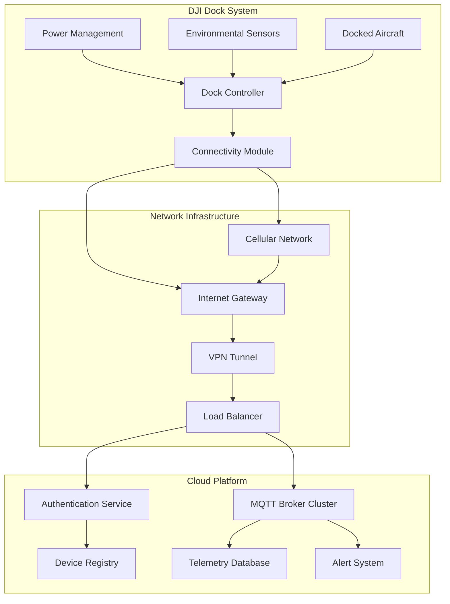
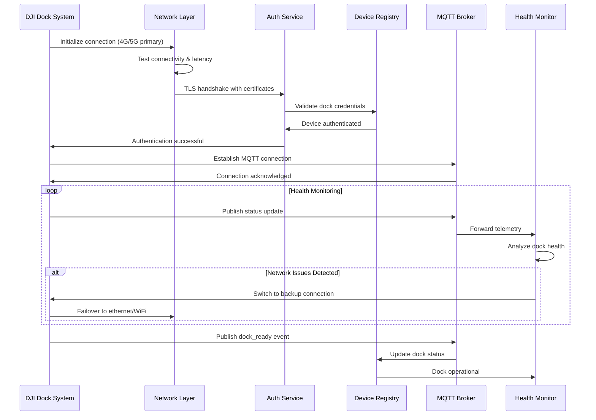

# Access to Cloud Server (Dock)

## Overview

The dock's cloud server access functionality establishes secure, persistent connections between DJI dock systems and the cloud platform. Unlike pilot devices, dock systems require 24/7 connectivity for autonomous operations, automated maintenance, and remote monitoring capabilities.

## Supported Dock Systems

| Dock Model | Connection Types | Power Management | Environmental | Notes |
|------------|------------------|------------------|---------------|-------|
| DJI Dock | 4G/5G, Ethernet, WiFi | UPS + Solar | IP55 Rated | Standard deployment |
| DJI Dock 2 | 5G, Ethernet, Satellite | Advanced UPS | IP67 Rated | Enhanced connectivity |
| M30 Dock | 4G/5G, Ethernet | Solar + Grid | IP55 Rated | M30 Series integration |
| M300 Dock | Ethernet, 4G | Grid Power | IP54 Rated | Enterprise deployment |

## Architecture Overview



## Connection Types and Protocols

### Primary Connection: 4G/5G Cellular
```json
{
  "connection_type": "cellular",
  "network_operator": "carrier_name",
  "signal_strength": -75,
  "data_plan": "unlimited",
  "apn_settings": {
    "apn": "iot.carrier.com",
    "username": "dock_user",
    "password": "encrypted_password"
  },
  "failover_enabled": true
}
```

### Secondary Connection: Ethernet
```json
{
  "connection_type": "ethernet", 
  "ip_configuration": "static",
  "ip_address": "192.168.1.100",
  "subnet_mask": "255.255.255.0",
  "gateway": "192.168.1.1",
  "dns_servers": ["8.8.8.8", "8.8.4.4"],
  "vlan_id": 100
}
```

### Tertiary Connection: WiFi (Backup)
```json
{
  "connection_type": "wifi",
  "ssid": "DockNetwork_Backup",
  "security": "WPA3",
  "frequency": "5GHz",
  "signal_quality": 85,
  "backup_only": true
}
```

## MQTT Topic Structure

### Dock-Specific Topics
```
# Dock Status and Health
thing/product/{dock_sn}/state
├── dock_status          # Overall dock health
├── power_status         # Battery, solar, grid power
├── environmental_data   # Weather, temperature
├── aircraft_status      # Docked aircraft information
└── maintenance_status   # Service intervals, alerts

# Dock Services
thing/product/{dock_sn}/services  
├── dock_open_close      # Dock door operations
├── aircraft_takeoff     # Launch aircraft
├── aircraft_landing     # Retrieve aircraft
├── battery_swap         # Automatic battery exchange
├── maintenance_check    # Automated diagnostics
└── emergency_shutdown   # Safety protocols

# Dock Events
thing/product/{dock_sn}/events
├── aircraft_docked      # Aircraft return events
├── maintenance_required # Service alerts  
├── weather_alert        # Environmental warnings
├── power_failure        # Power system issues
└── security_breach      # Unauthorized access
```

## API Endpoints

### Dock Registration and Authentication
```http
POST /api/v1/dock/register
Content-Type: application/json

{
  "dock_sn": "DOCK_001_ABC123",
  "model": "DJI_Dock_2",
  "firmware_version": "02.04.10.15",
  "location": {
    "latitude": 40.123456,
    "longitude": 116.123456,
    "altitude": 50.5,
    "address": "Industrial Park, Zone A"
  },
  "network_config": {
    "primary": "cellular",
    "secondary": "ethernet",
    "backup": "wifi"
  },
  "certificates": {
    "device_cert": "-----BEGIN CERTIFICATE-----...",
    "ca_cert": "-----BEGIN CERTIFICATE-----..."
  }
}
```

### Dock Status Reporting
```http
POST /api/v1/dock/{dock_sn}/status
Content-Type: application/json

{
  "timestamp": 1640995200000,
  "dock_status": "operational",
  "aircraft_status": {
    "docked": true,
    "aircraft_sn": "M30T_001_XYZ789", 
    "battery_level": 95,
    "last_flight": 1640985200000
  },
  "power_status": {
    "grid_power": true,
    "battery_level": 85,
    "solar_generation": 450,
    "power_consumption": 120
  },
  "environmental": {
    "temperature": 25.5,
    "humidity": 65,
    "wind_speed": 5.2,
    "precipitation": false
  }
}
```

### Remote Dock Operations
```http
POST /api/v1/dock/{dock_sn}/operation
Content-Type: application/json

{
  "operation": "launch_mission",
  "parameters": {
    "mission_id": "mission_123",
    "aircraft_sn": "M30T_001_XYZ789",
    "pre_flight_check": true,
    "weather_check": true,
    "return_to_dock": true
  },
  "schedule": {
    "execute_at": 1640998800000,
    "timeout": 3600
  }
}
```

## Message Schemas

### Dock Status Message
```json
{
  "tid": "dock_status_001",
  "bid": "12345678-1234-1234-1234-123456789012",
  "timestamp": 1640995200000,
  "method": "dock_status_report",
  "data": {
    "dock_sn": "DOCK_001_ABC123",
    "status": "operational",
    "uptime": 864000,
    "network_quality": {
      "primary_connection": "cellular",
      "signal_strength": -75,
      "latency": 45,
      "bandwidth": "50Mbps"
    },
    "aircraft_bay": {
      "occupied": true,
      "aircraft_sn": "M30T_001_XYZ789",
      "docking_time": 1640985200000,
      "charging_status": "complete"
    },
    "systems": {
      "door_mechanism": "operational",
      "charging_system": "operational", 
      "climate_control": "operational",
      "security_system": "armed"
    }
  }
}
```

### Mission Launch Command
```json
{
  "tid": "launch_cmd_001",
  "bid": "12345678-1234-1234-1234-123456789012",
  "timestamp": 1640995200000,
  "method": "launch_mission",
  "data": {
    "mission_id": "mission_123",
    "aircraft_sn": "M30T_001_XYZ789",
    "flight_plan": {
      "waypoints": [...],
      "altitude": 80,
      "speed": 10,
      "actions": [...]
    },
    "safety_config": {
      "rth_altitude": 100,
      "max_flight_time": 30,
      "low_battery_action": "rth",
      "weather_threshold": {
        "max_wind": 12,
        "min_visibility": 1000
      }
    }
  }
}
```

## Connection Establishment Flow



## Security Implementation

### Certificate-Based Authentication
- X.509 device certificates for dock identification
- Root CA validation and certificate chain verification
- Automatic certificate renewal before expiration
- Hardware security module (HSM) integration

### Encrypted Communication
- TLS 1.3 for all HTTP/MQTT communications
- AES-256 encryption for sensitive data
- Perfect forward secrecy (PFS) support
- Certificate pinning for enhanced security

### Access Control
- Role-based access control (RBAC) for operations
- Time-based access tokens with automatic renewal
- IP whitelist and geofencing restrictions
- Multi-factor authentication for sensitive operations

## Code Example

```java
@Service
@Slf4j
public class DockCloudAccessService extends AbstractDeviceService {
    
    @Autowired
    private NetworkConnectionManager networkManager;
    
    @Autowired
    private CertificateManager certificateManager;
    
    @Autowired
    private DockRegistryService registryService;
    
    private final Map<String, DockConnection> activeConnections = new ConcurrentHashMap<>();
    
    /**
     * Initialize dock connection to cloud platform
     */
    @PostConstruct
    public void initializeDockConnections() {
        
        List<DockConfiguration> dockConfigs = loadDockConfigurations();
        
        for (DockConfiguration config : dockConfigs) {
            try {
                establishDockConnection(config);
            } catch (Exception e) {
                log.error("Failed to establish connection for dock: {}", config.getDockSn(), e);
                scheduleConnectionRetry(config);
            }
        }
    }
    
    /**
     * Establish connection for a specific dock
     */
    public DockConnectionResult establishDockConnection(DockConfiguration config) {
        
        String dockSn = config.getDockSn();
        log.info("Establishing cloud connection for dock: {}", dockSn);
        
        try {
            // Network connection establishment
            NetworkConnection networkConn = networkManager.establishConnection(
                config.getNetworkConfig(), 
                config.getFailoverConfig()
            );
            
            // Certificate validation
            CertificateValidationResult certResult = certificateManager.validateDockCertificate(
                config.getDeviceCertificate(),
                config.getCaCertificate()
            );
            
            if (!certResult.isValid()) {
                throw new SecurityException("Invalid dock certificate: " + certResult.getError());
            }
            
            // Device registration
            DockRegistrationResult registration = registryService.registerDock(
                dockSn,
                config.getModel(),
                config.getFirmwareVersion(),
                config.getLocation()
            );
            
            // MQTT connection setup
            MQTTConfiguration mqttConfig = MQTTConfiguration.builder()
                    .broker(registration.getMqttBroker())
                    .clientId(dockSn)
                    .username(registration.getUsername())
                    .password(registration.getPassword())
                    .keepAlive(60)
                    .cleanSession(false)
                    .retryAttempts(3)
                    .build();
            
            MqttClient mqttClient = createMqttClient(mqttConfig);
            
            // Subscribe to dock-specific topics
            subscribeToDockTopics(mqttClient, dockSn);
            
            // Create dock connection object
            DockConnection connection = DockConnection.builder()
                    .dockSn(dockSn)
                    .networkConnection(networkConn)
                    .mqttClient(mqttClient)
                    .lastHeartbeat(Instant.now())
                    .status(ConnectionStatus.CONNECTED)
                    .build();
            
            activeConnections.put(dockSn, connection);
            
            // Start heartbeat monitoring
            startHeartbeatMonitoring(connection);
            
            // Publish dock ready event
            publishDockReadyEvent(dockSn, mqttClient);
            
            log.info("Dock connection established successfully: {}", dockSn);
            
            return DockConnectionResult.success(connection);
            
        } catch (Exception e) {
            log.error("Failed to establish dock connection: {}", dockSn, e);
            return DockConnectionResult.failure(e.getMessage());
        }
    }
    
    /**
     * Handle dock status updates
     */
    public void handleDockStatusUpdate(String dockSn, DockStatusMessage status) {
        
        DockConnection connection = activeConnections.get(dockSn);
        if (connection == null) {
            log.warn("Received status for unknown dock: {}", dockSn);
            return;
        }
        
        // Update connection heartbeat
        connection.setLastHeartbeat(Instant.now());
        
        // Process status data
        processDockStatus(dockSn, status);
        
        // Check for critical alerts
        if (status.hasCSriticalAlerts()) {
            handleCriticalAlerts(dockSn, status.getCriticalAlerts());
        }
        
        // Update dock registry
        registryService.updateDockStatus(dockSn, status);
        
        // Broadcast status via WebSocket
        broadcastDockStatus(dockSn, status);
    }
    
    /**
     * Execute remote dock operation
     */
    public OperationResult executeDockOperation(String dockSn, DockOperation operation) {
        
        DockConnection connection = activeConnections.get(dockSn);
        if (connection == null || !connection.isConnected()) {
            return OperationResult.failure("Dock not connected");
        }
        
        // Validate operation permissions
        if (!hasOperationPermission(dockSn, operation)) {
            return OperationResult.failure("Insufficient permissions");
        }
        
        // Build operation command
        CommonTopicResponse command = buildOperationCommand(operation);
        
        // Send command via MQTT
        String topic = TopicConst.THING_MODEL_PRE + dockSn + TopicConst.SERVICES_SUF;
        
        try {
            publishWithReply(topic, command, (reply, isSuccess) -> {
                handleOperationResponse(dockSn, operation, reply, isSuccess);
            });
            
            log.info("Dock operation sent: {} for dock: {}", operation.getType(), dockSn);
            return OperationResult.success("Operation initiated");
            
        } catch (Exception e) {
            log.error("Failed to execute dock operation: {} for dock: {}", 
                    operation.getType(), dockSn, e);
            return OperationResult.failure("Operation failed: " + e.getMessage());
        }
    }
    
    /**
     * Monitor dock connections and handle failures
     */
    @Scheduled(fixedRate = 30000) // Check every 30 seconds
    public void monitorDockConnections() {
        
        for (Map.Entry<String, DockConnection> entry : activeConnections.entrySet()) {
            String dockSn = entry.getKey();
            DockConnection connection = entry.getValue();
            
            if (connection.isHeartbeatExpired()) {
                log.warn("Dock heartbeat expired: {}", dockSn);
                handleConnectionFailure(dockSn, connection);
            }
            
            // Check network quality
            if (connection.getNetworkQuality() < 0.5) {
                log.warn("Poor network quality for dock: {}", dockSn);
                attemptConnectionImprovement(dockSn, connection);
            }
        }
    }
    
    /**
     * Subscribe to dock-specific MQTT topics
     */
    private void subscribeToDockTopics(MqttClient client, String dockSn) throws MqttException {
        
        String baseTopic = TopicConst.THING_MODEL_PRE + dockSn;
        
        // Status topics
        client.subscribe(baseTopic + TopicConst.STATE_SUF, (topic, message) -> {
            DockStatusMessage status = parseMessage(message, DockStatusMessage.class);
            handleDockStatusUpdate(dockSn, status);
        });
        
        // Event topics
        client.subscribe(baseTopic + TopicConst.EVENTS_SUF, (topic, message) -> {
            DockEvent event = parseMessage(message, DockEvent.class);
            handleDockEvent(dockSn, event);
        });
        
        // Service response topics
        client.subscribe(baseTopic + TopicConst.SERVICES_REPLY_SUF, (topic, message) -> {
            CommonTopicReceiver response = parseMessage(message, CommonTopicReceiver.class);
            handleServiceResponse(dockSn, response);
        });
    }
    
    /**
     * Handle connection failure and initiate recovery
     */
    private void handleConnectionFailure(String dockSn, DockConnection connection) {
        
        log.error("Dock connection failed: {}", dockSn);
        
        // Update connection status
        connection.setStatus(ConnectionStatus.FAILED);
        
        // Attempt network failover
        if (connection.hasBackupNetwork()) {
            log.info("Attempting network failover for dock: {}", dockSn);
            attemptNetworkFailover(dockSn, connection);
        }
        
        // Schedule reconnection attempt
        scheduleReconnection(dockSn);
        
        // Notify operators
        notifyConnectionFailure(dockSn);
    }
    
    /**
     * Publish dock ready event
     */
    private void publishDockReadyEvent(String dockSn, MqttClient client) {
        
        DockReadyEvent event = DockReadyEvent.builder()
                .dockSn(dockSn)
                .timestamp(System.currentTimeMillis())
                .status("connected")
                .capabilities(getDockCapabilities(dockSn))
                .build();
        
        String topic = TopicConst.THING_MODEL_PRE + dockSn + TopicConst.EVENTS_SUF;
        
        try {
            publish(client, topic, event);
        } catch (Exception e) {
            log.error("Failed to publish dock ready event: {}", dockSn, e);
        }
    }
}

/**
 * Dock connection data model
 */
@Data
@Builder
public class DockConnection {
    private String dockSn;
    private NetworkConnection networkConnection;
    private MqttClient mqttClient;
    private Instant lastHeartbeat;
    private ConnectionStatus status;
    private double networkQuality;
    
    public boolean isConnected() {
        return status == ConnectionStatus.CONNECTED && mqttClient.isConnected();
    }
    
    public boolean isHeartbeatExpired() {
        return Duration.between(lastHeartbeat, Instant.now()).getSeconds() > 120;
    }
    
    public boolean hasBackupNetwork() {
        return networkConnection.hasFailover();
    }
}
```

## High Availability Features

### Connection Redundancy
- Multiple network path support (4G/5G + Ethernet + WiFi)
- Automatic failover and load balancing
- Connection quality monitoring and optimization
- Geographic failover for critical operations

### Data Persistence
- Local data buffering during connectivity issues
- Automatic data synchronization on reconnection
- Critical message prioritization and guaranteed delivery
- Offline operation capability for essential functions

### Monitoring and Alerting
- Real-time connection health monitoring
- Proactive alert system for connectivity issues
- Performance metrics and trend analysis
- Automated troubleshooting and recovery procedures