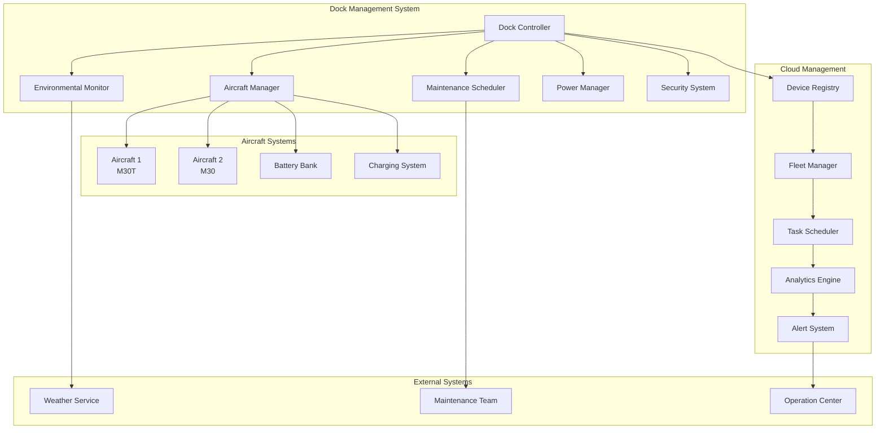
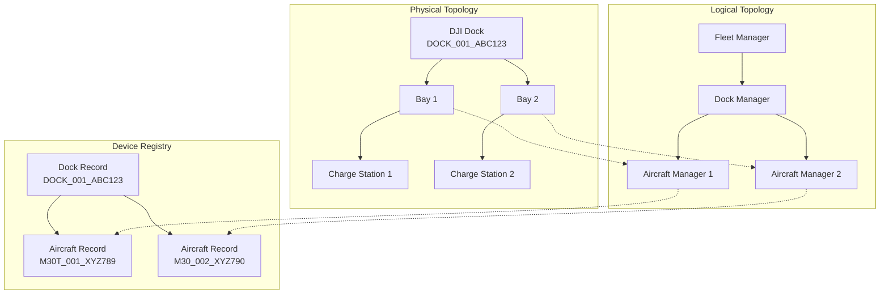
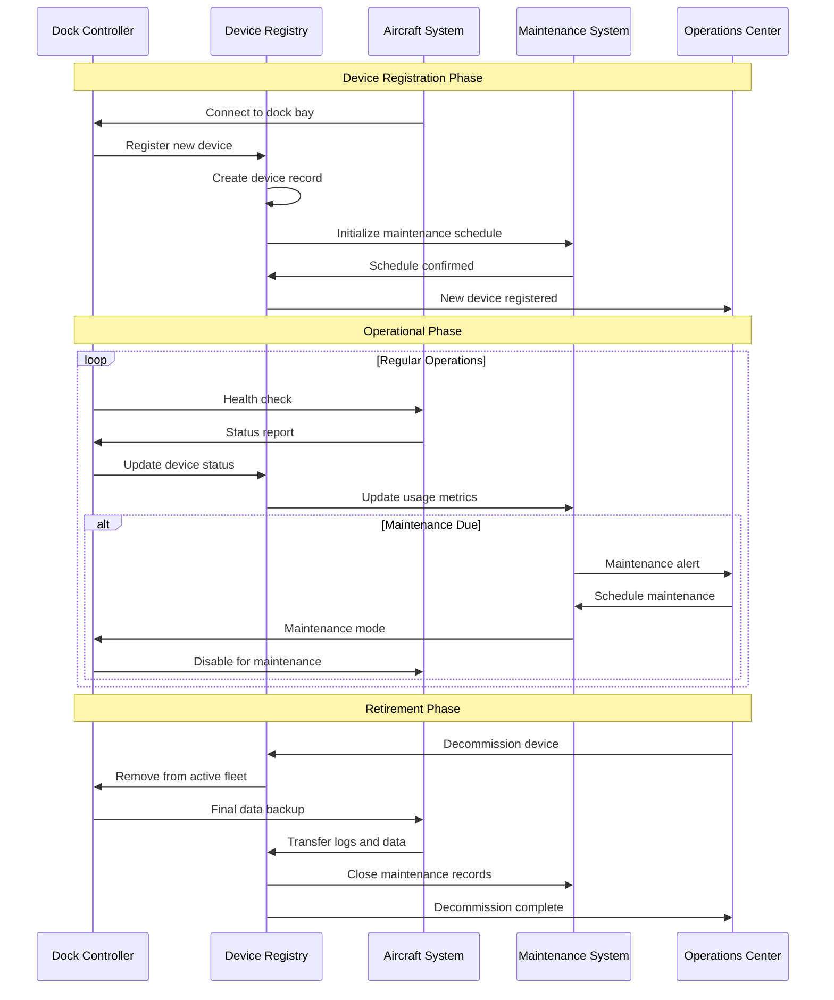

# Device Management (Dock)

## Overview

The dock device management system provides comprehensive control and monitoring of both the dock infrastructure and the aircraft it houses. This includes automated aircraft lifecycle management, dock maintenance scheduling, environmental monitoring, and integrated fleet operations.

## Supported Dock Configurations

| Configuration | Aircraft Capacity | Supported Models | Management Features | Environment Rating |
|---------------|------------------|------------------|-------------------|-------------------|
| Single Aircraft Dock | 1 | M30/M30T, M3E/M3T, M3M | Full lifecycle | IP55 |
| Multi-Aircraft Dock | 4-6 | M30 Series, Mavic 3 | Fleet coordination | IP67 |
| Enterprise Dock | 2 | M300 RTK, M350 RTK | Advanced diagnostics | IP54 |
| Specialized Dock | 1-2 | Custom configurations | Domain-specific | Varies |

## Architecture Overview



## Device Hierarchy and Topology

### Dock-Aircraft Relationship Model


## MQTT Topic Structure

### Device Management Topics
```
# Dock Device Management
thing/product/{dock_sn}/services
├── dock_management
│   ├── register_aircraft       # Register new aircraft
│   ├── remove_aircraft         # Remove aircraft from dock
│   ├── assign_bay              # Assign aircraft to specific bay
│   ├── maintenance_schedule    # Schedule maintenance tasks
│   └── system_diagnostics      # Run diagnostic procedures

# Aircraft Lifecycle Management
thing/product/{dock_sn}/aircraft/{aircraft_sn}/services
├── aircraft_diagnostics        # Run aircraft diagnostics
├── firmware_update            # Update aircraft firmware
├── calibration_procedure      # Sensor calibrations
├── battery_management         # Battery health management
└── component_replacement      # Track component replacements

# Status Reporting
thing/product/{dock_sn}/state
├── dock_devices               # All connected devices
├── aircraft_inventory         # Aircraft status and location
├── maintenance_status         # Maintenance schedules and alerts
├── system_health             # Overall system health
└── environmental_conditions   # Environmental parameters

# Events and Alerts
thing/product/{dock_sn}/events
├── device_connected          # New device connected
├── device_disconnected       # Device disconnected
├── maintenance_due           # Maintenance alert
├── system_error              # System error events
└── security_alert            # Security-related events
```

## API Endpoints

### Dock Device Registration
```http
POST /api/v1/dock/{dock_sn}/devices/register
Content-Type: application/json

{
  "device_type": "aircraft",
  "device_sn": "M30T_001_XYZ789",
  "model": "M30T", 
  "firmware_version": "07.01.10.03",
  "manufacturing_date": "2024-03-15",
  "bay_assignment": 1,
  "ownership": {
    "organization": "Survey Corp",
    "operator": "john.doe@surveycorp.com"
  },
  "configuration": {
    "default_mission_profile": "survey_standard",
    "maintenance_interval": 100,
    "flight_hours_limit": 500
  }
}
```

### Device Status Query
```http
GET /api/v1/dock/{dock_sn}/devices
Accept: application/json

Response:
{
  "dock_sn": "DOCK_001_ABC123",
  "total_devices": 3,
  "devices": [
    {
      "device_sn": "M30T_001_XYZ789",
      "device_type": "aircraft",
      "model": "M30T",
      "bay_number": 1,
      "status": "docked",
      "battery_level": 95,
      "flight_hours": 156.5,
      "last_maintenance": "2024-01-15T10:30:00Z",
      "next_maintenance_due": "2024-04-15T10:30:00Z",
      "health_score": 98
    },
    {
      "device_sn": "M30_002_XYZ790",
      "device_type": "aircraft", 
      "model": "M30",
      "bay_number": 2,
      "status": "charging",
      "battery_level": 67,
      "flight_hours": 89.2,
      "last_maintenance": "2024-02-01T14:20:00Z",
      "next_maintenance_due": "2024-05-01T14:20:00Z",
      "health_score": 94
    }
  ]
}
```

### Maintenance Scheduling
```http
POST /api/v1/dock/{dock_sn}/maintenance/schedule
Content-Type: application/json

{
  "device_sn": "M30T_001_XYZ789",
  "maintenance_type": "routine_inspection",
  "scheduled_date": "2024-04-15T09:00:00Z",
  "duration_hours": 4,
  "technician_required": true,
  "maintenance_tasks": [
    {
      "task": "propeller_inspection",
      "estimated_duration": 30,
      "parts_required": []
    },
    {
      "task": "gimbal_calibration", 
      "estimated_duration": 45,
      "parts_required": []
    },
    {
      "task": "battery_health_check",
      "estimated_duration": 60,
      "parts_required": ["test_battery"]
    }
  ],
  "downtime_allowable": true,
  "priority": "normal"
}
```

## Message Schemas

### Device Registration Message
```json
{
  "tid": "device_reg_001",
  "bid": "12345678-1234-1234-1234-123456789012",
  "timestamp": 1640995200000,
  "method": "register_aircraft",
  "data": {
    "aircraft_sn": "M30T_001_XYZ789",
    "model": "M30T",
    "firmware_version": "07.01.10.03",
    "bay_assignment": 1,
    "initial_config": {
      "rth_altitude": 100,
      "max_flight_speed": 15,
      "obstacle_avoidance": true,
      "precision_landing": true
    },
    "maintenance_profile": {
      "flight_hours_interval": 100,
      "calendar_interval_days": 90,
      "critical_component_monitoring": true
    }
  }
}
```

### Device Status Update
```json
{
  "tid": "device_status_001", 
  "bid": "12345678-1234-1234-1234-123456789012",
  "timestamp": 1640995200000,
  "method": "device_status_update",
  "data": {
    "dock_sn": "DOCK_001_ABC123",
    "device_inventory": [
      {
        "device_sn": "M30T_001_XYZ789",
        "device_type": "aircraft",
        "bay_number": 1,
        "status": "ready",
        "health_metrics": {
          "overall_score": 98,
          "component_scores": {
            "flight_controller": 99,
            "gimbal": 96,
            "camera": 98,
            "propellers": 97,
            "battery": 95,
            "sensors": 99
          }
        },
        "operational_stats": {
          "total_flight_time": 156.5,
          "total_flights": 342,
          "last_flight_duration": 28.5,
          "average_flight_duration": 25.3
        },
        "maintenance_status": {
          "last_service_date": "2024-01-15T10:30:00Z",
          "next_service_due": "2024-04-15T10:30:00Z",
          "service_alerts": [],
          "component_wear": {
            "propellers": 15,
            "gimbal": 8,
            "landing_gear": 22
          }
        }
      }
    ],
    "dock_systems": {
      "door_mechanism": "operational",
      "charging_system": "operational",
      "climate_control": "operational", 
      "security_system": "armed"
    }
  }
}
```

### Maintenance Alert Message
```json
{
  "tid": "maintenance_alert_001",
  "bid": "12345678-1234-1234-1234-123456789012",
  "timestamp": 1640995200000,
  "method": "maintenance_alert",
  "data": {
    "alert_type": "routine_maintenance_due",
    "severity": "warning",
    "device_sn": "M30T_001_XYZ789",
    "maintenance_details": {
      "type": "100_hour_inspection",
      "due_date": "2024-04-15T09:00:00Z",
      "overdue": false,
      "estimated_duration": 240,
      "required_parts": [],
      "required_tools": ["gimbal_calibration_kit", "battery_tester"],
      "certified_technician_required": true
    },
    "impact_assessment": {
      "operational_impact": "minimal",
      "downtime_hours": 4,
      "missions_affected": 0,
      "alternative_aircraft_available": true
    }
  }
}
```

## Device Lifecycle Management



## Code Example

```java
@Service
@Slf4j
public class DockDeviceManagementService extends AbstractDeviceService {
    
    @Autowired
    private DeviceRegistryService registryService;
    
    @Autowired
    private MaintenanceSchedulerService maintenanceService;
    
    @Autowired
    private HealthMonitoringService healthMonitor;
    
    @Autowired
    private BayManagementService bayManager;
    
    private final Map<String, DockDeviceInventory> dockInventories = new ConcurrentHashMap<>();
    
    /**
     * Register new aircraft to dock
     */
    public DeviceRegistrationResult registerAircraftToDock(String dockSn, 
                                                          AircraftRegistrationRequest request) {
        
        log.info("Registering aircraft {} to dock {}", request.getAircraftSn(), dockSn);
        
        try {
            // Validate dock capacity
            DockDeviceInventory inventory = dockInventories.get(dockSn);
            if (inventory == null) {
                inventory = initializeDockInventory(dockSn);
            }
            
            if (!inventory.hasAvailableBay()) {
                throw new InsufficientCapacityException("No available bays in dock");
            }
            
            // Assign bay to aircraft
            int assignedBay = bayManager.assignBayToAircraft(dockSn, request.getAircraftSn());
            
            // Create device record
            DeviceRecord deviceRecord = DeviceRecord.builder()
                    .deviceSn(request.getAircraftSn())
                    .deviceType(DeviceType.AIRCRAFT)
                    .model(request.getModel())
                    .firmwareVersion(request.getFirmwareVersion())
                    .dockSn(dockSn)
                    .bayNumber(assignedBay)
                    .registrationDate(Instant.now())
                    .status(DeviceStatus.REGISTERED)
                    .configuration(request.getConfiguration())
                    .build();
            
            // Register in device registry
            registryService.registerDevice(deviceRecord);
            
            // Initialize maintenance schedule
            maintenanceService.createMaintenanceSchedule(
                request.getAircraftSn(),
                request.getMaintenanceProfile()
            );
            
            // Add to dock inventory
            inventory.addDevice(deviceRecord);
            
            // Start health monitoring
            healthMonitor.startMonitoring(request.getAircraftSn());
            
            // Send registration command to dock
            sendDeviceRegistrationCommand(dockSn, deviceRecord);
            
            log.info("Aircraft {} registered successfully to dock {} in bay {}", 
                    request.getAircraftSn(), dockSn, assignedBay);
            
            return DeviceRegistrationResult.success(deviceRecord, assignedBay);
            
        } catch (Exception e) {
            log.error("Failed to register aircraft {} to dock {}", 
                    request.getAircraftSn(), dockSn, e);
            return DeviceRegistrationResult.failure(e.getMessage());
        }
    }
    
    /**
     * Update device status and health metrics
     */
    public void updateDeviceStatus(String dockSn, String deviceSn, DeviceStatusUpdate update) {
        
        DockDeviceInventory inventory = dockInventories.get(dockSn);
        if (inventory == null) {
            log.warn("No inventory found for dock: {}", dockSn);
            return;
        }
        
        DeviceRecord device = inventory.getDevice(deviceSn);
        if (device == null) {
            log.warn("Device not found in dock inventory: {}", deviceSn);
            return;
        }
        
        // Update device status
        device.setStatus(update.getStatus());
        device.setLastUpdate(Instant.now());
        device.setHealthMetrics(update.getHealthMetrics());
        device.setOperationalStats(update.getOperationalStats());
        
        // Update registry
        registryService.updateDeviceStatus(deviceSn, update);
        
        // Process health metrics
        healthMonitor.processHealthMetrics(deviceSn, update.getHealthMetrics());
        
        // Check for maintenance alerts
        checkMaintenanceAlerts(device);
        
        // Broadcast status update
        broadcastDeviceStatusUpdate(dockSn, deviceSn, update);
        
        log.debug("Device status updated: {} in dock {}", deviceSn, dockSn);
    }
    
    /**
     * Schedule device maintenance
     */
    public MaintenanceScheduleResult scheduleDeviceMaintenance(String dockSn, 
                                                             String deviceSn,
                                                             MaintenanceRequest request) {
        
        DeviceRecord device = getDeviceRecord(dockSn, deviceSn);
        if (device == null) {
            return MaintenanceScheduleResult.failure("Device not found");
        }
        
        // Check device availability
        if (!isDeviceAvailableForMaintenance(device)) {
            return MaintenanceScheduleResult.failure("Device not available for maintenance");
        }
        
        try {
            // Create maintenance schedule
            MaintenanceSchedule schedule = maintenanceService.scheduleMaintenanceTask(
                deviceSn,
                request.getMaintenanceType(),
                request.getScheduledDate(),
                request.getMaintenanceTasks()
            );
            
            // Reserve device for maintenance
            device.setStatus(DeviceStatus.MAINTENANCE_SCHEDULED);
            registryService.updateDeviceStatus(deviceSn, device.getStatus());
            
            // Notify operators
            notifyMaintenanceScheduled(dockSn, deviceSn, schedule);
            
            log.info("Maintenance scheduled for device {} in dock {}: {}", 
                    deviceSn, dockSn, schedule.getScheduleId());
            
            return MaintenanceScheduleResult.success(schedule);
            
        } catch (Exception e) {
            log.error("Failed to schedule maintenance for device {}", deviceSn, e);
            return MaintenanceScheduleResult.failure(e.getMessage());
        }
    }
    
    /**
     * Remove device from dock
     */
    public DeviceRemovalResult removeDeviceFromDock(String dockSn, String deviceSn, 
                                                   DeviceRemovalReason reason) {
        
        log.info("Removing device {} from dock {} - reason: {}", deviceSn, dockSn, reason);
        
        try {
            DockDeviceInventory inventory = dockInventories.get(dockSn);
            if (inventory == null) {
                throw new IllegalStateException("Dock inventory not found");
            }
            
            DeviceRecord device = inventory.getDevice(deviceSn);
            if (device == null) {
                throw new IllegalArgumentException("Device not found in dock");
            }
            
            // Ensure device is not in critical state
            if (device.getStatus() == DeviceStatus.IN_FLIGHT) {
                throw new IllegalStateException("Cannot remove device while in flight");
            }
            
            // Stop health monitoring
            healthMonitor.stopMonitoring(deviceSn);
            
            // Cancel scheduled maintenance
            maintenanceService.cancelScheduledMaintenance(deviceSn);
            
            // Release bay
            bayManager.releaseBay(dockSn, device.getBayNumber());
            
            // Archive device data
            archiveDeviceData(device);
            
            // Remove from inventory
            inventory.removeDevice(deviceSn);
            
            // Update registry
            registryService.deregisterDevice(deviceSn, reason);
            
            // Send removal command to dock
            sendDeviceRemovalCommand(dockSn, deviceSn);
            
            log.info("Device {} removed successfully from dock {}", deviceSn, dockSn);
            
            return DeviceRemovalResult.success();
            
        } catch (Exception e) {
            log.error("Failed to remove device {} from dock {}", deviceSn, dockSn, e);
            return DeviceRemovalResult.failure(e.getMessage());
        }
    }
    
    /**
     * Get dock device inventory
     */
    public DockInventoryResponse getDockInventory(String dockSn) {
        
        DockDeviceInventory inventory = dockInventories.get(dockSn);
        if (inventory == null) {
            return DockInventoryResponse.empty(dockSn);
        }
        
        List<DeviceInventoryItem> devices = inventory.getAllDevices()
                .stream()
                .map(this::mapToInventoryItem)
                .collect(Collectors.toList());
        
        DockSystemStatus systemStatus = getDockSystemStatus(dockSn);
        
        return DockInventoryResponse.builder()
                .dockSn(dockSn)
                .totalDevices(devices.size())
                .availableBays(inventory.getAvailableBayCount())
                .devices(devices)
                .systemStatus(systemStatus)
                .lastUpdate(Instant.now())
                .build();
    }
    
    /**
     * Check for maintenance alerts
     */
    private void checkMaintenanceAlerts(DeviceRecord device) {
        
        MaintenanceStatus status = maintenanceService.getMaintenanceStatus(device.getDeviceSn());
        
        if (status.isMaintenanceDue()) {
            MaintenanceAlert alert = MaintenanceAlert.builder()
                    .deviceSn(device.getDeviceSn())
                    .dockSn(device.getDockSn())
                    .alertType(MaintenanceAlertType.ROUTINE_MAINTENANCE_DUE)
                    .severity(AlertSeverity.WARNING)
                    .dueDate(status.getNextMaintenanceDate())
                    .estimatedDuration(status.getEstimatedDuration())
                    .build();
            
            publishMaintenanceAlert(alert);
        }
        
        // Check component wear levels
        HealthMetrics health = device.getHealthMetrics();
        if (health != null) {
            checkComponentWearAlerts(device, health);
        }
    }
    
    /**
     * Send device registration command to dock
     */
    private void sendDeviceRegistrationCommand(String dockSn, DeviceRecord device) {
        
        CommonTopicResponse command = CommonTopicResponse.builder()
                .tid(UUID.randomUUID().toString())
                .method("register_aircraft")
                .data(Map.of(
                    "aircraft_sn", device.getDeviceSn(),
                    "model", device.getModel(),
                    "bay_assignment", device.getBayNumber(),
                    "configuration", device.getConfiguration()
                ))
                .timestamp(System.currentTimeMillis())
                .build();
        
        String topic = TopicConst.THING_MODEL_PRE + dockSn + TopicConst.SERVICES_SUF;
        
        publishWithReply(topic, command, (reply, isSuccess) -> {
            if (isSuccess && reply.getResult() == 0) {
                log.info("Device registration confirmed by dock: {}", device.getDeviceSn());
            } else {
                log.error("Device registration rejected by dock: {}, error: {}", 
                        device.getDeviceSn(), reply.getResult());
            }
        });
    }
    
    /**
     * Initialize dock inventory
     */
    private DockDeviceInventory initializeDockInventory(String dockSn) {
        
        DockConfiguration config = getDockConfiguration(dockSn);
        DockDeviceInventory inventory = new DockDeviceInventory(dockSn, config.getMaxCapacity());
        
        // Load existing devices from registry
        List<DeviceRecord> existingDevices = registryService.getDevicesByDock(dockSn);
        for (DeviceRecord device : existingDevices) {
            inventory.addDevice(device);
        }
        
        dockInventories.put(dockSn, inventory);
        return inventory;
    }
}

/**
 * Dock device inventory data model
 */
@Data
public class DockDeviceInventory {
    private final String dockSn;
    private final int maxCapacity;
    private final Map<String, DeviceRecord> devices = new ConcurrentHashMap<>();
    private final Set<Integer> availableBays;
    
    public DockDeviceInventory(String dockSn, int maxCapacity) {
        this.dockSn = dockSn;
        this.maxCapacity = maxCapacity;
        this.availableBays = IntStream.rangeClosed(1, maxCapacity)
                .boxed()
                .collect(Collectors.toSet());
    }
    
    public boolean hasAvailableBay() {
        return !availableBays.isEmpty();
    }
    
    public void addDevice(DeviceRecord device) {
        devices.put(device.getDeviceSn(), device);
        availableBays.remove(device.getBayNumber());
    }
    
    public void removeDevice(String deviceSn) {
        DeviceRecord device = devices.remove(deviceSn);
        if (device != null) {
            availableBays.add(device.getBayNumber());
        }
    }
    
    public int getAvailableBayCount() {
        return availableBays.size();
    }
    
    public Collection<DeviceRecord> getAllDevices() {
        return devices.values();
    }
}
```

## Performance Optimization

### Inventory Management
- In-memory device inventory caching
- Batch status updates for multiple devices
- Efficient bay assignment algorithms
- Real-time inventory synchronization

### Health Monitoring
- Continuous health metric streaming
- Predictive maintenance algorithms
- Component wear trend analysis
- Automated alert escalation

### Resource Utilization
- Dynamic bay allocation optimization
- Maintenance scheduling coordination
- Power usage optimization
- Thermal management integration