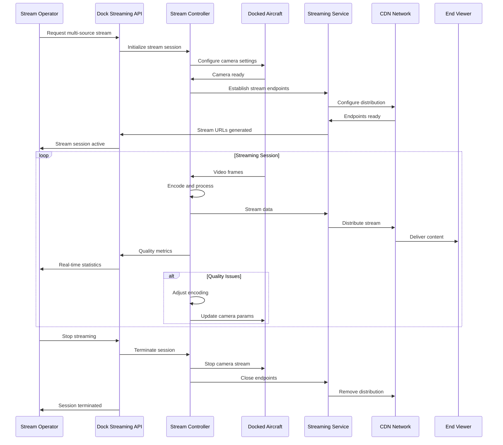

# Live Stream (Dock)

## Overview

The dock live stream system provides high-quality video streaming capabilities for docked aircraft, enabling remote monitoring, surveillance, and inspection operations. The system supports multiple streaming protocols, automated stream management, and integrated recording capabilities optimized for dock-based operations.

## Supported Dock Streaming Configurations

| Dock Model | Stream Sources | Max Resolution | Protocols | Bandwidth | Storage |
|------------|----------------|----------------|-----------|-----------|---------|
| DJI Dock | 2 aircraft | 4K@30fps | RTMP, WebRTC | 50Mbps | Local NVR |
| DJI Dock 2 | 4 aircraft | 4K@60fps | RTMP, WebRTC, SRT | 100Mbps | Cloud + Local |
| M30 Dock | 2 M30 aircraft | 4K@30fps | RTMP, RTSP | 60Mbps | Local + Cloud |
| M300 Dock | 1 M300 RTK | 8K@30fps | RTMP, RTSP, NDI | 80Mbps | Enterprise NVR |

## Architecture Overview

```mermaid
graph TB
    subgraph "Dock Streaming System"
        StreamController["Stream Controller"]
        AircraftStreams["Aircraft Stream Manager"]
        DockCameras["Dock Security Cameras"]
        StreamProcessor["Stream Processor"]
        RecordingEngine["Recording Engine"]
        NetworkManager["Network Manager"]
    end
    
    subgraph "Aircraft Systems"
        Aircraft1["Aircraft 1<br/>Main Camera"]
        Aircraft2["Aircraft 2<br/>Main Camera"] 
        Gimbal1["Gimbal Camera 1"]
        Gimbal2["Gimbal Camera 2"]
        ThermalCam["Thermal Camera"]
    end
    
    subgraph "Dock Infrastructure"
        SecurityCam1["Perimeter Camera 1"]
        SecurityCam2["Perimeter Camera 2"]
        DockInterior["Interior Camera"]
        StatusDisplay["Status Display"]
    end
    
    subgraph "Streaming Endpoints"
        RTMPServer["RTMP Server"]
        WebRTCServer["WebRTC Server"]
        SRTServer["SRT Server"]
        RTSPServer["RTSP Server"]
    end
    
    subgraph "Cloud Platform"
        StreamingService["Cloud Streaming"]
        CDNNetwork["CDN Network"]
        RecordingStorage["Recording Storage"]
        AnalyticsEngine["Video Analytics"]
    end
    
    StreamController --> AircraftStreams
    StreamController --> DockCameras
    StreamController --> StreamProcessor
    StreamController --> RecordingEngine
    StreamController --> NetworkManager
    
    AircraftStreams --> Aircraft1
    AircraftStreams --> Aircraft2
    Aircraft1 --> Gimbal1
    Aircraft2 --> Gimbal2
    Aircraft1 --> ThermalCam
    
    DockCameras --> SecurityCam1
    DockCameras --> SecurityCam2
    DockCameras --> DockInterior
    
    StreamProcessor --> RTMPServer
    StreamProcessor --> WebRTCServer
    StreamProcessor --> SRTServer
    StreamProcessor --> RTSPServer
    
    NetworkManager --> StreamingService
    StreamingService --> CDNNetwork
    RecordingEngine --> RecordingStorage
    StreamingService --> AnalyticsEngine
```



## Stream Types and Sources

### Aircraft Camera Streams
```json
{
  "aircraft_streams": [
    {
      "aircraft_sn": "M30T_001_XYZ789",
      "bay_number": 1,
      "cameras": [
        {
          "camera_id": "main_camera",
          "type": "rgb",
          "resolution": "3840x2160",
          "fps": 30,
          "bitrate": "15Mbps",
          "encoding": "H.265"
        },
        {
          "camera_id": "thermal_camera", 
          "type": "thermal",
          "resolution": "640x512",
          "fps": 30,
          "bitrate": "5Mbps",
          "encoding": "H.264"
        },
        {
          "camera_id": "zoom_camera",
          "type": "rgb_zoom",
          "resolution": "3840x2160", 
          "fps": 30,
          "optical_zoom": "28x",
          "digital_zoom": "200x",
          "bitrate": "20Mbps"
        }
      ]
    }
  ]
}
```

### Dock Security Streams
```json
{
  "dock_streams": [
    {
      "camera_id": "perimeter_north",
      "type": "security",
      "resolution": "2560x1440",
      "fps": 25,
      "fov": "120°",
      "night_vision": true,
      "motion_detection": true
    },
    {
      "camera_id": "interior_bay",
      "type": "monitoring",
      "resolution": "1920x1080", 
      "fps": 30,
      "ptz_control": true,
      "audio_recording": true
    }
  ]
}
```

## MQTT Topic Structure

### Stream Control Topics
```
# Dock Stream Management
thing/product/{dock_sn}/services
├── streaming
│   ├── start_stream           # Start streaming session
│   ├── stop_stream            # Stop streaming session
│   ├── configure_stream       # Configure stream parameters
│   ├── switch_source          # Switch between camera sources
│   └── record_control         # Control recording

# Aircraft Stream Control
thing/product/{dock_sn}/aircraft/{aircraft_sn}/services
├── camera_stream_start        # Start aircraft camera stream
├── camera_stream_stop         # Stop aircraft camera stream
├── gimbal_control            # Control gimbal for streaming
├── zoom_control              # Camera zoom control
└── camera_settings           # Adjust camera parameters

# Stream Status Topics
thing/product/{dock_sn}/state
├── active_streams            # Currently active streams
├── stream_quality           # Stream quality metrics
├── bandwidth_usage          # Network bandwidth utilization
└── recording_status         # Recording state and storage

# Stream Events
thing/product/{dock_sn}/events
├── stream_started           # Stream session started
├── stream_stopped           # Stream session ended
├── quality_degraded         # Stream quality issues
├── storage_full            # Recording storage full
└── bandwidth_exceeded       # Bandwidth limit exceeded
```

## API Endpoints

### Start Multi-Source Stream
```http
POST /api/v1/dock/{dock_sn}/streaming/start
Content-Type: application/json

{
  "session_id": "stream_session_001",
  "stream_sources": [
    {
      "source_type": "aircraft_camera",
      "aircraft_sn": "M30T_001_XYZ789",
      "camera_type": "main",
      "quality": "4K_30",
      "position": "bay_1"
    },
    {
      "source_type": "dock_security", 
      "camera_id": "perimeter_north",
      "quality": "1080p_25",
      "position": "perimeter"
    }
  ],
  "stream_config": {
    "protocol": "WebRTC",
    "backup_protocol": "RTMP",
    "max_bitrate": "25Mbps",
    "adaptive_bitrate": true,
    "record_enabled": true
  },
  "delivery_config": {
    "primary_endpoint": "wss://stream.dji.com/webrtc",
    "backup_endpoint": "rtmp://backup.dji.com/live",
    "cdn_distribution": true,
    "geo_restrictions": ["US", "EU"]
  }
}
```

### Stream Status Query
```http
GET /api/v1/dock/{dock_sn}/streaming/status
Accept: application/json

Response:
{
  "dock_sn": "DOCK_001_ABC123",
  "active_sessions": 2,
  "total_bandwidth": "35.5Mbps",
  "sessions": [
    {
      "session_id": "stream_session_001",
      "start_time": "2024-01-20T10:30:00Z",
      "duration": 1800,
      "sources": [
        {
          "source_id": "M30T_001_XYZ789_main",
          "resolution": "3840x2160",
          "fps": 30,
          "bitrate": "18.5Mbps",
          "quality_score": 95,
          "viewer_count": 12
        },
        {
          "source_id": "perimeter_north",
          "resolution": "2560x1440", 
          "fps": 25,
          "bitrate": "8.2Mbps",
          "quality_score": 98,
          "viewer_count": 3
        }
      ]
    }
  ],
  "system_status": {
    "cpu_usage": 45,
    "memory_usage": 62,
    "storage_usage": 73,
    "network_latency": 25,
    "encoding_performance": "optimal"
  }
}
```

### Recording Management
```http
POST /api/v1/dock/{dock_sn}/streaming/recording
Content-Type: application/json

{
  "action": "start_recording",
  "session_id": "stream_session_001",
  "recording_config": {
    "sources": ["M30T_001_XYZ789_main", "perimeter_north"],
    "quality": "4K",
    "format": "MP4",
    "segment_duration": 300,
    "storage_location": "local_nvr",
    "backup_location": "cloud_storage",
    "retention_period": 2592000
  },
  "metadata": {
    "mission_id": "survey_mission_123",
    "operator": "john.doe@company.com",
    "location": "Site_Alpha",
    "purpose": "routine_inspection"
  }
}
```

## Message Schemas

### Stream Start Command
```json
{
  "tid": "stream_start_001",
  "bid": "12345678-1234-1234-1234-123456789012",
  "timestamp": 1640995200000,
  "method": "start_stream",
  "data": {
    "session_id": "stream_session_001",
    "sources": [
      {
        "source_type": "aircraft_camera",
        "aircraft_sn": "M30T_001_XYZ789",
        "camera_type": "main",
        "stream_params": {
          "resolution": "3840x2160",
          "fps": 30,
          "bitrate": "18Mbps",
          "encoding": "H.265",
          "profile": "main"
        }
      }
    ],
    "stream_endpoints": [
      {
        "protocol": "WebRTC",
        "endpoint": "wss://stream.dji.com/webrtc/session_001",
        "ice_servers": ["stun:stun.dji.com:3478"]
      },
      {
        "protocol": "RTMP", 
        "endpoint": "rtmp://backup.dji.com/live/session_001",
        "stream_key": "encrypted_stream_key"
      }
    ]
  }
}
```

### Stream Quality Report
```json
{
  "tid": "quality_report_001",
  "bid": "12345678-1234-1234-1234-123456789012", 
  "timestamp": 1640995200000,
  "method": "stream_quality_report",
  "data": {
    "session_id": "stream_session_001",
    "dock_sn": "DOCK_001_ABC123",
    "quality_metrics": {
      "overall_score": 94,
      "video_quality": 96,
      "audio_quality": 92,
      "network_stability": 95,
      "latency_ms": 150
    },
    "bandwidth_metrics": {
      "current_upload": "22.5Mbps",
      "average_upload": "20.1Mbps", 
      "peak_upload": "28.3Mbps",
      "available_bandwidth": "45.0Mbps"
    },
    "source_performance": [
      {
        "source_id": "M30T_001_XYZ789_main",
        "frames_encoded": 1800,
        "frames_dropped": 2,
        "encoding_latency": 33,
        "bitrate_actual": "18.2Mbps",
        "quality_score": 96
      }
    ],
    "viewer_metrics": {
      "total_viewers": 15,
      "concurrent_viewers": 12,
      "average_watch_duration": 420,
      "geographic_distribution": {
        "US": 8,
        "EU": 4,
        "APAC": 3
      }
    }
  }
}
```

## Stream Management Flow



## Code Example

```java
@Service
@Slf4j
public class DockLiveStreamService extends AbstractDeviceService {
    
    @Autowired
    private StreamingEndpointService endpointService;
    
    @Autowired
    private RecordingService recordingService;
    
    @Autowired
    private BandwidthManager bandwidthManager;
    
    @Autowired
    private VideoAnalyticsService analyticsService;
    
    private final Map<String, DockStreamSession> activeSessions = new ConcurrentHashMap<>();
    
    /**
     * Start multi-source streaming session
     */
    public StreamStartResult startDockStreaming(String dockSn, StreamStartRequest request) {
        
        log.info("Starting dock streaming session: {} for dock: {}", 
                request.getSessionId(), dockSn);
        
        try {
            // Validate dock streaming capacity
            validateStreamingCapacity(dockSn, request.getStreamSources().size());
            
            // Check bandwidth availability
            BandwidthRequirement bandwidth = calculateBandwidthRequirement(request.getStreamSources());
            if (!bandwidthManager.reserveBandwidth(dockSn, bandwidth)) {
                throw new InsufficientBandwidthException("Insufficient bandwidth for requested streams");
            }
            
            // Create streaming endpoints
            List<StreamEndpoint> endpoints = endpointService.createStreamEndpoints(
                request.getSessionId(),
                request.getStreamConfig(),
                request.getDeliveryConfig()
            );
            
            // Initialize stream sources
            List<StreamSource> sources = initializeStreamSources(dockSn, request.getStreamSources());
            
            // Create stream session
            DockStreamSession session = DockStreamSession.builder()
                    .sessionId(request.getSessionId())
                    .dockSn(dockSn)
                    .sources(sources)
                    .endpoints(endpoints)
                    .config(request.getStreamConfig())
                    .startTime(Instant.now())
                    .status(StreamStatus.STARTING)
                    .build();
            
            activeSessions.put(request.getSessionId(), session);
            
            // Start streaming for each source
            for (StreamSource source : sources) {
                startStreamSource(session, source);
            }
            
            // Start recording if enabled
            if (request.getStreamConfig().isRecordEnabled()) {
                recordingService.startRecording(session);
            }
            
            // Update session status
            session.setStatus(StreamStatus.ACTIVE);
            
            // Start quality monitoring
            startQualityMonitoring(session);
            
            log.info("Dock streaming session started successfully: {}", request.getSessionId());
            
            return StreamStartResult.success(session, endpoints);
            
        } catch (Exception e) {
            log.error("Failed to start dock streaming session: {}", request.getSessionId(), e);
            cleanupFailedSession(request.getSessionId());
            return StreamStartResult.failure(e.getMessage());
        }
    }
    
    /**
     * Initialize stream sources (aircraft cameras, dock cameras)
     */
    private List<StreamSource> initializeStreamSources(String dockSn, 
                                                      List<StreamSourceRequest> sourceRequests) {
        
        List<StreamSource> sources = new ArrayList<>();
        
        for (StreamSourceRequest sourceRequest : sourceRequests) {
            StreamSource source = null;
            
            switch (sourceRequest.getSourceType()) {
                case AIRCRAFT_CAMERA:
                    source = initializeAircraftCameraSource(dockSn, sourceRequest);
                    break;
                case DOCK_SECURITY:
                    source = initializeDockSecuritySource(dockSn, sourceRequest);
                    break;
                case DOCK_INTERIOR:
                    source = initializeDockInteriorSource(dockSn, sourceRequest);
                    break;
                default:
                    log.warn("Unsupported stream source type: {}", sourceRequest.getSourceType());
                    continue;
            }
            
            if (source != null) {
                sources.add(source);
            }
        }
        
        return sources;
    }
    
    /**
     * Initialize aircraft camera stream source
     */
    private StreamSource initializeAircraftCameraSource(String dockSn, 
                                                       StreamSourceRequest request) {
        
        String aircraftSn = request.getAircraftSn();
        
        // Verify aircraft is docked
        if (!isAircraftDocked(dockSn, aircraftSn)) {
            throw new IllegalStateException("Aircraft not docked: " + aircraftSn);
        }
        
        // Configure aircraft camera
        AircraftCameraConfig cameraConfig = AircraftCameraConfig.builder()
                .cameraType(request.getCameraType())
                .resolution(request.getQuality())
                .fps(30)
                .encoding("H.265")
                .bitrate(calculateOptimalBitrate(request.getQuality()))
                .build();
        
        // Send camera configuration to aircraft
        configureAircraftCamera(aircraftSn, cameraConfig);
        
        return StreamSource.builder()
                .sourceId(aircraftSn + "_" + request.getCameraType())
                .sourceType(StreamSourceType.AIRCRAFT_CAMERA)
                .aircraftSn(aircraftSn)
                .cameraType(request.getCameraType())
                .config(cameraConfig)
                .status(StreamSourceStatus.CONFIGURED)
                .build();
    }
    
    /**
     * Start streaming for a specific source
     */
    private void startStreamSource(DockStreamSession session, StreamSource source) {
        
        log.debug("Starting stream source: {} for session: {}", 
                source.getSourceId(), session.getSessionId());
        
        try {
            switch (source.getSourceType()) {
                case AIRCRAFT_CAMERA:
                    startAircraftCameraStream(session, source);
                    break;
                case DOCK_SECURITY:
                    startDockSecurityStream(session, source);
                    break;
                case DOCK_INTERIOR:
                    startDockInteriorStream(session, source);
                    break;
            }
            
            source.setStatus(StreamSourceStatus.STREAMING);
            source.setStartTime(Instant.now());
            
        } catch (Exception e) {
            log.error("Failed to start stream source: {}", source.getSourceId(), e);
            source.setStatus(StreamSourceStatus.ERROR);
            source.setErrorMessage(e.getMessage());
        }
    }
    
    /**
     * Start aircraft camera streaming
     */
    private void startAircraftCameraStream(DockStreamSession session, StreamSource source) {
        
        // Build stream start command for aircraft
        CommonTopicResponse command = CommonTopicResponse.builder()
                .tid(UUID.randomUUID().toString())
                .method("camera_stream_start")
                .data(Map.of(
                    "session_id", session.getSessionId(),
                    "camera_type", source.getCameraType(),
                    "config", source.getConfig(),
                    "endpoints", session.getEndpoints()
                        .stream()
                        .map(this::mapEndpointForAircraft)
                        .collect(Collectors.toList())
                ))
                .timestamp(System.currentTimeMillis())
                .build();
        
        String topic = TopicConst.THING_MODEL_PRE + source.getAircraftSn() + TopicConst.SERVICES_SUF;
        
        publishWithReply(topic, command, (reply, isSuccess) -> {
            handleStreamStartResponse(session, source, reply, isSuccess);
        });
    }
    
    /**
     * Monitor stream quality and performance
     */
    @Scheduled(fixedRate = 10000) // Check every 10 seconds
    public void monitorStreamQuality() {
        
        for (DockStreamSession session : activeSessions.values()) {
            if (session.getStatus() != StreamStatus.ACTIVE) {
                continue;
            }
            
            try {
                // Collect quality metrics
                StreamQualityMetrics metrics = collectQualityMetrics(session);
                
                // Update session metrics
                session.updateQualityMetrics(metrics);
                
                // Check for quality issues
                if (metrics.getOverallScore() < 70) {
                    handleQualityDegradation(session, metrics);
                }
                
                // Check bandwidth usage
                if (metrics.getBandwidthUsage() > 0.9 * session.getAllocatedBandwidth()) {
                    handleBandwidthExceeded(session);
                }
                
                // Broadcast quality report
                broadcastQualityReport(session, metrics);
                
            } catch (Exception e) {
                log.error("Error monitoring stream quality for session: {}", 
                        session.getSessionId(), e);
            }
        }
    }
    
    /**
     * Handle stream quality degradation
     */
    private void handleQualityDegradation(DockStreamSession session, StreamQualityMetrics metrics) {
        
        log.warn("Stream quality degraded for session: {}, score: {}", 
                session.getSessionId(), metrics.getOverallScore());
        
        // Attempt automatic quality adjustment
        if (session.getConfig().isAdaptiveBitrate()) {
            adjustStreamQuality(session, metrics);
        }
        
        // Publish quality alert
        StreamQualityAlert alert = StreamQualityAlert.builder()
                .sessionId(session.getSessionId())
                .dockSn(session.getDockSn())
                .alertType(QualityAlertType.QUALITY_DEGRADED)
                .currentScore(metrics.getOverallScore())
                .threshold(70)
                .affectedSources(getAffectedSources(session, metrics))
                .suggestedActions(generateSuggestedActions(metrics))
                .build();
        
        publishQualityAlert(alert);
    }
    
    /**
     * Stop streaming session
     */
    public StreamStopResult stopDockStreaming(String sessionId, String reason) {
        
        DockStreamSession session = activeSessions.get(sessionId);
        if (session == null) {
            return StreamStopResult.failure("Session not found");
        }
        
        log.info("Stopping dock streaming session: {} - reason: {}", sessionId, reason);
        
        try {
            // Stop all stream sources
            for (StreamSource source : session.getSources()) {
                stopStreamSource(session, source);
            }
            
            // Stop recording
            if (session.isRecordingActive()) {
                recordingService.stopRecording(session);
            }
            
            // Release bandwidth
            bandwidthManager.releaseBandwidth(session.getDockSn(), session.getAllocatedBandwidth());
            
            // Cleanup streaming endpoints
            endpointService.cleanupStreamEndpoints(session.getEndpoints());
            
            // Update session status
            session.setStatus(StreamStatus.STOPPED);
            session.setEndTime(Instant.now());
            session.setStopReason(reason);
            
            // Archive session data
            archiveSessionData(session);
            
            // Remove from active sessions
            activeSessions.remove(sessionId);
            
            log.info("Dock streaming session stopped successfully: {}", sessionId);
            
            return StreamStopResult.success();
            
        } catch (Exception e) {
            log.error("Error stopping streaming session: {}", sessionId, e);
            return StreamStopResult.failure(e.getMessage());
        }
    }
    
    /**
     * Get dock streaming status
     */
    public DockStreamingStatus getDockStreamingStatus(String dockSn) {
        
        List<DockStreamSession> dockSessions = activeSessions.values()
                .stream()
                .filter(session -> session.getDockSn().equals(dockSn))
                .collect(Collectors.toList());
        
        double totalBandwidth = dockSessions.stream()
                .mapToDouble(DockStreamSession::getCurrentBandwidth)
                .sum();
        
        SystemResourceUsage resourceUsage = getSystemResourceUsage(dockSn);
        
        return DockStreamingStatus.builder()
                .dockSn(dockSn)
                .activeSessions(dockSessions.size())
                .totalBandwidth(totalBandwidth)
                .sessions(dockSessions.stream()
                        .map(this::mapToStatusResponse)
                        .collect(Collectors.toList()))
                .systemStatus(resourceUsage)
                .build();
    }
}

/**
 * Dock stream session data model
 */
@Data
@Builder
public class DockStreamSession {
    private String sessionId;
    private String dockSn;
    private List<StreamSource> sources;
    private List<StreamEndpoint> endpoints;
    private StreamConfig config;
    private Instant startTime;
    private Instant endTime;
    private StreamStatus status;
    private String stopReason;
    private double allocatedBandwidth;
    private StreamQualityMetrics latestMetrics;
    private boolean recordingActive;
    
    public double getCurrentBandwidth() {
        return sources.stream()
                .filter(source -> source.getStatus() == StreamSourceStatus.STREAMING)
                .mapToDouble(source -> source.getCurrentBitrate())
                .sum() / 1_000_000.0; // Convert to Mbps
    }
}
```

## Quality Management

### Adaptive Bitrate Streaming
- Real-time bandwidth monitoring
- Automatic quality adjustment
- Multi-resolution stream variants
- Buffer health optimization

### Performance Optimization
- Hardware-accelerated encoding
- GPU-based video processing
- Efficient memory management
- Network congestion handling

### Error Recovery
- Automatic reconnection mechanisms
- Redundant stream paths
- Graceful degradation strategies
- Real-time error detection