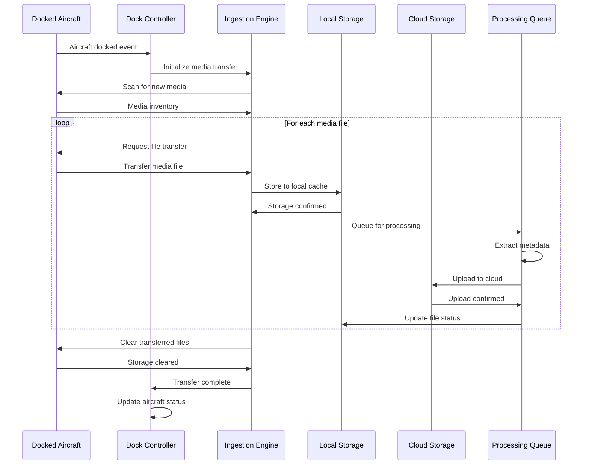

# Media Management (Dock)

## Overview

The dock media management system provides comprehensive file handling capabilities for multimedia content captured by docked aircraft. This includes automated media ingestion, intelligent storage management, cloud synchronization, and integrated post-processing workflows optimized for high-volume operations.

## Supported Media Types and Formats

| Content Type | Formats | Max Resolution | Processing | Storage Options |
|--------------|---------|----------------|------------|----------------|
| RGB Photos | JPG, DNG, TIFF | 48MP | Auto enhancement | Local + Cloud |
| Thermal Images | JPG, TIFF, R-JPG | 640x512 | Temperature analysis | Local + Cloud |
| Video Recordings | MP4, MOV | 4K@60fps | Auto editing | NVR + Cloud |
| Panoramic Images | JPG, DNG | 360° x 180° | Stitching | Cloud only |
| Point Cloud Data | LAS, PLY | Variable | Reconstruction | Specialized storage |
| Mission Logs | JSON, XML | - | Analytics | Database |

## Architecture Overview

```mermaid
graph TB
    subgraph "Dock Media System"
        MediaController["Media Controller"]
        IngestionEngine["Media Ingestion Engine"]
        StorageManager["Storage Manager"]
        ProcessingQueue["Processing Queue"]
        SyncEngine["Cloud Sync Engine"]
        MetadataDB["Metadata Database"]
    end
    
    subgraph "Aircraft Storage"
        Aircraft1SD["Aircraft 1 SD Card"]
        Aircraft2SD["Aircraft 2 SD Card"]
        InternalStorage["Internal Storage"]
        CacheMemory["Cache Memory"]
    end
    
    subgraph "Local Storage"
        NVRStorage["NVR Storage<br/>10TB RAID"]
        SSDCache["SSD Cache<br/>2TB NVMe"]
        BackupDrive["Backup Drive<br/>External"]
        TempStorage["Temp Processing<br/>1TB"]
    end
    
    subgraph "Processing Pipeline"
        MediaAnalyzer["Media Analyzer"]
        ImageProcessor["Image Processor"]
        VideoProcessor["Video Processor"]
        AIAnalytics["AI Analytics"]
        QualityChecker["Quality Checker"]
    end
    
    subgraph "Cloud Services"
        CloudStorage["Cloud Storage<br/>AWS S3/Azure"]
        CDNService["CDN Distribution"]
        MLPipeline["ML Processing"]
        APIGateway["API Gateway"]
    end
    
    MediaController --> IngestionEngine
    MediaController --> StorageManager
    MediaController --> ProcessingQueue
    MediaController --> SyncEngine
    
    IngestionEngine --> Aircraft1SD
    IngestionEngine --> Aircraft2SD
    IngestionEngine --> InternalStorage
    
    StorageManager --> NVRStorage
    StorageManager --> SSDCache
    StorageManager --> BackupDrive
    StorageManager --> TempStorage
    
    ProcessingQueue --> MediaAnalyzer
    ProcessingQueue --> ImageProcessor
    ProcessingQueue --> VideoProcessor
    ProcessingQueue --> AIAnalytics
    ProcessingQueue --> QualityChecker
    
    SyncEngine --> CloudStorage
    SyncEngine --> CDNService
    CloudStorage --> MLPipeline
    MLPipeline --> APIGateway
```



## Media Ingestion Workflow

### Automated Media Transfer


## MQTT Topic Structure

### Media Management Topics
```
# Dock Media Operations
thing/product/{dock_sn}/services
├── media_management
│   ├── start_ingestion         # Start media transfer from aircraft
│   ├── process_media           # Process media files
│   ├── sync_to_cloud          # Sync media to cloud storage
│   ├── cleanup_local          # Clean up local storage
│   └── archive_media          # Archive old media

# Aircraft Media Operations
thing/product/{dock_sn}/aircraft/{aircraft_sn}/services
├── scan_media                 # Scan aircraft for media files
├── transfer_media             # Transfer specific media files
├── clear_media                # Clear aircraft storage
├── media_status              # Get media storage status
└── format_storage            # Format aircraft storage

# Media Status Topics
thing/product/{dock_sn}/state
├── media_inventory           # Current media inventory
├── storage_status           # Storage usage and health
├── processing_queue         # Processing status
├── sync_status             # Cloud sync status
└── transfer_progress       # Active transfer progress

# Media Events
thing/product/{dock_sn}/events
├── media_ingested          # New media ingested
├── processing_complete     # Media processing finished
├── sync_complete           # Cloud sync finished
├── storage_warning         # Storage space warning
└── transfer_error          # Media transfer error
```

## API Endpoints

### Media Ingestion Control
```http
POST /api/v1/dock/{dock_sn}/media/ingestion/start
Content-Type: application/json

{
  "aircraft_sn": "M30T_001_XYZ789",
  "ingestion_config": {
    "transfer_mode": "incremental",
    "file_types": ["jpg", "mp4", "dng"],
    "quality_filter": "high_only",
    "auto_process": true,
    "auto_sync": true
  },
  "processing_options": {
    "generate_thumbnails": true,
    "extract_metadata": true,
    "run_analytics": true,
    "quality_check": true
  },
  "storage_options": {
    "local_retention": 30,
    "cloud_backup": true,
    "compression": "lossless",
    "encryption": true
  }
}
```

### Media Search and Query
```http
GET /api/v1/dock/{dock_sn}/media/search
Accept: application/json
Query Parameters:
- date_from: 2024-01-01T00:00:00Z
- date_to: 2024-01-31T23:59:59Z
- aircraft_sn: M30T_001_XYZ789
- file_type: jpg,mp4
- mission_id: mission_123
- location: polygon geometry
- tags: inspection,thermal

Response:
{
  "total_files": 1250,
  "total_size": "45.2GB",
  "page": 1,
  "page_size": 50,
  "files": [
    {
      "file_id": "media_file_001",
      "filename": "DJI_20240115_103045_001.jpg",
      "file_type": "jpg",
      "size": 8457329,
      "resolution": "4000x3000",
      "created_at": "2024-01-15T10:30:45Z",
      "aircraft_sn": "M30T_001_XYZ789",
      "mission_id": "survey_mission_123",
      "location": {
        "latitude": 40.123456,
        "longitude": 116.123456,
        "altitude": 85.5
      },
      "metadata": {
        "camera": "main",
        "exposure": "1/1000",
        "iso": 100,
        "focal_length": "24mm"
      },
      "processing_status": "completed",
      "cloud_url": "https://cdn.dji.com/media/files/media_file_001.jpg",
      "thumbnails": {
        "small": "https://cdn.dji.com/thumbnails/small/media_file_001.jpg",
        "medium": "https://cdn.dji.com/thumbnails/medium/media_file_001.jpg"
      },
      "analytics": {
        "quality_score": 94,
        "detected_objects": ["building", "vehicle", "vegetation"],
        "defect_detected": false
      }
    }
  ]
}
```

### Bulk Media Operations
```http
POST /api/v1/dock/{dock_sn}/media/bulk-operation
Content-Type: application/json

{
  "operation": "export_to_external",
  "selection_criteria": {
    "date_range": {
      "from": "2024-01-01T00:00:00Z",
      "to": "2024-01-31T23:59:59Z"
    },
    "aircraft_sn": "M30T_001_XYZ789",
    "mission_ids": ["mission_123", "mission_124"],
    "file_types": ["jpg", "mp4"]
  },
  "export_config": {
    "destination": "external_drive",
    "format": "original",
    "include_metadata": true,
    "folder_structure": "date_based",
    "compression": "none"
  },
  "processing_options": {
    "generate_report": true,
    "create_manifest": true,
    "verify_integrity": true
  }
}
```

## Message Schemas

### Media Ingestion Command
```json
{
  "tid": "ingestion_001",
  "bid": "12345678-1234-1234-1234-123456789012",
  "timestamp": 1640995200000,
  "method": "start_ingestion",
  "data": {
    "aircraft_sn": "M30T_001_XYZ789",
    "ingestion_id": "ing_20240115_001",
    "config": {
      "transfer_mode": "incremental",
      "file_filters": {
        "types": ["jpg", "mp4", "dng"],
        "min_size": 1024,
        "date_from": "2024-01-15T00:00:00Z"
      },
      "processing": {
        "auto_thumbnail": true,
        "metadata_extraction": true,
        "quality_analysis": true,
        "duplicate_detection": true
      },
      "storage": {
        "local_path": "/media/dock/aircraft_001/",
        "cloud_sync": true,
        "backup_enabled": true,
        "compression_level": 85
      }
    }
  }
}
```

### Media Inventory Update
```json
{
  "tid": "inventory_update_001",
  "bid": "12345678-1234-1234-1234-123456789012",
  "timestamp": 1640995200000,
  "method": "media_inventory_update",
  "data": {
    "dock_sn": "DOCK_001_ABC123",
    "update_type": "incremental",
    "inventory": {
      "total_files": 15432,
      "total_size": "2.4TB",
      "by_aircraft": [
        {
          "aircraft_sn": "M30T_001_XYZ789",
          "file_count": 8245,
          "total_size": "1.3TB",
          "by_type": {
            "jpg": {"count": 5123, "size": "89.2GB"},
            "mp4": {"count": 2890, "size": "1.1TB"},
            "dng": {"count": 232, "size": "45.8GB"}
          },
          "by_date": {
            "today": {"count": 156, "size": "2.8GB"},
            "last_7_days": {"count": 1245, "size": "18.9GB"},
            "last_30_days": {"count": 4567, "size": "156.7GB"}
          }
        }
      ],
      "storage_usage": {
        "local_nvr": {
          "capacity": "10TB",
          "used": "7.2TB",
          "available": "2.8TB",
          "usage_percent": 72
        },
        "cloud_storage": {
          "used": "45.6TB",
          "cost_current_month": 1247.56,
          "projected_monthly_cost": 1580.34
        }
      },
      "processing_stats": {
        "queue_size": 45,
        "processing_rate": "12.5 files/min",
        "average_processing_time": "4.8s",
        "failed_processing": 3
      }
    }
  }
}
```

### Media Processing Result
```json
{
  "tid": "processing_result_001",
  "bid": "12345678-1234-1234-1234-123456789012",
  "timestamp": 1640995200000,
  "method": "media_processing_complete",
  "data": {
    "processing_id": "proc_20240115_001",
    "file_id": "media_file_001",
    "original_file": {
      "filename": "DJI_20240115_103045_001.jpg",
      "size": 8457329,
      "checksum": "sha256:abc123def456..."
    },
    "processing_results": {
      "thumbnails_generated": [
        {
          "size": "150x150",
          "filename": "thumb_150_media_file_001.jpg",
          "size_bytes": 12456
        },
        {
          "size": "500x375", 
          "filename": "thumb_500_media_file_001.jpg",
          "size_bytes": 45789
        }
      ],
      "metadata_extracted": {
        "exif_data": {
          "camera_model": "DJI Mini 3",
          "focal_length": "24mm",
          "exposure_time": "1/1000s",
          "iso": 100,
          "gps_coordinates": {
            "latitude": 40.123456,
            "longitude": 116.123456,
            "altitude": 85.5
          }
        },
        "flight_data": {
          "aircraft_sn": "M30T_001_XYZ789",
          "mission_id": "survey_mission_123",
          "flight_mode": "waypoint",
          "gimbal_pitch": -45,
          "gimbal_yaw": 0
        }
      },
      "analytics_results": {
        "quality_score": 94,
        "sharpness": 0.92,
        "exposure_quality": 0.96,
        "detected_objects": [
          {"class": "building", "confidence": 0.95, "bbox": [120, 80, 300, 200]},
          {"class": "vehicle", "confidence": 0.87, "bbox": [450, 120, 520, 180]}
        ],
        "anomaly_detected": false,
        "inspection_results": {
          "defects_found": 0,
          "inspection_score": 98
        }
      }
    },
    "cloud_sync": {
      "status": "completed",
      "cloud_url": "https://storage.dji.com/media/media_file_001.jpg",
      "cdn_url": "https://cdn.dji.com/media/media_file_001.jpg",
      "sync_duration": 15.2
    }
  }
}
```

## Code Example

```java
@Service
@Slf4j
public class DockMediaManagementService extends AbstractDeviceService {
    
    @Autowired
    private StorageService storageService;
    
    @Autowired
    private MediaProcessingService processingService;
    
    @Autowired
    private CloudSyncService cloudSyncService;
    
    @Autowired
    private MediaAnalyticsService analyticsService;
    
    @Autowired
    private MetadataRepository metadataRepository;
    
    private final Map<String, MediaIngestionSession> activeIngestionSessions = new ConcurrentHashMap<>();
    
    /**
     * Start media ingestion from aircraft
     */
    public MediaIngestionResult startMediaIngestion(String dockSn, String aircraftSn, 
                                                   MediaIngestionRequest request) {
        
        log.info("Starting media ingestion for aircraft {} in dock {}", aircraftSn, dockSn);
        
        try {
            // Validate storage capacity
            validateStorageCapacity(dockSn, request);
            
            // Check aircraft connectivity
            if (!isAircraftDocked(dockSn, aircraftSn)) {
                throw new AircraftNotDockedException("Aircraft not properly docked");
            }
            
            // Create ingestion session
            MediaIngestionSession session = MediaIngestionSession.builder()
                    .sessionId(UUID.randomUUID().toString())
                    .dockSn(dockSn)
                    .aircraftSn(aircraftSn)
                    .config(request.getIngestionConfig())
                    .startTime(Instant.now())
                    .status(IngestionStatus.INITIALIZING)
                    .build();
            
            activeIngestionSessions.put(session.getSessionId(), session);
            
            // Scan aircraft media
            MediaInventory aircraftInventory = scanAircraftMedia(aircraftSn, request.getIngestionConfig());
            session.setTotalFiles(aircraftInventory.getTotalFiles());
            session.setTotalSize(aircraftInventory.getTotalSize());
            
            // Start ingestion process
            session.setStatus(IngestionStatus.TRANSFERRING);
            startMediaTransfer(session, aircraftInventory);
            
            log.info("Media ingestion started successfully: {}", session.getSessionId());
            
            return MediaIngestionResult.success(session);
            
        } catch (Exception e) {
            log.error("Failed to start media ingestion for aircraft {}", aircraftSn, e);
            return MediaIngestionResult.failure(e.getMessage());
        }
    }
    
    /**
     * Start media transfer process
     */
    private void startMediaTransfer(MediaIngestionSession session, MediaInventory inventory) {
        
        CompletableFuture.runAsync(() -> {
            try {
                for (MediaFileInfo fileInfo : inventory.getFiles()) {
                    
                    if (session.getStatus() == IngestionStatus.CANCELLED) {
                        break;
                    }
                    
                    // Transfer file from aircraft
                    transferMediaFile(session, fileInfo);
                    
                    // Update progress
                    session.incrementProcessedFiles();
                    broadcastIngestionProgress(session);
                }
                
                // Complete ingestion
                completeIngestion(session);
                
            } catch (Exception e) {
                log.error("Media ingestion failed for session: {}", session.getSessionId(), e);
                session.setStatus(IngestionStatus.FAILED);
                session.setErrorMessage(e.getMessage());
                broadcastIngestionStatus(session);
            }
        });
    }
    
    /**
     * Transfer individual media file
     */
    private void transferMediaFile(MediaIngestionSession session, MediaFileInfo fileInfo) {
        
        log.debug("Transferring media file: {} from aircraft: {}", 
                fileInfo.getFilename(), session.getAircraftSn());
        
        try {
            // Request file from aircraft
            byte[] fileData = requestFileFromAircraft(session.getAircraftSn(), fileInfo);
            
            // Verify file integrity
            if (!verifyFileIntegrity(fileData, fileInfo)) {
                throw new FileCorruptedException("File integrity check failed");
            }
            
            // Store to local storage
            String localPath = storageService.storeMediaFile(
                session.getDockSn(), 
                fileInfo.getFilename(),
                fileData,
                session.getConfig().getStorageOptions()
            );
            
            // Create media record
            MediaRecord mediaRecord = MediaRecord.builder()
                    .fileId(UUID.randomUUID().toString())
                    .filename(fileInfo.getFilename())
                    .dockSn(session.getDockSn())
                    .aircraftSn(session.getAircraftSn())
                    .localPath(localPath)
                    .fileSize(fileInfo.getSize())
                    .fileType(getFileType(fileInfo.getFilename()))
                    .captureTime(fileInfo.getCaptureTime())
                    .ingestionTime(Instant.now())
                    .status(MediaStatus.INGESTED)
                    .build();
            
            // Save to database
            metadataRepository.save(mediaRecord);
            
            // Queue for processing
            if (session.getConfig().getProcessingOptions().isAutoProcess()) {
                queueForProcessing(mediaRecord, session.getConfig().getProcessingOptions());
            }
            
            // Queue for cloud sync
            if (session.getConfig().getStorageOptions().isCloudBackup()) {
                queueForCloudSync(mediaRecord);
            }
            
            log.debug("Media file transferred successfully: {}", fileInfo.getFilename());
            
        } catch (Exception e) {
            log.error("Failed to transfer media file: {}", fileInfo.getFilename(), e);
            session.incrementFailedFiles();
        }
    }
    
    /**
     * Process media file
     */
    public MediaProcessingResult processMediaFile(String fileId, MediaProcessingOptions options) {
        
        MediaRecord mediaRecord = metadataRepository.findByFileId(fileId);
        if (mediaRecord == null) {
            return MediaProcessingResult.failure("Media file not found");
        }
        
        log.info("Processing media file: {}", mediaRecord.getFilename());
        
        try {
            // Update status
            mediaRecord.setStatus(MediaStatus.PROCESSING);
            metadataRepository.save(mediaRecord);
            
            // Load file data
            byte[] fileData = storageService.loadMediaFile(mediaRecord.getLocalPath());
            
            MediaProcessingResult result = MediaProcessingResult.builder()
                    .fileId(fileId)
                    .processingId(UUID.randomUUID().toString())
                    .startTime(Instant.now())
                    .build();
            
            // Generate thumbnails
            if (options.isGenerateThumbnails()) {
                generateThumbnails(mediaRecord, fileData, result);
            }
            
            // Extract metadata
            if (options.isExtractMetadata()) {
                extractMetadata(mediaRecord, fileData, result);
            }
            
            // Run analytics
            if (options.isRunAnalytics()) {
                runMediaAnalytics(mediaRecord, fileData, result);
            }
            
            // Quality check
            if (options.isQualityCheck()) {
                performQualityCheck(mediaRecord, fileData, result);
            }
            
            // Update media record with processing results
            updateMediaRecordWithResults(mediaRecord, result);
            
            // Update status
            mediaRecord.setStatus(MediaStatus.PROCESSED);
            mediaRecord.setProcessedTime(Instant.now());
            metadataRepository.save(mediaRecord);
            
            result.setStatus(ProcessingStatus.COMPLETED);
            result.setEndTime(Instant.now());
            
            log.info("Media file processed successfully: {}", mediaRecord.getFilename());
            
            // Publish processing complete event
            publishProcessingCompleteEvent(mediaRecord, result);
            
            return result;
            
        } catch (Exception e) {
            log.error("Failed to process media file: {}", mediaRecord.getFilename(), e);
            
            mediaRecord.setStatus(MediaStatus.PROCESSING_FAILED);
            mediaRecord.setErrorMessage(e.getMessage());
            metadataRepository.save(mediaRecord);
            
            return MediaProcessingResult.failure(e.getMessage());
        }
    }
    
    /**
     * Run media analytics
     */
    private void runMediaAnalytics(MediaRecord mediaRecord, byte[] fileData, 
                                 MediaProcessingResult result) {
        
        AnalyticsRequest analyticsRequest = AnalyticsRequest.builder()
                .fileId(mediaRecord.getFileId())
                .fileType(mediaRecord.getFileType())
                .fileData(fileData)
                .aircraftModel(getAircraftModel(mediaRecord.getAircraftSn()))
                .analysisTypes(Arrays.asList(
                    AnalysisType.OBJECT_DETECTION,
                    AnalysisType.QUALITY_ASSESSMENT,
                    AnalysisType.ANOMALY_DETECTION
                ))
                .build();
        
        AnalyticsResult analyticsResult = analyticsService.analyzeMedia(analyticsRequest);
        
        result.setAnalyticsResult(analyticsResult);
        
        // Store analytics in database
        AnalyticsRecord analyticsRecord = AnalyticsRecord.builder()
                .fileId(mediaRecord.getFileId())
                .qualityScore(analyticsResult.getQualityScore())
                .detectedObjects(analyticsResult.getDetectedObjects())
                .anomalyDetected(analyticsResult.isAnomalyDetected())
                .inspectionResults(analyticsResult.getInspectionResults())
                .analysisTime(Instant.now())
                .build();
        
        analyticsRepository.save(analyticsRecord);
    }
    
    /**
     * Search media files
     */
    public MediaSearchResult searchMediaFiles(String dockSn, MediaSearchCriteria criteria) {
        
        log.debug("Searching media files for dock: {} with criteria: {}", dockSn, criteria);
        
        // Build query
        MediaQuery query = buildMediaQuery(dockSn, criteria);
        
        // Execute search
        List<MediaRecord> mediaRecords = metadataRepository.search(query);
        
        // Calculate totals
        long totalFiles = metadataRepository.countByQuery(query);
        long totalSize = metadataRepository.sumSizeByQuery(query);
        
        // Convert to response format
        List<MediaFileResponse> files = mediaRecords.stream()
                .map(this::convertToResponse)
                .collect(Collectors.toList());
        
        return MediaSearchResult.builder()
                .totalFiles(totalFiles)
                .totalSize(totalSize)
                .page(criteria.getPage())
                .pageSize(criteria.getPageSize())
                .files(files)
                .build();
    }
    
    /**
     * Bulk media operations
     */
    public BulkOperationResult executeBulkOperation(String dockSn, BulkOperationRequest request) {
        
        log.info("Executing bulk operation: {} for dock: {}", request.getOperation(), dockSn);
        
        // Find matching files
        MediaSearchCriteria criteria = request.getSelectionCriteria();
        List<MediaRecord> matchingFiles = metadataRepository.search(buildMediaQuery(dockSn, criteria));
        
        BulkOperationResult result = BulkOperationResult.builder()
                .operationId(UUID.randomUUID().toString())
                .operation(request.getOperation())
                .totalFiles(matchingFiles.size())
                .startTime(Instant.now())
                .build();
        
        // Execute operation asynchronously
        CompletableFuture.runAsync(() -> {
            try {
                executeBulkOperationAsync(matchingFiles, request, result);
            } catch (Exception e) {
                log.error("Bulk operation failed: {}", result.getOperationId(), e);
                result.setStatus(BulkOperationStatus.FAILED);
                result.setErrorMessage(e.getMessage());
            }
        });
        
        return result;
    }
    
    /**
     * Get storage statistics
     */
    public StorageStatistics getStorageStatistics(String dockSn) {
        
        // Local storage stats
        LocalStorageStats localStats = storageService.getLocalStorageStats(dockSn);
        
        // Cloud storage stats  
        CloudStorageStats cloudStats = cloudSyncService.getCloudStorageStats(dockSn);
        
        // Media statistics by type
        Map<String, FileTypeStats> fileTypeStats = metadataRepository.getFileTypeStatistics(dockSn);
        
        // Recent activity
        List<MediaActivityRecord> recentActivity = metadataRepository.getRecentActivity(dockSn, 24);
        
        return StorageStatistics.builder()
                .dockSn(dockSn)
                .localStorage(localStats)
                .cloudStorage(cloudStats)
                .fileTypeStatistics(fileTypeStats)
                .recentActivity(recentActivity)
                .lastUpdated(Instant.now())
                .build();
    }
}

/**
 * Media ingestion session data model
 */
@Data
@Builder
public class MediaIngestionSession {
    private String sessionId;
    private String dockSn;
    private String aircraftSn;
    private MediaIngestionConfig config;
    private Instant startTime;
    private Instant endTime;
    private IngestionStatus status;
    private String errorMessage;
    private int totalFiles;
    private long totalSize;
    private int processedFiles;
    private int failedFiles;
    
    public void incrementProcessedFiles() {
        this.processedFiles++;
    }
    
    public void incrementFailedFiles() {
        this.failedFiles++;
    }
    
    public double getProgressPercentage() {
        return totalFiles > 0 ? (double) processedFiles / totalFiles * 100 : 0;
    }
}
```

## Storage Optimization

### Tiered Storage Strategy
- Hot storage: Recent media on SSD
- Warm storage: Frequently accessed on NVR
- Cold storage: Archive on cloud
- Automatic tiering based on access patterns

### Deduplication and Compression
- Content-based deduplication
- Loseless compression for critical files
- Smart compression for different media types
- Space optimization algorithms

### Data Lifecycle Management
- Automated retention policies
- Configurable archive rules
- Compliance-aware deletion
- Audit trail maintenance