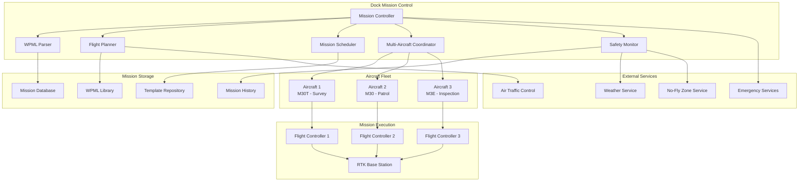
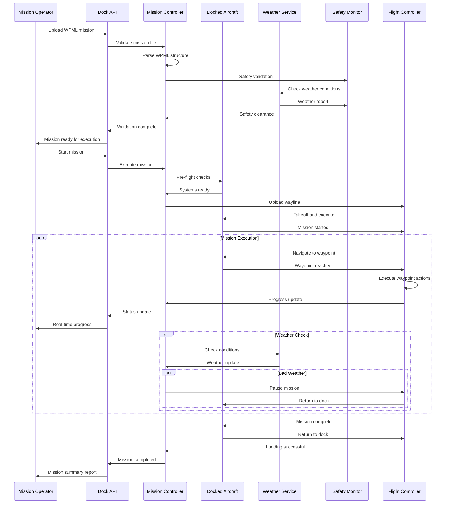

# Wayline Management (Dock)

## Overview

The dock wayline management system provides comprehensive autonomous mission planning and execution capabilities for docked aircraft. This includes WPML (Waypoint Mission Language) file management, automated mission scheduling, multi-aircraft coordination, and intelligent mission optimization based on environmental conditions and aircraft capabilities.

## Supported Mission Types

| Mission Type | Aircraft Models | Max Waypoints | Features | Use Cases |
|--------------|----------------|---------------|----------|-----------|
| Survey Mapping | M30/M30T, M3E/M3T | 99 | Grid patterns, overlap control | Area mapping, construction |
| Inspection | M30T, M300 RTK | 50 | POI focus, zoom control | Infrastructure inspection |
| Patrol | M30/M30T, Mavic 3 | 75 | Scheduled repeats, alerts | Security, monitoring |
| Emergency Response | M30T, M300 RTK | 30 | Rapid deployment, live stream | Search & rescue, incident |
| Delivery | Custom payload | 20 | Drop points, return home | Medical supplies, parts |
| Multi-Aircraft | All supported | 99 per aircraft | Coordination, sequencing | Large area coverage |

## Architecture Overview



## WPML Mission Structure

### Mission Definition
```json
{
  "mission_info": {
    "mission_id": "dock_survey_001",
    "version": "1.0.0",
    "author": "Dock Automation System",
    "create_time": 1640995200000,
    "update_time": 1640995200000,
    "drone_model_key": "M30T",
    "dock_sn": "DOCK_001_ABC123"
  },
  "mission_config": {
    "flyto_waypoint_mode": "safely",
    "finish_action": "return_to_dock",
    "exit_on_rc_lost": "execute_lost_action",
    "execute_rc_lost_action": "return_to_dock",
    "take_off_security_height": 20,
    "global_waypoint_turnmode": "clockwise"
  },
  "waylines": [
    {
      "wayline_id": 0,
      "distance": 2500.5,
      "duration": 450,
      "auto_flight_speed": 8.0,
      "waypoints": [
        {
          "waypoint_index": 0,
          "location": {
            "lng": 116.123456,
            "lat": 40.123456,
            "ellipsoidHeight": 85.0,
            "height": 50.0
          },
          "speed": 8.0,
          "headingMode": "smoothly",
          "turnMode": "clockwise",
          "gimbalPitch": -45.0,
          "actions": [
            {
              "actionActuatorFunc": "take_photo",
              "actionActuatorFuncParam": {
                "payloadPositionIndex": 0
              }
            }
          ]
        }
      ]
    }
  ]
}
```

## MQTT Topic Structure

### Mission Management Topics
```
# Dock Mission Control
thing/product/{dock_sn}/services
├── mission_management
│   ├── upload_mission          # Upload WPML mission
│   ├── start_mission           # Start mission execution
│   ├── pause_mission           # Pause current mission
│   ├── resume_mission          # Resume paused mission
│   ├── abort_mission           # Abort mission
│   └── schedule_mission        # Schedule future mission

# Aircraft Mission Control
thing/product/{dock_sn}/aircraft/{aircraft_sn}/services
├── execute_wayline            # Execute specific wayline
├── update_mission_progress    # Update mission progress
├── report_mission_status      # Report mission status
├── emergency_rth             # Emergency return to home
└── mission_complete          # Mission completion report

# Mission Status Topics
thing/product/{dock_sn}/state
├── active_missions           # Currently active missions
├── mission_queue            # Scheduled mission queue
├── aircraft_status          # Aircraft mission status
├── weather_conditions       # Mission-relevant weather
└── safety_status           # Safety system status

# Mission Events
thing/product/{dock_sn}/events
├── mission_started         # Mission execution started
├── mission_completed       # Mission completed successfully
├── mission_aborted         # Mission aborted
├── waypoint_reached        # Waypoint reached
├── weather_hold           # Mission on weather hold
└── emergency_landing      # Emergency landing event
```

## API Endpoints

### Mission Upload and Validation
```http
POST /api/v1/dock/{dock_sn}/missions/upload
Content-Type: multipart/form-data

Parameters:
- wpml_file: mission_survey_001.wpml (binary file)
- mission_name: "Daily Survey Mission"
- description: "Automated daily survey of construction site"
- priority: "normal"
- aircraft_assignment: "M30T_001_XYZ789"
- auto_validate: true

Response:
{
  "mission_id": "mission_survey_001",
  "upload_status": "success",
  "validation_result": {
    "is_valid": true,
    "warnings": [
      "Waypoint 15 altitude exceeds recommended height by 5m"
    ],
    "estimated_flight_time": 1847,
    "estimated_battery_usage": 78,
    "no_fly_zones_checked": true,
    "weather_compatibility": "suitable"
  },
  "file_info": {
    "filename": "mission_survey_001.wpml",
    "size": 15432,
    "checksum": "sha256:abc123def456...",
    "waypoint_count": 45
  }
}
```

### Mission Scheduling
```http
POST /api/v1/dock/{dock_sn}/missions/schedule
Content-Type: application/json

{
  "mission_id": "mission_survey_001",
  "schedule_config": {
    "execution_type": "recurring",
    "start_date": "2024-01-20T06:00:00Z",
    "recurrence": {
      "pattern": "daily",
      "interval": 1,
      "days_of_week": ["monday", "tuesday", "wednesday", "thursday", "friday"],
      "end_date": "2024-12-31T23:59:59Z"
    },
    "conditions": {
      "max_wind_speed": 12,
      "min_visibility": 1000,
      "no_precipitation": true,
      "daylight_required": true
    }
  },
  "aircraft_assignment": {
    "primary_aircraft": "M30T_001_XYZ789",
    "backup_aircraft": "M30T_002_XYZ790",
    "auto_assign": true
  },
  "notification_config": {
    "pre_flight_notice": 300,
    "completion_notification": true,
    "failure_alert": true,
    "recipients": ["operator@company.com", "manager@company.com"]
  }
}
```

### Multi-Aircraft Mission Coordination
```http
POST /api/v1/dock/{dock_sn}/missions/multi-aircraft
Content-Type: application/json

{
  "coordination_mission_id": "large_area_survey_001",
  "total_area": {
    "polygon": [
      [116.123456, 40.123456],
      [116.125456, 40.123456],
      [116.125456, 40.125456],
      [116.123456, 40.125456],
      [116.123456, 40.123456]
    ]
  },
  "aircraft_assignments": [
    {
      "aircraft_sn": "M30T_001_XYZ789",
      "area_section": "north_section",
      "mission_id": "survey_north_001",
      "priority": 1,
      "start_delay": 0
    },
    {
      "aircraft_sn": "M30T_002_XYZ790",
      "area_section": "south_section", 
      "mission_id": "survey_south_001",
      "priority": 2,
      "start_delay": 300
    }
  ],
  "coordination_rules": {
    "maintain_separation": 200,
    "altitude_separation": 20,
    "communication_interval": 30,
    "abort_on_collision_risk": true
  }
}
```

## Message Schemas

### Mission Start Command
```json
{
  "tid": "mission_start_001",
  "bid": "12345678-1234-1234-1234-123456789012",
  "timestamp": 1640995200000,
  "method": "start_mission",
  "data": {
    "mission_id": "mission_survey_001",
    "aircraft_sn": "M30T_001_XYZ789",
    "execution_config": {
      "pre_flight_checks": true,
      "weather_check": true,
      "safety_validation": true,
      "auto_takeoff": true
    },
    "mission_parameters": {
      "flight_speed_override": 10.0,
      "gimbal_mode": "fpv_mode",
      "camera_settings": {
        "photo_interval": 2.0,
        "video_recording": false,
        "exposure_mode": "auto"
      }
    },
    "safety_limits": {
      "max_altitude": 120,
      "max_distance": 2000,
      "low_battery_action": "rth",
      "weather_threshold": {
        "max_wind": 12,
        "min_visibility": 1000
      }
    }
  }
}
```

### Mission Progress Update
```json
{
  "tid": "mission_progress_001",
  "bid": "12345678-1234-1234-1234-123456789012",
  "timestamp": 1640995200000,
  "method": "mission_progress_update",
  "data": {
    "mission_id": "mission_survey_001",
    "aircraft_sn": "M30T_001_XYZ789",
    "dock_sn": "DOCK_001_ABC123",
    "progress": {
      "current_waypoint": 15,
      "total_waypoints": 45,
      "completion_percentage": 33.3,
      "elapsed_time": 612,
      "estimated_remaining_time": 1235,
      "battery_remaining": 67
    },
    "current_status": {
      "flight_mode": "waypoint",
      "altitude": 85.5,
      "ground_speed": 8.2,
      "location": {
        "latitude": 40.123789,
        "longitude": 116.123987,
        "altitude": 85.5
      },
      "gimbal_position": {
        "pitch": -45,
        "roll": 0,
        "yaw": 90
      }
    },
    "recent_actions": [
      {
        "action": "take_photo",
        "waypoint": 14,
        "timestamp": 1640995180000,
        "result": "success"
      },
      {
        "action": "waypoint_reached",
        "waypoint": 15,
        "timestamp": 1640995200000,
        "result": "success"
      }
    ]
  }
}
```

### Mission Completion Report
```json
{
  "tid": "mission_complete_001",
  "bid": "12345678-1234-1234-1234-123456789012",
  "timestamp": 1640995200000,
  "method": "mission_complete",
  "data": {
    "mission_id": "mission_survey_001",
    "aircraft_sn": "M30T_001_XYZ789",
    "dock_sn": "DOCK_001_ABC123",
    "completion_status": "success",
    "execution_summary": {
      "start_time": "2024-01-20T10:00:00Z",
      "end_time": "2024-01-20T10:30:47Z",
      "total_duration": 1847,
      "waypoints_completed": 45,
      "waypoints_skipped": 0,
      "photos_taken": 89,
      "video_recorded": false,
      "battery_used": 78
    },
    "flight_statistics": {
      "total_distance": 2547.8,
      "max_altitude": 89.2,
      "avg_ground_speed": 8.1,
      "max_ground_speed": 12.5,
      "flight_path_accuracy": 98.5
    },
    "media_captured": {
      "photos": [
        {
          "filename": "DJI_20240120_100245_001.jpg",
          "location": {"lat": 40.123456, "lng": 116.123456},
          "timestamp": "2024-01-20T10:02:45Z"
        }
      ],
      "total_media_size": "2.3GB"
    },
    "post_mission": {
      "return_to_dock_successful": true,
      "aircraft_status": "healthy",
      "data_offload_required": true,
      "maintenance_alerts": []
    }
  }
}
```

## Mission Execution Flow



## Code Example

```java
@Service
@Slf4j
public class DockWaylineManagementService extends AbstractDeviceService {
    
    @Autowired
    private WPMLParserService wpmlParser;
    
    @Autowired
    private MissionValidationService validationService;
    
    @Autowired
    private FlightPlanningService flightPlanner;
    
    @Autowired
    private WeatherService weatherService;
    
    @Autowired
    private MissionRepository missionRepository;
    
    @Autowired
    private AircraftCoordinationService coordinationService;
    
    private final Map<String, ActiveMissionExecution> activeMissions = new ConcurrentHashMap<>();
    
    /**
     * Upload and validate WPML mission
     */
    public MissionUploadResult uploadMission(String dockSn, MissionUploadRequest request) {
        
        log.info("Uploading mission to dock: {}, filename: {}", dockSn, request.getFilename());
        
        try {
            // Parse WPML file
            WPMLMission wpmlMission = wpmlParser.parseWPMLFile(request.getWpmlData());
            
            // Validate mission structure
            ValidationResult structureValidation = validationService.validateMissionStructure(wpmlMission);
            if (!structureValidation.isValid()) {
                return MissionUploadResult.failure("Invalid mission structure", structureValidation.getErrors());
            }
            
            // Validate against dock capabilities
            ValidationResult dockValidation = validationService.validateDockCompatibility(dockSn, wpmlMission);
            if (!dockValidation.isValid()) {
                return MissionUploadResult.failure("Mission incompatible with dock", dockValidation.getErrors());
            }
            
            // Check aircraft assignment
            String aircraftSn = request.getAircraftAssignment();
            if (aircraftSn != null && !isAircraftAvailable(dockSn, aircraftSn)) {
                throw new AircraftNotAvailableException("Assigned aircraft not available");
            }
            
            // Safety validation
            SafetyValidationResult safetyValidation = validateMissionSafety(wpmlMission);
            
            // Create mission record
            MissionRecord missionRecord = MissionRecord.builder()
                    .missionId(UUID.randomUUID().toString())
                    .dockSn(dockSn)
                    .missionName(request.getMissionName())
                    .description(request.getDescription())
                    .wpmlData(request.getWpmlData())
                    .aircraftAssignment(aircraftSn)
                    .uploadTime(Instant.now())
                    .status(MissionStatus.UPLOADED)
                    .priority(request.getPriority())
                    .estimatedDuration(wpmlMission.getEstimatedDuration())
                    .estimatedBatteryUsage(wpmlMission.getEstimatedBatteryUsage())
                    .waypointCount(wpmlMission.getTotalWaypoints())
                    .build();
            
            // Store mission
            missionRepository.save(missionRecord);
            
            log.info("Mission uploaded successfully: {}", missionRecord.getMissionId());
            
            return MissionUploadResult.builder()
                    .missionId(missionRecord.getMissionId())
                    .uploadStatus("success")
                    .validationResult(safetyValidation)
                    .fileInfo(FileInfo.fromWPMLMission(wpmlMission))
                    .build();
            
        } catch (Exception e) {
            log.error("Failed to upload mission to dock: {}", dockSn, e);
            return MissionUploadResult.failure("Upload failed", Arrays.asList(e.getMessage()));
        }
    }
    
    /**
     * Start mission execution
     */
    public MissionExecutionResult startMission(String dockSn, String missionId, 
                                             MissionExecutionConfig config) {
        
        log.info("Starting mission execution: {} on dock: {}", missionId, dockSn);
        
        try {
            // Load mission
            MissionRecord mission = missionRepository.findByMissionId(missionId);
            if (mission == null) {
                throw new MissionNotFoundException("Mission not found: " + missionId);
            }
            
            // Determine aircraft assignment
            String aircraftSn = determineAircraftAssignment(dockSn, mission, config);
            
            // Pre-flight validation
            PreFlightValidationResult preFlightValidation = performPreFlightValidation(
                dockSn, aircraftSn, mission, config);
            
            if (!preFlightValidation.isValid()) {
                return MissionExecutionResult.failure("Pre-flight validation failed", 
                        preFlightValidation.getErrors());
            }
            
            // Create execution session
            ActiveMissionExecution execution = ActiveMissionExecution.builder()
                    .executionId(UUID.randomUUID().toString())
                    .missionId(missionId)
                    .dockSn(dockSn)
                    .aircraftSn(aircraftSn)
                    .config(config)
                    .status(ExecutionStatus.STARTING)
                    .startTime(Instant.now())
                    .build();
            
            activeMissions.put(execution.getExecutionId(), execution);
            
            // Send mission to aircraft
            sendMissionToAircraft(execution);
            
            // Update mission status
            mission.setStatus(MissionStatus.EXECUTING);
            mission.setLastExecutionTime(Instant.now());
            missionRepository.save(mission);
            
            log.info("Mission execution started: {}", execution.getExecutionId());
            
            return MissionExecutionResult.success(execution);
            
        } catch (Exception e) {
            log.error("Failed to start mission: {}", missionId, e);
            return MissionExecutionResult.failure("Execution start failed", Arrays.asList(e.getMessage()));
        }
    }
    
    /**
     * Send mission to aircraft for execution
     */
    private void sendMissionToAircraft(ActiveMissionExecution execution) {
        
        // Load WPML data
        MissionRecord mission = missionRepository.findByMissionId(execution.getMissionId());
        WPMLMission wpmlMission = wpmlParser.parseWPMLData(mission.getWpmlData());
        
        // Build mission command
        CommonTopicResponse command = CommonTopicResponse.builder()
                .tid(UUID.randomUUID().toString())
                .method("execute_wayline")
                .data(Map.of(
                    "mission_id", execution.getMissionId(),
                    "execution_id", execution.getExecutionId(),
                    "waylines", wpmlMission.getWaylines(),
                    "config", execution.getConfig(),
                    "safety_limits", buildSafetyLimits(execution)
                ))
                .timestamp(System.currentTimeMillis())
                .build();
        
        String topic = TopicConst.THING_MODEL_PRE + execution.getAircraftSn() + TopicConst.SERVICES_SUF;
        
        publishWithReply(topic, command, (reply, isSuccess) -> {
            handleMissionStartResponse(execution, reply, isSuccess);
        });
    }
    
    /**
     * Handle mission progress updates
     */
    public void handleMissionProgressUpdate(String executionId, MissionProgressUpdate update) {
        
        ActiveMissionExecution execution = activeMissions.get(executionId);
        if (execution == null) {
            log.warn("Received progress update for unknown mission execution: {}", executionId);
            return;
        }
        
        // Update execution progress
        execution.updateProgress(update);
        
        // Store progress in database
        MissionProgressRecord progressRecord = MissionProgressRecord.builder()
                .executionId(executionId)
                .waypointIndex(update.getCurrentWaypoint())
                .completionPercentage(update.getCompletionPercentage())
                .batteryRemaining(update.getBatteryRemaining())
                .location(update.getCurrentLocation())
                .timestamp(Instant.now())
                .build();
        
        missionProgressRepository.save(progressRecord);
        
        // Check for alerts
        checkMissionAlerts(execution, update);
        
        // Broadcast progress update
        broadcastMissionProgress(execution, update);
        
        log.debug("Mission progress updated: {} - {}% complete", 
                executionId, update.getCompletionPercentage());
    }
    
    /**
     * Schedule recurring mission
     */
    public MissionScheduleResult scheduleMission(String dockSn, MissionScheduleRequest request) {
        
        log.info("Scheduling mission: {} for dock: {}", request.getMissionId(), dockSn);
        
        try {
            // Validate mission exists
            MissionRecord mission = missionRepository.findByMissionId(request.getMissionId());
            if (mission == null) {
                throw new MissionNotFoundException("Mission not found");
            }
            
            // Create schedule
            MissionSchedule schedule = MissionSchedule.builder()
                    .scheduleId(UUID.randomUUID().toString())
                    .missionId(request.getMissionId())
                    .dockSn(dockSn)
                    .scheduleConfig(request.getScheduleConfig())
                    .aircraftAssignment(request.getAircraftAssignment())
                    .notificationConfig(request.getNotificationConfig())
                    .status(ScheduleStatus.ACTIVE)
                    .createdTime(Instant.now())
                    .nextExecution(calculateNextExecution(request.getScheduleConfig()))
                    .build();
            
            // Save schedule
            missionScheduleRepository.save(schedule);
            
            // Register with scheduler
            scheduleWithCronScheduler(schedule);
            
            log.info("Mission scheduled successfully: {}", schedule.getScheduleId());
            
            return MissionScheduleResult.success(schedule);
            
        } catch (Exception e) {
            log.error("Failed to schedule mission: {}", request.getMissionId(), e);
            return MissionScheduleResult.failure(e.getMessage());
        }
    }
    
    /**
     * Coordinate multi-aircraft mission
     */
    public MultiAircraftMissionResult coordinateMultiAircraftMission(String dockSn, 
                                                                   MultiAircraftMissionRequest request) {
        
        log.info("Coordinating multi-aircraft mission: {} for dock: {}", 
                request.getCoordinationMissionId(), dockSn);
        
        try {
            // Validate aircraft availability
            for (AircraftAssignment assignment : request.getAircraftAssignments()) {
                if (!isAircraftAvailable(dockSn, assignment.getAircraftSn())) {
                    throw new AircraftNotAvailableException(
                            "Aircraft not available: " + assignment.getAircraftSn());
                }
            }
            
            // Create coordination plan
            MultiAircraftCoordinationPlan plan = coordinationService.createCoordinationPlan(
                request.getTotalArea(),
                request.getAircraftAssignments(),
                request.getCoordinationRules()
            );
            
            // Validate coordination safety
            CoordinationSafetyResult safety = coordinationService.validateSafety(plan);
            if (!safety.isSafe()) {
                throw new UnsafeCoordinationException("Coordination plan unsafe: " + safety.getReason());
            }
            
            // Execute coordinated mission
            List<String> executionIds = new ArrayList<>();
            for (AircraftMissionPlan aircraftPlan : plan.getAircraftPlans()) {
                
                MissionExecutionResult result = startMission(
                    dockSn,
                    aircraftPlan.getMissionId(),
                    aircraftPlan.getExecutionConfig()
                );
                
                if (result.isSuccess()) {
                    executionIds.add(result.getExecutionId());
                } else {
                    // Abort other missions if one fails to start
                    abortExecutions(executionIds);
                    throw new CoordinationExecutionException("Failed to start aircraft mission");
                }
            }
            
            // Create coordination session
            MultiAircraftCoordinationSession session = MultiAircraftCoordinationSession.builder()
                    .coordinationId(request.getCoordinationMissionId())
                    .dockSn(dockSn)
                    .plan(plan)
                    .executionIds(executionIds)
                    .startTime(Instant.now())
                    .status(CoordinationStatus.ACTIVE)
                    .build();
            
            activeCoordinationSessions.put(session.getCoordinationId(), session);
            
            log.info("Multi-aircraft mission coordination started: {}", 
                    request.getCoordinationMissionId());
            
            return MultiAircraftMissionResult.success(session);
            
        } catch (Exception e) {
            log.error("Failed to coordinate multi-aircraft mission: {}", 
                    request.getCoordinationMissionId(), e);
            return MultiAircraftMissionResult.failure(e.getMessage());
        }
    }
    
    /**
     * Monitor scheduled missions and weather conditions
     */
    @Scheduled(fixedRate = 60000) // Check every minute
    public void monitorScheduledMissions() {
        
        List<MissionSchedule> upcomingMissions = missionScheduleRepository.findUpcomingMissions(
                Instant.now().plusMinutes(10));
        
        for (MissionSchedule schedule : upcomingMissions) {
            
            // Check weather conditions
            WeatherConditions weather = weatherService.getCurrentWeather(schedule.getDockSn());
            if (!isWeatherSuitable(weather, schedule.getScheduleConfig().getConditions())) {
                log.info("Mission delayed due to weather: {}", schedule.getScheduleId());
                delayMissionForWeather(schedule, weather);
                continue;
            }
            
            // Check aircraft availability
            String aircraftSn = determineAircraftForSchedule(schedule);
            if (!isAircraftAvailable(schedule.getDockSn(), aircraftSn)) {
                log.info("Mission delayed due to aircraft unavailability: {}", schedule.getScheduleId());
                delayMissionForAircraft(schedule);
                continue;
            }
            
            // Execute scheduled mission
            try {
                MissionExecutionResult result = startMission(
                    schedule.getDockSn(),
                    schedule.getMissionId(),
                    buildExecutionConfigFromSchedule(schedule)
                );
                
                if (result.isSuccess()) {
                    log.info("Scheduled mission started: {}", schedule.getScheduleId());
                    updateScheduleNextExecution(schedule);
                } else {
                    log.error("Scheduled mission failed to start: {}", schedule.getScheduleId());
                    handleScheduledMissionFailure(schedule, result.getErrors());
                }
                
            } catch (Exception e) {
                log.error("Error executing scheduled mission: {}", schedule.getScheduleId(), e);
                handleScheduledMissionFailure(schedule, Arrays.asList(e.getMessage()));
            }
        }
    }
}

/**
 * Active mission execution tracking
 */
@Data
@Builder
public class ActiveMissionExecution {
    private String executionId;
    private String missionId;
    private String dockSn;
    private String aircraftSn;
    private MissionExecutionConfig config;
    private ExecutionStatus status;
    private Instant startTime;
    private Instant endTime;
    private MissionProgressUpdate latestProgress;
    
    public void updateProgress(MissionProgressUpdate update) {
        this.latestProgress = update;
        
        if (update.getCompletionPercentage() >= 100) {
            this.status = ExecutionStatus.COMPLETED;
            this.endTime = Instant.now();
        }
    }
}
```

## Mission Optimization

### Intelligent Flight Planning
- Weather-aware route optimization
- Battery usage optimization
- Time-efficient waypoint sequencing
- Obstacle avoidance integration

### Multi-Aircraft Coordination
- Collision avoidance algorithms
- Efficient area coverage patterns
- Load balancing across aircraft
- Synchronized mission execution

### Automated Scheduling
- Weather condition monitoring
- Aircraft availability tracking
- Priority-based execution
- Maintenance window coordination