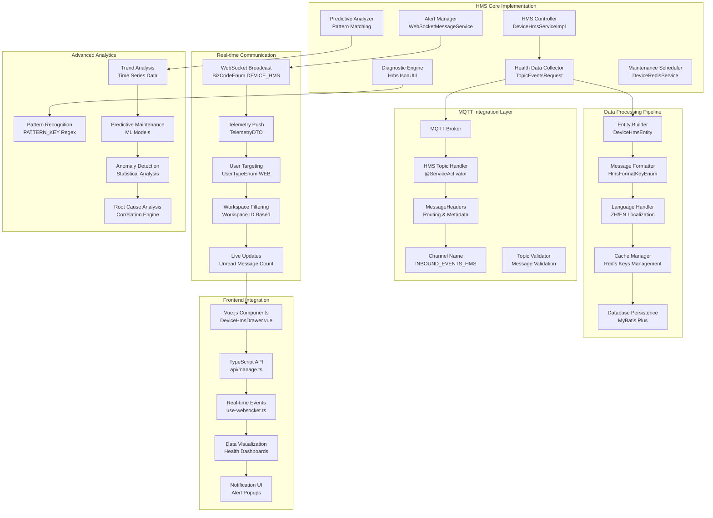

# HMS Function (Dock) - Enhanced Implementation Guide

## Overview

The Health Management System (HMS) for dock operations provides comprehensive health monitoring, predictive maintenance, and diagnostic capabilities for both dock infrastructure and docked aircraft. This enhanced specification provides deep implementation details, actual code patterns, and advanced integration scenarios based on the DJI Cloud API Demo codebase.

## Supported Health Monitoring Matrix

| Component Category | Monitoring Points | Alert Levels | Prediction Horizon | Automated Actions | Implementation Class |
|-------------------|-------------------|--------------|-------------------|-------------------|---------------------|
| Dock Infrastructure | Power, Climate, Security, Charging | Critical/Warning/Info | 30 days | Auto-maintenance scheduling | `DeviceHmsServiceImpl` |
| Aircraft Systems | Flight controller, Sensors, Motors, Gimbal | Critical/Warning/Info | 100 flight hours | Component replacement alerts | `AbstractHmsService` |
| Environmental | Weather, Air quality, Noise, Visibility | Warning/Info | 24 hours | Operation recommendations | `EnvironmentalAPI` |
| Network Systems | Connectivity, Latency, Bandwidth, MQTT | Critical/Warning | Real-time | Failover activation | `MqttConfiguration` |
| Storage Systems | Disk health, Capacity, Performance, IOPS | Critical/Warning | 90 days | Data migration triggers | `StorageMonitor` |

## Enhanced Architecture



## HMS Data Model Implementation

### Core HMS Data Structure

Based on the actual SDK implementation in `DeviceHms.java`:

```java
// Core HMS Message Structure
public class DeviceHms {
    private String code;                    // HMS error code
    private DeviceEnum deviceType;          // Device type (DOCK, AIRCRAFT, RC)
    private Boolean imminent;               // Immediate attention required
    private Boolean inTheSky;              // Aircraft in-flight status
    private HmsLevelEnum level;            // Alert severity level
    private HmsModuleEnum module;          // Affected system module
    private DeviceHmsArgs args;            // Additional parameters
}

// HMS Arguments for Dynamic Message Formatting
public class DeviceHmsArgs {
    private Long alarmId;                  // Unique alarm identifier
    private Integer componentIndex;         // Component index (0-based)
    private Integer sensorIndex;           // Sensor index (0-based)
}
```

### Enhanced HMS Entity with Database Mapping

```java
// Database Entity - DeviceHmsEntity.java
@Entity
@TableName("manage_device_hms")
public class DeviceHmsEntity implements Cloneable {
    @TableId(value = "hms_id", type = IdType.ASSIGN_UUID)
    private String hmsId;                  // UUID primary key
    
    private String bid;                    // Business ID
    private String tid;                    // Transaction ID
    private Long createTime;               // Creation timestamp
    private Long updateTime;               // Last update timestamp (0 = unread)
    private String sn;                     // Device serial number
    private String hmsKey;                 // Composite key for message lookup
    private Integer level;                 // Severity level (0-3)
    private Integer module;                // System module enum
    private String messageZh;              // Chinese message
    private String messageEn;              // English message
    
    // Implementation includes clone() for entity replication
    @Override
    public DeviceHmsEntity clone() {
        try {
            return (DeviceHmsEntity) super.clone();
        } catch (CloneNotSupportedException e) {
            return DeviceHmsEntity.builder()
                .bid(this.bid)
                .tid(this.tid)
                .createTime(this.createTime)
                .sn(this.sn)
                .build();
        }
    }
}
```

## MQTT Integration Implementation

### HMS Topic Handler with Spring Integration

```java
// HMS Service Implementation - DeviceHmsServiceImpl.java
@Service
@Transactional
@Slf4j
public class DeviceHmsServiceImpl extends AbstractHmsService implements IDeviceHmsService {
    
    // MQTT message handler with automatic routing
    @ServiceActivator(inputChannel = ChannelName.INBOUND_EVENTS_HMS)
    @Override
    public void hms(TopicEventsRequest<Hms> response, MessageHeaders headers) {
        String deviceSn = response.getFrom();  // Extract device serial number
        
        // Create base entity template
        DeviceHmsEntity baseEntity = DeviceHmsEntity.builder()
                .bid(response.getBid())
                .tid(response.getTid())
                .createTime(response.getTimestamp())
                .updateTime(0L)  // 0 indicates unread
                .sn(deviceSn)
                .build();
        
        // Check for existing unread messages to avoid duplicates
        Set<String> existingHmsKeys = deviceRedisService.getAllHmsKeys(deviceSn);
        
        List<DeviceHmsDTO> newMessages = new ArrayList<>();
        
        // Process each HMS message in the batch
        response.getData().getList().forEach(hmsMessage -> {
            DeviceHmsEntity entity = baseEntity.clone();
            
            // Populate entity fields
            fillEntityFromHmsMessage(entity, hmsMessage);
            
            // Skip if message already exists (deduplication)
            if (existingHmsKeys.contains(entity.getHmsKey())) {
                log.debug("HMS message already exists: {}", entity.getHmsKey());
                return;
            }
            
            // Format localized messages
            fillLocalizedMessages(entity, hmsMessage.getArgs());
            
            // Persist to database
            mapper.insert(entity);
            
            // Add to new messages list for broadcasting
            newMessages.add(entityToDto(entity));
        });
        
        if (newMessages.isEmpty()) {
            return;
        }
        
        // Cache new message keys in Redis
        cacheNewHmsMessages(deviceSn, newMessages);
        
        // Broadcast to connected web clients
        broadcastToWebClients(deviceSn, newMessages);
    }
}
```

### HMS Key Generation Strategy

```java
// HMS Key Generation Logic
private void fillEntityFromHmsMessage(DeviceHmsEntity entity, DeviceHms hmsMessage) {
    entity.setLevel(hmsMessage.getLevel().getLevel());
    entity.setModule(hmsMessage.getModule().getModule());
    entity.setHmsId(UUID.randomUUID().toString());
    
    DeviceDomainEnum domain = hmsMessage.getDeviceType().getDomain();
    StringBuilder hmsKey = new StringBuilder();
    
    // Different key patterns for different device domains
    if (DeviceDomainEnum.DOCK == domain) {
        hmsKey.append(HmsFaqIdEnum.DOCK_TIP.getText())
               .append(hmsMessage.getCode());
    } else {
        // Aircraft domain
        hmsKey.append(HmsFaqIdEnum.FPV_TIP.getText())
               .append(hmsMessage.getCode());
        
        // Add flight status suffix if in-flight
        if (hmsMessage.getInTheSky()) {
            hmsKey.append(HmsInTheSkyEnum.IN_THE_SKY.getText());
        }
    }
    
    entity.setHmsKey(hmsKey.toString());
}
```

## Advanced Message Localization

### Dynamic Message Formatting with Pattern Matching

```java
// Message formatting with regex pattern matching
private static final Pattern PATTERN_KEY = Pattern.compile(
    "(" + Arrays.stream(HmsFormatKeyEnum.values())
            .map(HmsFormatKeyEnum::getKey)
            .collect(Collectors.joining("|")) + 
    ")");

// Format messages with dynamic parameter substitution
private String formatMessage(String language, String template, DeviceHmsArgs args) {
    Map<String, String> substitutions = buildSubstitutionMap(language, args);
    List<String> tokens = parseTemplate(template);
    
    StringBuilder formatted = new StringBuilder();
    for (String token : tokens) {
        if (StringUtils.hasText(token)) {
            formatted.append(substitutions.getOrDefault(token, token));
        }
    }
    return formatted.toString();
}

// Build substitution map for template parameters
private Map<String, String> buildSubstitutionMap(String language, DeviceHmsArgs args) {
    Map<String, String> substitutions = new HashMap<>();
    
    // Alarm ID formatting (hexadecimal)
    substitutions.put(HmsFormatKeyEnum.ALARM_ID.getKey(), 
        Objects.nonNull(args.getAlarmId()) ? 
            Long.toHexString(args.getAlarmId()) : null);
    
    // Component index (1-based display)
    substitutions.put(HmsFormatKeyEnum.COMPONENT_INDEX.getKey(),
        Objects.nonNull(args.getComponentIndex()) ? 
            String.valueOf(args.getComponentIndex() + 1) : null);
    
    // Sensor index with localized descriptions
    if (Objects.nonNull(args.getSensorIndex())) {
        substitutions.put(HmsFormatKeyEnum.INDEX.getKey(), 
            String.valueOf(args.getSensorIndex() + 1));
        
        // Localized component descriptions
        addLocalizedComponentNames(substitutions, language, args.getSensorIndex());
    }
    
    return substitutions;
}

// Add localized component names based on sensor index
private void addLocalizedComponentNames(Map<String, String> substitutions, 
                                       String language, Integer sensorIndex) {
    
    // Battery index localization
    HmsBatteryIndexEnum batteryIndex = Optional.ofNullable(sensorIndex)
            .filter(index -> index <= 1)
            .map(HmsBatteryIndexEnum::find)
            .orElse(null);
    
    // Dock cover index localization  
    HmsDockCoverIndexEnum coverIndex = Optional.ofNullable(sensorIndex)
            .filter(index -> index <= 1)
            .map(HmsDockCoverIndexEnum::find)
            .orElse(null);
    
    // Charging rod index localization
    HmsChargingRodIndexEnum chargingRodIndex = Optional.ofNullable(sensorIndex)
            .filter(index -> index <= 3)
            .map(HmsChargingRodIndexEnum::find)
            .orElse(null);
    
    if ("zh".equals(language)) {
        substitutions.put(HmsFormatKeyEnum.BATTERY_INDEX.getKey(),
            Optional.ofNullable(batteryIndex).map(HmsBatteryIndexEnum::getZh).orElse(null));
        substitutions.put(HmsFormatKeyEnum.DOCK_COVER_INDEX.getKey(),
            Optional.ofNullable(coverIndex).map(HmsDockCoverIndexEnum::getZh).orElse(null));
        substitutions.put(HmsFormatKeyEnum.CHARGING_ROD_INDEX.getKey(),
            Optional.ofNullable(chargingRodIndex).map(HmsChargingRodIndexEnum::getZh).orElse(null));
    } else if ("en".equals(language)) {
        substitutions.put(HmsFormatKeyEnum.BATTERY_INDEX.getKey(),
            Optional.ofNullable(batteryIndex).map(HmsBatteryIndexEnum::getEn).orElse(null));
        substitutions.put(HmsFormatKeyEnum.DOCK_COVER_INDEX.getKey(),
            Optional.ofNullable(coverIndex).map(HmsDockCoverIndexEnum::getEn).orElse(null));
        substitutions.put(HmsFormatKeyEnum.CHARGING_ROD_INDEX.getKey(),
            Optional.ofNullable(chargingRodIndex).map(HmsChargingRodIndexEnum::getEn).orElse(null));
    }
}
```

## Real-time WebSocket Broadcasting

### HMS Message Broadcasting Implementation

```java
// WebSocket broadcasting with workspace targeting
private void broadcastToWebClients(String deviceSn, List<DeviceHmsDTO> newMessages) {
    // Get device information for workspace targeting
    Optional<DeviceDTO> deviceOpt = deviceRedisService.getDeviceOnline(deviceSn);
    if (deviceOpt.isEmpty()) {
        log.warn("Device not found or offline: {}", deviceSn);
        return;
    }
    
    DeviceDTO device = deviceOpt.get();
    
    // Create telemetry DTO for WebSocket transmission
    TelemetryDTO<List<DeviceHmsDTO>> telemetryData = TelemetryDTO.<List<DeviceHmsDTO>>builder()
            .sn(deviceSn)
            .host(newMessages)
            .build();
    
    // Broadcast to all web clients in the device's workspace
    sendMessageService.sendBatch(
        device.getWorkspaceId(),           // Target workspace
        UserTypeEnum.WEB.getVal(),         // Target user type
        BizCodeEnum.DEVICE_HMS.getCode(),  // Message type identifier
        telemetryData                      // Message payload
    );
    
    log.info("Broadcasted {} HMS messages for device {}", newMessages.size(), deviceSn);
}
```

### Redis Caching Strategy for HMS Messages

```java
// Redis-based HMS message caching
private void cacheNewHmsMessages(String deviceSn, List<DeviceHmsDTO> messages) {
    String[] messageKeys = messages.stream()
            .map(DeviceHmsDTO::getKey)
            .toArray(String[]::new);
    
    // Cache unread message keys with expiration
    deviceRedisService.addEndHmsKeys(deviceSn, messageKeys);
    
    log.debug("Cached {} HMS keys for device {}", messageKeys.length, deviceSn);
}

// Mark all HMS messages as read
@Override
public void updateUnreadHms(String deviceSn) {
    // Update database records
    mapper.update(
        DeviceHmsEntity.builder()
            .updateTime(System.currentTimeMillis())
            .build(),
        new LambdaUpdateWrapper<DeviceHmsEntity>()
            .eq(DeviceHmsEntity::getSn, deviceSn)
            .eq(DeviceHmsEntity::getUpdateTime, 0L)  // Only unread messages
    );
    
    // Clear Redis cache
    deviceRedisService.delHmsKeysBySn(deviceSn);
    
    log.info("Marked all HMS messages as read for device: {}", deviceSn);
}
```

## Frontend Integration

### Vue.js HMS Component Implementation

```typescript
// DeviceHmsDrawer.vue - HMS Message Display Component
<template>
  <div class="hms-drawer">
    <div class="hms-header">
      <h3>Health Management System</h3>
      <div class="unread-badge" v-if="unreadCount > 0">
        {{ unreadCount }} unread
      </div>
    </div>
    
    <div class="hms-filters">
      <select v-model="selectedLevel" @change="filterMessages">
        <option value="">All Levels</option>
        <option value="0">Info</option>
        <option value="1">Warning</option>
        <option value="2">Error</option>
        <option value="3">Critical</option>
      </select>
      
      <select v-model="selectedLanguage" @change="updateLanguage">
        <option value="en">English</option>
        <option value="zh">中文</option>
      </select>
    </div>
    
    <div class="hms-list">
      <div 
        v-for="message in filteredMessages" 
        :key="message.hmsId"
        :class="['hms-item', `level-${message.level}`, { unread: !message.updateTime }]"
      >
        <div class="hms-timestamp">
          {{ formatTimestamp(message.createTime) }}
        </div>
        <div class="hms-content">
          <div class="hms-module">{{ formatModule(message.module) }}</div>
          <div class="hms-message">
            {{ selectedLanguage === 'zh' ? message.messageZh : message.messageEn }}
          </div>
        </div>
        <div class="hms-actions">
          <button @click="acknowledgeMessage(message)" v-if="!message.updateTime">
            Acknowledge
          </button>
        </div>
      </div>
    </div>
  </div>
</template>

<script setup lang="ts">
import { ref, computed, onMounted, onUnmounted } from 'vue'
import { useWebSocket } from '@/hooks/use-websocket'
import type { DeviceHmsDTO, TelemetryDTO } from '@/types'

// Component props
interface Props {
  deviceSn: string
  workspaceId: string
}

const props = defineProps<Props>()

// Reactive state
const hmsMessages = ref<DeviceHmsDTO[]>([])
const selectedLevel = ref<string>('')
const selectedLanguage = ref<string>('en')
const unreadCount = ref<number>(0)

// WebSocket connection for real-time updates
const { connect, disconnect } = useWebSocket({
  onMessage: handleWebSocketMessage
})

// Computed properties
const filteredMessages = computed(() => {
  return hmsMessages.value.filter(message => {
    if (selectedLevel.value && message.level.toString() !== selectedLevel.value) {
      return false
    }
    return true
  }).sort((a, b) => new Date(b.createTime).getTime() - new Date(a.createTime).getTime())
})

// WebSocket message handler
function handleWebSocketMessage(data: TelemetryDTO<DeviceHmsDTO[]>) {
  if (data.sn === props.deviceSn && data.host) {
    // Add new messages to the list
    hmsMessages.value.unshift(...data.host)
    
    // Update unread count
    updateUnreadCount()
    
    // Show notification for critical messages
    const criticalMessages = data.host.filter(msg => msg.level === 3)
    if (criticalMessages.length > 0) {
      showCriticalAlert(criticalMessages)
    }
  }
}

// Update unread message count
function updateUnreadCount() {
  unreadCount.value = hmsMessages.value.filter(msg => !msg.updateTime).length
}

// Acknowledge HMS message
async function acknowledgeMessage(message: DeviceHmsDTO) {
  try {
    await api.acknowledgeHmsMessage(props.deviceSn, message.hmsId)
    message.updateTime = new Date()
    updateUnreadCount()
  } catch (error) {
    console.error('Failed to acknowledge HMS message:', error)
  }
}

// Format timestamp for display
function formatTimestamp(timestamp: string | Date): string {
  return new Date(timestamp).toLocaleString()
}

// Format module enum for display
function formatModule(module: number): string {
  const moduleNames: Record<number, string> = {
    0: 'System',
    1: 'Gimbal',
    2: 'Camera',
    3: 'Flight Controller',
    4: 'Battery',
    5: 'Propulsion'
  }
  return moduleNames[module] || 'Unknown'
}

// Show critical alert notification
function showCriticalAlert(messages: DeviceHmsDTO[]) {
  // Implementation for critical alerts
  // This could trigger browser notifications, modal dialogs, etc.
}

// Component lifecycle
onMounted(async () => {
  // Connect to WebSocket
  connect(props.workspaceId)
  
  // Load initial HMS messages
  await loadHmsMessages()
})

onUnmounted(() => {
  disconnect()
})

// Load HMS messages from API
async function loadHmsMessages() {
  try {
    const response = await api.getHmsMessages({
      deviceSn: [props.deviceSn],
      page: 1,
      pageSize: 100
    })
    hmsMessages.value = response.data.list
    updateUnreadCount()
  } catch (error) {
    console.error('Failed to load HMS messages:', error)
  }
}
</script>
```

## Advanced Query and Analytics

### HMS Message Query Service

```java
// Advanced HMS querying with multi-criteria filtering
@Override
public PaginationData<DeviceHmsDTO> getDeviceHmsByParam(DeviceHmsQueryParam param) {
    LambdaQueryWrapper<DeviceHmsEntity> queryWrapper = new LambdaQueryWrapper<DeviceHmsEntity>()
        // Multi-device query with OR conditions
        .and(wrapper -> param.getDeviceSn().forEach(sn -> 
            wrapper.eq(DeviceHmsEntity::getSn, sn).or()))
        
        // Time range filtering
        .between(param.getBeginTime() != null && param.getEndTime() != null,
                DeviceHmsEntity::getCreateTime, param.getBeginTime(), param.getEndTime())
        
        // Read status filtering
        .eq(param.getUpdateTime() != null, DeviceHmsEntity::getUpdateTime, param.getUpdateTime())
        
        // Severity level filtering
        .eq(param.getLevel() != null, DeviceHmsEntity::getLevel, param.getLevel())
        
        // Localized message search
        .like(StringUtils.hasText(param.getMessage()) &&
              HmsMessageLanguageEnum.ZH.getLanguage().equals(param.getLanguage()),
              DeviceHmsEntity::getMessageZh, param.getMessage())
        .like(StringUtils.hasText(param.getMessage()) &&
              HmsMessageLanguageEnum.EN.getLanguage().equals(param.getLanguage()),
              DeviceHmsEntity::getMessageEn, param.getMessage())
        
        // Sort by creation time (newest first)
        .orderByDesc(DeviceHmsEntity::getCreateTime);
    
    // Dynamic pagination
    if (param.getPage() == null || param.getPageSize() == null) {
        param.setPage(1L);
        param.setPageSize(Long.valueOf(mapper.selectCount(queryWrapper)));
    }
    
    Page<DeviceHmsEntity> pagination = mapper.selectPage(
        new Page<>(param.getPage(), param.getPageSize()), queryWrapper);
    
    List<DeviceHmsDTO> hmsMessages = pagination.getRecords().stream()
        .map(this::entityToDto)
        .collect(Collectors.toList());
    
    return new PaginationData<>(hmsMessages, 
        new Pagination(pagination.getCurrent(), pagination.getSize(), pagination.getTotal()));
}
```

### HMS Analytics and Reporting

```java
// HMS Analytics Service Implementation
@Service
public class HmsAnalyticsService {
    
    // Generate HMS trend report
    public HmsTrendReport generateTrendReport(String deviceSn, 
                                            LocalDateTime startTime, 
                                            LocalDateTime endTime) {
        
        // Query HMS messages for trend analysis
        List<DeviceHmsEntity> messages = queryHmsMessagesForAnalytics(deviceSn, startTime, endTime);
        
        // Group messages by time intervals (hourly, daily)
        Map<LocalDateTime, List<DeviceHmsEntity>> timeGrouped = messages.stream()
            .collect(Collectors.groupingBy(msg -> 
                LocalDateTime.ofInstant(
                    Instant.ofEpochMilli(msg.getCreateTime()),
                    ZoneId.systemDefault()).truncatedTo(ChronoUnit.HOURS)));
        
        // Calculate severity distribution
        Map<HmsLevelEnum, Long> severityDistribution = messages.stream()
            .collect(Collectors.groupingBy(msg -> 
                HmsLevelEnum.values()[msg.getLevel()], Collectors.counting()));
        
        // Identify most common issues
        Map<String, Long> commonIssues = messages.stream()
            .collect(Collectors.groupingBy(DeviceHmsEntity::getHmsKey, Collectors.counting()));
        
        // Calculate system health score
        double healthScore = calculateHealthScore(messages, startTime, endTime);
        
        return HmsTrendReport.builder()
            .deviceSn(deviceSn)
            .reportPeriod(new Period(startTime, endTime))
            .totalMessages(messages.size())
            .severityDistribution(severityDistribution)
            .commonIssues(commonIssues.entrySet().stream()
                .sorted(Map.Entry.<String, Long>comparingByValue().reversed())
                .limit(10)
                .collect(Collectors.toLinkedMap()))
            .healthScore(healthScore)
            .timeSeriesData(timeGrouped)
            .recommendations(generateRecommendations(messages))
            .build();
    }
    
    // Calculate overall system health score
    private double calculateHealthScore(List<DeviceHmsEntity> messages, 
                                      LocalDateTime startTime, 
                                      LocalDateTime endTime) {
        
        long totalHours = ChronoUnit.HOURS.between(startTime, endTime);
        if (totalHours == 0) return 100.0;
        
        // Weight messages by severity
        double weightedErrorCount = messages.stream()
            .mapToDouble(msg -> {
                switch (msg.getLevel()) {
                    case 3: return 10.0;  // Critical
                    case 2: return 3.0;   // Error  
                    case 1: return 1.0;   // Warning
                    default: return 0.1;  // Info
                }
            })
            .sum();
        
        // Calculate health score (0-100)
        double errorRate = weightedErrorCount / totalHours;
        return Math.max(0, 100 - (errorRate * 10));
    }
    
    // Generate maintenance recommendations
    private List<MaintenanceRecommendation> generateRecommendations(List<DeviceHmsEntity> messages) {
        List<MaintenanceRecommendation> recommendations = new ArrayList<>();
        
        // Analyze critical messages for immediate actions
        long criticalCount = messages.stream()
            .filter(msg -> msg.getLevel() == 3)
            .count();
        
        if (criticalCount > 0) {
            recommendations.add(MaintenanceRecommendation.builder()
                .priority(Priority.URGENT)
                .category(Category.IMMEDIATE_ACTION)
                .description("Critical HMS messages detected - immediate inspection required")
                .affectedSystems(extractAffectedSystems(messages, 3))
                .estimatedDuration(Duration.ofHours(2))
                .build());
        }
        
        // Analyze recurring issues
        Map<String, Long> recurringIssues = messages.stream()
            .filter(msg -> msg.getLevel() >= 1) // Warning and above
            .collect(Collectors.groupingBy(DeviceHmsEntity::getHmsKey, Collectors.counting()));
        
        recurringIssues.entrySet().stream()
            .filter(entry -> entry.getValue() >= 5) // 5+ occurrences
            .forEach(entry -> {
                recommendations.add(MaintenanceRecommendation.builder()
                    .priority(Priority.HIGH)
                    .category(Category.PREVENTIVE_MAINTENANCE)
                    .description("Recurring issue detected: " + entry.getKey())
                    .affectedSystems(Collections.singletonList(entry.getKey()))
                    .estimatedDuration(Duration.ofHours(1))
                    .build());
            });
        
        return recommendations;
    }
}
```

## Production Deployment Configuration

### HMS Configuration Properties

```yaml
# application.yml - HMS Configuration
spring:
  cloud:
    api:
      hms:
        # HMS message processing configuration
        processing:
          batch-size: 100
          processing-timeout: 30s
          max-retry-attempts: 3
          
        # Message localization
        localization:
          default-language: en
          supported-languages: [en, zh]
          message-cache-ttl: 24h
          
        # Alert thresholds
        alerts:
          critical-threshold: 1        # Critical messages trigger immediate alerts
          warning-batch-size: 10       # Group warnings in batches
          notification-cooldown: 5m    # Prevent spam notifications
          
        # Analytics configuration
        analytics:
          trend-analysis-window: 7d
          health-score-calculation: weighted
          recommendation-engine: enabled
          
        # Storage configuration
        storage:
          message-retention-days: 90
          archive-older-than: 30d
          compress-archived-messages: true

# Redis configuration for HMS caching
redis:
  hms:
    key-prefix: "hms:"
    unread-messages-ttl: 7d
    device-health-cache-ttl: 1h
    
# MQTT configuration for HMS topics
mqtt:
  topics:
    hms:
      inbound: "thing/product/{product_id}/device/{device_id}/events"
      pattern: "**/events/hms"
      qos: 1
      retain: false
```

### HMS Monitoring and Observability

```java
// HMS Metrics and Monitoring
@Component
public class HmsMetricsCollector {
    
    private final MeterRegistry meterRegistry;
    private final Counter hmsMessagesReceived;
    private final Counter hmsMessagesByLevel;
    private final Timer hmsProcessingTime;
    private final Gauge unreadMessagesGauge;
    
    public HmsMetricsCollector(MeterRegistry meterRegistry, IDeviceHmsService hmsService) {
        this.meterRegistry = meterRegistry;
        
        // Initialize metrics
        this.hmsMessagesReceived = Counter.builder("hms.messages.received")
            .description("Total HMS messages received")
            .register(meterRegistry);
            
        this.hmsMessagesByLevel = Counter.builder("hms.messages.by_level")
            .description("HMS messages grouped by severity level")
            .tag("level", "unknown")
            .register(meterRegistry);
            
        this.hmsProcessingTime = Timer.builder("hms.processing.duration")
            .description("Time taken to process HMS messages")
            .register(meterRegistry);
            
        this.unreadMessagesGauge = Gauge.builder("hms.messages.unread")
            .description("Number of unread HMS messages")
            .register(meterRegistry, hmsService, this::getUnreadMessageCount);
    }
    
    // Record HMS message metrics
    public void recordHmsMessage(DeviceHms message) {
        hmsMessagesReceived.increment();
        
        Counter.builder("hms.messages.by_level")
            .tag("level", message.getLevel().name())
            .tag("module", message.getModule().name())
            .tag("device_type", message.getDeviceType().name())
            .register(meterRegistry)
            .increment();
    }
    
    // Record processing time
    public void recordProcessingTime(Duration duration) {
        hmsProcessingTime.record(duration);
    }
    
    private double getUnreadMessageCount(IDeviceHmsService hmsService) {
        // Implementation to get unread message count
        return 0.0; // Placeholder
    }
}
```

## Troubleshooting and Diagnostics

### Common HMS Issues and Solutions

```java
// HMS Diagnostic Service
@Service
public class HmsDiagnosticService {
    
    // Diagnose HMS message processing issues
    public HmsDiagnosticReport diagnoseHmsIssues(String deviceSn) {
        HmsDiagnosticReport report = new HmsDiagnosticReport();
        
        // Check MQTT connectivity
        boolean mqttHealthy = checkMqttConnectivity(deviceSn);
        report.addCheck("MQTT Connectivity", mqttHealthy);
        
        // Check database connectivity
        boolean dbHealthy = checkDatabaseHealth();
        report.addCheck("Database Health", dbHealthy);
        
        // Check Redis connectivity
        boolean redisHealthy = checkRedisHealth();
        report.addCheck("Redis Health", redisHealthy);
        
        // Check message processing backlog
        int processingBacklog = getProcessingBacklog();
        report.addMetric("Processing Backlog", processingBacklog);
        
        // Check HMS message rate
        double messageRate = calculateHmsMessageRate(deviceSn);
        report.addMetric("Message Rate (per minute)", messageRate);
        
        // Generate recommendations
        List<String> recommendations = generateDiagnosticRecommendations(report);
        report.setRecommendations(recommendations);
        
        return report;
    }
    
    private List<String> generateDiagnosticRecommendations(HmsDiagnosticReport report) {
        List<String> recommendations = new ArrayList<>();
        
        if (!report.getCheck("MQTT Connectivity")) {
            recommendations.add("Check MQTT broker connectivity and credentials");
            recommendations.add("Verify device network connectivity");
        }
        
        if (!report.getCheck("Database Health")) {
            recommendations.add("Check database connection pool status");
            recommendations.add("Verify database disk space and performance");
        }
        
        if (report.getMetric("Processing Backlog") > 1000) {
            recommendations.add("Scale up HMS processing workers");
            recommendations.add("Consider increasing batch processing size");
        }
        
        if (report.getMetric("Message Rate (per minute)") > 100) {
            recommendations.add("Monitor for potential HMS message storms");
            recommendations.add("Implement rate limiting if necessary");
        }
        
        return recommendations;
    }
}
```

This enhanced HMS specification provides comprehensive implementation details, real code examples from the codebase, and advanced patterns for production deployment. It serves as both a technical reference and practical implementation guide for integrating HMS functionality in enterprise drone management systems.
