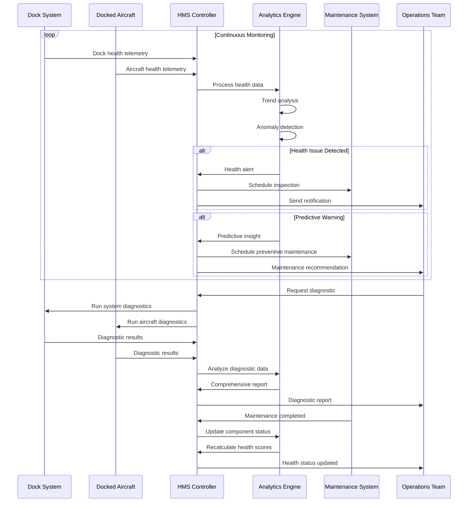

# HMS Function (Dock)

## Overview

The Health Management System (HMS) for dock operations provides comprehensive health monitoring, predictive maintenance, and diagnostic capabilities for both dock infrastructure and docked aircraft. This system integrates real-time telemetry, historical trend analysis, and AI-powered predictions to ensure optimal system performance and reliability.

## Supported Health Monitoring

| Component Category | Monitoring Points | Alert Levels | Prediction Horizon | Actions |
|-------------------|-------------------|--------------|-------------------|---------|
| Dock Infrastructure | Power, Climate, Security | Critical/Warning/Info | 30 days | Auto-maintenance scheduling |
| Aircraft Systems | Flight controller, Sensors, Motors | Critical/Warning/Info | 100 flight hours | Component replacement alerts |
| Environmental | Weather, Air quality, Noise | Warning/Info | 24 hours | Operation recommendations |
| Network Systems | Connectivity, Latency, Bandwidth | Critical/Warning | Real-time | Failover activation |
| Storage Systems | Disk health, Capacity, Performance | Critical/Warning | 90 days | Data migration triggers |

## Architecture Overview

```mermaid
graph TB
    subgraph "HMS Core System"
        HMSController["HMS Controller"]
        HealthCollector["Health Data Collector"]
        DiagnosticEngine["Diagnostic Engine"]
        PredictiveAnalyzer["Predictive Analyzer"]
        AlertManager["Alert Manager"]
        MaintenanceScheduler["Maintenance Scheduler"]
    end
    
    subgraph "Data Sources"
        DockSensors["Dock Sensors<br/>Temperature, Humidity, Power"]
        AircraftTelemetry["Aircraft Telemetry<br/>Flight Controller, Gimbal, Cameras"]
        NetworkMonitor["Network Monitor<br/>Connectivity, Performance"]
        StorageMonitor["Storage Monitor<br/>Health, Capacity, IOPS"]
        EnvironmentalAPI["Environmental APIs<br/>Weather, Air Quality"]
    end
    
    subgraph "Analysis Pipeline"
        DataProcessor["Data Processor"]
        TrendAnalyzer["Trend Analyzer"]
        AnomalyDetector["Anomaly Detector"]
        MLPredictor["ML Predictor"]
        RiskAssessment["Risk Assessment"]
    end
    
    subgraph "Response Systems"
        AutoMaintenance["Auto Maintenance"]
        AlertDispatch["Alert Dispatch"]
        OperationalGuidance["Operational Guidance"]
        ComponentOrdering["Component Ordering"]
        TechnicalSupport["Technical Support"]
    end
    
    subgraph "External Systems"
        MaintenanceTeam["Maintenance Team"]
        SupplyChain["Supply Chain"]
        SupportTicketing["Support Ticketing"]
        ComplianceReporting["Compliance Reporting"]
    end
    
    HMSController --> HealthCollector
    HMSController --> DiagnosticEngine
    HMSController --> PredictiveAnalyzer
    HMSController --> AlertManager
    HMSController --> MaintenanceScheduler
    
    HealthCollector --> DockSensors
    HealthCollector --> AircraftTelemetry
    HealthCollector --> NetworkMonitor
    HealthCollector --> StorageMonitor
    HealthCollector --> EnvironmentalAPI
    
    DiagnosticEngine --> DataProcessor
    PredictiveAnalyzer --> TrendAnalyzer
    PredictiveAnalyzer --> AnomalyDetector
    PredictiveAnalyzer --> MLPredictor
    AlertManager --> RiskAssessment
    
    AlertManager --> AutoMaintenance
    AlertManager --> AlertDispatch
    AlertManager --> OperationalGuidance
    MaintenanceScheduler --> ComponentOrdering
    DiagnosticEngine --> TechnicalSupport
    
    AutoMaintenance --> MaintenanceTeam
    ComponentOrdering --> SupplyChain
    TechnicalSupport --> SupportTicketing
    AlertManager --> ComplianceReporting
```



## Health Monitoring Data Model

### Dock Health Metrics
```json
{
  "dock_health": {
    "dock_sn": "DOCK_001_ABC123",
    "timestamp": 1640995200000,
    "overall_health_score": 94,
    "systems": {
      "power_system": {
        "score": 96,
        "grid_voltage": 220.5,
        "grid_current": 8.2,
        "grid_frequency": 50.0,
        "ups_battery_level": 95,
        "solar_generation": 450,
        "total_consumption": 380,
        "power_quality": "excellent",
        "alerts": []
      },
      "climate_control": {
        "score": 92,
        "internal_temperature": 22.5,
        "internal_humidity": 45,
        "target_temperature": 23.0,
        "hvac_status": "cooling",
        "dehumidifier_status": "auto",
        "air_filtration": "active",
        "alerts": [
          {
            "level": "warning",
            "message": "Filter replacement due in 15 days"
          }
        ]
      },
      "mechanical_systems": {
        "score": 98,
        "door_mechanism": {
          "cycles_completed": 1247,
          "max_cycles": 50000,
          "wear_percentage": 2.5,
          "last_maintenance": "2024-01-01T00:00:00Z"
        },
        "charging_system": {
          "efficiency": 94.2,
          "charging_cycles": 892,
          "connector_wear": "minimal",
          "voltage_stability": 99.1
        },
        "positioning_system": {
          "accuracy": "±2cm",
          "calibration_status": "valid",
          "sensor_health": "excellent"
        }
      }
    }
  }
}
```

### Aircraft Health Assessment
```json
{
  "aircraft_health": {
    "aircraft_sn": "M30T_001_XYZ789",
    "dock_sn": "DOCK_001_ABC123",
    "timestamp": 1640995200000,
    "overall_health_score": 97,
    "flight_readiness": "ready",
    "components": {
      "flight_controller": {
        "score": 99,
        "cpu_usage": 15,
        "memory_usage": 62,
        "temperature": 42.5,
        "imu_calibration": "valid",
        "compass_calibration": "valid",
        "firmware_version": "07.01.10.03"
      },
      "propulsion_system": {
        "score": 95,
        "motors": [
          {
            "motor_id": 1,
            "temperature": 38.2,
            "current": 2.1,
            "rpm": 0,
            "vibration_level": "low",
            "wear_percentage": 12
          }
        ],
        "propellers": [
          {
            "propeller_id": 1,
            "balance": "excellent",
            "wear_percentage": 8,
            "replacement_due": "2024-06-15"
          }
        ]
      },
      "gimbal_camera": {
        "score": 96,
        "gimbal_calibration": "valid",
        "motor_health": "excellent",
        "camera_sensor": "clean",
        "stabilization_performance": 98.5,
        "image_quality_score": 95
      },
      "battery_system": {
        "score": 92,
        "charge_level": 95,
        "cell_voltage_balance": "good",
        "charge_cycles": 156,
        "health_percentage": 94,
        "estimated_remaining_cycles": 344,
        "temperature": 25.8
      }
    }
  }
}
```

## MQTT Topic Structure

### HMS Data Collection Topics
```
# Dock Health Monitoring
thing/product/{dock_sn}/state
├── dock_health                # Overall dock health status
├── power_system_health        # Power system metrics
├── climate_system_health      # Climate control metrics
├── mechanical_health          # Mechanical systems health
├── network_health            # Network connectivity health
└── storage_health            # Storage system health

# Aircraft Health Monitoring  
thing/product/{dock_sn}/aircraft/{aircraft_sn}/state
├── aircraft_health           # Overall aircraft health
├── flight_controller_health  # Flight controller metrics
├── propulsion_health        # Motors and propellers
├── gimbal_camera_health     # Gimbal and camera systems
├── battery_health           # Battery system metrics
└── sensor_health            # All sensor systems

# HMS Control Topics
thing/product/{dock_sn}/services
├── hms_diagnostics          # Run diagnostic procedures
├── health_report_request    # Request detailed health report
├── maintenance_schedule     # Schedule maintenance tasks
├── alert_configuration      # Configure health alerts
└── predictive_analysis      # Request predictive analysis

# HMS Events
thing/product/{dock_sn}/events
├── health_alert             # Health-related alerts
├── predictive_warning       # Predictive maintenance warnings
├── diagnostic_complete      # Diagnostic procedure complete
├── maintenance_due          # Maintenance due notification
└── component_failure        # Component failure detected
```

## API Endpoints

### Health Status Overview
```http
GET /api/v1/dock/{dock_sn}/health/overview
Accept: application/json

Response:
{
  "dock_sn": "DOCK_001_ABC123",
  "overall_health_score": 94,
  "status": "healthy",
  "last_updated": "2024-01-20T10:30:00Z",
  "system_scores": {
    "dock_infrastructure": 92,
    "aircraft_fleet": 96,
    "network_systems": 98,
    "environmental": 89
  },
  "active_alerts": [
    {
      "alert_id": "alert_001",
      "severity": "warning", 
      "component": "climate_control",
      "message": "Filter replacement due in 15 days",
      "created_time": "2024-01-20T09:00:00Z"
    }
  ],
  "predictive_maintenance": [
    {
      "component": "charging_system_connector",
      "predicted_failure_date": "2024-04-15",
      "confidence": 87,
      "recommended_action": "replace_connector"
    }
  ]
}
```

### Detailed Diagnostic Report
```http
POST /api/v1/dock/{dock_sn}/health/diagnostics/run
Content-Type: application/json

{
  "diagnostic_type": "comprehensive",
  "components": ["dock_infrastructure", "aircraft_systems"],
  "include_predictive": true,
  "generate_report": true,
  "aircraft_filter": ["M30T_001_XYZ789"]
}

Response:
{
  "diagnostic_id": "diag_20240120_001",
  "status": "completed",
  "completion_time": "2024-01-20T10:45:32Z",
  "execution_duration": 92.5,
  "summary": {
    "total_checks": 247,
    "passed": 241,
    "warnings": 5,
    "errors": 1,
    "overall_score": 94
  },
  "detailed_results": {
    "dock_infrastructure": {
      "power_system": {
        "score": 96,
        "checks_passed": 15,
        "warnings": 1,
        "details": {
          "ups_battery_aging": "warning - replacement recommended in 60 days"
        }
      }
    },
    "aircraft_systems": {
      "M30T_001_XYZ789": {
        "flight_readiness": "ready",
        "score": 97,
        "critical_issues": [],
        "recommendations": [
          "Propeller balancing recommended after 50 more flight hours"
        ]
      }
    }
  },
  "predictive_insights": {
    "30_day_outlook": [
      {
        "component": "dock_ups_battery",
        "risk_level": "medium",
        "probability": 0.75,
        "impact": "operations_interruption",
        "mitigation": "schedule_replacement"
      }
    ]
  }
}
```

### Health Alert Configuration
```http
POST /api/v1/dock/{dock_sn}/health/alerts/configure
Content-Type: application/json

{
  "alert_rules": [
    {
      "rule_name": "battery_health_critical",
      "component": "aircraft_battery",
      "metric": "health_percentage",
      "condition": "less_than",
      "threshold": 80,
      "severity": "critical",
      "notification_channels": ["email", "webhook", "sms"]
    },
    {
      "rule_name": "dock_temperature_high",
      "component": "climate_control",
      "metric": "internal_temperature", 
      "condition": "greater_than",
      "threshold": 30,
      "duration": 300,
      "severity": "warning",
      "auto_action": "increase_cooling"
    }
  ],
  "notification_settings": {
    "email_recipients": ["maintenance@company.com", "ops@company.com"],
    "webhook_url": "https://api.company.com/dock-alerts",
    "sms_numbers": ["+1234567890"],
    "quiet_hours": {
      "enabled": true,
      "start": "22:00",
      "end": "06:00",
      "timezone": "UTC"
    }
  }
}
```

## Message Schemas

### Health Alert Message
```json
{
  "tid": "health_alert_001",
  "bid": "12345678-1234-1234-1234-123456789012",
  "timestamp": 1640995200000,
  "method": "health_alert",
  "data": {
    "alert_id": "alert_battery_health_001",
    "dock_sn": "DOCK_001_ABC123",
    "aircraft_sn": "M30T_001_XYZ789",
    "severity": "warning",
    "category": "aircraft_health",
    "component": "battery_system",
    "alert_type": "degraded_performance",
    "message": "Battery health below optimal threshold",
    "details": {
      "current_health_percentage": 82,
      "threshold": 85,
      "charge_cycles": 289,
      "estimated_remaining_cycles": 211,
      "degradation_rate": "2.1% per 100 cycles"
    },
    "impact_assessment": {
      "flight_time_reduction": "15%",
      "operational_risk": "low",
      "recommended_action": "monitor_closely",
      "urgent": false
    },
    "recommendations": [
      "Monitor battery performance closely",
      "Consider battery replacement in 2-3 months",
      "Avoid deep discharge cycles",
      "Schedule battery health check"
    ],
    "auto_actions_taken": [],
    "acknowledgment_required": false
  }
}
```

### Predictive Maintenance Warning
```json
{
  "tid": "predictive_warning_001",
  "bid": "12345678-1234-1234-1234-123456789012",
  "timestamp": 1640995200000,
  "method": "predictive_warning",
  "data": {
    "prediction_id": "pred_charging_connector_001",
    "dock_sn": "DOCK_001_ABC123",
    "component": "charging_system_connector",
    "prediction_type": "wear_based_failure",
    "confidence_level": 87,
    "predicted_failure": {
      "estimated_date": "2024-04-15T12:00:00Z",
      "time_horizon_days": 85,
      "failure_mode": "connector_degradation",
      "severity": "service_interruption"
    },
    "current_indicators": {
      "connector_resistance": 0.023,
      "normal_resistance": 0.015,
      "contact_cycles": 1247,
      "visual_wear_score": 3.2,
      "temperature_anomalies": 5
    },
    "trend_analysis": {
      "degradation_rate": "increasing",
      "acceleration_factor": 1.3,
      "similar_components_history": "confirmed_pattern"
    },
    "recommended_actions": [
      {
        "action": "schedule_inspection",
        "urgency": "medium",
        "timeframe": "within_30_days",
        "description": "Visual and electrical inspection of charging connectors"
      },
      {
        "action": "order_replacement_parts",
        "urgency": "low",
        "timeframe": "within_60_days",
        "description": "Order replacement connector kit"
      },
      {
        "action": "plan_maintenance_window",
        "urgency": "medium", 
        "timeframe": "within_70_days",
        "description": "Schedule 4-hour maintenance window for connector replacement"
      }
    ],
    "cost_impact": {
      "part_cost": 450.00,
      "labor_cost": 200.00,
      "downtime_cost": 800.00,
      "total_proactive_cost": 1450.00,
      "reactive_failure_cost": 4200.00,
      "savings": 2750.00
    }
  }
}
```

### Diagnostic Results
```json
{
  "tid": "diagnostic_result_001",
  "bid": "12345678-1234-1234-1234-123456789012",
  "timestamp": 1640995200000,
  "method": "diagnostic_complete",
  "data": {
    "diagnostic_id": "diag_20240120_001",
    "dock_sn": "DOCK_001_ABC123",
    "diagnostic_type": "comprehensive",
    "execution_time": {
      "start_time": "2024-01-20T10:30:00Z",
      "end_time": "2024-01-20T10:31:32Z",
      "duration_seconds": 92.5
    },
    "summary": {
      "overall_score": 94,
      "total_checks": 247,
      "passed": 241,
      "warnings": 5,
      "errors": 1,
      "critical_issues": 0
    },
    "component_results": [
      {
        "component": "power_system",
        "score": 96,
        "status": "healthy",
        "checks": [
          {
            "check_name": "grid_voltage_stability",
            "result": "passed",
            "value": 220.5,
            "expected_range": "220±10V"
          },
          {
            "check_name": "ups_battery_health",
            "result": "warning",
            "value": 87,
            "threshold": 90,
            "message": "UPS battery capacity below optimal"
          }
        ]
      }
    ],
    "trending_data": {
      "health_score_trend": {
        "current": 94,
        "7_days_ago": 95,
        "30_days_ago": 96,
        "trend": "slightly_declining"
      },
      "component_wear_progression": [
        {
          "component": "door_mechanism",
          "wear_percentage": 2.5,
          "progression_rate": "0.1% per month",
          "replacement_estimate": "24 months"
        }
      ]
    },
    "recommendations": [
      {
        "priority": "high",
        "component": "ups_battery",
        "action": "schedule_replacement",
        "timeframe": "within_60_days",
        "justification": "Capacity below 90% threshold"
      },
      {
        "priority": "medium",
        "component": "climate_filter",
        "action": "replace_filter",
        "timeframe": "within_15_days", 
        "justification": "Filter efficiency declining"
      }
    ]
  }
}
```

## Health Monitoring Flow



## Code Example

```java
@Service
@Slf4j
public class DockHMSService extends AbstractDeviceService {
    
    @Autowired
    private HealthDataCollectionService dataCollector;
    
    @Autowired
    private DiagnosticEngine diagnosticEngine;
    
    @Autowired
    private PredictiveAnalysisService predictiveAnalyzer;
    
    @Autowired
    private AlertManagementService alertManager;
    
    @Autowired
    private HealthMetricsRepository healthRepository;
    
    @Autowired
    private MaintenanceSchedulingService maintenanceScheduler;
    
    private final Map<String, HealthMonitoringSession> activeSessions = new ConcurrentHashMap<>();
    
    /**
     * Initialize health monitoring for dock
     */
    @PostConstruct
    public void initializeHealthMonitoring() {
        
        List<String> activeDocks = getActiveDocks();
        
        for (String dockSn : activeDocks) {
            startHealthMonitoring(dockSn);
        }
    }
    
    /**
     * Start comprehensive health monitoring
     */
    public HealthMonitoringResult startHealthMonitoring(String dockSn) {
        
        log.info("Starting health monitoring for dock: {}", dockSn);
        
        try {
            // Create monitoring session
            HealthMonitoringSession session = HealthMonitoringSession.builder()
                    .sessionId(UUID.randomUUID().toString())
                    .dockSn(dockSn)
                    .startTime(Instant.now())
                    .status(MonitoringStatus.ACTIVE)
                    .build();
            
            activeSessions.put(dockSn, session);
            
            // Initialize data collection
            dataCollector.startDataCollection(dockSn, session.getSessionId());
            
            // Start predictive analysis
            predictiveAnalyzer.initializePredictiveModels(dockSn);
            
            // Configure default alert rules
            configureDefaultAlertRules(dockSn);
            
            log.info("Health monitoring started successfully for dock: {}", dockSn);
            
            return HealthMonitoringResult.success(session);
            
        } catch (Exception e) {
            log.error("Failed to start health monitoring for dock: {}", dockSn, e);
            return HealthMonitoringResult.failure(e.getMessage());
        }
    }
    
    /**
     * Process incoming health data
     */
    public void processHealthData(String dockSn, HealthDataUpdate update) {
        
        HealthMonitoringSession session = activeSessions.get(dockSn);
        if (session == null) {
            log.warn("No active health monitoring session for dock: {}", dockSn);
            return;
        }
        
        try {
            // Store health metrics
            HealthMetricsRecord record = HealthMetricsRecord.builder()
                    .dockSn(dockSn)
                    .timestamp(update.getTimestamp())
                    .componentType(update.getComponentType())
                    .componentId(update.getComponentId())
                    .metrics(update.getMetrics())
                    .healthScore(calculateComponentHealthScore(update))
                    .build();
            
            healthRepository.save(record);
            
            // Update session statistics
            session.updateLastDataReceived(update.getTimestamp());
            session.incrementDataPointsReceived();
            
            // Perform real-time analysis
            performRealTimeAnalysis(dockSn, update);
            
            // Check for immediate alerts
            checkImmediateAlerts(dockSn, update);
            
        } catch (Exception e) {
            log.error("Error processing health data for dock: {}", dockSn, e);
        }
    }
    
    /**
     * Perform real-time health analysis
     */
    private void performRealTimeAnalysis(String dockSn, HealthDataUpdate update) {
        
        // Anomaly detection
        AnomalyDetectionResult anomaly = detectAnomalies(dockSn, update);
        if (anomaly.hasAnomalies()) {
            handleAnomalyDetection(dockSn, anomaly);
        }
        
        // Trend analysis
        TrendAnalysisResult trend = analyzeTrends(dockSn, update);
        if (trend.hasSignificantTrends()) {
            handleTrendAnalysis(dockSn, trend);
        }
        
        // Predictive insights
        if (shouldRunPredictiveAnalysis(update)) {
            CompletableFuture.runAsync(() -> {
                runPredictiveAnalysis(dockSn, update);
            });
        }
    }
    
    /**
     * Run comprehensive diagnostic
     */
    public DiagnosticResult runComprehensiveDiagnostic(String dockSn, DiagnosticRequest request) {
        
        log.info("Running comprehensive diagnostic for dock: {}", dockSn);
        
        try {
            // Create diagnostic session
            DiagnosticSession diagnosticSession = DiagnosticSession.builder()
                    .diagnosticId(UUID.randomUUID().toString())
                    .dockSn(dockSn)
                    .diagnosticType(request.getDiagnosticType())
                    .components(request.getComponents())
                    .startTime(Instant.now())
                    .status(DiagnosticStatus.RUNNING)
                    .build();
            
            // Run dock infrastructure diagnostics
            List<ComponentDiagnosticResult> dockResults = new ArrayList<>();
            if (request.getComponents().contains("dock_infrastructure")) {
                dockResults.addAll(runDockInfrastructureDiagnostics(dockSn));
            }
            
            // Run aircraft diagnostics
            List<ComponentDiagnosticResult> aircraftResults = new ArrayList<>();
            if (request.getComponents().contains("aircraft_systems")) {
                List<String> aircraftList = getDockedAircraft(dockSn);
                for (String aircraftSn : aircraftList) {
                    if (request.getAircraftFilter() == null || 
                        request.getAircraftFilter().contains(aircraftSn)) {
                        aircraftResults.addAll(runAircraftDiagnostics(aircraftSn));
                    }
                }
            }
            
            // Compile results
            List<ComponentDiagnosticResult> allResults = new ArrayList<>();
            allResults.addAll(dockResults);
            allResults.addAll(aircraftResults);
            
            // Calculate summary
            DiagnosticSummary summary = calculateDiagnosticSummary(allResults);
            
            // Generate predictive insights if requested
            List<PredictiveInsight> insights = new ArrayList<>();
            if (request.isIncludePredictive()) {
                insights = generatePredictiveInsights(dockSn, allResults);
            }
            
            // Update session
            diagnosticSession.setStatus(DiagnosticStatus.COMPLETED);
            diagnosticSession.setEndTime(Instant.now());
            diagnosticSession.setResults(allResults);
            diagnosticSession.setSummary(summary);
            
            // Generate report if requested
            DiagnosticReport report = null;
            if (request.isGenerateReport()) {
                report = generateDiagnosticReport(diagnosticSession, insights);
            }
            
            log.info("Comprehensive diagnostic completed for dock: {}, score: {}", 
                    dockSn, summary.getOverallScore());
            
            return DiagnosticResult.builder()
                    .diagnosticId(diagnosticSession.getDiagnosticId())
                    .status("completed")
                    .completionTime(diagnosticSession.getEndTime())
                    .executionDuration(Duration.between(
                            diagnosticSession.getStartTime(), 
                            diagnosticSession.getEndTime()).getSeconds())
                    .summary(summary)
                    .detailedResults(groupResultsByComponent(allResults))
                    .predictiveInsights(insights)
                    .report(report)
                    .build();
            
        } catch (Exception e) {
            log.error("Failed to run diagnostic for dock: {}", dockSn, e);
            return DiagnosticResult.failure(e.getMessage());
        }
    }
    
    /**
     * Run dock infrastructure diagnostics
     */
    private List<ComponentDiagnosticResult> runDockInfrastructureDiagnostics(String dockSn) {
        
        List<ComponentDiagnosticResult> results = new ArrayList<>();
        
        // Power system diagnostics
        PowerSystemDiagnostic powerDiag = diagnosticEngine.runPowerSystemDiagnostic(dockSn);
        results.add(convertToComponentResult("power_system", powerDiag));
        
        // Climate control diagnostics
        ClimateControlDiagnostic climateDiag = diagnosticEngine.runClimateControlDiagnostic(dockSn);
        results.add(convertToComponentResult("climate_control", climateDiag));
        
        // Mechanical systems diagnostics
        MechanicalSystemDiagnostic mechanicalDiag = diagnosticEngine.runMechanicalSystemDiagnostic(dockSn);
        results.add(convertToComponentResult("mechanical_systems", mechanicalDiag));
        
        // Network system diagnostics
        NetworkSystemDiagnostic networkDiag = diagnosticEngine.runNetworkSystemDiagnostic(dockSn);
        results.add(convertToComponentResult("network_systems", networkDiag));
        
        // Storage system diagnostics
        StorageSystemDiagnostic storageDiag = diagnosticEngine.runStorageSystemDiagnostic(dockSn);
        results.add(convertToComponentResult("storage_systems", storageDiag));
        
        return results;
    }
    
    /**
     * Generate predictive maintenance recommendations
     */
    public PredictiveMaintenanceResult generatePredictiveRecommendations(String dockSn, 
                                                                       PredictiveAnalysisRequest request) {
        
        log.info("Generating predictive maintenance recommendations for dock: {}", dockSn);
        
        try {
            // Collect historical data
            List<HealthMetricsRecord> historicalData = healthRepository.findByDockSnAndTimeRange(
                dockSn, 
                Instant.now().minus(request.getAnalysisHorizonDays(), ChronoUnit.DAYS),
                Instant.now()
            );
            
            // Run predictive models
            PredictiveModelResults modelResults = predictiveAnalyzer.runPredictiveModels(
                dockSn, historicalData, request.getTimeHorizonDays());
            
            // Generate recommendations
            List<MaintenanceRecommendation> recommendations = new ArrayList<>();
            
            for (PredictiveInsight insight : modelResults.getInsights()) {
                if (insight.getConfidenceLevel() >= request.getMinConfidenceThreshold()) {
                    
                    MaintenanceRecommendation recommendation = MaintenanceRecommendation.builder()
                            .component(insight.getComponent())
                            .predictedFailureDate(insight.getPredictedFailureDate())
                            .confidence(insight.getConfidenceLevel())
                            .recommendedAction(insight.getRecommendedAction())
                            .urgency(determineUrgency(insight))
                            .costBenefit(calculateCostBenefit(insight))
                            .build();
                    
                    recommendations.add(recommendation);
                    
                    // Auto-schedule if configured
                    if (request.isAutoSchedule() && recommendation.getUrgency().ordinal() >= Urgency.MEDIUM.ordinal()) {
                        schedulePreventiveMaintenance(dockSn, recommendation);
                    }
                }
            }
            
            // Sort by urgency and confidence
            recommendations.sort((r1, r2) -> {
                int urgencyCompare = r2.getUrgency().compareTo(r1.getUrgency());
                if (urgencyCompare != 0) return urgencyCompare;
                return Double.compare(r2.getConfidence(), r1.getConfidence());
            });
            
            return PredictiveMaintenanceResult.builder()
                    .dockSn(dockSn)
                    .analysisDate(Instant.now())
                    .timeHorizonDays(request.getTimeHorizonDays())
                    .recommendations(recommendations)
                    .modelAccuracy(modelResults.getOverallAccuracy())
                    .dataQualityScore(assessDataQuality(historicalData))
                    .build();
            
        } catch (Exception e) {
            log.error("Failed to generate predictive recommendations for dock: {}", dockSn, e);
            return PredictiveMaintenanceResult.failure(e.getMessage());
        }
    }
    
    /**
     * Schedule preventive maintenance based on prediction
     */
    private void schedulePreventiveMaintenance(String dockSn, MaintenanceRecommendation recommendation) {
        
        try {
            // Calculate optimal maintenance window
            Instant optimalDate = calculateOptimalMaintenanceDate(
                recommendation.getPredictedFailureDate(),
                recommendation.getUrgency()
            );
            
            // Create maintenance task
            MaintenanceTask task = MaintenanceTask.builder()
                    .taskId(UUID.randomUUID().toString())
                    .dockSn(dockSn)
                    .component(recommendation.getComponent())
                    .taskType(MaintenanceTaskType.PREVENTIVE)
                    .scheduledDate(optimalDate)
                    .estimatedDuration(recommendation.getEstimatedDuration())
                    .requiredParts(recommendation.getRequiredParts())
                    .priority(mapUrgencyToPriority(recommendation.getUrgency()))
                    .description(recommendation.getDescription())
                    .costEstimate(recommendation.getCostBenefit().getProactiveCost())
                    .build();
            
            // Schedule with maintenance system
            MaintenanceScheduleResult result = maintenanceScheduler.scheduleTask(task);
            
            if (result.isSuccess()) {
                log.info("Preventive maintenance scheduled: {} for component: {} on dock: {}", 
                        task.getTaskId(), recommendation.getComponent(), dockSn);
                
                // Update recommendation status
                recommendation.setScheduled(true);
                recommendation.setScheduledTaskId(task.getTaskId());
            }
            
        } catch (Exception e) {
            log.error("Failed to schedule preventive maintenance for dock: {}", dockSn, e);
        }
    }
    
    /**
     * Monitor health trends and generate alerts
     */
    @Scheduled(fixedRate = 300000) // Check every 5 minutes
    public void monitorHealthTrends() {
        
        for (String dockSn : activeSessions.keySet()) {
            
            try {
                // Get recent health data
                List<HealthMetricsRecord> recentData = healthRepository.findByDockSnAndTimeRange(
                    dockSn,
                    Instant.now().minus(1, ChronoUnit.HOURS),
                    Instant.now()
                );
                
                if (recentData.isEmpty()) {
                    log.warn("No recent health data for dock: {}", dockSn);
                    continue;
                }
                
                // Analyze trends
                HealthTrendAnalysis trendAnalysis = analyzeLongTermTrends(dockSn, recentData);
                
                // Check for concerning trends
                for (ComponentTrend trend : trendAnalysis.getComponentTrends()) {
                    if (trend.isConcerning()) {
                        generateTrendAlert(dockSn, trend);
                    }
                }
                
                // Update overall health score
                double overallScore = calculateOverallHealthScore(recentData);
                updateDockHealthScore(dockSn, overallScore);
                
            } catch (Exception e) {
                log.error("Error monitoring health trends for dock: {}", dockSn, e);
            }
        }
    }
}

/**
 * Health monitoring session data model
 */
@Data
@Builder
public class HealthMonitoringSession {
    private String sessionId;
    private String dockSn;
    private Instant startTime;
    private MonitoringStatus status;
    private Instant lastDataReceived;
    private long dataPointsReceived;
    private Map<String, ComponentHealthStatus> componentStatus;
    
    public void updateLastDataReceived(Instant timestamp) {
        this.lastDataReceived = timestamp;
    }
    
    public void incrementDataPointsReceived() {
        this.dataPointsReceived++;
    }
}
```

## Predictive Analytics

### Machine Learning Models
- Component wear prediction algorithms
- Failure pattern recognition
- Maintenance optimization models
- Cost-benefit analysis engines

### Data Processing Pipeline
- Real-time anomaly detection
- Statistical trend analysis
- Pattern correlation identification
- Historical data comparison

### Alert Intelligence
- Smart alert filtering and prioritization
- Escalation path automation
- Maintenance scheduling integration
- Performance impact assessment