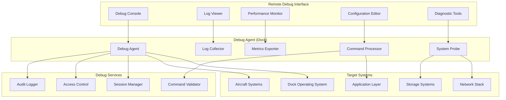
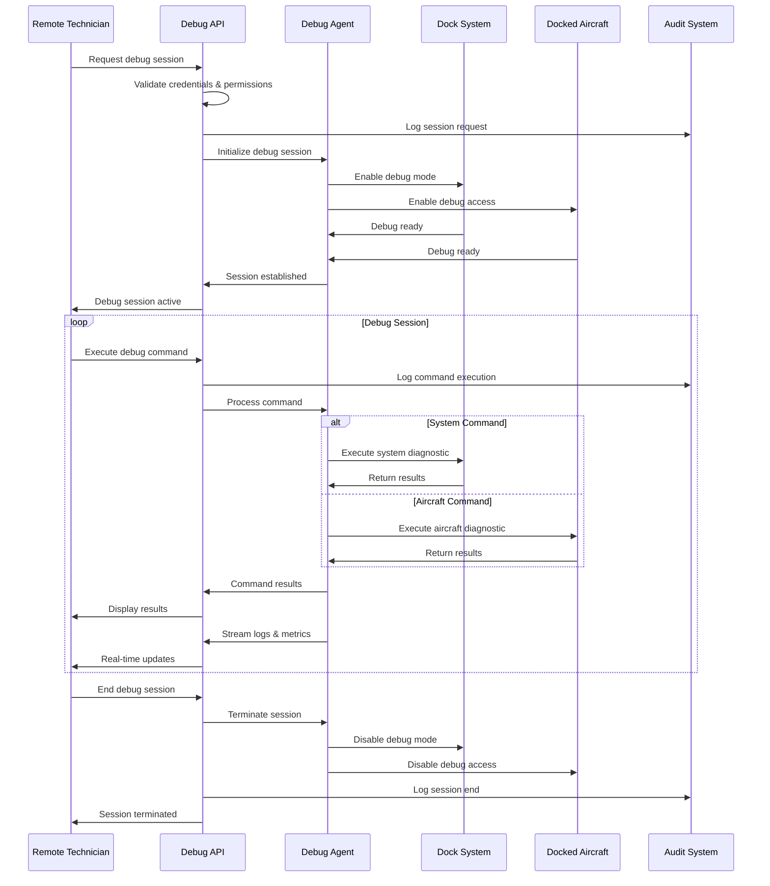

# Remote Debugging (Dock)

## Overview

The dock remote debugging system provides comprehensive troubleshooting and diagnostic capabilities for both dock infrastructure and docked aircraft. This enables real-time problem resolution, performance optimization, and system maintenance without requiring physical presence at the dock location.

## Debugging Capabilities

| Debug Category | Scope | Access Level | Tools | Real-time Support |
|---------------|-------|--------------|--------|------------------|
| System Logs | Dock + Aircraft | Admin/Technician | Log viewer, Search, Filter | Yes |
| Performance Metrics | All systems | Admin/Operator | Charts, Alerts, Analysis | Yes |
| Network Diagnostics | Connectivity | Admin/Technician | Trace, Latency, Bandwidth | Yes |
| Hardware Status | Components | Technician only | Sensors, Actuators, Tests | Yes |
| Flight Data | Aircraft systems | Pilot/Technician | Flight logs, Telemetry | Post-flight |
| Configuration | System settings | Admin only | Config editor, Validation | Yes |

## Architecture Overview



## MQTT Topic Structure

### Debug Control Topics
```
# Debug Session Management
thing/product/{dock_sn}/services
├── debug_session
│   ├── start_session          # Start debug session
│   ├── end_session            # End debug session
│   ├── execute_command        # Execute debug command
│   ├── get_logs              # Retrieve system logs
│   └── update_config         # Update configuration

# System Debugging
thing/product/{dock_sn}/debug
├── system_logs               # System log streams
├── performance_metrics       # Real-time metrics
├── network_diagnostics       # Network debug info
├── hardware_status          # Hardware debug data
└── configuration_state      # Current configuration

# Aircraft Debugging  
thing/product/{dock_sn}/aircraft/{aircraft_sn}/debug
├── flight_logs              # Flight operation logs
├── telemetry_stream         # Real-time telemetry
├── sensor_diagnostics       # Sensor debug data
├── firmware_status          # Firmware information
└── calibration_data         # Calibration status

# Debug Events
thing/product/{dock_sn}/events
├── debug_session_started    # Debug session initiated
├── debug_session_ended      # Debug session terminated
├── command_executed         # Debug command completed
├── configuration_changed    # Configuration updated
└── debug_alert              # Debug-related alerts
```

## API Endpoints

### Start Debug Session
```http
POST /api/v1/dock/{dock_sn}/debug/session/start
Content-Type: application/json
Authorization: Bearer {admin_token}

{
  "session_type": "comprehensive",
  "duration_minutes": 60,
  "access_level": "technician",
  "debug_targets": ["dock_system", "aircraft_systems"],
  "aircraft_filter": ["M30T_001_XYZ789"],
  "capabilities": [
    "log_access",
    "metrics_monitoring", 
    "command_execution",
    "configuration_read"
  ],
  "audit_required": true,
  "operator_info": {
    "name": "John Doe",
    "employee_id": "EMP123",
    "department": "Technical Support",
    "justification": "Customer reported connectivity issues"
  }
}

Response:
{
  "session_id": "debug_session_001",
  "status": "active",
  "expires_at": "2024-01-20T11:30:00Z",
  "access_token": "debug_token_abc123",
  "endpoints": {
    "websocket": "wss://debug.dji.com/ws/debug_session_001",
    "log_stream": "wss://debug.dji.com/logs/debug_session_001",
    "metrics_stream": "wss://debug.dji.com/metrics/debug_session_001"
  },
  "capabilities_granted": [
    "log_access",
    "metrics_monitoring",
    "command_execution"
  ],
  "restrictions": [
    "no_aircraft_control",
    "read_only_config"
  ]
}
```

### Execute Debug Command
```http
POST /api/v1/dock/{dock_sn}/debug/command
Content-Type: application/json
Authorization: Bearer {debug_token}

{
  "session_id": "debug_session_001",
  "command": "system_status",
  "target": "dock_system",
  "parameters": {
    "include_metrics": true,
    "include_logs": false,
    "time_range": "last_1_hour"
  },
  "timeout": 30
}

Response:
{
  "command_id": "cmd_001",
  "status": "completed",
  "execution_time": 2.5,
  "result": {
    "system_health": {
      "overall_score": 94,
      "cpu_usage": 23,
      "memory_usage": 67,
      "disk_usage": 45,
      "network_latency": 15
    },
    "active_processes": [
      {
        "name": "dock-controller",
        "pid": 1234,
        "cpu": 12.5,
        "memory": 245.6,
        "status": "running"
      }
    ],
    "system_uptime": "15d 4h 32m",
    "last_reboot": "2024-01-05T08:15:00Z"
  }
}
```

### Retrieve System Logs
```http
GET /api/v1/dock/{dock_sn}/debug/logs
Authorization: Bearer {debug_token}
Query Parameters:
- session_id: debug_session_001
- log_type: system,application,aircraft
- level: error,warning,info,debug
- time_from: 2024-01-20T09:00:00Z
- time_to: 2024-01-20T10:00:00Z
- limit: 1000
- aircraft_sn: M30T_001_XYZ789 (optional)

Response:
{
  "total_entries": 2847,
  "returned_entries": 1000,
  "time_range": {
    "from": "2024-01-20T09:00:00Z",
    "to": "2024-01-20T10:00:00Z"
  },
  "logs": [
    {
      "timestamp": "2024-01-20T09:15:23.456Z",
      "level": "error",
      "source": "dock-controller",
      "component": "charging_system",
      "message": "Charging connector temperature exceeded threshold",
      "details": {
        "temperature": 67.5,
        "threshold": 65.0,
        "connector_id": "connector_1"
      },
      "trace_id": "trace_abc123"
    },
    {
      "timestamp": "2024-01-20T09:16:01.789Z", 
      "level": "info",
      "source": "aircraft-manager",
      "aircraft_sn": "M30T_001_XYZ789",
      "message": "Aircraft docking sequence completed",
      "details": {
        "docking_duration": 45.2,
        "battery_level": 23,
        "charging_started": true
      }
    }
  ]
}
```

## Message Schemas

### Debug Command Execution
```json
{
  "tid": "debug_cmd_001",
  "bid": "12345678-1234-1234-1234-123456789012",
  "timestamp": 1640995200000,
  "method": "execute_debug_command",
  "data": {
    "session_id": "debug_session_001",
    "command": "network_diagnostics",
    "target": "dock_system",
    "parameters": {
      "test_type": "connectivity",
      "target_hosts": ["8.8.8.8", "cloud.dji.com"],
      "packet_count": 10,
      "timeout": 5
    },
    "audit_info": {
      "operator": "john.doe@company.com",
      "reason": "Investigating connectivity issues",
      "approval_id": "APPR_001"
    }
  }
}
```

### Debug Command Response
```json
{
  "tid": "debug_cmd_001",
  "bid": "12345678-1234-1234-1234-123456789012",
  "timestamp": 1640995205000,
  "method": "debug_command_result",
  "data": {
    "command_id": "cmd_001",
    "session_id": "debug_session_001",
    "status": "completed",
    "execution_time": 4.8,
    "result": {
      "network_diagnostics": {
        "connectivity_test": {
          "target": "8.8.8.8",
          "packets_sent": 10,
          "packets_received": 10,
          "packet_loss": 0,
          "avg_latency": 15.2,
          "min_latency": 12.1,
          "max_latency": 18.9
        },
        "dns_resolution": {
          "target": "cloud.dji.com",
          "resolved_ip": "52.123.45.67",
          "resolution_time": 23.5,
          "status": "success"
        },
        "bandwidth_test": {
          "upload_speed": "45.2 Mbps",
          "download_speed": "78.9 Mbps",
          "latency": 12.3,
          "jitter": 2.1
        }
      }
    },
    "warnings": [],
    "errors": []
  }
}
```

### Log Stream Message
```json
{
  "tid": "log_stream_001",
  "bid": "12345678-1234-1234-1234-123456789012",
  "timestamp": 1640995200000,
  "method": "log_entry",
  "data": {
    "session_id": "debug_session_001",
    "log_entry": {
      "timestamp": "2024-01-20T10:30:15.123Z",
      "level": "warning",
      "source": "aircraft-controller",
      "aircraft_sn": "M30T_001_XYZ789",
      "component": "gimbal_system",
      "thread": "gimbal-monitor-thread",
      "message": "Gimbal calibration drift detected",
      "details": {
        "axis": "pitch",
        "drift_degrees": 0.8,
        "threshold": 0.5,
        "last_calibration": "2024-01-15T14:20:00Z",
        "recalibration_recommended": true
      },
      "stack_trace": null,
      "correlation_id": "corr_gimbal_001"
    }
  }
}
```

## Debug Session Flow



## Code Example

```java
@Service
@Slf4j
public class DockRemoteDebuggingService extends AbstractDeviceService {
    
    @Autowired
    private DebugSessionManager sessionManager;
    
    @Autowired
    private AccessControlService accessControl;
    
    @Autowired
    private LogCollectionService logCollector;
    
    @Autowired
    private SystemDiagnosticsService systemDiagnostics;
    
    @Autowired
    private AuditLoggingService auditLogger;
    
    private final Map<String, ActiveDebugSession> activeSessions = new ConcurrentHashMap<>();
    
    /**
     * Start debug session
     */
    @PreAuthorize("hasRole('TECHNICIAN') or hasRole('ADMIN')")
    public DebugSessionResult startDebugSession(String dockSn, DebugSessionRequest request) {
        
        log.info("Starting debug session for dock: {}, operator: {}", 
                dockSn, request.getOperatorInfo().getName());
        
        try {
            // Validate access permissions
            AccessValidationResult accessValidation = accessControl.validateDebugAccess(
                request.getOperatorInfo(),
                dockSn,
                request.getAccessLevel()
            );
            
            if (!accessValidation.isGranted()) {
                throw new AccessDeniedException("Insufficient permissions for debug access");
            }
            
            // Create debug session
            ActiveDebugSession session = ActiveDebugSession.builder()
                    .sessionId(UUID.randomUUID().toString())
                    .dockSn(dockSn)
                    .operatorInfo(request.getOperatorInfo())
                    .sessionType(request.getSessionType())
                    .accessLevel(request.getAccessLevel())
                    .capabilities(filterCapabilities(request.getCapabilities(), accessValidation))
                    .startTime(Instant.now())
                    .expiresAt(Instant.now().plus(request.getDurationMinutes(), ChronoUnit.MINUTES))
                    .status(DebugSessionStatus.INITIALIZING)
                    .build();
            
            activeSessions.put(session.getSessionId(), session);
            
            // Initialize debug agents
            initializeDebugAgents(session);
            
            // Generate access token
            String accessToken = generateDebugAccessToken(session);
            
            // Create debug endpoints
            DebugEndpoints endpoints = createDebugEndpoints(session);
            
            // Enable debug mode on dock
            enableDebugMode(dockSn, session);
            
            // Enable debug mode on aircraft if requested
            if (request.getDebugTargets().contains("aircraft_systems")) {
                enableAircraftDebugMode(dockSn, request.getAircraftFilter(), session);
            }
            
            session.setStatus(DebugSessionStatus.ACTIVE);
            session.setAccessToken(accessToken);
            session.setEndpoints(endpoints);
            
            // Log session start
            auditLogger.logDebugSessionStart(session);
            
            log.info("Debug session started successfully: {}", session.getSessionId());
            
            return DebugSessionResult.builder()
                    .sessionId(session.getSessionId())
                    .status("active")
                    .expiresAt(session.getExpiresAt())
                    .accessToken(accessToken)
                    .endpoints(endpoints.toMap())
                    .capabilitiesGranted(session.getCapabilities())
                    .restrictions(generateRestrictionsList(session))
                    .build();
            
        } catch (Exception e) {
            log.error("Failed to start debug session for dock: {}", dockSn, e);
            return DebugSessionResult.failure(e.getMessage());
        }
    }
    
    /**
     * Execute debug command
     */
    @PreAuthorize("@debugSessionManager.validateSessionAccess(#sessionId, authentication)")
    public DebugCommandResult executeDebugCommand(String dockSn, String sessionId, 
                                                 DebugCommandRequest request) {
        
        ActiveDebugSession session = activeSessions.get(sessionId);
        if (session == null || session.isExpired()) {
            throw new InvalidDebugSessionException("Debug session not found or expired");
        }
        
        log.info("Executing debug command: {} for session: {}", request.getCommand(), sessionId);
        
        try {
            // Validate command permissions
            if (!session.hasCapability(getRequiredCapability(request.getCommand()))) {
                throw new InsufficientDebugPermissionException("Command not allowed in session");
            }
            
            // Create command execution context
            DebugCommandExecution execution = DebugCommandExecution.builder()
                    .commandId(UUID.randomUUID().toString())
                    .sessionId(sessionId)
                    .command(request.getCommand())
                    .target(request.getTarget())
                    .parameters(request.getParameters())
                    .startTime(Instant.now())
                    .timeout(Duration.ofSeconds(request.getTimeout()))
                    .build();
            
            // Log command execution
            auditLogger.logDebugCommandExecution(execution, session.getOperatorInfo());
            
            // Execute command based on target
            DebugCommandResult result = null;
            switch (request.getTarget()) {
                case "dock_system":
                    result = executeDockSystemCommand(execution);
                    break;
                case "aircraft_system":
                    result = executeAircraftSystemCommand(execution, request.getAircraftSn());
                    break;
                case "network_system":
                    result = executeNetworkCommand(execution);
                    break;
                default:
                    throw new UnsupportedDebugTargetException("Unsupported debug target: " + request.getTarget());
            }
            
            execution.setEndTime(Instant.now());
            execution.setExecutionTime(Duration.between(execution.getStartTime(), execution.getEndTime()).toMillis() / 1000.0);
            
            // Update session activity
            session.updateLastActivity();
            
            log.info("Debug command executed successfully: {} in {}s", 
                    execution.getCommandId(), execution.getExecutionTime());
            
            return result;
            
        } catch (Exception e) {
            log.error("Failed to execute debug command: {}", request.getCommand(), e);
            return DebugCommandResult.failure(e.getMessage());
        }
    }
    
    /**
     * Execute dock system debug command
     */
    private DebugCommandResult executeDockSystemCommand(DebugCommandExecution execution) {
        
        switch (execution.getCommand()) {
            case "system_status":
                SystemStatusInfo status = systemDiagnostics.getSystemStatus(execution.getSessionId());
                return DebugCommandResult.success(execution.getCommandId(), status);
                
            case "process_list":
                List<ProcessInfo> processes = systemDiagnostics.getProcessList();
                return DebugCommandResult.success(execution.getCommandId(), Map.of("processes", processes));
                
            case "disk_usage":
                DiskUsageInfo diskUsage = systemDiagnostics.getDiskUsage();
                return DebugCommandResult.success(execution.getCommandId(), diskUsage);
                
            case "network_interfaces":
                List<NetworkInterfaceInfo> interfaces = systemDiagnostics.getNetworkInterfaces();
                return DebugCommandResult.success(execution.getCommandId(), Map.of("interfaces", interfaces));
                
            case "service_status":
                String serviceName = (String) execution.getParameters().get("service_name");
                ServiceStatusInfo serviceStatus = systemDiagnostics.getServiceStatus(serviceName);
                return DebugCommandResult.success(execution.getCommandId(), serviceStatus);
                
            default:
                throw new UnsupportedDebugCommandException("Unsupported system command: " + execution.getCommand());
        }
    }
    
    /**
     * Retrieve system logs with filtering
     */
    @PreAuthorize("@debugSessionManager.validateSessionAccess(#sessionId, authentication)")
    public LogRetrievalResult retrieveSystemLogs(String dockSn, String sessionId, 
                                               LogRetrievalRequest request) {
        
        ActiveDebugSession session = activeSessions.get(sessionId);
        if (session == null || !session.hasCapability(DebugCapability.LOG_ACCESS)) {
            throw new InsufficientDebugPermissionException("Log access not granted");
        }
        
        log.info("Retrieving logs for session: {}, type: {}, level: {}", 
                sessionId, request.getLogType(), request.getLevel());
        
        try {
            // Build log query
            LogQuery query = LogQuery.builder()
                    .dockSn(dockSn)
                    .logType(request.getLogType())
                    .level(request.getLevel())
                    .timeFrom(request.getTimeFrom())
                    .timeTo(request.getTimeTo())
                    .aircraftSn(request.getAircraftSn())
                    .limit(request.getLimit())
                    .build();
            
            // Execute log retrieval
            LogQueryResult queryResult = logCollector.queryLogs(query);
            
            // Filter sensitive information based on access level
            List<LogEntry> filteredLogs = filterSensitiveLogData(
                queryResult.getLogEntries(), 
                session.getAccessLevel()
            );
            
            // Log access for audit
            auditLogger.logLogAccess(sessionId, session.getOperatorInfo(), query);
            
            return LogRetrievalResult.builder()
                    .totalEntries(queryResult.getTotalCount())
                    .returnedEntries(filteredLogs.size())
                    .timeRange(Map.of(
                        "from", request.getTimeFrom(),
                        "to", request.getTimeTo()
                    ))
                    .logs(filteredLogs)
                    .build();
            
        } catch (Exception e) {
            log.error("Failed to retrieve logs for session: {}", sessionId, e);
            return LogRetrievalResult.failure(e.getMessage());
        }
    }
    
    /**
     * Start real-time log streaming
     */
    @PreAuthorize("@debugSessionManager.validateSessionAccess(#sessionId, authentication)")
    public void startLogStreaming(String sessionId, LogStreamingRequest request, 
                                StreamObserver<LogEntry> responseObserver) {
        
        ActiveDebugSession session = activeSessions.get(sessionId);
        if (session == null || !session.hasCapability(DebugCapability.LOG_STREAMING)) {
            responseObserver.onError(new InsufficientDebugPermissionException("Log streaming not granted"));
            return;
        }
        
        log.info("Starting log streaming for session: {}", sessionId);
        
        try {
            // Create log stream subscription
            LogStreamSubscription subscription = LogStreamSubscription.builder()
                    .subscriptionId(UUID.randomUUID().toString())
                    .sessionId(sessionId)
                    .dockSn(session.getDockSn())
                    .filters(request.getFilters())
                    .observer(responseObserver)
                    .startTime(Instant.now())
                    .build();
            
            // Register with log collector
            logCollector.subscribeToLogStream(subscription);
            
            // Add to session
            session.addLogStreamSubscription(subscription);
            
            log.info("Log streaming started for session: {}, subscription: {}", 
                    sessionId, subscription.getSubscriptionId());
            
        } catch (Exception e) {
            log.error("Failed to start log streaming for session: {}", sessionId, e);
            responseObserver.onError(e);
        }
    }
    
    /**
     * End debug session
     */
    public void endDebugSession(String sessionId) {
        
        ActiveDebugSession session = activeSessions.get(sessionId);
        if (session == null) {
            log.warn("Attempt to end non-existent debug session: {}", sessionId);
            return;
        }
        
        log.info("Ending debug session: {}", sessionId);
        
        try {
            // Stop log streaming subscriptions
            for (LogStreamSubscription subscription : session.getLogStreamSubscriptions()) {
                logCollector.unsubscribeFromLogStream(subscription.getSubscriptionId());
            }
            
            // Disable debug mode on dock
            disableDebugMode(session.getDockSn());
            
            // Disable debug mode on aircraft
            disableAircraftDebugMode(session.getDockSn(), session.getAircraftFilter());
            
            // Update session status
            session.setStatus(DebugSessionStatus.ENDED);
            session.setEndTime(Instant.now());
            
            // Log session end
            auditLogger.logDebugSessionEnd(session);
            
            // Remove from active sessions
            activeSessions.remove(sessionId);
            
            log.info("Debug session ended successfully: {}", sessionId);
            
        } catch (Exception e) {
            log.error("Error ending debug session: {}", sessionId, e);
        }
    }
    
    /**
     * Monitor debug session timeouts
     */
    @Scheduled(fixedRate = 60000) // Check every minute
    public void monitorSessionTimeouts() {
        
        Instant now = Instant.now();
        
        for (ActiveDebugSession session : activeSessions.values()) {
            if (session.isExpired(now)) {
                log.info("Debug session expired: {}", session.getSessionId());
                endDebugSession(session.getSessionId());
            }
        }
    }
}

/**
 * Active debug session data model
 */
@Data
@Builder
public class ActiveDebugSession {
    private String sessionId;
    private String dockSn;
    private OperatorInfo operatorInfo;
    private DebugSessionType sessionType;
    private DebugAccessLevel accessLevel;
    private List<DebugCapability> capabilities;
    private Instant startTime;
    private Instant endTime;
    private Instant expiresAt;
    private Instant lastActivity;
    private DebugSessionStatus status;
    private String accessToken;
    private DebugEndpoints endpoints;
    private List<String> aircraftFilter;
    private List<LogStreamSubscription> logStreamSubscriptions;
    
    public boolean isExpired() {
        return Instant.now().isAfter(expiresAt);
    }
    
    public boolean isExpired(Instant checkTime) {
        return checkTime.isAfter(expiresAt);
    }
    
    public boolean hasCapability(DebugCapability capability) {
        return capabilities.contains(capability);
    }
    
    public void updateLastActivity() {
        this.lastActivity = Instant.now();
    }
}
```

## Security and Compliance

### Access Control
- Role-based permission system
- Multi-factor authentication required
- Session time limits and auto-expiration
- Command validation and filtering

### Audit and Compliance
- Complete audit trail of all debug activities
- Command execution logging with timestamps
- Data access tracking and reporting
- Compliance with regulatory requirements

### Data Protection
- Sensitive data filtering based on access level
- Encryption of debug communications
- No persistent storage of sensitive debug data
- Automatic session cleanup and data purging