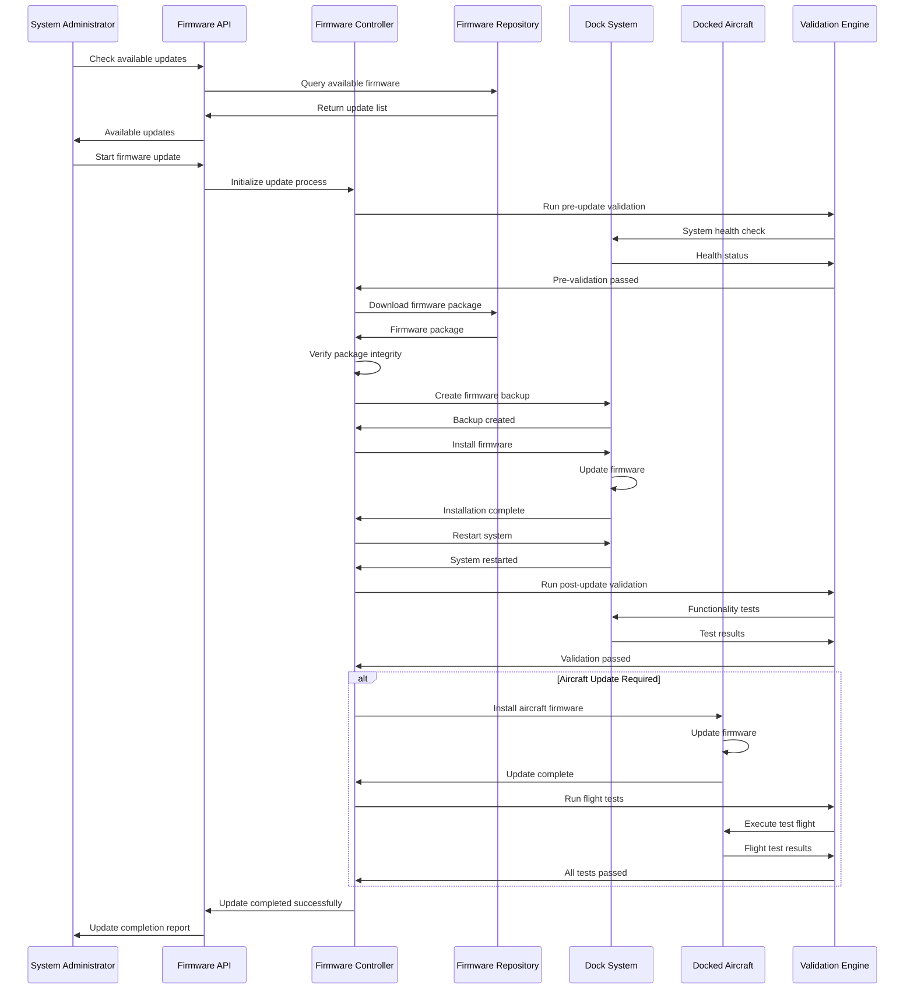

# Firmware Upgrade (Dock)

## Overview

The dock firmware upgrade system provides comprehensive over-the-air (OTA) firmware update capabilities for both dock infrastructure and docked aircraft. This system ensures secure, reliable, and coordinated firmware updates with rollback capabilities, staged deployments, and comprehensive validation processes.

## Supported Update Targets

| Target System | Update Method | Rollback Support | Downtime | Validation |
|---------------|---------------|------------------|----------|------------|
| Dock Controller | OTA/USB | Full rollback | 10-15 minutes | Pre/Post validation |
| Aircraft FC | OTA via dock | Full rollback | 5-10 minutes | Flight test required |
| Gimbal Firmware | OTA via dock | Limited rollback | 3-5 minutes | Calibration check |
| Camera Firmware | OTA via dock | Limited rollback | 2-3 minutes | Image quality test |
| Dock Subsystems | OTA/Local | Component rollback | 1-2 minutes | Health check |
| RTK Module | OTA via dock | Full rollback | 2-3 minutes | Positioning test |

## Architecture Overview

```mermaid
graph TB
    subgraph "Firmware Management System"
        FirmwareController["Firmware Controller"]
        UpdateOrchestrator["Update Orchestrator"]
        ValidationEngine["Validation Engine"]
        RollbackManager["Rollback Manager"]
        ProgressTracker["Progress Tracker"]
    end
    
    subgraph "Firmware Repository"
        FirmwareRepo["Firmware Repository"]
        VersionRegistry["Version Registry"]
        SecurityValidator["Security Validator"]
        IntegrityChecker["Integrity Checker"]
    end
    
    subgraph "Update Targets"
        DockController["Dock Controller"]
        AircraftFC["Aircraft FC"]
        GimbalSystem["Gimbal System"]
        CameraModule["Camera Module"]
        RTKModule["RTK Module"]
        SensorSystems["Sensor Systems"]
    end
    
    subgraph "Validation Systems"
        PreUpdateTests["Pre-Update Tests"]
        PostUpdateTests["Post-Update Tests"]
        FlightTestSuite["Flight Test Suite"]
        PerformanceTests["Performance Tests"]
        SafetyChecks["Safety Checks"]
    end
    
    subgraph "External Services"
        DJIFirmwareAPI["DJI Firmware API"]
        UpdateNotifications["Update Notifications"]
        ComplianceReporting["Compliance Reporting"]
        TechnicalSupport["Technical Support"]
    end
    
    FirmwareController --> UpdateOrchestrator
    FirmwareController --> ValidationEngine
    FirmwareController --> RollbackManager
    FirmwareController --> ProgressTracker
    
    UpdateOrchestrator --> FirmwareRepo
    FirmwareRepo --> VersionRegistry
    FirmwareRepo --> SecurityValidator
    FirmwareRepo --> IntegrityChecker
    
    UpdateOrchestrator --> DockController
    UpdateOrchestrator --> AircraftFC
    UpdateOrchestrator --> GimbalSystem
    UpdateOrchestrator --> CameraModule
    UpdateOrchestrator --> RTKModule
    UpdateOrchestrator --> SensorSystems
    
    ValidationEngine --> PreUpdateTests
    ValidationEngine --> PostUpdateTests
    ValidationEngine --> FlightTestSuite
    ValidationEngine --> PerformanceTests
    ValidationEngine --> SafetyChecks
    
    FirmwareRepo --> DJIFirmwareAPI
    ProgressTracker --> UpdateNotifications
    ValidationEngine --> ComplianceReporting
    RollbackManager --> TechnicalSupport
```



## MQTT Topic Structure

### Firmware Update Topics
```
# Dock Firmware Management
thing/product/{dock_sn}/services
├── firmware_update
│   ├── check_updates           # Check for available updates
│   ├── download_firmware       # Download firmware packages
│   ├── install_firmware        # Install firmware updates
│   ├── rollback_firmware       # Rollback to previous version
│   └── validate_installation   # Validate firmware installation

# Aircraft Firmware Management
thing/product/{dock_sn}/aircraft/{aircraft_sn}/services
├── aircraft_firmware_update   # Update aircraft firmware
├── gimbal_firmware_update     # Update gimbal firmware
├── camera_firmware_update     # Update camera firmware
├── rtk_firmware_update        # Update RTK module firmware
└── sensor_firmware_update     # Update sensor firmware

# Update Status Topics
thing/product/{dock_sn}/state
├── firmware_versions          # Current firmware versions
├── update_progress           # Update progress status
├── available_updates         # Available firmware updates
├── update_history           # Update history log
└── rollback_status          # Rollback status

# Update Events
thing/product/{dock_sn}/events
├── update_available         # New firmware available
├── update_started           # Update process started
├── update_completed         # Update completed successfully
├── update_failed            # Update failed
├── rollback_initiated       # Rollback process started
└── validation_completed     # Validation tests completed
```

## API Endpoints

### Check Available Updates
```http
GET /api/v1/dock/{dock_sn}/firmware/updates/available
Authorization: Bearer {admin_token}

Response:
{
  "dock_sn": "DOCK_001_ABC123",
  "check_time": "2024-01-20T10:30:00Z",
  "available_updates": [
    {
      "component": "dock_controller",
      "current_version": "02.04.10.15",
      "available_version": "02.04.11.02",
      "update_type": "minor",
      "security_update": false,
      "release_date": "2024-01-15T00:00:00Z",
      "size_mb": 45.2,
      "estimated_downtime": 12,
      "description": "Performance improvements and bug fixes",
      "prerequisites": [],
      "compatibility": "full"
    },
    {
      "component": "aircraft_fc",
      "aircraft_sn": "M30T_001_XYZ789",
      "current_version": "07.01.10.03",
      "available_version": "07.01.10.05",
      "update_type": "patch",
      "security_update": true,
      "release_date": "2024-01-18T00:00:00Z",
      "size_mb": 12.8,
      "estimated_downtime": 8,
      "description": "Security patch and sensor calibration improvements",
      "prerequisites": ["aircraft_docked", "battery_level_80"],
      "compatibility": "full"
    }
  ],
  "total_updates": 2,
  "critical_updates": 0,
  "security_updates": 1
}
```

### Start Firmware Update
```http
POST /api/v1/dock/{dock_sn}/firmware/update/start
Content-Type: application/json
Authorization: Bearer {admin_token}

{
  "update_plan": {
    "update_id": "update_20240120_001",
    "components": [
      {
        "component": "dock_controller",
        "target_version": "02.04.11.02",
        "schedule": "immediate",
        "validation_required": true
      },
      {
        "component": "aircraft_fc",
        "aircraft_sn": "M30T_001_XYZ789",
        "target_version": "07.01.10.05",
        "schedule": "after_dock_controller",
        "validation_required": true,
        "flight_test_required": true
      }
    ]
  },
  "update_options": {
    "staged_deployment": false,
    "automatic_rollback": true,
    "max_retry_attempts": 3,
    "backup_current_firmware": true,
    "notification_enabled": true
  },
  "validation_config": {
    "pre_update_tests": true,
    "post_update_tests": true,
    "performance_validation": true,
    "safety_checks": true,
    "flight_test_duration": 300
  },
  "operator_info": {
    "name": "John Doe",
    "employee_id": "EMP123",
    "authorization_code": "AUTH_ABC123"
  }
}

Response:
{
  "update_id": "update_20240120_001",
  "status": "initiated",
  "estimated_completion": "2024-01-20T11:15:00Z",
  "components_scheduled": 2,
  "total_estimated_time": 25,
  "progress_url": "/api/v1/dock/DOCK_001_ABC123/firmware/update/update_20240120_001/progress",
  "websocket_url": "wss://api.dji.com/firmware-updates/update_20240120_001"
}
```

### Update Progress Monitoring
```http
GET /api/v1/dock/{dock_sn}/firmware/update/{update_id}/progress
Authorization: Bearer {admin_token}

Response:
{
  "update_id": "update_20240120_001",
  "overall_status": "in_progress",
  "overall_progress": 45,
  "start_time": "2024-01-20T10:45:00Z",
  "estimated_completion": "2024-01-20T11:15:00Z",
  "current_component": "dock_controller",
  "components": [
    {
      "component": "dock_controller",
      "status": "updating",
      "progress": 78,
      "phase": "installing",
      "start_time": "2024-01-20T10:45:15Z",
      "estimated_completion": "2024-01-20T10:52:00Z",
      "details": {
        "download_progress": 100,
        "verification_complete": true,
        "installation_progress": 78,
        "backup_created": true
      }
    },
    {
      "component": "aircraft_fc",
      "aircraft_sn": "M30T_001_XYZ789",
      "status": "pending",
      "progress": 0,
      "phase": "waiting",
      "dependencies": ["dock_controller"],
      "estimated_start": "2024-01-20T10:52:30Z"
    }
  ],
  "logs": [
    {
      "timestamp": "2024-01-20T10:45:15Z",
      "level": "info",
      "message": "Starting dock controller firmware update",
      "component": "dock_controller"
    },
    {
      "timestamp": "2024-01-20T10:47:32Z",
      "level": "info",
      "message": "Firmware download completed, verifying integrity",
      "component": "dock_controller"
    }
  ]
}
```

## Message Schemas

### Firmware Update Command
```json
{
  "tid": "fw_update_001",
  "bid": "12345678-1234-1234-1234-123456789012",
  "timestamp": 1640995200000,
  "method": "install_firmware",
  "data": {
    "update_id": "update_20240120_001",
    "component": "dock_controller",
    "firmware_package": {
      "version": "02.04.11.02",
      "package_url": "https://firmware.dji.com/dock/02.04.11.02/firmware.bin",
      "checksum": "sha256:abc123def456789...",
      "size_bytes": 47185920,
      "signature": "RSA_signature_here"
    },
    "update_options": {
      "backup_current": true,
      "validate_before_install": true,
      "automatic_rollback": true,
      "max_retry_attempts": 3
    },
    "validation_config": {
      "pre_update_tests": [
        "system_health_check",
        "storage_space_check",
        "power_stability_check"
      ],
      "post_update_tests": [
        "boot_sequence_test",
        "component_functionality_test",
        "performance_baseline_test"
      ]
    }
  }
}
```

### Update Progress Report
```json
{
  "tid": "fw_update_progress_001",
  "bid": "12345678-1234-1234-1234-123456789012",
  "timestamp": 1640995500000,
  "method": "firmware_update_progress",
  "data": {
    "update_id": "update_20240120_001",
    "component": "dock_controller",
    "dock_sn": "DOCK_001_ABC123",
    "status": "installing",
    "overall_progress": 65,
    "phase_progress": {
      "download": 100,
      "verification": 100,
      "backup": 100,
      "installation": 65,
      "validation": 0
    },
    "current_step": "writing_firmware_to_flash",
    "estimated_remaining_time": 180,
    "details": {
      "bytes_written": 30720000,
      "total_bytes": 47185920,
      "write_speed": "2.5 MB/s",
      "flash_sectors_updated": 1024,
      "total_flash_sectors": 1536
    },
    "system_status": {
      "cpu_usage": 25,
      "memory_usage": 45,
      "disk_io": "high",
      "network_status": "stable",
      "power_status": "stable"
    }
  }
}
```

### Update Completion Report
```json
{
  "tid": "fw_update_complete_001",
  "bid": "12345678-1234-1234-1234-123456789012",
  "timestamp": 1640996400000,
  "method": "firmware_update_complete",
  "data": {
    "update_id": "update_20240120_001",
    "component": "dock_controller",
    "dock_sn": "DOCK_001_ABC123",
    "status": "completed",
    "result": "success",
    "execution_summary": {
      "start_time": "2024-01-20T10:45:15Z",
      "end_time": "2024-01-20T10:57:45Z",
      "total_duration": 750,
      "phases_completed": [
        "download",
        "verification", 
        "backup",
        "installation",
        "validation"
      ]
    },
    "version_info": {
      "previous_version": "02.04.10.15",
      "new_version": "02.04.11.02",
      "backup_location": "/backup/firmware/02.04.10.15_backup.bin"
    },
    "validation_results": {
      "pre_update_tests": {
        "all_passed": true,
        "tests_run": 5,
        "tests_passed": 5,
        "tests_failed": 0
      },
      "post_update_tests": {
        "all_passed": true,
        "tests_run": 8,
        "tests_passed": 8,
        "tests_failed": 0,
        "performance_comparison": {
          "boot_time_improvement": "15%",
          "memory_usage_reduction": "8%",
          "network_latency_improvement": "12%"
        }
      }
    },
    "system_status": {
      "health_score": 98,
      "all_components_operational": true,
      "configuration_preserved": true,
      "data_integrity_verified": true
    }
  }
}
```

## Firmware Update Flow



## Code Example

```java
@Service
@Slf4j
public class DockFirmwareUpgradeService extends AbstractDeviceService {
    
    @Autowired
    private FirmwareRepository firmwareRepo;
    
    @Autowired
    private UpdateOrchestrationService orchestrator;
    
    @Autowired
    private ValidationEngineService validator;
    
    @Autowired
    private RollbackManagerService rollbackManager;
    
    @Autowired
    private ProgressTrackingService progressTracker;
    
    private final Map<String, ActiveFirmwareUpdate> activeUpdates = new ConcurrentHashMap<>();
    
    /**
     * Check for available firmware updates
     */
    public AvailableUpdatesResult checkAvailableUpdates(String dockSn) {
        
        log.info("Checking available firmware updates for dock: {}", dockSn);
        
        try {
            // Get current firmware versions
            Map<String, String> currentVersions = getCurrentFirmwareVersions(dockSn);
            
            // Query available updates from repository
            List<FirmwareUpdate> availableUpdates = firmwareRepo.queryAvailableUpdates(
                dockSn, currentVersions);
            
            // Filter by compatibility and prerequisites
            List<FirmwareUpdate> compatibleUpdates = filterCompatibleUpdates(
                dockSn, availableUpdates);
            
            // Calculate update statistics
            long criticalUpdates = compatibleUpdates.stream()
                    .filter(update -> update.getUpdateType() == UpdateType.CRITICAL)
                    .count();
            
            long securityUpdates = compatibleUpdates.stream()
                    .filter(FirmwareUpdate::isSecurityUpdate)
                    .count();
            
            return AvailableUpdatesResult.builder()
                    .dockSn(dockSn)
                    .checkTime(Instant.now())
                    .availableUpdates(compatibleUpdates)
                    .totalUpdates(compatibleUpdates.size())
                    .criticalUpdates(criticalUpdates)
                    .securityUpdates(securityUpdates)
                    .build();
            
        } catch (Exception e) {
            log.error("Failed to check available updates for dock: {}", dockSn, e);
            return AvailableUpdatesResult.failure(e.getMessage());
        }
    }
    
    /**
     * Start firmware update process
     */
    @PreAuthorize("hasRole('FIRMWARE_ADMIN')")
    public FirmwareUpdateResult startFirmwareUpdate(String dockSn, FirmwareUpdateRequest request) {
        
        log.info("Starting firmware update: {} for dock: {}", request.getUpdateId(), dockSn);
        
        try {
            // Validate update request
            UpdateValidationResult validation = validateUpdateRequest(dockSn, request);
            if (!validation.isValid()) {
                throw new InvalidUpdateRequestException("Update request validation failed", 
                        validation.getErrors());
            }
            
            // Check for conflicting updates
            if (hasActiveUpdate(dockSn)) {
                throw new ConcurrentUpdateException("Another firmware update is already in progress");
            }
            
            // Create active update session
            ActiveFirmwareUpdate activeUpdate = ActiveFirmwareUpdate.builder()
                    .updateId(request.getUpdateId())
                    .dockSn(dockSn)
                    .updatePlan(request.getUpdatePlan())
                    .options(request.getUpdateOptions())
                    .validationConfig(request.getValidationConfig())
                    .operatorInfo(request.getOperatorInfo())
                    .startTime(Instant.now())
                    .status(UpdateStatus.INITIALIZING)
                    .build();
            
            activeUpdates.put(request.getUpdateId(), activeUpdate);
            
            // Initialize progress tracking
            progressTracker.initializeUpdateProgress(activeUpdate);
            
            // Start update orchestration asynchronously
            CompletableFuture.runAsync(() -> {
                executeUpdatePlan(activeUpdate);
            });
            
            log.info("Firmware update initiated successfully: {}", request.getUpdateId());
            
            return FirmwareUpdateResult.builder()
                    .updateId(request.getUpdateId())
                    .status("initiated")
                    .estimatedCompletion(calculateEstimatedCompletion(request.getUpdatePlan()))
                    .componentsScheduled(request.getUpdatePlan().getComponents().size())
                    .totalEstimatedTime(calculateTotalEstimatedTime(request.getUpdatePlan()))
                    .progressUrl(buildProgressUrl(dockSn, request.getUpdateId()))
                    .websocketUrl(buildWebSocketUrl(request.getUpdateId()))
                    .build();
            
        } catch (Exception e) {
            log.error("Failed to start firmware update: {}", request.getUpdateId(), e);
            return FirmwareUpdateResult.failure(e.getMessage());
        }
    }
    
    /**
     * Execute firmware update plan
     */
    private void executeUpdatePlan(ActiveFirmwareUpdate activeUpdate) {
        
        try {
            activeUpdate.setStatus(UpdateStatus.IN_PROGRESS);
            progressTracker.updateOverallStatus(activeUpdate.getUpdateId(), UpdateStatus.IN_PROGRESS);
            
            // Sort components by dependency order
            List<ComponentUpdate> orderedComponents = orderComponentsByDependencies(
                activeUpdate.getUpdatePlan().getComponents());
            
            for (ComponentUpdate componentUpdate : orderedComponents) {
                
                // Check if update should continue
                if (activeUpdate.getStatus() == UpdateStatus.CANCELLED) {
                    log.info("Update cancelled, stopping execution: {}", activeUpdate.getUpdateId());
                    break;
                }
                
                // Execute component update
                ComponentUpdateResult result = executeComponentUpdate(activeUpdate, componentUpdate);
                
                if (!result.isSuccess()) {
                    // Handle update failure
                    handleUpdateFailure(activeUpdate, componentUpdate, result);
                    return;
                }
                
                // Update progress
                progressTracker.updateComponentProgress(
                    activeUpdate.getUpdateId(), 
                    componentUpdate.getComponent(),
                    UpdateStatus.COMPLETED
                );
            }
            
            // All components updated successfully
            completeUpdate(activeUpdate);
            
        } catch (Exception e) {
            log.error("Error executing update plan: {}", activeUpdate.getUpdateId(), e);
            handleUpdateException(activeUpdate, e);
        }
    }
    
    /**
     * Execute individual component update
     */
    private ComponentUpdateResult executeComponentUpdate(ActiveFirmwareUpdate activeUpdate, 
                                                       ComponentUpdate componentUpdate) {
        
        String component = componentUpdate.getComponent();
        log.info("Starting component update: {} for update: {}", 
                component, activeUpdate.getUpdateId());
        
        try {
            // Update component status
            progressTracker.updateComponentStatus(
                activeUpdate.getUpdateId(),
                component,
                UpdateStatus.STARTING
            );
            
            // Run pre-update validation
            if (activeUpdate.getValidationConfig().isPreUpdateTests()) {
                ValidationResult preValidation = validator.runPreUpdateValidation(
                    activeUpdate.getDockSn(), componentUpdate);
                
                if (!preValidation.isValid()) {
                    throw new PreUpdateValidationException("Pre-update validation failed", 
                            preValidation.getErrors());
                }
            }
            
            // Download firmware package
            FirmwarePackage firmwarePackage = downloadFirmwarePackage(componentUpdate);
            progressTracker.updateComponentPhase(activeUpdate.getUpdateId(), component, "downloaded");
            
            // Verify package integrity
            if (!verifyPackageIntegrity(firmwarePackage)) {
                throw new FirmwareIntegrityException("Firmware package integrity check failed");
            }
            progressTracker.updateComponentPhase(activeUpdate.getUpdateId(), component, "verified");
            
            // Create backup if requested
            if (activeUpdate.getOptions().isBackupCurrentFirmware()) {
                createFirmwareBackup(activeUpdate.getDockSn(), component);
                progressTracker.updateComponentPhase(activeUpdate.getUpdateId(), component, "backed_up");
            }
            
            // Install firmware
            FirmwareInstallationResult installResult = installFirmware(
                activeUpdate.getDockSn(), component, firmwarePackage);
            
            if (!installResult.isSuccess()) {
                throw new FirmwareInstallationException("Firmware installation failed", 
                        installResult.getError());
            }
            progressTracker.updateComponentPhase(activeUpdate.getUpdateId(), component, "installed");
            
            // Run post-update validation
            if (activeUpdate.getValidationConfig().isPostUpdateTests()) {
                ValidationResult postValidation = validator.runPostUpdateValidation(
                    activeUpdate.getDockSn(), componentUpdate);
                
                if (!postValidation.isValid()) {
                    // Attempt automatic rollback if enabled
                    if (activeUpdate.getOptions().isAutomaticRollback()) {
                        rollbackComponent(activeUpdate.getDockSn(), component);
                    }
                    throw new PostUpdateValidationException("Post-update validation failed", 
                            postValidation.getErrors());
                }
            }
            progressTracker.updateComponentPhase(activeUpdate.getUpdateId(), component, "validated");
            
            // Run flight test for aircraft components
            if (isAircraftComponent(component) && activeUpdate.getValidationConfig().isFlightTestRequired()) {
                FlightTestResult flightTest = runFlightValidation(
                    activeUpdate.getDockSn(), componentUpdate);
                
                if (!flightTest.isSuccess()) {
                    throw new FlightTestException("Flight test failed", flightTest.getErrors());
                }
            }
            
            // Update completion
            progressTracker.updateComponentStatus(
                activeUpdate.getUpdateId(),
                component,
                UpdateStatus.COMPLETED
            );
            
            log.info("Component update completed successfully: {} for update: {}", 
                    component, activeUpdate.getUpdateId());
            
            return ComponentUpdateResult.success(component);
            
        } catch (Exception e) {
            log.error("Component update failed: {} for update: {}", 
                    component, activeUpdate.getUpdateId(), e);
            
            progressTracker.updateComponentStatus(
                activeUpdate.getUpdateId(),
                component,
                UpdateStatus.FAILED
            );
            
            return ComponentUpdateResult.failure(component, e.getMessage());
        }
    }
    
    /**
     * Handle update failure with rollback if configured
     */
    private void handleUpdateFailure(ActiveFirmwareUpdate activeUpdate, 
                                   ComponentUpdate failedComponent,
                                   ComponentUpdateResult result) {
        
        log.error("Firmware update failed for component: {} in update: {}", 
                failedComponent.getComponent(), activeUpdate.getUpdateId());
        
        activeUpdate.setStatus(UpdateStatus.FAILED);
        activeUpdate.setEndTime(Instant.now());
        activeUpdate.setFailureReason(result.getError());
        
        // Attempt rollback if enabled
        if (activeUpdate.getOptions().isAutomaticRollback()) {
            try {
                log.info("Attempting automatic rollback for update: {}", activeUpdate.getUpdateId());
                
                RollbackResult rollbackResult = rollbackManager.rollbackUpdate(
                    activeUpdate.getDockSn(),
                    activeUpdate.getUpdateId(),
                    failedComponent.getComponent()
                );
                
                if (rollbackResult.isSuccess()) {
                    activeUpdate.setStatus(UpdateStatus.ROLLED_BACK);
                    log.info("Automatic rollback completed successfully: {}", activeUpdate.getUpdateId());
                } else {
                    log.error("Automatic rollback failed: {}", rollbackResult.getError());
                    activeUpdate.setStatus(UpdateStatus.ROLLBACK_FAILED);
                }
                
            } catch (Exception e) {
                log.error("Error during automatic rollback: {}", activeUpdate.getUpdateId(), e);
                activeUpdate.setStatus(UpdateStatus.ROLLBACK_FAILED);
            }
        }
        
        // Notify stakeholders
        notifyUpdateFailure(activeUpdate, failedComponent, result);
        
        // Clean up update session
        cleanupUpdateSession(activeUpdate);
    }
    
    /**
     * Rollback firmware to previous version
     */
    @PreAuthorize("hasRole('FIRMWARE_ADMIN')")
    public RollbackResult rollbackFirmware(String dockSn, RollbackRequest request) {
        
        log.info("Starting firmware rollback for dock: {}, component: {}", 
                dockSn, request.getComponent());
        
        try {
            // Validate rollback request
            RollbackValidationResult validation = rollbackManager.validateRollback(dockSn, request);
            if (!validation.isValid()) {
                throw new InvalidRollbackRequestException("Rollback validation failed", 
                        validation.getErrors());
            }
            
            // Execute rollback
            RollbackExecutionResult result = rollbackManager.executeRollback(dockSn, request);
            
            if (result.isSuccess()) {
                log.info("Firmware rollback completed successfully for dock: {}, component: {}", 
                        dockSn, request.getComponent());
                
                // Run post-rollback validation
                ValidationResult postRollbackValidation = validator.runPostRollbackValidation(
                    dockSn, request.getComponent());
                
                return RollbackResult.builder()
                        .rollbackId(result.getRollbackId())
                        .status("completed")
                        .previousVersion(result.getRolledBackToVersion())
                        .executionTime(result.getExecutionTime())
                        .validationResults(postRollbackValidation)
                        .build();
            } else {
                throw new RollbackExecutionException("Rollback execution failed", result.getError());
            }
            
        } catch (Exception e) {
            log.error("Failed to rollback firmware for dock: {}", dockSn, e);
            return RollbackResult.failure(e.getMessage());
        }
    }
    
    /**
     * Get firmware update progress
     */
    public UpdateProgressResult getUpdateProgress(String dockSn, String updateId) {
        
        ActiveFirmwareUpdate activeUpdate = activeUpdates.get(updateId);
        if (activeUpdate == null) {
            throw new UpdateNotFoundException("Update not found: " + updateId);
        }
        
        return progressTracker.getUpdateProgress(updateId);
    }
    
    /**
     * Monitor update timeouts and cleanup
     */
    @Scheduled(fixedRate = 60000) // Check every minute
    public void monitorUpdateTimeouts() {
        
        Instant now = Instant.now();
        
        for (ActiveFirmwareUpdate activeUpdate : activeUpdates.values()) {
            
            // Check for stalled updates
            if (activeUpdate.isStalled(now)) {
                log.warn("Firmware update appears stalled: {}", activeUpdate.getUpdateId());
                handleStalledUpdate(activeUpdate);
            }
            
            // Check for expired updates
            if (activeUpdate.isExpired(now)) {
                log.warn("Firmware update expired: {}", activeUpdate.getUpdateId());
                handleExpiredUpdate(activeUpdate);
            }
        }
    }
}

/**
 * Active firmware update session
 */
@Data
@Builder
public class ActiveFirmwareUpdate {
    private String updateId;
    private String dockSn;
    private UpdatePlan updatePlan;
    private UpdateOptions options;
    private ValidationConfig validationConfig;
    private OperatorInfo operatorInfo;
    private Instant startTime;
    private Instant endTime;
    private UpdateStatus status;
    private String failureReason;
    private Instant lastActivity;
    
    public boolean isStalled(Instant checkTime) {
        return lastActivity != null && 
               Duration.between(lastActivity, checkTime).toMinutes() > 15;
    }
    
    public boolean isExpired(Instant checkTime) {
        return Duration.between(startTime, checkTime).toHours() > 4;
    }
}
```

## Security and Validation

### Firmware Security
- Digital signature verification for all firmware packages
- Encrypted firmware distribution channels  
- Integrity checks using cryptographic hashes
- Secure boot verification post-update

### Validation Framework
- Comprehensive pre-update system health checks
- Post-update functional validation
- Performance regression testing
- Flight test validation for aircraft components

### Rollback Capabilities
- Automatic rollback on validation failure
- Manual rollback support with admin authorization
- Version history tracking and management
- Quick recovery procedures for critical failures