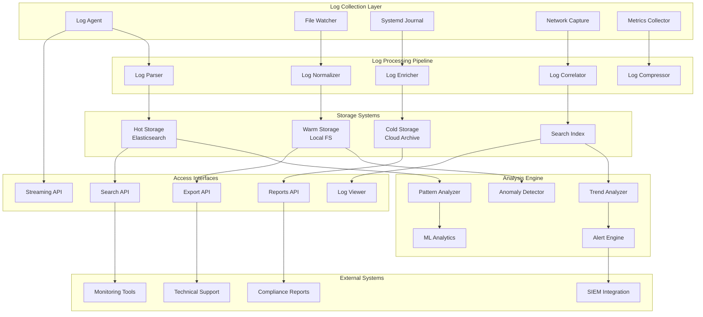
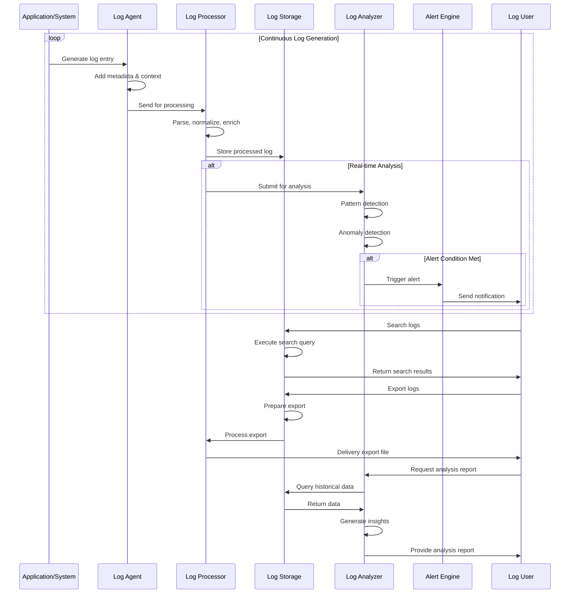

# Remote Log (Dock)

## Overview

The dock remote log system provides comprehensive log collection, analysis, and management capabilities for both dock infrastructure and docked aircraft. This system enables centralized logging, real-time log streaming, intelligent log analysis, and automated log management with support for compliance and troubleshooting requirements.

## Supported Log Types

| Log Category | Sources | Retention | Real-time | Analysis | Compliance |
|-------------|---------|-----------|-----------|----------|------------|
| System Logs | Dock OS, Services | 90 days | Yes | Automated | SOC2 |
| Application Logs | Dock software, APIs | 60 days | Yes | ML-powered | GDPR |
| Security Logs | Auth, Access control | 2 years | Yes | Alert-based | SOX |
| Flight Logs | Aircraft operations | 1 year | Yes | Performance | Aviation |
| Network Logs | Connectivity, Traffic | 30 days | Yes | Anomaly detection | - |
| Hardware Logs | Sensors, Diagnostics | 180 days | Yes | Predictive | ISO27001 |

## Architecture Overview



## MQTT Topic Structure

### Log Management Topics
```
# Log Collection Control
thing/product/{dock_sn}/services
├── log_management
│   ├── configure_logging      # Configure log collection
│   ├── start_log_collection   # Start log collection
│   ├── stop_log_collection    # Stop log collection
│   ├── export_logs           # Export log data
│   └── archive_logs          # Archive old logs

# Real-time Log Streaming
thing/product/{dock_sn}/logs
├── system_logs               # System-level logs
├── application_logs          # Application logs
├── security_logs            # Security-related logs
├── hardware_logs            # Hardware diagnostic logs
└── network_logs             # Network traffic logs

# Aircraft Log Streaming
thing/product/{dock_sn}/aircraft/{aircraft_sn}/logs
├── flight_logs              # Flight operation logs
├── sensor_logs              # Sensor data logs
├── performance_logs         # Performance metrics
├── error_logs               # Error and exception logs
└── maintenance_logs         # Maintenance event logs

# Log Events
thing/product/{dock_sn}/events
├── log_alert               # Log-based alerts
├── log_rotation           # Log rotation events
├── log_export_complete    # Log export completed
├── log_storage_warning    # Storage space warnings
└── log_analysis_complete  # Analysis completed
```

## API Endpoints

### Configure Log Collection
```http
POST /api/v1/dock/{dock_sn}/logs/configure
Content-Type: application/json
Authorization: Bearer {admin_token}

{
  "log_configuration": {
    "collection_enabled": true,
    "log_levels": {
      "system": "info",
      "application": "debug", 
      "security": "info",
      "hardware": "warning",
      "network": "error"
    },
    "retention_policies": {
      "system": "90d",
      "application": "60d",
      "security": "2y",
      "hardware": "180d",
      "network": "30d"
    },
    "real_time_streaming": {
      "enabled": true,
      "buffer_size": 1000,
      "flush_interval": 5,
      "compression": "gzip"
    }
  },
  "filtering_rules": [
    {
      "rule_name": "exclude_debug_spew",
      "log_source": "application",
      "condition": "level != 'debug' OR component != 'network_monitor'",
      "action": "exclude"
    },
    {
      "rule_name": "highlight_security",
      "log_source": "security",
      "condition": "level IN ('warning', 'error', 'critical')",
      "action": "priority_high"
    }
  ],
  "export_settings": {
    "auto_export_enabled": true,
    "export_schedule": "0 2 * * *",
    "export_format": "json",
    "compression": true,
    "encryption": true
  }
}
```

### Search Logs
```http
GET /api/v1/dock/{dock_sn}/logs/search
Authorization: Bearer {operator_token}
Query Parameters:
- query: "level:error AND component:charging_system"
- time_from: 2024-01-20T00:00:00Z
- time_to: 2024-01-20T23:59:59Z
- log_types: system,application,security
- aircraft_sn: M30T_001_XYZ789
- limit: 1000
- offset: 0
- sort: timestamp:desc

Response:
{
  "total_matches": 15647,
  "returned_count": 1000,
  "execution_time": 45.2,
  "query_info": {
    "parsed_query": "level:error AND component:charging_system",
    "search_period": "24h",
    "indexes_searched": ["dock-logs-2024-01-20"]
  },
  "results": [
    {
      "timestamp": "2024-01-20T15:23:45.123Z",
      "level": "error",
      "source": "charging_system",
      "component": "connector_monitor",
      "message": "Charging connector temperature exceeded safe threshold",
      "details": {
        "connector_id": "connector_1",
        "temperature": 67.5,
        "threshold": 65.0,
        "duration_seconds": 15,
        "auto_action_taken": "reduce_charging_current"
      },
      "context": {
        "dock_sn": "DOCK_001_ABC123",
        "aircraft_sn": "M30T_001_XYZ789",
        "charge_session_id": "charge_20240120_001",
        "battery_level": 78
      },
      "correlation_id": "corr_charging_001",
      "thread": "charging-monitor-thread-1",
      "log_id": "log_15647_abc123"
    }
  ],
  "aggregations": {
    "by_level": {
      "error": 856,
      "warning": 1247,
      "info": 13544
    },
    "by_component": {
      "charging_system": 234,
      "network_monitor": 189,
      "aircraft_controller": 167
    }
  }
}
```

### Export Logs
```http
POST /api/v1/dock/{dock_sn}/logs/export
Content-Type: application/json
Authorization: Bearer {admin_token}

{
  "export_request": {
    "export_id": "export_20240120_001",
    "time_range": {
      "from": "2024-01-15T00:00:00Z",
      "to": "2024-01-20T23:59:59Z"
    },
    "log_types": ["system", "application", "security"],
    "aircraft_filter": ["M30T_001_XYZ789", "M30T_002_XYZ790"],
    "export_format": "json",
    "compression": "gzip",
    "encryption": true,
    "include_metadata": true,
    "privacy_filtering": true
  },
  "delivery_options": {
    "method": "download_link",
    "notification_email": "admin@company.com",
    "retention_days": 7
  },
  "compliance_info": {
    "purpose": "security_audit",
    "requester": "John Doe",
    "approval_id": "AUDIT_2024_001",
    "data_classification": "confidential"
  }
}

Response:
{
  "export_id": "export_20240120_001",
  "status": "initiated",
  "estimated_completion": "2024-01-20T16:45:00Z",
  "estimated_size": "2.4GB",
  "progress_url": "/api/v1/dock/DOCK_001_ABC123/logs/export/export_20240120_001/progress",
  "notification_settings": {
    "email_on_completion": true,
    "webhook_on_completion": false
  }
}
```

## Message Schemas

### Log Entry Message
```json
{
  "tid": "log_entry_001",
  "bid": "12345678-1234-1234-1234-123456789012",
  "timestamp": 1640995200000,
  "method": "log_entry",
  "data": {
    "log_entry": {
      "timestamp": "2024-01-20T10:30:15.123Z",
      "level": "warning",
      "source": "aircraft_controller",
      "component": "battery_monitor",
      "thread": "battery-health-monitor",
      "message": "Battery cell voltage imbalance detected",
      "details": {
        "aircraft_sn": "M30T_001_XYZ789",
        "battery_id": "battery_001", 
        "cell_voltages": [4.18, 4.16, 4.19, 4.15],
        "max_imbalance": 0.04,
        "threshold": 0.03,
        "charge_cycles": 156,
        "recommended_action": "balance_charge"
      },
      "context": {
        "dock_sn": "DOCK_001_ABC123",
        "session_id": "charge_session_001",
        "mission_id": null,
        "operator": null
      },
      "tags": ["battery", "health", "imbalance"],
      "severity": "medium",
      "correlation_id": "corr_battery_001",
      "log_id": "log_20240120_103015_001"
    }
  }
}
```

### Log Analysis Alert
```json
{
  "tid": "log_alert_001",
  "bid": "12345678-1234-1234-1234-123456789012",
  "timestamp": 1640995200000,
  "method": "log_analysis_alert",
  "data": {
    "alert_id": "alert_log_pattern_001",
    "dock_sn": "DOCK_001_ABC123",
    "alert_type": "pattern_anomaly",
    "severity": "warning",
    "title": "Unusual charging error frequency detected",
    "description": "Charging errors have increased by 300% in the last 2 hours compared to baseline",
    "analysis_details": {
      "time_window": "2h",
      "pattern_detected": "error_frequency_spike",
      "baseline_rate": "0.5 errors/hour",
      "current_rate": "2.0 errors/hour",
      "confidence": 0.87,
      "affected_components": ["charging_system", "battery_monitor"]
    },
    "related_logs": [
      {
        "log_id": "log_20240120_103015_001",
        "timestamp": "2024-01-20T10:30:15Z",
        "message": "Battery cell voltage imbalance detected"
      },
      {
        "log_id": "log_20240120_103045_002", 
        "timestamp": "2024-01-20T10:30:45Z",
        "message": "Charging connector resistance abnormal"
      }
    ],
    "recommendations": [
      "Inspect charging system hardware",
      "Check battery health status",
      "Review charging configuration",
      "Schedule maintenance if pattern continues"
    ],
    "auto_actions_taken": [
      "Reduced charging current by 20%",
      "Increased monitoring frequency",
      "Created maintenance ticket"
    ]
  }
}
```

### Log Export Status
```json
{
  "tid": "log_export_status_001", 
  "bid": "12345678-1234-1234-1234-123456789012",
  "timestamp": 1640995200000,
  "method": "log_export_progress",
  "data": {
    "export_id": "export_20240120_001",
    "dock_sn": "DOCK_001_ABC123",
    "status": "in_progress",
    "progress": {
      "percentage": 65,
      "phase": "compressing",
      "processed_logs": 1456789,
      "total_logs": 2241234,
      "processed_size": "1.6GB",
      "estimated_total_size": "2.4GB"
    },
    "timing": {
      "start_time": "2024-01-20T15:30:00Z",
      "current_time": "2024-01-20T15:42:30Z",
      "estimated_completion": "2024-01-20T15:48:00Z",
      "elapsed_time": 750
    },
    "export_details": {
      "log_types_included": ["system", "application", "security"],
      "aircraft_count": 2,
      "time_range": {
        "from": "2024-01-15T00:00:00Z",
        "to": "2024-01-20T23:59:59Z"
      },
      "format": "json",
      "compression": "gzip",
      "encryption": "AES-256"
    },
    "file_info": {
      "filename": "dock_logs_20240120_001.json.gz.enc",
      "download_url": null,
      "retention_until": "2024-01-27T15:30:00Z"
    }
  }
}
```

## Log Processing Flow



## Code Example

```java
@Service
@Slf4j
public class DockRemoteLogService extends AbstractDeviceService {
    
    @Autowired
    private LogCollectionService logCollector;
    
    @Autowired
    private LogProcessingService logProcessor;
    
    @Autowired
    private LogStorageService logStorage;
    
    @Autowired
    private LogAnalysisService logAnalyzer;
    
    @Autowired
    private LogExportService logExporter;
    
    private final Map<String, LogCollectionSession> activeSessions = new ConcurrentHashMap<>();
    
    /**
     * Configure log collection for dock
     */
    public LogConfigurationResult configureLogCollection(String dockSn, 
                                                       LogConfigurationRequest request) {
        
        log.info("Configuring log collection for dock: {}", dockSn);
        
        try {
            // Validate configuration
            ConfigurationValidationResult validation = validateLogConfiguration(request);
            if (!validation.isValid()) {
                throw new InvalidLogConfigurationException("Invalid log configuration", 
                        validation.getErrors());
            }
            
            // Create configuration
            LogConfiguration config = LogConfiguration.builder()
                    .dockSn(dockSn)
                    .logLevels(request.getLogConfiguration().getLogLevels())
                    .retentionPolicies(request.getLogConfiguration().getRetentionPolicies())
                    .realTimeStreaming(request.getLogConfiguration().getRealTimeStreaming())
                    .filteringRules(request.getFilteringRules())
                    .exportSettings(request.getExportSettings())
                    .configuredAt(Instant.now())
                    .build();
            
            // Apply configuration to log collector
            logCollector.applyConfiguration(dockSn, config);
            
            // Update storage retention policies
            logStorage.updateRetentionPolicies(dockSn, config.getRetentionPolicies());
            
            // Configure real-time streaming if enabled
            if (config.getRealTimeStreaming().isEnabled()) {
                logCollector.enableRealTimeStreaming(dockSn, config.getRealTimeStreaming());
            }
            
            // Store configuration
            logConfigurationRepository.save(config);
            
            log.info("Log collection configured successfully for dock: {}", dockSn);
            
            return LogConfigurationResult.success(config);
            
        } catch (Exception e) {
            log.error("Failed to configure log collection for dock: {}", dockSn, e);
            return LogConfigurationResult.failure(e.getMessage());
        }
    }
    
    /**
     * Start log collection session
     */
    public LogCollectionResult startLogCollection(String dockSn, LogCollectionRequest request) {
        
        log.info("Starting log collection session for dock: {}", dockSn);
        
        try {
            // Check if collection already active
            if (activeSessions.containsKey(dockSn)) {
                throw new LogCollectionAlreadyActiveException("Log collection already active for dock");
            }
            
            // Load log configuration
            LogConfiguration config = loadLogConfiguration(dockSn);
            if (config == null) {
                throw new LogConfigurationNotFoundException("No log configuration found for dock");
            }
            
            // Create collection session
            LogCollectionSession session = LogCollectionSession.builder()
                    .sessionId(UUID.randomUUID().toString())
                    .dockSn(dockSn)
                    .config(config)
                    .collectionTypes(request.getCollectionTypes())
                    .aircraftFilter(request.getAircraftFilter())
                    .startTime(Instant.now())
                    .status(CollectionStatus.STARTING)
                    .build();
            
            activeSessions.put(dockSn, session);
            
            // Initialize collection agents
            initializeCollectionAgents(session);
            
            // Start log streaming
            startLogStreaming(session);
            
            // Enable analysis if configured
            if (request.isAnalysisEnabled()) {
                logAnalyzer.enableRealTimeAnalysis(session);
            }
            
            session.setStatus(CollectionStatus.ACTIVE);
            
            log.info("Log collection started successfully for dock: {}, session: {}", 
                    dockSn, session.getSessionId());
            
            return LogCollectionResult.builder()
                    .sessionId(session.getSessionId())
                    .status("active")
                    .collectionTypes(session.getCollectionTypes())
                    .streamingEndpoint(buildStreamingEndpoint(session))
                    .build();
            
        } catch (Exception e) {
            log.error("Failed to start log collection for dock: {}", dockSn, e);
            return LogCollectionResult.failure(e.getMessage());
        }
    }
    
    /**
     * Process incoming log entry
     */
    public void processLogEntry(String dockSn, LogEntry logEntry) {
        
        LogCollectionSession session = activeSessions.get(dockSn);
        if (session == null) {
            log.debug("No active log collection session for dock: {}", dockSn);
            return;
        }
        
        try {
            // Enrich log entry with metadata
            LogEntry enrichedEntry = logProcessor.enrichLogEntry(logEntry, session);
            
            // Apply filtering rules
            if (!passesFilteringRules(enrichedEntry, session.getConfig().getFilteringRules())) {
                return;
            }
            
            // Store log entry
            logStorage.storeLogEntry(dockSn, enrichedEntry);
            
            // Update session statistics
            session.incrementLogCount();
            session.updateLastLogTime(enrichedEntry.getTimestamp());
            
            // Stream to real-time subscribers
            if (session.getConfig().getRealTimeStreaming().isEnabled()) {
                streamLogEntry(session, enrichedEntry);
            }
            
            // Trigger real-time analysis
            if (logAnalyzer.isRealTimeAnalysisEnabled(session.getSessionId())) {
                logAnalyzer.analyzeLogEntry(session.getSessionId(), enrichedEntry);
            }
            
        } catch (Exception e) {
            log.error("Error processing log entry for dock: {}", dockSn, e);
        }
    }
    
    /**
     * Search logs with advanced filtering
     */
    public LogSearchResult searchLogs(String dockSn, LogSearchRequest request) {
        
        log.info("Searching logs for dock: {}, query: {}", dockSn, request.getQuery());
        
        try {
            // Validate search request
            SearchValidationResult validation = validateSearchRequest(request);
            if (!validation.isValid()) {
                throw new InvalidSearchRequestException("Invalid search request", validation.getErrors());
            }
            
            // Build search query
            LogSearchQuery searchQuery = LogSearchQuery.builder()
                    .dockSn(dockSn)
                    .queryString(request.getQuery())
                    .timeRange(TimeRange.of(request.getTimeFrom(), request.getTimeTo()))
                    .logTypes(request.getLogTypes())
                    .aircraftFilter(request.getAircraftSn())
                    .limit(request.getLimit())
                    .offset(request.getOffset())
                    .sortOrder(request.getSort())
                    .build();
            
            // Execute search
            Instant searchStart = Instant.now();
            LogSearchExecutionResult executionResult = logStorage.executeSearch(searchQuery);
            double executionTime = Duration.between(searchStart, Instant.now()).toMillis() / 1000.0;
            
            // Apply access control filtering
            List<LogEntry> filteredResults = applyAccessControlFiltering(
                executionResult.getResults(), 
                getCurrentUserContext()
            );
            
            // Generate aggregations if requested
            Map<String, Object> aggregations = new HashMap<>();
            if (request.isIncludeAggregations()) {
                aggregations = generateLogAggregations(executionResult);
            }
            
            return LogSearchResult.builder()
                    .totalMatches(executionResult.getTotalCount())
                    .returnedCount(filteredResults.size())
                    .executionTime(executionTime)
                    .queryInfo(Map.of(
                        "parsed_query", searchQuery.getQueryString(),
                        "search_period", formatSearchPeriod(request),
                        "indexes_searched", executionResult.getIndexesSearched()
                    ))
                    .results(filteredResults)
                    .aggregations(aggregations)
                    .build();
            
        } catch (Exception e) {
            log.error("Failed to search logs for dock: {}", dockSn, e);
            return LogSearchResult.failure(e.getMessage());
        }
    }
    
    /**
     * Export logs to external format
     */
    @PreAuthorize("hasRole('LOG_EXPORT')")
    public LogExportResult exportLogs(String dockSn, LogExportRequest request) {
        
        log.info("Exporting logs for dock: {}, export_id: {}", dockSn, request.getExportId());
        
        try {
            // Validate export request
            ExportValidationResult validation = validateExportRequest(request);
            if (!validation.isValid()) {
                throw new InvalidExportRequestException("Invalid export request", validation.getErrors());
            }
            
            // Create export job
            LogExportJob exportJob = LogExportJob.builder()
                    .exportId(request.getExportId())
                    .dockSn(dockSn)
                    .timeRange(TimeRange.of(
                        request.getExportRequest().getTimeRange().getFrom(),
                        request.getExportRequest().getTimeRange().getTo()
                    ))
                    .logTypes(request.getExportRequest().getLogTypes())
                    .aircraftFilter(request.getExportRequest().getAircraftFilter())
                    .exportFormat(request.getExportRequest().getExportFormat())
                    .compression(request.getExportRequest().getCompression())
                    .encryption(request.getExportRequest().isEncryption())
                    .includeMetadata(request.getExportRequest().isIncludeMetadata())
                    .privacyFiltering(request.getExportRequest().isPrivacyFiltering())
                    .deliveryOptions(request.getDeliveryOptions())
                    .complianceInfo(request.getComplianceInfo())
                    .createdAt(Instant.now())
                    .status(ExportStatus.INITIATED)
                    .build();
            
            // Estimate export size and completion time
            ExportEstimate estimate = logExporter.estimateExport(exportJob);
            exportJob.setEstimatedSize(estimate.getEstimatedSize());
            exportJob.setEstimatedCompletion(estimate.getEstimatedCompletion());
            
            // Store export job
            logExportJobRepository.save(exportJob);
            
            // Start export process asynchronously
            CompletableFuture.runAsync(() -> {
                executeLogExport(exportJob);
            });
            
            log.info("Log export initiated successfully: {}", request.getExportId());
            
            return LogExportResult.builder()
                    .exportId(request.getExportId())
                    .status("initiated")
                    .estimatedCompletion(exportJob.getEstimatedCompletion())
                    .estimatedSize(exportJob.getEstimatedSize())
                    .progressUrl(buildProgressUrl(dockSn, request.getExportId()))
                    .notificationSettings(Map.of(
                        "email_on_completion", request.getDeliveryOptions().getNotificationEmail() != null,
                        "webhook_on_completion", false
                    ))
                    .build();
            
        } catch (Exception e) {
            log.error("Failed to export logs for dock: {}", dockSn, e);
            return LogExportResult.failure(e.getMessage());
        }
    }
    
    /**
     * Execute log export asynchronously
     */
    private void executeLogExport(LogExportJob exportJob) {
        
        try {
            exportJob.setStatus(ExportStatus.IN_PROGRESS);
            exportJob.setStartTime(Instant.now());
            logExportJobRepository.save(exportJob);
            
            // Execute export
            LogExportExecutionResult result = logExporter.executeExport(exportJob);
            
            if (result.isSuccess()) {
                exportJob.setStatus(ExportStatus.COMPLETED);
                exportJob.setCompletionTime(Instant.now());
                exportJob.setFilename(result.getFilename());
                exportJob.setFileSize(result.getFileSize());
                exportJob.setDownloadUrl(result.getDownloadUrl());
                
                // Send completion notification
                if (exportJob.getDeliveryOptions().getNotificationEmail() != null) {
                    sendExportCompletionNotification(exportJob);
                }
                
                log.info("Log export completed successfully: {}", exportJob.getExportId());
                
            } else {
                exportJob.setStatus(ExportStatus.FAILED);
                exportJob.setErrorMessage(result.getError());
                
                log.error("Log export failed: {}, error: {}", 
                        exportJob.getExportId(), result.getError());
            }
            
            logExportJobRepository.save(exportJob);
            
        } catch (Exception e) {
            log.error("Error executing log export: {}", exportJob.getExportId(), e);
            
            exportJob.setStatus(ExportStatus.FAILED);
            exportJob.setErrorMessage(e.getMessage());
            logExportJobRepository.save(exportJob);
        }
    }
    
    /**
     * Analyze log patterns and generate insights
     */
    public LogAnalysisResult analyzeLogPatterns(String dockSn, LogAnalysisRequest request) {
        
        log.info("Analyzing log patterns for dock: {}", dockSn);
        
        try {
            // Load logs for analysis period
            List<LogEntry> logs = logStorage.getLogsForTimeRange(
                dockSn,
                request.getTimeRange(),
                request.getLogTypes()
            );
            
            // Run pattern analysis
            PatternAnalysisResult patternResult = logAnalyzer.analyzePatterns(logs);
            
            // Run anomaly detection
            AnomalyDetectionResult anomalyResult = logAnalyzer.detectAnomalies(logs);
            
            // Generate trend analysis
            TrendAnalysisResult trendResult = logAnalyzer.analyzeTrends(logs);
            
            // Generate insights and recommendations
            List<LogInsight> insights = generateLogInsights(
                patternResult, anomalyResult, trendResult);
            
            return LogAnalysisResult.builder()
                    .dockSn(dockSn)
                    .analysisId(UUID.randomUUID().toString())
                    .analysisTime(Instant.now())
                    .timeRange(request.getTimeRange())
                    .logsAnalyzed(logs.size())
                    .patterns(patternResult.getPatterns())
                    .anomalies(anomalyResult.getAnomalies())
                    .trends(trendResult.getTrends())
                    .insights(insights)
                    .overallHealth(calculateOverallHealth(patternResult, anomalyResult))
                    .build();
            
        } catch (Exception e) {
            log.error("Failed to analyze log patterns for dock: {}", dockSn, e);
            return LogAnalysisResult.failure(e.getMessage());
        }
    }
    
    /**
     * Cleanup old logs based on retention policies
     */
    @Scheduled(cron = "0 2 * * *") // Run daily at 2 AM
    public void cleanupOldLogs() {
        
        log.info("Starting log cleanup process");
        
        try {
            List<String> activeDocks = getActiveDocks();
            
            for (String dockSn : activeDocks) {
                LogConfiguration config = loadLogConfiguration(dockSn);
                if (config != null) {
                    logStorage.cleanupOldLogs(dockSn, config.getRetentionPolicies());
                }
            }
            
            log.info("Log cleanup process completed");
            
        } catch (Exception e) {
            log.error("Error during log cleanup process", e);
        }
    }
}

/**
 * Log collection session data model
 */
@Data
@Builder
public class LogCollectionSession {
    private String sessionId;
    private String dockSn;
    private LogConfiguration config;
    private List<String> collectionTypes;
    private List<String> aircraftFilter;
    private Instant startTime;
    private CollectionStatus status;
    private long logCount;
    private Instant lastLogTime;
    private String streamingEndpoint;
    
    public void incrementLogCount() {
        this.logCount++;
    }
    
    public void updateLastLogTime(Instant timestamp) {
        this.lastLogTime = timestamp;
    }
}
```

## Advanced Features

### Machine Learning Analysis
- Automated log pattern recognition
- Predictive issue identification
- Intelligent log categorization
- Anomaly detection with learning

### Compliance and Security
- Automated compliance reporting
- PII and sensitive data filtering
- Audit trail maintenance
- Secure log transmission and storage

### Integration Capabilities
- SIEM system integration
- Third-party monitoring tools
- Custom webhook notifications
- API-based log consumption