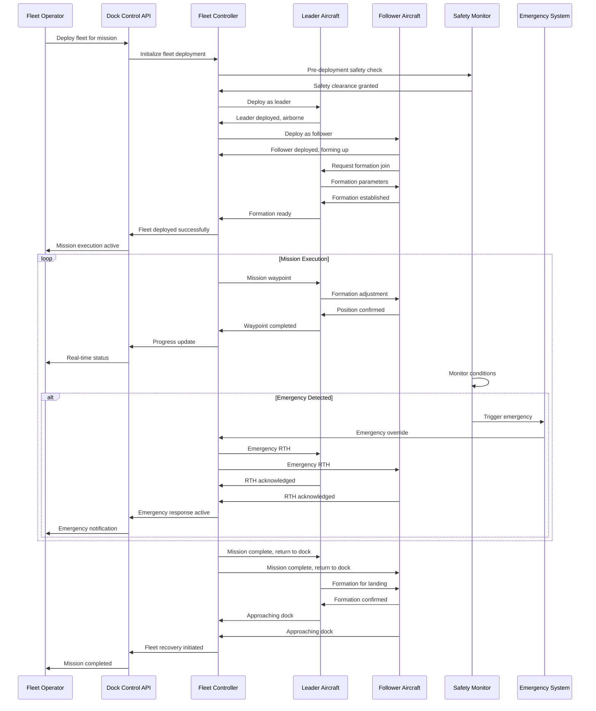

# Live Flight Controls / Remote Control (Dock)

## Overview

The dock-based live flight controls system provides comprehensive remote control capabilities for aircraft operating from dock stations. This system enables centralized fleet control, automated mission execution, emergency response coordination, and advanced multi-aircraft operations with enhanced safety and monitoring features specific to dock-based operations.

## Supported Control Modes

| Control Mode | Aircraft Count | Range | Automation Level | Use Cases |
|-------------|----------------|-------|------------------|-----------|
| Direct Control | 1 aircraft | Unlimited* | Manual | Emergency response, precise operations |
| Mission Control | 1-4 aircraft | Unlimited* | Semi-automatic | Survey missions, inspections |
| Fleet Control | Up to 10 aircraft | Unlimited* | Fully automatic | Large area operations |
| Emergency Override | All available | Unlimited* | Manual override | Safety responses, abort missions |
| Coordinated Swarm | 2-6 aircraft | 10km radius | AI-assisted | Complex area coverage |

*Range limited by network connectivity and regulatory requirements

## Architecture Overview

```mermaid
graph TB
    subgraph "Dock Control Center"
        FleetController["Fleet Controller"]
        MissionOrchestrator["Mission Orchestrator"]
        SafetyMonitor["Safety Monitor"]
        CollisionAvoidance["Collision Avoidance"]
        EmergencySystem["Emergency System"]
    end
    
    subgraph "Aircraft Fleet"
        Aircraft1["Aircraft 1<br/>M30T - Leader"]
        Aircraft2["Aircraft 2<br/>M30 - Follower"]
        Aircraft3["Aircraft 3<br/>M3E - Scout"]
        Aircraft4["Aircraft 4<br/>M300 - Survey"]
    end
    
    subgraph "Control Infrastructure"
        RTKBase["RTK Base Station"]
        WeatherStation["Weather Station"]
        AirspaceMonitor["Airspace Monitor"]
        CommRelay["Communication Relay"]
    end
    
    subgraph "External Systems"
        ATC["Air Traffic Control"]
        Emergency["Emergency Services"]
        WeatherAPI["Weather Services"]
        NOTAMService["NOTAM Service"]
    end
    
    subgraph "Operator Interface"
        ControlPanel["Control Panel"]
        FlightDisplay["Flight Display"]
        MissionPlanner["Mission Planner"]
        AlertDashboard["Alert Dashboard"]
    end
    
    FleetController --> MissionOrchestrator
    FleetController --> SafetyMonitor
    FleetController --> CollisionAvoidance
    FleetController --> EmergencySystem
    
    MissionOrchestrator --> Aircraft1
    MissionOrchestrator --> Aircraft2
    MissionOrchestrator --> Aircraft3
    MissionOrchestrator --> Aircraft4
    
    SafetyMonitor --> RTKBase
    SafetyMonitor --> WeatherStation
    SafetyMonitor --> AirspaceMonitor
    FleetController --> CommRelay
    
    SafetyMonitor --> ATC
    EmergencySystem --> Emergency
    SafetyMonitor --> WeatherAPI
    AirspaceMonitor --> NOTAMService
    
    FleetController --> ControlPanel
    MissionOrchestrator --> FlightDisplay
    MissionOrchestrator --> MissionPlanner
    SafetyMonitor --> AlertDashboard
```



## MQTT Topic Structure

### Fleet Control Topics
```
# Dock Fleet Management
thing/product/{dock_sn}/services
├── fleet_control
│   ├── deploy_aircraft          # Deploy aircraft from dock
│   ├── recall_aircraft          # Recall aircraft to dock
│   ├── execute_formation        # Execute formation flight
│   ├── coordinate_missions      # Coordinate multi-aircraft missions
│   └── emergency_override       # Emergency control override

# Individual Aircraft Control
thing/product/{dock_sn}/aircraft/{aircraft_sn}/services
├── remote_takeoff              # Remote takeoff control
├── remote_landing              # Remote landing control
├── flight_path_control         # Real-time path control
├── gimbal_remote_control       # Remote gimbal control
├── payload_control             # Payload operation control
└── emergency_procedures        # Emergency procedures

# Flight Status Topics
thing/product/{dock_sn}/state
├── fleet_status                # Overall fleet status
├── active_missions            # Currently active missions
├── airspace_status           # Local airspace conditions
├── formation_status          # Formation flight status
└── safety_status             # Safety system status

# Flight Control Events
thing/product/{dock_sn}/events
├── aircraft_deployed         # Aircraft deployment event
├── formation_established     # Formation flight established
├── mission_coordination      # Mission coordination events
├── collision_avoidance       # Collision avoidance events
├── emergency_activated       # Emergency procedures activated
└── aircraft_recovered        # Aircraft recovery events
```

## API Endpoints

### Deploy Aircraft Fleet
```http
POST /api/v1/dock/{dock_sn}/fleet/deploy
Content-Type: application/json
Authorization: Bearer {operator_token}

{
  "deployment_plan": {
    "deployment_id": "deployment_001",
    "mission_type": "coordinated_survey",
    "aircraft_assignments": [
      {
        "aircraft_sn": "M30T_001_XYZ789",
        "role": "leader",
        "deployment_order": 1,
        "mission_section": "north_area",
        "altitude": 80,
        "speed": 10,
        "payload_config": "survey_standard"
      },
      {
        "aircraft_sn": "M30_002_XYZ790",
        "role": "follower",
        "deployment_order": 2,
        "mission_section": "south_area", 
        "altitude": 85,
        "speed": 10,
        "formation_offset": {"x": 200, "y": 0, "z": 5}
      }
    ]
  },
  "coordination_rules": {
    "maintain_formation": true,
    "separation_distance": 150,
    "altitude_separation": 10,
    "communication_interval": 5,
    "leader_aircraft": "M30T_001_XYZ789"
  },
  "safety_parameters": {
    "max_wind_speed": 12,
    "min_visibility": 1000,
    "emergency_landing_sites": ["site_alpha", "site_beta"],
    "abort_conditions": ["weather_degradation", "equipment_failure"],
    "max_flight_duration": 30
  },
  "mission_parameters": {
    "area_of_interest": {
      "type": "polygon",
      "coordinates": [...]
    },
    "overlap_percentage": 75,
    "ground_resolution": "2cm/pixel",
    "flight_pattern": "grid",
    "coordination_required": true
  }
}

Response:
{
  "deployment_id": "deployment_001",
  "status": "initiated",
  "aircraft_count": 2,
  "estimated_deployment_time": 180,
  "formation_established": false,
  "leader_aircraft": "M30T_001_XYZ789",
  "deployment_sequence": [
    {
      "aircraft_sn": "M30T_001_XYZ789",
      "status": "preparing",
      "estimated_takeoff": "2024-01-20T10:35:00Z"
    },
    {
      "aircraft_sn": "M30_002_XYZ790",
      "status": "waiting",
      "estimated_takeoff": "2024-01-20T10:37:00Z"
    }
  ],
  "monitoring_urls": {
    "fleet_status": "/api/v1/dock/DOCK_001_ABC123/fleet/deployment_001/status",
    "live_tracking": "wss://tracking.dji.com/fleet/deployment_001"
  }
}
```

### Real-time Flight Control
```http
POST /api/v1/dock/{dock_sn}/aircraft/{aircraft_sn}/control/command
Content-Type: application/json
Authorization: Bearer {pilot_token}

{
  "control_session_id": "ctrl_session_001",
  "command_type": "flight_vector",
  "command_data": {
    "velocity": {
      "vx": 5.0,
      "vy": 2.5,
      "vz": 1.0,
      "vyaw": 0.3
    },
    "coordinate_system": "ned",
    "duration": 5.0,
    "precision_mode": true
  },
  "safety_overrides": {
    "max_altitude": 100,
    "geofence_enabled": true,
    "obstacle_avoidance": true,
    "emergency_stop_enabled": true
  },
  "confirmation_required": false
}

Response:
{
  "command_id": "cmd_flight_001",
  "status": "executed",
  "execution_time": 0.15,
  "aircraft_response": {
    "current_position": {
      "latitude": 40.123456,
      "longitude": 116.123456,
      "altitude": 87.5,
      "heading": 45.2
    },
    "velocity": {
      "ground_speed": 5.5,
      "vertical_speed": 1.0,
      "heading_rate": 0.3
    },
    "system_status": {
      "flight_mode": "manual_control",
      "battery_remaining": 78,
      "signal_quality": 95,
      "gps_satellites": 18
    }
  }
}
```

### Emergency Fleet Override
```http
POST /api/v1/dock/{dock_sn}/fleet/emergency
Content-Type: application/json
Authorization: Bearer {emergency_token}

{
  "emergency_type": "weather_deterioration",
  "affected_aircraft": ["M30T_001_XYZ789", "M30_002_XYZ790"],
  "override_command": "immediate_rth",
  "emergency_parameters": {
    "return_altitude": 100,
    "return_speed": 15,
    "landing_mode": "dock_landing",
    "abort_current_missions": true
  },
  "operator_info": {
    "operator_id": "pilot_001",
    "authorization_level": "emergency",
    "justification": "Severe weather approaching area"
  }
}

Response:
{
  "emergency_id": "emergency_001",
  "status": "activated",
  "aircraft_responses": [
    {
      "aircraft_sn": "M30T_001_XYZ789",
      "response": "rth_initiated",
      "estimated_return_time": 420,
      "current_distance": 2.3
    },
    {
      "aircraft_sn": "M30_002_XYZ790", 
      "response": "rth_initiated",
      "estimated_return_time": 380,
      "current_distance": 1.8
    }
  ],
  "dock_preparation": {
    "status": "preparing_for_recovery",
    "available_bays": 2,
    "weather_protection": "activated"
  }
}
```

## Message Schemas

### Fleet Deployment Command
```json
{
  "tid": "fleet_deploy_001",
  "bid": "12345678-1234-1234-1234-123456789012",
  "timestamp": 1640995200000,
  "method": "deploy_fleet",
  "data": {
    "deployment_id": "deployment_001",
    "dock_sn": "DOCK_001_ABC123",
    "deployment_plan": {
      "mission_type": "coordinated_survey",
      "aircraft_count": 2,
      "leader_aircraft": "M30T_001_XYZ789",
      "formation_type": "line_abreast",
      "deployment_sequence": [
        {
          "aircraft_sn": "M30T_001_XYZ789",
          "takeoff_order": 1,
          "initial_position": {
            "altitude": 80,
            "heading": 90,
            "speed": 10
          },
          "mission_assignment": "grid_survey_north"
        },
        {
          "aircraft_sn": "M30_002_XYZ790",
          "takeoff_order": 2,
          "initial_position": {
            "altitude": 85,
            "heading": 90,
            "speed": 10
          },
          "formation_offset": {"x": 200, "y": 0, "z": 5},
          "mission_assignment": "grid_survey_south"
        }
      ]
    },
    "coordination_parameters": {
      "formation_maintenance": true,
      "inter_aircraft_communication": true,
      "collision_avoidance": "advanced",
      "formation_leader_priority": true,
      "dynamic_repositioning": true
    },
    "safety_configuration": {
      "geofence_boundaries": [...],
      "emergency_landing_sites": [...],
      "weather_limits": {
        "max_wind": 12,
        "min_visibility": 1000,
        "max_precipitation": 2
      },
      "abort_conditions": [
        "leader_aircraft_failure",
        "communication_loss_30s",
        "weather_below_limits"
      ]
    }
  }
}
```

### Real-time Formation Status
```json
{
  "tid": "formation_status_001",
  "bid": "12345678-1234-1234-1234-123456789012",
  "timestamp": 1640995200000,
  "method": "formation_status_update",
  "data": {
    "deployment_id": "deployment_001",
    "dock_sn": "DOCK_001_ABC123",
    "formation_status": "established",
    "aircraft_positions": [
      {
        "aircraft_sn": "M30T_001_XYZ789",
        "role": "leader",
        "position": {
          "latitude": 40.123456,
          "longitude": 116.123456,
          "altitude": 80.2,
          "heading": 90.5
        },
        "velocity": {
          "ground_speed": 10.2,
          "vertical_speed": 0.1,
          "heading_rate": 0.2
        },
        "status": "nominal",
        "battery_remaining": 76
      },
      {
        "aircraft_sn": "M30_002_XYZ790",
        "role": "follower",
        "position": {
          "latitude": 40.123456,
          "longitude": 116.121856,
          "altitude": 85.1,
          "heading": 90.3
        },
        "formation_error": {
          "lateral_error": 2.3,
          "longitudinal_error": 1.8,
          "vertical_error": 0.9,
          "within_tolerance": true
        },
        "status": "following",
        "battery_remaining": 78
      }
    ],
    "formation_metrics": {
      "formation_integrity": 98.5,
      "average_separation": 200.5,
      "relative_position_accuracy": 1.2,
      "communication_quality": 95,
      "coordination_delay": 0.8
    },
    "mission_progress": {
      "overall_completion": 23.5,
      "area_covered": 156.7,
      "estimated_remaining_time": 1420,
      "data_collected": "145MB",
      "waypoints_completed": 89
    }
  }
}
```

### Emergency Override Response
```json
{
  "tid": "emergency_override_001",
  "bid": "12345678-1234-1234-1234-123456789012",
  "timestamp": 1640995200000,
  "method": "emergency_override_response",
  "data": {
    "emergency_id": "emergency_001",
    "dock_sn": "DOCK_001_ABC123",
    "emergency_type": "weather_deterioration",
    "response_status": "all_aircraft_responding",
    "aircraft_responses": [
      {
        "aircraft_sn": "M30T_001_XYZ789",
        "response_action": "immediate_rth",
        "response_time": 0.5,
        "current_status": "returning",
        "estimated_arrival": "2024-01-20T10:47:00Z",
        "return_route": {
          "direct_line": true,
          "distance_remaining": 2.1,
          "altitude": 100,
          "ground_speed": 15.2
        },
        "system_health": {
          "all_systems_nominal": true,
          "battery_sufficient": true,
          "communication_stable": true
        }
      },
      {
        "aircraft_sn": "M30_002_XYZ790",
        "response_action": "immediate_rth",
        "response_time": 0.7,
        "current_status": "returning",
        "estimated_arrival": "2024-01-20T10:44:00Z",
        "return_route": {
          "direct_line": true,
          "distance_remaining": 1.7,
          "altitude": 105,
          "ground_speed": 15.8
        },
        "system_health": {
          "all_systems_nominal": true,
          "battery_sufficient": true,
          "communication_stable": true
        }
      }
    ],
    "dock_preparation": {
      "recovery_mode": "active",
      "available_landing_bays": 2,
      "weather_protection": "deployed",
      "recovery_sequence": ["M30_002_XYZ790", "M30T_001_XYZ789"],
      "estimated_recovery_completion": "2024-01-20T10:50:00Z"
    },
    "safety_measures": {
      "airspace_cleared": true,
      "emergency_services_notified": false,
      "backup_landing_sites_activated": true,
      "collision_avoidance": "maximum_sensitivity"
    }
  }
}
```

## Flight Control Flow



## Code Example

```java
@Service
@Slf4j
public class DockFlightControlService extends AbstractDeviceService {
    
    @Autowired
    private FleetCoordinationService fleetCoordinator;
    
    @Autowired
    private MissionOrchestrationService missionOrchestrator;
    
    @Autowired
    private SafetyMonitoringService safetyMonitor;
    
    @Autowired
    private CollisionAvoidanceService collisionAvoidance;
    
    @Autowired
    private EmergencyResponseService emergencyResponse;
    
    private final Map<String, ActiveFleetDeployment> activeDeployments = new ConcurrentHashMap<>();
    
    /**
     * Deploy aircraft fleet for coordinated mission
     */
    @PreAuthorize("hasRole('FLEET_OPERATOR')")
    public FleetDeploymentResult deployFleet(String dockSn, FleetDeploymentRequest request) {
        
        log.info("Deploying fleet for dock: {}, deployment: {}", 
                dockSn, request.getDeploymentId());
        
        try {
            // Validate deployment request
            DeploymentValidationResult validation = validateDeploymentRequest(dockSn, request);
            if (!validation.isValid()) {
                throw new InvalidDeploymentException("Fleet deployment validation failed", 
                        validation.getErrors());
            }
            
            // Pre-deployment safety checks
            SafetyCheckResult safetyCheck = safetyMonitor.performPreDeploymentCheck(
                dockSn, request.getDeploymentPlan());
            
            if (!safetyCheck.isPassed()) {
                throw new SafetyCheckFailedException("Pre-deployment safety check failed", 
                        safetyCheck.getIssues());
            }
            
            // Create deployment session
            ActiveFleetDeployment deployment = ActiveFleetDeployment.builder()
                    .deploymentId(request.getDeploymentId())
                    .dockSn(dockSn)
                    .deploymentPlan(request.getDeploymentPlan())
                    .coordinationRules(request.getCoordinationRules())
                    .safetyParameters(request.getSafetyParameters())
                    .missionParameters(request.getMissionParameters())
                    .startTime(Instant.now())
                    .status(DeploymentStatus.INITIALIZING)
                    .build();
            
            activeDeployments.put(request.getDeploymentId(), deployment);
            
            // Initialize fleet coordination
            fleetCoordinator.initializeFleetCoordination(deployment);
            
            // Start deployment sequence
            startDeploymentSequence(deployment);
            
            log.info("Fleet deployment initiated: {}", request.getDeploymentId());
            
            return FleetDeploymentResult.builder()
                    .deploymentId(request.getDeploymentId())
                    .status("initiated")
                    .aircraftCount(request.getDeploymentPlan().getAircraftAssignments().size())
                    .estimatedDeploymentTime(calculateDeploymentTime(request.getDeploymentPlan()))
                    .formationEstablished(false)
                    .leaderAircraft(request.getCoordinationRules().getLeaderAircraft())
                    .deploymentSequence(buildDeploymentSequence(request.getDeploymentPlan()))
                    .monitoringUrls(buildMonitoringUrls(dockSn, request.getDeploymentId()))
                    .build();
            
        } catch (Exception e) {
            log.error("Failed to deploy fleet: {}", request.getDeploymentId(), e);
            return FleetDeploymentResult.failure(e.getMessage());
        }
    }
    
    /**
     * Start sequential aircraft deployment
     */
    private void startDeploymentSequence(ActiveFleetDeployment deployment) {
        
        CompletableFuture.runAsync(() -> {
            try {
                deployment.setStatus(DeploymentStatus.DEPLOYING);
                
                // Sort aircraft by deployment order
                List<AircraftAssignment> sortedAssignments = deployment.getDeploymentPlan()
                        .getAircraftAssignments()
                        .stream()
                        .sorted(Comparator.comparing(AircraftAssignment::getDeploymentOrder))
                        .collect(Collectors.toList());
                
                String leaderAircraft = deployment.getCoordinationRules().getLeaderAircraft();
                
                for (AircraftAssignment assignment : sortedAssignments) {
                    
                    // Deploy aircraft
                    AircraftDeploymentResult result = deployAircraft(deployment, assignment);
                    
                    if (!result.isSuccess()) {
                        handleDeploymentFailure(deployment, assignment, result);
                        return;
                    }
                    
                    // Wait for aircraft to reach formation position
                    if (!assignment.getAircraftSn().equals(leaderAircraft)) {
                        waitForFormationJoin(deployment, assignment);
                    }
                    
                    // Update deployment progress
                    updateDeploymentProgress(deployment, assignment);
                }
                
                // Establish formation coordination
                establishFormationCoordination(deployment);
                
                // Start mission execution
                startCoordinatedMission(deployment);
                
            } catch (Exception e) {
                log.error("Error in deployment sequence: {}", deployment.getDeploymentId(), e);
                handleDeploymentException(deployment, e);
            }
        });
    }
    
    /**
     * Deploy individual aircraft
     */
    private AircraftDeploymentResult deployAircraft(ActiveFleetDeployment deployment, 
                                                   AircraftAssignment assignment) {
        
        String aircraftSn = assignment.getAircraftSn();
        log.info("Deploying aircraft: {} for deployment: {}", 
                aircraftSn, deployment.getDeploymentId());
        
        try {
            // Build deployment command
            AircraftDeploymentCommand command = AircraftDeploymentCommand.builder()
                    .deploymentId(deployment.getDeploymentId())
                    .aircraftSn(aircraftSn)
                    .role(assignment.getRole())
                    .initialPosition(assignment.getInitialPosition())
                    .missionAssignment(assignment.getMissionAssignment())
                    .coordinationRules(deployment.getCoordinationRules())
                    .safetyParameters(deployment.getSafetyParameters())
                    .build();
            
            // Send deployment command to aircraft
            CommonTopicResponse mqttCommand = buildDeploymentMQTTCommand(command);
            String topic = TopicConst.THING_MODEL_PRE + aircraftSn + TopicConst.SERVICES_SUF;
            
            CompletableFuture<AircraftDeploymentResponse> responseFuture = new CompletableFuture<>();
            
            publishWithReply(topic, mqttCommand, (reply, isSuccess) -> {
                handleAircraftDeploymentResponse(command, reply, isSuccess, responseFuture);
            });
            
            // Wait for deployment confirmation
            AircraftDeploymentResponse response = responseFuture.get(60, TimeUnit.SECONDS);
            
            if (response.isSuccess()) {
                log.info("Aircraft deployed successfully: {}", aircraftSn);
                return AircraftDeploymentResult.success(aircraftSn);
            } else {
                throw new AircraftDeploymentException("Aircraft deployment failed", response.getError());
            }
            
        } catch (Exception e) {
            log.error("Failed to deploy aircraft: {}", aircraftSn, e);
            return AircraftDeploymentResult.failure(aircraftSn, e.getMessage());
        }
    }
    
    /**
     * Execute real-time flight control command
     */
    @PreAuthorize("hasRole('PILOT') or hasRole('FLEET_OPERATOR')")
    public FlightControlResult executeFlightCommand(String dockSn, String aircraftSn, 
                                                   FlightControlRequest request) {
        
        log.debug("Executing flight command: {} for aircraft: {}", 
                request.getCommandType(), aircraftSn);
        
        try {
            // Validate control session
            if (!isValidControlSession(request.getControlSessionId())) {
                throw new InvalidControlSessionException("Invalid or expired control session");
            }
            
            // Safety validation
            SafetyValidationResult safetyValidation = safetyMonitor.validateFlightCommand(
                aircraftSn, request);
            
            if (!safetyValidation.isValid()) {
                throw new UnsafeCommandException("Flight command failed safety validation", 
                        safetyValidation.getIssues());
            }
            
            // Check for formation constraints
            if (isPartOfActiveFormation(aircraftSn)) {
                FormationConstraintResult constraints = checkFormationConstraints(
                    aircraftSn, request);
                
                if (!constraints.isAllowed()) {
                    throw new FormationConstraintException("Command violates formation constraints");
                }
            }
            
            // Build flight control command
            FlightControlCommand command = FlightControlCommand.builder()
                    .commandId(UUID.randomUUID().toString())
                    .sessionId(request.getControlSessionId())
                    .commandType(request.getCommandType())
                    .commandData(request.getCommandData())
                    .safetyOverrides(request.getSafetyOverrides())
                    .timestamp(Instant.now())
                    .build();
            
            // Execute command
            FlightControlExecutionResult result = executeFlightControlCommand(
                aircraftSn, command);
            
            // Log command execution
            logFlightControlExecution(aircraftSn, command, result);
            
            // Update formation if necessary
            if (isPartOfActiveFormation(aircraftSn)) {
                updateFormationAfterCommand(aircraftSn, command, result);
            }
            
            return FlightControlResult.builder()
                    .commandId(command.getCommandId())
                    .status("executed")
                    .executionTime(result.getExecutionTime())
                    .aircraftResponse(result.getAircraftResponse())
                    .build();
            
        } catch (Exception e) {
            log.error("Failed to execute flight command for aircraft: {}", aircraftSn, e);
            return FlightControlResult.failure(e.getMessage());
        }
    }
    
    /**
     * Handle emergency override for entire fleet
     */
    @PreAuthorize("hasRole('EMERGENCY_OPERATOR')")
    public EmergencyOverrideResult handleEmergencyOverride(String dockSn, 
                                                         EmergencyOverrideRequest request) {
        
        log.warn("Emergency override activated for dock: {}, type: {}", 
                dockSn, request.getEmergencyType());
        
        try {
            // Validate emergency authorization
            if (!emergencyResponse.validateEmergencyAuthorization(request.getOperatorInfo())) {
                throw new UnauthorizedEmergencyException("Insufficient emergency authorization");
            }
            
            // Create emergency session
            EmergencySession emergencySession = EmergencySession.builder()
                    .emergencyId(UUID.randomUUID().toString())
                    .dockSn(dockSn)
                    .emergencyType(request.getEmergencyType())
                    .affectedAircraft(request.getAffectedAircraft())
                    .overrideCommand(request.getOverrideCommand())
                    .emergencyParameters(request.getEmergencyParameters())
                    .operatorInfo(request.getOperatorInfo())
                    .startTime(Instant.now())
                    .build();
            
            // Execute emergency procedures
            List<AircraftEmergencyResponse> responses = new ArrayList<>();
            
            for (String aircraftSn : request.getAffectedAircraft()) {
                
                AircraftEmergencyResponse response = executeEmergencyProcedure(
                    aircraftSn, emergencySession);
                
                responses.add(response);
            }
            
            // Prepare dock for aircraft recovery
            DockRecoveryPreparation dockPrep = prepareDockForRecovery(dockSn, emergencySession);
            
            // Log emergency activation
            emergencyResponse.logEmergencyActivation(emergencySession);
            
            // Notify relevant parties
            notifyEmergencyActivation(emergencySession);
            
            log.warn("Emergency override executed successfully: {}", emergencySession.getEmergencyId());
            
            return EmergencyOverrideResult.builder()
                    .emergencyId(emergencySession.getEmergencyId())
                    .status("activated")
                    .aircraftResponses(responses)
                    .dockPreparation(dockPrep)
                    .build();
            
        } catch (Exception e) {
            log.error("Failed to execute emergency override for dock: {}", dockSn, e);
            return EmergencyOverrideResult.failure(e.getMessage());
        }
    }
    
    /**
     * Monitor formation integrity and coordination
     */
    @Scheduled(fixedRate = 1000) // Check every second
    public void monitorFormationIntegrity() {
        
        for (ActiveFleetDeployment deployment : activeDeployments.values()) {
            
            if (deployment.getStatus() != DeploymentStatus.MISSION_ACTIVE) {
                continue;
            }
            
            try {
                // Get current aircraft positions
                Map<String, AircraftPosition> positions = getCurrentAircraftPositions(deployment);
                
                // Calculate formation metrics
                FormationMetrics metrics = calculateFormationMetrics(deployment, positions);
                
                // Check formation integrity
                FormationIntegrityResult integrity = checkFormationIntegrity(deployment, metrics);
                
                if (!integrity.isIntact()) {
                    handleFormationDegradation(deployment, integrity);
                }
                
                // Update formation status
                updateFormationStatus(deployment, metrics);
                
                // Check for collision risks
                CollisionRiskAssessment riskAssessment = collisionAvoidance.assessRisks(positions);
                
                if (riskAssessment.hasHighRisk()) {
                    handleCollisionRisk(deployment, riskAssessment);
                }
                
            } catch (Exception e) {
                log.error("Error monitoring formation integrity for deployment: {}", 
                        deployment.getDeploymentId(), e);
            }
        }
    }
    
    /**
     * Handle formation degradation
     */
    private void handleFormationDegradation(ActiveFleetDeployment deployment, 
                                           FormationIntegrityResult integrity) {
        
        log.warn("Formation degradation detected for deployment: {}, issues: {}", 
                deployment.getDeploymentId(), integrity.getIssues());
        
        // Determine corrective action
        FormationCorrectionAction action = determineFormationCorrection(deployment, integrity);
        
        switch (action.getType()) {
            case MINOR_ADJUSTMENT:
                executeMinorFormationAdjustment(deployment, action);
                break;
                
            case MAJOR_REFORMATION:
                executeFormationReformation(deployment, action);
                break;
                
            case EMERGENCY_SEPARATION:
                executeEmergencySeparation(deployment, action);
                break;
                
            case ABORT_FORMATION:
                abortFormation(deployment, action.getReason());
                break;
        }
    }
    
    /**
     * Get fleet deployment status
     */
    public FleetStatusResult getFleetStatus(String dockSn, String deploymentId) {
        
        ActiveFleetDeployment deployment = activeDeployments.get(deploymentId);
        if (deployment == null) {
            throw new DeploymentNotFoundException("Deployment not found: " + deploymentId);
        }
        
        // Get current aircraft positions and status
        Map<String, AircraftStatus> aircraftStatuses = getCurrentAircraftStatuses(deployment);
        
        // Get formation metrics
        FormationMetrics formationMetrics = getCurrentFormationMetrics(deployment);
        
        // Get mission progress
        MissionProgress missionProgress = getMissionProgress(deployment);
        
        return FleetStatusResult.builder()
                .deploymentId(deploymentId)
                .status(deployment.getStatus().name())
                .aircraftCount(deployment.getDeploymentPlan().getAircraftAssignments().size())
                .formationStatus(formationMetrics.getFormationIntegrity() > 95 ? "established" : "degraded")
                .aircraftPositions(buildAircraftPositions(aircraftStatuses))
                .formationMetrics(formationMetrics)
                .missionProgress(missionProgress)
                .lastUpdate(Instant.now())
                .build();
    }
}

/**
 * Active fleet deployment session
 */
@Data
@Builder
public class ActiveFleetDeployment {
    private String deploymentId;
    private String dockSn;
    private DeploymentPlan deploymentPlan;
    private CoordinationRules coordinationRules;
    private SafetyParameters safetyParameters;
    private MissionParameters missionParameters;
    private Instant startTime;
    private Instant endTime;
    private DeploymentStatus status;
    private FormationMetrics latestFormationMetrics;
    private List<String> deployedAircraft;
    private Map<String, AircraftStatus> aircraftStatuses;
    
    public boolean isFormationEstablished() {
        return status == DeploymentStatus.FORMATION_ESTABLISHED || 
               status == DeploymentStatus.MISSION_ACTIVE;
    }
    
    public void addDeployedAircraft(String aircraftSn) {
        if (deployedAircraft == null) {
            deployedAircraft = new ArrayList<>();
        }
        deployedAircraft.add(aircraftSn);
    }
}
```

## Advanced Coordination Features

### Formation Flight Control
- Autonomous formation maintenance algorithms
- Dynamic formation reconfiguration
- Leader-follower coordination protocols
- Collision avoidance within formations

### Multi-Mission Coordination
- Parallel mission execution
- Resource allocation optimization
- Dynamic task reassignment
- Mission priority management

### Safety and Emergency Systems
- Real-time safety monitoring
- Automated emergency response
- Multi-level backup procedures
- Regulatory compliance integration