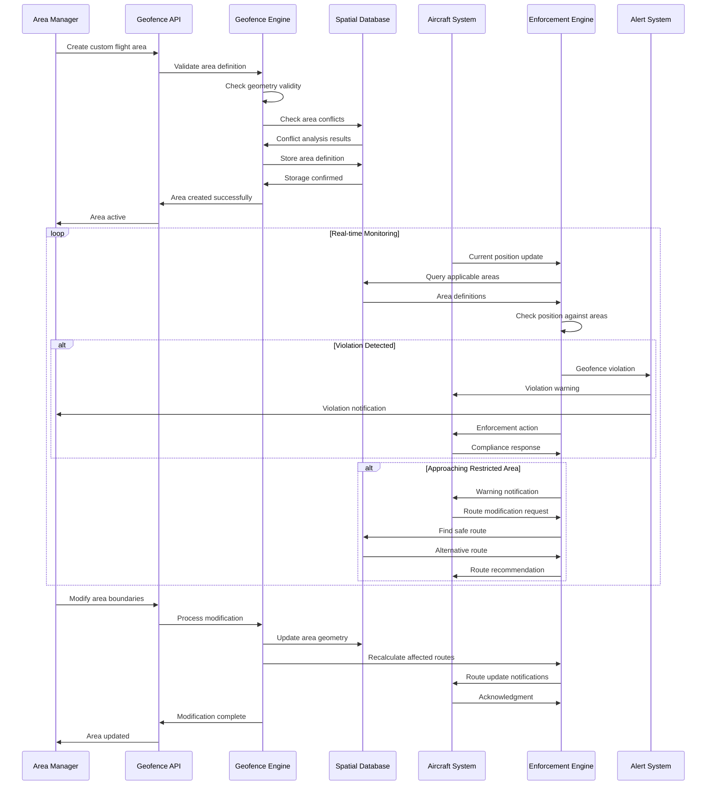

# Custom Flight Area (Dock)

## Overview

The dock custom flight area system provides comprehensive geofencing and airspace management capabilities for dock-based operations. This system enables dynamic creation, modification, and enforcement of custom flight areas with support for complex geometries, altitude restrictions, temporal constraints, and regulatory compliance.

## Supported Area Types

| Area Type | Geometry | Altitude Control | Time Constraints | Enforcement | Use Cases |
|-----------|----------|------------------|------------------|-------------|-----------|
| No-Fly Zone | Polygon/Circle | Min/Max altitude | Permanent/Scheduled | Hard block | Safety zones, restricted areas |
| Restricted Zone | Complex polygon | Variable altitude | Time-based | Warning + block | Temporary restrictions |
| Operational Zone | Multi-polygon | Layered altitude | Dynamic | Guidance | Mission corridors |
| Emergency Zone | Circle/Polygon | All altitudes | Immediate | Immediate block | Emergency response |
| Regulatory Zone | Polygon | Regulatory limits | Permanent | Compliance check | Airport zones, military |
| Custom Zone | Any geometry | Configurable | Flexible | Configurable | Customer-specific needs |

## Architecture Overview

```mermaid
graph TB
    subgraph "Geofencing System"
        GeofenceManager["Geofence Manager"]
        AreaDefinitionEngine["Area Definition Engine"]
        EnforcementEngine["Enforcement Engine"]
        ComplianceChecker["Compliance Checker"]
        TemporalManager["Temporal Manager"]
    end
    
    subgraph "Area Storage"
        GeospatialDB["Geospatial Database"]
        AreaRegistry["Area Registry"]
        RegulatoryDB["Regulatory Database"]
        TemporaryAreas["Temporary Areas"]
    end
    
    subgraph "External Data Sources"
        NOTAMService["NOTAM Service"]
        WeatherRestrictions["Weather Restrictions"]
        AirTrafficControl["Air Traffic Control"]
        RegulatoryAPI["Regulatory APIs"]
        EmergencyServices["Emergency Services"]
    end
    
    subgraph "Enforcement Points"
        PreFlightCheck["Pre-flight Check"]
        RealTimeMonitor["Real-time Monitor"]
        MissionValidator["Mission Validator"]
        RouteOptimizer["Route Optimizer"]
    end
    
    subgraph "Aircraft Fleet"
        Aircraft1["Aircraft 1"]
        Aircraft2["Aircraft 2"]
        Aircraft3["Aircraft 3"]
        Aircraft4["Aircraft 4"]
    end
    
    GeofenceManager --> AreaDefinitionEngine
    GeofenceManager --> EnforcementEngine
    GeofenceManager --> ComplianceChecker
    GeofenceManager --> TemporalManager
    
    AreaDefinitionEngine --> GeospatialDB
    AreaRegistry --> RegulatoryDB
    TemporalManager --> TemporaryAreas
    
    ComplianceChecker --> NOTAMService
    AreaDefinitionEngine --> WeatherRestrictions
    EnforcementEngine --> AirTrafficControl
    ComplianceChecker --> RegulatoryAPI
    TemporalManager --> EmergencyServices
    
    EnforcementEngine --> PreFlightCheck
    EnforcementEngine --> RealTimeMonitor
    EnforcementEngine --> MissionValidator
    EnforcementEngine --> RouteOptimizer
    
    PreFlightCheck --> Aircraft1
    RealTimeMonitor --> Aircraft2
    MissionValidator --> Aircraft3
    RouteOptimizer --> Aircraft4
```



## MQTT Topic Structure

### Geofence Management Topics
```
# Dock Geofence Control
thing/product/{dock_sn}/services
├── geofence_management
│   ├── create_flight_area        # Create custom flight area
│   ├── modify_flight_area        # Modify existing area
│   ├── delete_flight_area        # Delete flight area
│   ├── activate_emergency_area   # Activate emergency restriction
│   └── sync_regulatory_areas     # Sync with regulatory databases

# Area Enforcement
thing/product/{dock_sn}/geofence
├── area_definitions             # Current area definitions
├── enforcement_status          # Enforcement system status
├── violation_alerts           # Geofence violation alerts
├── compliance_status          # Regulatory compliance status
└── temporal_restrictions      # Time-based restrictions

# Aircraft Geofence Topics
thing/product/{dock_sn}/aircraft/{aircraft_sn}/geofence
├── area_assignments           # Areas assigned to aircraft
├── violation_warnings         # Real-time violation warnings
├── route_modifications        # Route modifications due to areas
├── altitude_restrictions      # Altitude-specific restrictions
└── emergency_restrictions     # Emergency area notifications

# Geofence Events
thing/product/{dock_sn}/events
├── area_created              # New flight area created
├── area_modified             # Flight area modified
├── area_violated             # Geofence violation detected
├── emergency_area_activated  # Emergency area activated
└── regulatory_update         # Regulatory area update
```

## API Endpoints

### Create Custom Flight Area
```http
POST /api/v1/dock/{dock_sn}/flight-areas
Content-Type: application/json
Authorization: Bearer {admin_token}

{
  "area_definition": {
    "area_id": "custom_area_001",
    "name": "Construction Site No-Fly Zone",
    "description": "Temporary no-fly zone around active construction",
    "area_type": "no_fly_zone",
    "priority": "high",
    "geometry": {
      "type": "polygon",
      "coordinates": [
        [
          [116.123456, 40.123456],
          [116.125456, 40.123456],
          [116.125456, 40.125456],
          [116.123456, 40.125456],
          [116.123456, 40.123456]
        ]
      ]
    },
    "altitude_restrictions": {
      "min_altitude": 0,
      "max_altitude": 150,
      "reference": "above_ground_level"
    },
    "temporal_constraints": {
      "start_time": "2024-01-20T06:00:00Z",
      "end_time": "2024-01-25T18:00:00Z",
      "recurring_pattern": {
        "type": "daily",
        "days_of_week": ["monday", "tuesday", "wednesday", "thursday", "friday"],
        "time_windows": [
          {"start": "06:00", "end": "18:00"}
        ]
      }
    }
  },
  "enforcement_rules": {
    "enforcement_type": "hard_block",
    "pre_flight_check": true,
    "real_time_monitoring": true,
    "violation_actions": [
      "immediate_alert",
      "force_landing_outside_area",
      "log_violation"
    ],
    "grace_period": 5,
    "warning_distance": 50
  },
  "affected_operations": {
    "all_aircraft": true,
    "aircraft_filter": [],
    "mission_types": ["all"],
    "operator_exemptions": ["emergency_services"]
  },
  "compliance_info": {
    "regulatory_basis": "local_authority_order",
    "reference_number": "ORDER_2024_001",
    "authority": "Local Aviation Authority",
    "compliance_level": "mandatory"
  }
}

Response:
{
  "area_id": "custom_area_001",
  "status": "created",
  "created_at": "2024-01-20T10:30:00Z",
  "effective_at": "2024-01-20T06:00:00Z",
  "expires_at": "2024-01-25T18:00:00Z",
  "area_info": {
    "area_size_sqm": 400000,
    "center_point": {
      "latitude": 40.124456,
      "longitude": 116.124456
    },
    "boundary_points": 4,
    "altitude_range": "0-150m AGL"
  },
  "enforcement_status": "active",
  "affected_aircraft_count": 4,
  "validation_result": {
    "geometry_valid": true,
    "no_conflicts": true,
    "regulatory_compliant": true,
    "warnings": []
  }
}
```

### Query Flight Areas
```http
GET /api/v1/dock/{dock_sn}/flight-areas
Authorization: Bearer {operator_token}
Query Parameters:
- area_type: no_fly_zone,restricted_zone,operational_zone
- status: active,inactive,pending
- location: 40.123456,116.123456
- radius: 5000
- altitude: 100
- time: 2024-01-20T10:30:00Z

Response:
{
  "total_areas": 15,
  "active_areas": 12,
  "areas": [
    {
      "area_id": "custom_area_001",
      "name": "Construction Site No-Fly Zone",
      "area_type": "no_fly_zone",
      "status": "active",
      "priority": "high",
      "geometry_summary": {
        "type": "polygon",
        "area_sqm": 400000,
        "center": {"lat": 40.124456, "lng": 116.124456},
        "bounding_box": {
          "min_lat": 40.123456,
          "max_lat": 40.125456,
          "min_lng": 116.123456,
          "max_lng": 116.125456
        }
      },
      "altitude_restrictions": {
        "min_altitude": 0,
        "max_altitude": 150,
        "reference": "above_ground_level"
      },
      "temporal_status": {
        "currently_active": true,
        "next_activation": null,
        "next_deactivation": "2024-01-20T18:00:00Z"
      },
      "enforcement": {
        "type": "hard_block",
        "violations_today": 0,
        "affected_missions": 3
      }
    }
  ],
  "summary": {
    "coverage_area_sqm": 2500000,
    "altitude_layers": 3,
    "temporal_restrictions": 8,
    "regulatory_areas": 5,
    "custom_areas": 10
  }
}
```

### Real-time Geofence Check
```http
POST /api/v1/dock/{dock_sn}/flight-areas/check
Content-Type: application/json
Authorization: Bearer {operator_token}

{
  "check_request": {
    "aircraft_sn": "M30T_001_XYZ789",
    "position": {
      "latitude": 40.123789,
      "longitude": 116.123987,
      "altitude": 85.5,
      "heading": 90
    },
    "planned_route": [
      {
        "latitude": 40.123789,
        "longitude": 116.123987,
        "altitude": 85.5,
        "timestamp": "2024-01-20T10:31:00Z"
      },
      {
        "latitude": 40.124789,
        "longitude": 116.124987,
        "altitude": 90.0,
        "timestamp": "2024-01-20T10:32:00Z"
      }
    ],
    "mission_type": "survey",
    "check_time": "2024-01-20T10:30:00Z"
  }
}

Response:
{
  "check_result": {
    "overall_status": "violation_detected",
    "current_position": {
      "status": "clear",
      "areas_nearby": [
        {
          "area_id": "custom_area_001",
          "distance_to_boundary": 45.2,
          "time_to_violation": 18.5,
          "severity": "warning"
        }
      ]
    },
    "planned_route": {
      "status": "violations_detected",
      "violation_points": [
        {
          "position": {
            "latitude": 40.124789,
            "longitude": 116.124987,
            "altitude": 90.0
          },
          "violated_areas": [
            {
              "area_id": "custom_area_001",
              "area_name": "Construction Site No-Fly Zone",
              "violation_type": "boundary_breach",
              "penetration_distance": 25.8,
              "enforcement": "hard_block"
            }
          ],
          "timestamp": "2024-01-20T10:32:00Z"
        }
      ]
    },
    "recommendations": [
      {
        "action": "modify_route",
        "description": "Reroute to avoid construction site no-fly zone",
        "alternative_waypoints": [
          {"lat": 40.124789, "lng": 116.122987, "alt": 90.0},
          {"lat": 40.124789, "lng": 116.124987, "alt": 90.0}
        ],
        "additional_distance": 150.5,
        "additional_time": 45
      }
    ]
  }
}
```

## Message Schemas

### Flight Area Creation
```json
{
  "tid": "area_create_001",
  "bid": "12345678-1234-1234-1234-123456789012",
  "timestamp": 1640995200000,
  "method": "create_flight_area",
  "data": {
    "area_id": "emergency_area_001",
    "dock_sn": "DOCK_001_ABC123",
    "area_definition": {
      "name": "Emergency Response Zone",
      "description": "Temporary emergency response area - helicopter landing",
      "area_type": "emergency_zone",
      "priority": "critical",
      "geometry": {
        "type": "circle",
        "center": {"latitude": 40.123456, "longitude": 116.123456},
        "radius": 500
      },
      "altitude_restrictions": {
        "min_altitude": 0,
        "max_altitude": 300,
        "reference": "above_ground_level"
      },
      "temporal_constraints": {
        "start_time": "2024-01-20T10:30:00Z",
        "duration": 7200,
        "immediate_activation": true
      }
    },
    "enforcement_rules": {
      "enforcement_type": "immediate_block",
      "violation_actions": [
        "immediate_alert",
        "emergency_rth",
        "notify_emergency_services"
      ],
      "grace_period": 0,
      "warning_distance": 200
    },
    "creation_context": {
      "created_by": "emergency_controller_001",
      "authority": "emergency_services",
      "incident_reference": "INCIDENT_2024_001",
      "automatic_creation": false
    }
  }
}
```

### Geofence Violation Alert
```json
{
  "tid": "violation_alert_001",
  "bid": "12345678-1234-1234-1234-123456789012",
  "timestamp": 1640995200000,
  "method": "geofence_violation",
  "data": {
    "violation_id": "violation_20240120_001",
    "dock_sn": "DOCK_001_ABC123",
    "aircraft_sn": "M30T_001_XYZ789",
    "violation_details": {
      "violation_type": "boundary_breach",
      "violated_area": {
        "area_id": "custom_area_001",
        "area_name": "Construction Site No-Fly Zone",
        "area_type": "no_fly_zone",
        "enforcement_type": "hard_block"
      },
      "violation_position": {
        "latitude": 40.124789,
        "longitude": 116.124987,
        "altitude": 87.2,
        "heading": 92.5,
        "ground_speed": 8.3
      },
      "penetration_details": {
        "penetration_distance": 15.7,
        "time_in_violation": 12.5,
        "maximum_penetration": 23.4,
        "entry_point": {
          "latitude": 40.124756,
          "longitude": 116.124956,
          "timestamp": "2024-01-20T10:30:45Z"
        }
      }
    },
    "mission_context": {
      "mission_id": "survey_mission_001",
      "mission_phase": "data_collection",
      "operator": "pilot_001",
      "planned_route_deviation": true
    },
    "enforcement_actions": {
      "immediate_actions": [
        "alert_pilot",
        "log_violation",
        "initiate_rth_sequence"
      ],
      "automated_response": {
        "action": "force_exit_area",
        "exit_direction": "shortest_path",
        "target_position": {
          "latitude": 40.124612,
          "longitude": 116.124823,
          "altitude": 87.2
        },
        "estimated_exit_time": 25.8
      }
    },
    "severity_assessment": {
      "severity": "high",
      "risk_factors": [
        "construction_equipment_present",
        "personnel_on_ground",
        "no_airspace_coordination"
      ],
      "safety_impact": "immediate_danger",
      "regulatory_impact": "violation_of_authority_order"
    }
  }
}
```

### Area Modification Update
```json
{
  "tid": "area_modify_001",
  "bid": "12345678-1234-1234-1234-123456789012",
  "timestamp": 1640995200000,
  "method": "flight_area_modified",
  "data": {
    "area_id": "custom_area_001",
    "dock_sn": "DOCK_001_ABC123",
    "modification_type": "geometry_update",
    "changes": {
      "previous_geometry": {
        "type": "polygon",
        "coordinates": [...]
      },
      "new_geometry": {
        "type": "polygon", 
        "coordinates": [...]
      },
      "geometry_changes": {
        "area_increase_sqm": 50000,
        "boundary_shift_max_m": 75.2,
        "affected_boundary_percentage": 25.6
      }
    },
    "impact_assessment": {
      "newly_restricted_area": 50000,
      "newly_accessible_area": 0,
      "affected_active_missions": 2,
      "affected_aircraft": ["M30T_001_XYZ789", "M30_002_XYZ790"],
      "route_modifications_required": [
        {
          "aircraft_sn": "M30T_001_XYZ789",
          "mission_id": "survey_mission_001",
          "modification_type": "waypoint_adjustment",
          "affected_waypoints": [15, 16, 17],
          "additional_distance": 120.5
        }
      ]
    },
    "effective_time": "2024-01-20T10:35:00Z",
    "modification_reason": "construction_zone_expansion",
    "modified_by": "site_manager_001",
    "approval_reference": "APPROVAL_2024_002"
  }
}
```

## Geofence Processing Flow



## Code Example

```java
@Service
@Slf4j
public class DockCustomFlightAreaService extends AbstractDeviceService {
    
    @Autowired
    private GeospatialService geospatialService;
    
    @Autowired
    private AreaDefinitionEngine areaEngine;
    
    @Autowired
    private EnforcementEngineService enforcementEngine;
    
    @Autowired
    private TemporalManagerService temporalManager;
    
    @Autowired
    private ComplianceService complianceService;
    
    @Autowired
    private FlightAreaRepository flightAreaRepository;
    
    private final Map<String, ActiveFlightArea> activeAreas = new ConcurrentHashMap<>();
    
    /**
     * Create custom flight area
     */
    @PreAuthorize("hasRole('AREA_MANAGER')")
    public FlightAreaCreationResult createFlightArea(String dockSn, FlightAreaCreationRequest request) {
        
        log.info("Creating custom flight area: {} for dock: {}", 
                request.getAreaDefinition().getAreaId(), dockSn);
        
        try {
            // Validate area definition
            AreaValidationResult validation = areaEngine.validateAreaDefinition(
                request.getAreaDefinition());
            
            if (!validation.isValid()) {
                throw new InvalidAreaDefinitionException("Area definition validation failed", 
                        validation.getErrors());
            }
            
            // Check for conflicts with existing areas
            ConflictAnalysisResult conflictAnalysis = geospatialService.analyzeAreaConflicts(
                dockSn, request.getAreaDefinition().getGeometry());
            
            if (conflictAnalysis.hasConflicts() && !request.isIgnoreConflicts()) {
                throw new AreaConflictException("Area conflicts with existing areas", 
                        conflictAnalysis.getConflicts());
            }
            
            // Validate regulatory compliance
            ComplianceCheckResult complianceCheck = complianceService.checkRegulatory
                (request.getAreaDefinition(), request.getComplianceInfo());
            
            if (!complianceCheck.isCompliant()) {
                throw new RegulatoryComplianceException("Area violates regulatory requirements",
                        complianceCheck.getViolations());
            }
            
            // Create flight area record
            FlightArea flightArea = FlightArea.builder()
                    .areaId(request.getAreaDefinition().getAreaId())
                    .dockSn(dockSn)
                    .name(request.getAreaDefinition().getName())
                    .description(request.getAreaDefinition().getDescription())
                    .areaType(request.getAreaDefinition().getAreaType())
                    .priority(request.getAreaDefinition().getPriority())
                    .geometry(request.getAreaDefinition().getGeometry())
                    .altitudeRestrictions(request.getAreaDefinition().getAltitudeRestrictions())
                    .temporalConstraints(request.getAreaDefinition().getTemporalConstraints())
                    .enforcementRules(request.getEnforcementRules())
                    .affectedOperations(request.getAffectedOperations())
                    .complianceInfo(request.getComplianceInfo())
                    .createdAt(Instant.now())
                    .status(AreaStatus.CREATED)
                    .build();
            
            // Store in database
            flightAreaRepository.save(flightArea);
            
            // Store in spatial database
            geospatialService.storeFlightArea(flightArea);
            
            // Create active area if immediately effective
            if (isImmediatelyEffective(flightArea)) {
                activateFlightArea(flightArea);
            } else {
                scheduleFlightAreaActivation(flightArea);
            }
            
            // Calculate area metrics
            AreaMetrics metrics = calculateAreaMetrics(flightArea);
            
            log.info("Custom flight area created successfully: {}", flightArea.getAreaId());
            
            return FlightAreaCreationResult.builder()
                    .areaId(flightArea.getAreaId())
                    .status("created")
                    .createdAt(flightArea.getCreatedAt())
                    .effectiveAt(calculateEffectiveTime(flightArea))
                    .expiresAt(calculateExpirationTime(flightArea))
                    .areaInfo(metrics)
                    .enforcementStatus(flightArea.getStatus().name())
                    .affectedAircraftCount(countAffectedAircraft(dockSn, flightArea))
                    .validationResult(validation)
                    .build();
            
        } catch (Exception e) {
            log.error("Failed to create custom flight area: {}", 
                    request.getAreaDefinition().getAreaId(), e);
            return FlightAreaCreationResult.failure(e.getMessage());
        }
    }
    
    /**
     * Activate flight area
     */
    private void activateFlightArea(FlightArea flightArea) {
        
        try {
            // Create active area session
            ActiveFlightArea activeArea = ActiveFlightArea.builder()
                    .areaId(flightArea.getAreaId())
                    .dockSn(flightArea.getDockSn())
                    .flightArea(flightArea)
                    .activationTime(Instant.now())
                    .status(ActiveAreaStatus.ACTIVE)
                    .violationCount(0)
                    .affectedFlights(new ArrayList<>())
                    .build();
            
            activeAreas.put(flightArea.getAreaId(), activeArea);
            
            // Update area status
            flightArea.setStatus(AreaStatus.ACTIVE);
            flightAreaRepository.save(flightArea);
            
            // Enable enforcement
            enforcementEngine.enableAreaEnforcement(flightArea);
            
            // Notify affected aircraft
            notifyAircraftOfNewArea(flightArea);
            
            log.info("Flight area activated: {}", flightArea.getAreaId());
            
        } catch (Exception e) {
            log.error("Failed to activate flight area: {}", flightArea.getAreaId(), e);
        }
    }
    
    /**
     * Check geofence compliance for aircraft
     */
    public GeofenceCheckResult checkGeofenceCompliance(String dockSn, GeofenceCheckRequest request) {
        
        log.debug("Checking geofence compliance for aircraft: {}", request.getAircraftSn());
        
        try {
            // Get applicable flight areas
            List<FlightArea> applicableAreas = getApplicableFlightAreas(
                dockSn, 
                request.getPosition(),
                request.getCheckTime()
            );
            
            // Check current position
            PositionCheckResult currentPositionResult = checkPositionCompliance(
                request.getPosition(),
                applicableAreas,
                request.getAircraftSn()
            );
            
            // Check planned route if provided
            RouteCheckResult routeCheckResult = null;
            if (request.getPlannedRoute() != null && !request.getPlannedRoute().isEmpty()) {
                routeCheckResult = checkRouteCompliance(
                    request.getPlannedRoute(),
                    applicableAreas,
                    request.getAircraftSn()
                );
            }
            
            // Generate recommendations if violations detected
            List<GeofenceRecommendation> recommendations = new ArrayList<>();
            if (hasViolations(currentPositionResult, routeCheckResult)) {
                recommendations = generateComplianceRecommendations(
                    request,
                    currentPositionResult,
                    routeCheckResult,
                    applicableAreas
                );
            }
            
            // Determine overall status
            String overallStatus = determineOverallComplianceStatus(
                currentPositionResult, routeCheckResult);
            
            return GeofenceCheckResult.builder()
                    .checkResult(GeofenceCheckResultData.builder()
                            .overallStatus(overallStatus)
                            .currentPosition(currentPositionResult)
                            .plannedRoute(routeCheckResult)
                            .recommendations(recommendations)
                            .build())
                    .build();
            
        } catch (Exception e) {
            log.error("Failed to check geofence compliance for aircraft: {}", 
                    request.getAircraftSn(), e);
            return GeofenceCheckResult.failure(e.getMessage());
        }
    }
    
    /**
     * Handle real-time geofence violation
     */
    public void handleGeofenceViolation(String dockSn, String aircraftSn, 
                                      GeofenceViolationEvent violationEvent) {
        
        log.warn("Geofence violation detected: aircraft {} in area {}", 
                aircraftSn, violationEvent.getViolatedArea().getAreaId());
        
        try {
            // Get flight area details
            FlightArea violatedArea = flightAreaRepository.findByAreaId(
                violationEvent.getViolatedArea().getAreaId());
            
            if (violatedArea == null) {
                log.error("Violated area not found: {}", violationEvent.getViolatedArea().getAreaId());
                return;
            }
            
            // Create violation record
            GeofenceViolation violation = GeofenceViolation.builder()
                    .violationId(UUID.randomUUID().toString())
                    .dockSn(dockSn)
                    .aircraftSn(aircraftSn)
                    .areaId(violatedArea.getAreaId())
                    .violationType(violationEvent.getViolationType())
                    .violationPosition(violationEvent.getViolationPosition())
                    .penetrationDetails(violationEvent.getPenetrationDetails())
                    .violationTime(Instant.now())
                    .missionContext(violationEvent.getMissionContext())
                    .severity(assessViolationSeverity(violatedArea, violationEvent))
                    .status(ViolationStatus.ACTIVE)
                    .build();
            
            // Store violation record
            geofenceViolationRepository.save(violation);
            
            // Update active area statistics
            updateActiveAreaViolationStats(violatedArea.getAreaId(), violation);
            
            // Execute enforcement actions
            executeEnforcementActions(violation, violatedArea);
            
            // Send notifications
            sendViolationNotifications(violation, violatedArea);
            
            // Log for compliance
            logComplianceViolation(violation, violatedArea);
            
        } catch (Exception e) {
            log.error("Error handling geofence violation for aircraft: {}", aircraftSn, e);
        }
    }
    
    /**
     * Execute enforcement actions based on violation
     */
    private void executeEnforcementActions(GeofenceViolation violation, FlightArea violatedArea) {
        
        EnforcementRules rules = violatedArea.getEnforcementRules();
        
        for (String action : rules.getViolationActions()) {
            
            switch (action) {
                case "immediate_alert":
                    sendImmediateAlert(violation);
                    break;
                    
                case "force_landing_outside_area":
                    initiateForcedExit(violation, violatedArea);
                    break;
                    
                case "emergency_rth":
                    initiateEmergencyRTH(violation);
                    break;
                    
                case "log_violation":
                    logViolationToAuthorities(violation, violatedArea);
                    break;
                    
                case "notify_emergency_services":
                    notifyEmergencyServices(violation, violatedArea);
                    break;
                    
                default:
                    log.warn("Unknown enforcement action: {}", action);
            }
        }
    }
    
    /**
     * Initiate forced exit from restricted area
     */
    private void initiateForcedExit(GeofenceViolation violation, FlightArea violatedArea) {
        
        try {
            // Calculate safest exit path
            ExitPathCalculationResult exitPath = geospatialService.calculateSafeExitPath(
                violation.getViolationPosition(),
                violatedArea.getGeometry(),
                violatedArea.getAltitudeRestrictions()
            );
            
            if (exitPath.isSuccess()) {
                // Send forced exit command to aircraft
                ForceExitCommand command = ForceExitCommand.builder()
                        .violationId(violation.getViolationId())
                        .aircraftSn(violation.getAircraftSn())
                        .exitPath(exitPath.getExitPath())
                        .urgency(violation.getSeverity())
                        .maxExitTime(violatedArea.getEnforcementRules().getGracePeriod())
                        .build();
                
                sendForceExitCommand(violation.getAircraftSn(), command);
                
                log.info("Forced exit initiated for aircraft: {} from area: {}", 
                        violation.getAircraftSn(), violatedArea.getAreaId());
            } else {
                log.error("Failed to calculate exit path for violation: {}", violation.getViolationId());
                // Fallback to emergency RTH
                initiateEmergencyRTH(violation);
            }
            
        } catch (Exception e) {
            log.error("Error initiating forced exit for violation: {}", violation.getViolationId(), e);
        }
    }
    
    /**
     * Modify flight area
     */
    @PreAuthorize("hasRole('AREA_MANAGER')")
    public FlightAreaModificationResult modifyFlightArea(String dockSn, String areaId, 
                                                       FlightAreaModificationRequest request) {
        
        log.info("Modifying flight area: {} for dock: {}", areaId, dockSn);
        
        try {
            // Get existing area
            FlightArea existingArea = flightAreaRepository.findByAreaId(areaId);
            if (existingArea == null) {
                throw new FlightAreaNotFoundException("Flight area not found: " + areaId);
            }
            
            // Validate modification request
            ModificationValidationResult validation = areaEngine.validateModification(
                existingArea, request);
            
            if (!validation.isValid()) {
                throw new InvalidModificationException("Area modification validation failed", 
                        validation.getErrors());
            }
            
            // Calculate impact of changes
            ModificationImpactAssessment impact = assessModificationImpact(
                existingArea, request);
            
            // Apply modifications
            FlightArea modifiedArea = applyModifications(existingArea, request);
            
            // Update spatial database
            geospatialService.updateFlightArea(modifiedArea);
            
            // Update database
            flightAreaRepository.save(modifiedArea);
            
            // Update active enforcement if area is currently active
            if (activeAreas.containsKey(areaId)) {
                updateActiveAreaEnforcement(modifiedArea);
            }
            
            // Notify affected aircraft
            notifyAircraftOfAreaModification(modifiedArea, impact);
            
            log.info("Flight area modified successfully: {}", areaId);
            
            return FlightAreaModificationResult.builder()
                    .areaId(areaId)
                    .modificationType(request.getModificationType())
                    .changes(buildChangesSummary(existingArea, modifiedArea))
                    .impactAssessment(impact)
                    .effectiveTime(modifiedArea.getModifiedAt())
                    .modificationReason(request.getReason())
                    .modifiedBy(getCurrentUser().getUsername())
                    .approvalReference(request.getApprovalReference())
                    .build();
            
        } catch (Exception e) {
            log.error("Failed to modify flight area: {}", areaId, e);
            return FlightAreaModificationResult.failure(e.getMessage());
        }
    }
    
    /**
     * Monitor temporal area activations and deactivations
     */
    @Scheduled(fixedRate = 60000) // Check every minute
    public void monitorTemporalAreas() {
        
        Instant now = Instant.now();
        
        // Check for areas to activate
        List<FlightArea> areasToActivate = flightAreaRepository.findAreasToActivate(now);
        for (FlightArea area : areasToActivate) {
            try {
                activateFlightArea(area);
                log.info("Temporal area activated: {}", area.getAreaId());
            } catch (Exception e) {
                log.error("Failed to activate temporal area: {}", area.getAreaId(), e);
            }
        }
        
        // Check for areas to deactivate
        List<String> areasToDeactivate = activeAreas.values().stream()
                .filter(activeArea -> shouldDeactivate(activeArea, now))
                .map(ActiveFlightArea::getAreaId)
                .collect(Collectors.toList());
        
        for (String areaId : areasToDeactivate) {
            try {
                deactivateFlightArea(areaId);
                log.info("Temporal area deactivated: {}", areaId);
            } catch (Exception e) {
                log.error("Failed to deactivate temporal area: {}", areaId, e);
            }
        }
    }
    
    /**
     * Get flight areas for specific location and time
     */
    public FlightAreasQueryResult getFlightAreas(String dockSn, FlightAreasQueryRequest request) {
        
        try {
            // Build spatial query
            SpatialQuery spatialQuery = buildSpatialQuery(request);
            
            // Execute query
            List<FlightArea> matchingAreas = geospatialService.queryFlightAreas(
                dockSn, spatialQuery);
            
            // Filter by temporal constraints if time specified
            if (request.getTime() != null) {
                matchingAreas = temporalManager.filterByTime(matchingAreas, request.getTime());
            }
            
            // Apply access control filtering
            matchingAreas = applyAccessControlFiltering(matchingAreas, getCurrentUserContext());
            
            // Generate summary statistics
            FlightAreasSummary summary = generateAreasSummary(matchingAreas);
            
            return FlightAreasQueryResult.builder()
                    .totalAreas(matchingAreas.size())
                    .activeAreas(countActiveAreas(matchingAreas))
                    .areas(matchingAreas.stream()
                            .map(this::convertToQueryResponse)
                            .collect(Collectors.toList()))
                    .summary(summary)
                    .build();
            
        } catch (Exception e) {
            log.error("Failed to query flight areas for dock: {}", dockSn, e);
            return FlightAreasQueryResult.failure(e.getMessage());
        }
    }
}

/**
 * Active flight area tracking
 */
@Data
@Builder
public class ActiveFlightArea {
    private String areaId;
    private String dockSn;
    private FlightArea flightArea;
    private Instant activationTime;
    private Instant deactivationTime;
    private ActiveAreaStatus status;
    private int violationCount;
    private List<String> affectedFlights;
    private Map<String, Object> runtimeMetrics;
    
    public void incrementViolationCount() {
        this.violationCount++;
    }
    
    public void addAffectedFlight(String flightId) {
        if (affectedFlights == null) {
            affectedFlights = new ArrayList<>();
        }
        affectedFlights.add(flightId);
    }
}
```

## Advanced Geofencing Features

### Dynamic Area Management
- Real-time area creation and modification
- Temporal constraints with complex scheduling
- Weather-responsive area adjustments
- Emergency area activation protocols

### Intelligent Enforcement
- Context-aware violation handling
- Graduated enforcement responses
- Mission-specific exemptions
- Regulatory compliance automation

### Integration Capabilities
- External airspace data integration
- Weather service integration
- Emergency services coordination
- Multi-authority compliance management