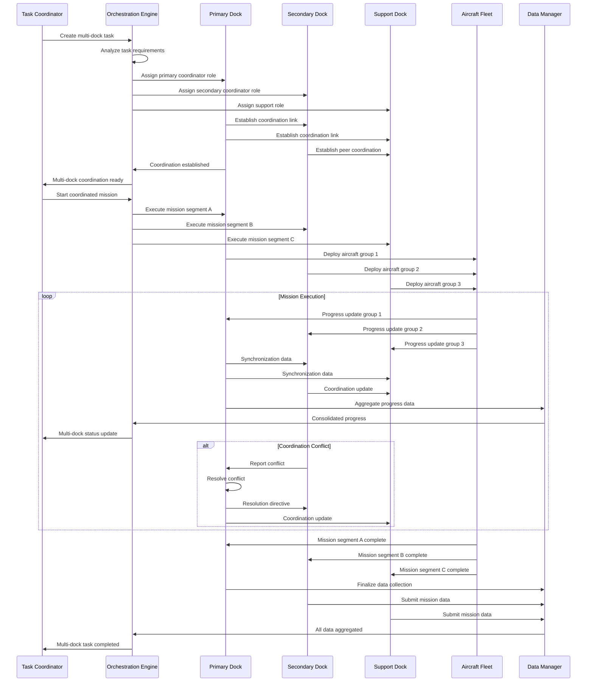

# Multi-Dock Task (Dock)

## Overview

The multi-dock task system provides comprehensive coordination and management capabilities for operations involving multiple dock stations. This system enables large-scale mission coordination, resource sharing, fleet synchronization, and intelligent workload distribution across dock networks for complex operations requiring multiple aircraft and locations.

## Supported Multi-Dock Operations

| Operation Type | Dock Count | Aircraft Count | Coordination Level | Use Cases |
|---------------|------------|----------------|-------------------|-----------|
| Synchronized Survey | 2-5 docks | 4-20 aircraft | Tight coordination | Large area mapping |
| Distributed Inspection | 3-10 docks | 6-40 aircraft | Loose coordination | Infrastructure inspection |
| Emergency Response | 2-8 docks | 4-32 aircraft | Real-time coordination | Disaster response |
| Surveillance Network | 5-20 docks | 10-80 aircraft | Autonomous coordination | Security operations |
| Research Campaign | 2-6 docks | 4-24 aircraft | Scheduled coordination | Scientific studies |
| Commercial Operations | 3-15 docks | 6-60 aircraft | Business coordination | Delivery networks |

## Architecture Overview

```mermaid
graph TB
    subgraph "Central Command Center"
        TaskOrchestrator["Task Orchestrator"]
        ResourceManager["Resource Manager"]
        CoordinationEngine["Coordination Engine"]
        MissionPlanner["Mission Planner"]
        ConflictResolver["Conflict Resolver"]
    end
    
    subgraph "Dock Network Alpha"
        Dock1["Dock 1<br/>DOCK_001"]
        Dock2["Dock 2<br/>DOCK_002"]
        Dock3["Dock 3<br/>DOCK_003"]
    end
    
    subgraph "Dock Network Beta"
        Dock4["Dock 4<br/>DOCK_004"]
        Dock5["Dock 5<br/>DOCK_005"]
        Dock6["Dock 6<br/>DOCK_006"]
    end
    
    subgraph "Aircraft Fleet Management"
        FleetAlpha["Fleet Alpha<br/>12 Aircraft"]
        FleetBeta["Fleet Beta<br/>8 Aircraft"]
        FleetGamma["Fleet Gamma<br/>6 Aircraft"]
    end
    
    subgraph "Support Systems"
        WeatherService["Weather Service"]
        AirspaceManager["Airspace Manager"]
        RegulatorAPI["Regulatory API"]
        EmergencyServices["Emergency Services"]
    end
    
    subgraph "Data Management"
        TaskDatabase["Task Database"]
        FlightDataDB["Flight Data DB"]
        AnalyticsEngine["Analytics Engine"]
        ReportsEngine["Reports Engine"]
    end
    
    TaskOrchestrator --> ResourceManager
    TaskOrchestrator --> CoordinationEngine
    TaskOrchestrator --> MissionPlanner
    TaskOrchestrator --> ConflictResolver
    
    ResourceManager --> Dock1
    ResourceManager --> Dock2
    ResourceManager --> Dock3
    ResourceManager --> Dock4
    ResourceManager --> Dock5
    ResourceManager --> Dock6
    
    CoordinationEngine --> FleetAlpha
    CoordinationEngine --> FleetBeta
    CoordinationEngine --> FleetGamma
    
    MissionPlanner --> WeatherService
    MissionPlanner --> AirspaceManager
    ConflictResolver --> RegulatorAPI
    TaskOrchestrator --> EmergencyServices
    
    TaskOrchestrator --> TaskDatabase
    CoordinationEngine --> FlightDataDB
    ResourceManager --> AnalyticsEngine
    MissionPlanner --> ReportsEngine
```



## MQTT Topic Structure

### Multi-Dock Coordination Topics
```
# Central Task Management
thing/product/multi-dock/services
├── task_orchestration
│   ├── create_multi_dock_task     # Create coordinated task
│   ├── coordinate_docks           # Coordinate dock operations
│   ├── synchronize_missions       # Synchronize mission execution
│   ├── allocate_resources         # Allocate resources across docks
│   └── resolve_conflicts          # Resolve coordination conflicts

# Dock Network Status
thing/product/multi-dock/state
├── network_status                 # Overall network status
├── resource_allocation           # Current resource allocation
├── task_progress                # Multi-dock task progress
├── coordination_health          # Coordination system health
└── conflict_status              # Current conflicts and resolutions

# Individual Dock Coordination
thing/product/{dock_sn}/multi-dock
├── task_assignments             # Tasks assigned to this dock
├── coordination_requests        # Coordination requests from other docks
├── resource_sharing            # Shared resources status
├── synchronization_status      # Sync status with other docks
└── peer_communications         # Communications with peer docks

# Multi-Dock Events
thing/product/multi-dock/events
├── task_created               # Multi-dock task created
├── coordination_established   # Dock coordination established
├── resource_conflict         # Resource allocation conflict
├── synchronization_lost      # Synchronization lost between docks
├── task_completed           # Multi-dock task completed
└── emergency_coordination    # Emergency coordination activated
```

## API Endpoints

### Create Multi-Dock Task
```http
POST /api/v1/multi-dock/tasks
Content-Type: application/json
Authorization: Bearer {coordinator_token}

{
  "task_definition": {
    "task_id": "multi_survey_001",
    "task_name": "Large Area Survey Campaign",
    "task_type": "coordinated_survey",
    "priority": "high",
    "estimated_duration": 14400,
    "area_of_interest": {
      "type": "polygon",
      "coordinates": [
        [116.100000, 40.100000],
        [116.150000, 40.100000],
        [116.150000, 40.150000],
        [116.100000, 40.150000],
        [116.100000, 40.100000]
      ]
    },
    "mission_parameters": {
      "ground_resolution": "2cm/pixel",
      "overlap_percentage": 75,
      "flight_altitude": 80,
      "coverage_type": "complete"
    }
  },
  "dock_assignments": [
    {
      "dock_sn": "DOCK_001_ABC123",
      "role": "primary_coordinator",
      "assigned_area": {
        "type": "polygon",
        "coordinates": [...]
      },
      "aircraft_allocation": 4,
      "priority": 1,
      "start_time": "2024-01-20T08:00:00Z"
    },
    {
      "dock_sn": "DOCK_002_ABC124",
      "role": "secondary_coordinator",
      "assigned_area": {
        "type": "polygon", 
        "coordinates": [...]
      },
      "aircraft_allocation": 3,
      "priority": 2,
      "start_time": "2024-01-20T08:15:00Z"
    },
    {
      "dock_sn": "DOCK_003_ABC125",
      "role": "support",
      "assigned_area": {
        "type": "polygon",
        "coordinates": [...]
      },
      "aircraft_allocation": 2,
      "priority": 3,
      "start_time": "2024-01-20T08:30:00Z"
    }
  ],
  "coordination_rules": {
    "synchronization_required": true,
    "resource_sharing_enabled": true,
    "conflict_resolution": "automatic",
    "communication_interval": 30,
    "coordination_timeout": 300,
    "fallback_strategy": "independent_operation"
  },
  "safety_parameters": {
    "minimum_separation_distance": 200,
    "altitude_deconfliction": true,
    "emergency_coordination": true,
    "weather_synchronization": true,
    "airspace_coordination": true
  },
  "data_management": {
    "centralized_collection": true,
    "real_time_processing": false,
    "data_deduplication": true,
    "quality_assurance": "automated",
    "delivery_format": "photogrammetry_ready"
  }
}

Response:
{
  "task_id": "multi_survey_001",
  "status": "created",
  "coordination_established": false,
  "participating_docks": 3,
  "total_aircraft_allocated": 9,
  "estimated_start_time": "2024-01-20T08:00:00Z",
  "estimated_completion_time": "2024-01-20T12:00:00Z",
  "coordination_session": {
    "session_id": "coord_session_001",
    "primary_coordinator": "DOCK_001_ABC123",
    "coordination_protocol": "hierarchical",
    "status": "initializing"
  },
  "resource_allocation": {
    "total_area_sqkm": 25.0,
    "area_per_dock": [
      {"dock_sn": "DOCK_001_ABC123", "area_sqkm": 12.0},
      {"dock_sn": "DOCK_002_ABC124", "area_sqkm": 8.5},
      {"dock_sn": "DOCK_003_ABC125", "area_sqkm": 4.5}
    ],
    "estimated_flight_hours": 36.0,
    "estimated_data_volume": "2.4TB"
  },
  "monitoring_endpoints": {
    "task_status": "/api/v1/multi-dock/tasks/multi_survey_001/status",
    "coordination_health": "/api/v1/multi-dock/tasks/multi_survey_001/coordination",
    "real_time_progress": "wss://api.dji.com/multi-dock/multi_survey_001/progress"
  }
}
```

### Monitor Multi-Dock Task Progress
```http
GET /api/v1/multi-dock/tasks/{task_id}/status
Authorization: Bearer {operator_token}

Response:
{
  "task_id": "multi_survey_001",
  "overall_status": "executing",
  "overall_progress": 34.7,
  "start_time": "2024-01-20T08:00:00Z",
  "estimated_completion": "2024-01-20T12:15:00Z",
  "elapsed_time": 3420,
  "coordination_health": {
    "status": "healthy",
    "active_connections": 3,
    "synchronization_drift": 2.3,
    "communication_latency": 45.2,
    "conflict_count": 0
  },
  "dock_status": [
    {
      "dock_sn": "DOCK_001_ABC123",
      "role": "primary_coordinator", 
      "status": "active",
      "progress": 42.1,
      "aircraft_deployed": 4,
      "aircraft_active": 3,
      "aircraft_returning": 1,
      "area_coverage": 38.5,
      "data_collected": "156MB",
      "last_communication": "2024-01-20T09:02:15Z"
    },
    {
      "dock_sn": "DOCK_002_ABC124",
      "role": "secondary_coordinator",
      "status": "active", 
      "progress": 28.9,
      "aircraft_deployed": 3,
      "aircraft_active": 3,
      "aircraft_returning": 0,
      "area_coverage": 25.2,
      "data_collected": "98MB",
      "last_communication": "2024-01-20T09:02:18Z"
    },
    {
      "dock_sn": "DOCK_003_ABC125",
      "role": "support",
      "status": "active",
      "progress": 31.4,
      "aircraft_deployed": 2,
      "aircraft_active": 2,
      "aircraft_returning": 0,
      "area_coverage": 29.8,
      "data_collected": "67MB",
      "last_communication": "2024-01-20T09:02:12Z"
    }
  ],
  "resource_utilization": {
    "total_aircraft_hours_flown": 12.5,
    "average_aircraft_efficiency": 87.3,
    "data_collection_rate": "45MB/hour",
    "area_coverage_rate": "2.1 sqkm/hour",
    "battery_utilization": 78.6,
    "coordination_overhead": 5.2
  },
  "quality_metrics": {
    "coverage_quality": 94.2,
    "overlap_compliance": 98.7,
    "altitude_consistency": 96.1,
    "timing_synchronization": 89.4,
    "data_quality_score": 91.8
  }
}
```

### Emergency Multi-Dock Coordination
```http
POST /api/v1/multi-dock/tasks/{task_id}/emergency
Content-Type: application/json
Authorization: Bearer {emergency_token}

{
  "emergency_type": "severe_weather_approaching",
  "affected_docks": ["DOCK_001_ABC123", "DOCK_002_ABC124", "DOCK_003_ABC125"],
  "emergency_action": "coordinated_rth",
  "emergency_parameters": {
    "immediate_recall": true,
    "priority_order": ["safety", "aircraft_recovery", "data_preservation"],
    "coordination_timeout": 60,
    "fallback_to_individual": true
  },
  "operator_info": {
    "operator_id": "emergency_coord_001",
    "authorization_level": "fleet_emergency",
    "justification": "Weather radar shows severe thunderstorm approaching at 15:30"
  },
  "recovery_plan": {
    "dock_prioritization": "nearest_first",
    "aircraft_sequencing": "battery_level_ascending",
    "alternate_landing_sites": ["site_alpha", "site_beta"],
    "data_preservation": "immediate_upload"
  }
}

Response:
{
  "emergency_id": "emergency_multi_001",
  "status": "coordinating",
  "affected_aircraft_count": 9,
  "coordination_responses": [
    {
      "dock_sn": "DOCK_001_ABC123",
      "response_status": "acknowledged",
      "aircraft_status": [
        {
          "aircraft_sn": "M30T_001_XYZ789",
          "current_position": {"lat": 40.123456, "lng": 116.123456, "alt": 85},
          "action": "immediate_rth",
          "estimated_arrival": "2024-01-20T15:20:00Z",
          "distance_to_dock": 2.3
        }
      ],
      "dock_preparation": "active"
    }
  ],
  "coordination_plan": {
    "total_recovery_time": 1200,
    "landing_sequence": [
      {"dock_sn": "DOCK_003_ABC125", "aircraft_count": 2, "eta": "2024-01-20T15:18:00Z"},
      {"dock_sn": "DOCK_002_ABC124", "aircraft_count": 3, "eta": "2024-01-20T15:22:00Z"},
      {"dock_sn": "DOCK_001_ABC123", "aircraft_count": 4, "eta": "2024-01-20T15:25:00Z"}
    ],
    "data_preservation": {
      "immediate_uploads": 9,
      "estimated_upload_time": 180,
      "data_integrity": "verified"
    }
  }
}
```

## Message Schemas

### Multi-Dock Task Creation
```json
{
  "tid": "multi_task_001",
  "bid": "12345678-1234-1234-1234-123456789012",
  "timestamp": 1640995200000,
  "method": "create_multi_dock_task",
  "data": {
    "task_id": "multi_survey_001",
    "task_type": "coordinated_survey",
    "coordination_mode": "hierarchical",
    "participating_docks": [
      {
        "dock_sn": "DOCK_001_ABC123",
        "role": "primary_coordinator",
        "capabilities": ["mission_planning", "data_aggregation", "conflict_resolution"],
        "resource_allocation": {
          "aircraft_count": 4,
          "area_assignment": {...},
          "priority_level": 1
        }
      },
      {
        "dock_sn": "DOCK_002_ABC124", 
        "role": "secondary_coordinator",
        "capabilities": ["mission_execution", "data_collection"],
        "resource_allocation": {
          "aircraft_count": 3,
          "area_assignment": {...},
          "priority_level": 2
        }
      }
    ],
    "coordination_parameters": {
      "synchronization_tolerance": 30,
      "communication_protocol": "mqtt_reliable",
      "conflict_resolution_strategy": "primary_coordinator_arbitration",
      "redundancy_level": "high",
      "failover_enabled": true
    },
    "mission_specifications": {
      "total_area_sqkm": 25.0,
      "required_resolution": "2cm/pixel",
      "coverage_requirements": 100,
      "quality_thresholds": {
        "overlap_min": 70,
        "altitude_variance_max": 5,
        "synchronization_drift_max": 60
      }
    }
  }
}
```

### Coordination Status Update
```json
{
  "tid": "coord_status_001",
  "bid": "12345678-1234-1234-1234-123456789012",
  "timestamp": 1640995200000,
  "method": "coordination_status_update",
  "data": {
    "task_id": "multi_survey_001",
    "coordination_session": "coord_session_001",
    "overall_coordination_health": {
      "status": "healthy",
      "health_score": 94.2,
      "active_connections": 3,
      "failed_connections": 0,
      "average_latency": 45.2,
      "synchronization_drift": 2.3
    },
    "dock_coordination_status": [
      {
        "dock_sn": "DOCK_001_ABC123",
        "role": "primary_coordinator",
        "connection_status": "active",
        "last_heartbeat": "2024-01-20T09:02:15Z",
        "command_queue_size": 0,
        "execution_lag": 1.2,
        "coordination_score": 98.1
      },
      {
        "dock_sn": "DOCK_002_ABC124",
        "role": "secondary_coordinator", 
        "connection_status": "active",
        "last_heartbeat": "2024-01-20T09:02:18Z",
        "command_queue_size": 2,
        "execution_lag": 3.4,
        "coordination_score": 91.7
      }
    ],
    "shared_resources": {
      "airspace_segments": [
        {
          "segment_id": "airspace_001",
          "controlling_dock": "DOCK_001_ABC123",
          "shared_with": ["DOCK_002_ABC124"],
          "conflict_level": "none",
          "utilization": 67.8
        }
      ],
      "data_channels": {
        "primary_channel": "active",
        "backup_channel": "standby",
        "bandwidth_utilization": 34.2,
        "data_integrity": 100.0
      }
    },
    "conflict_resolution": {
      "active_conflicts": 0,
      "resolved_conflicts": 3,
      "resolution_time_avg": 12.5,
      "escalation_count": 0
    }
  }
}
```

### Multi-Dock Emergency Coordination
```json
{
  "tid": "emergency_coord_001",
  "bid": "12345678-1234-1234-1234-123456789012",
  "timestamp": 1640995200000,
  "method": "emergency_multi_dock_coordination",
  "data": {
    "emergency_id": "emergency_multi_001",
    "task_id": "multi_survey_001",
    "emergency_type": "severe_weather_approaching",
    "emergency_severity": "high",
    "coordination_mode": "emergency_centralized",
    "affected_docks": ["DOCK_001_ABC123", "DOCK_002_ABC124", "DOCK_003_ABC125"],
    "emergency_coordinator": "DOCK_001_ABC123",
    "emergency_actions": {
      "immediate_actions": [
        "cease_new_deployments",
        "recall_all_aircraft",
        "secure_dock_systems",
        "preserve_mission_data"
      ],
      "coordinated_recovery": {
        "recovery_strategy": "nearest_dock_first",
        "aircraft_prioritization": "battery_level_ascending",
        "landing_sequence": [
          {
            "sequence": 1,
            "dock_sn": "DOCK_003_ABC125",
            "aircraft_list": ["M30_003_XYZ791", "M30_004_XYZ792"],
            "estimated_completion": "2024-01-20T15:18:00Z"
          },
          {
            "sequence": 2,
            "dock_sn": "DOCK_002_ABC124",
            "aircraft_list": ["M30T_002_XYZ790", "M30_005_XYZ793", "M30_006_XYZ794"],
            "estimated_completion": "2024-01-20T15:22:00Z"
          }
        ]
      }
    },
    "resource_preservation": {
      "data_backup_status": "in_progress",
      "mission_state_saved": true,
      "equipment_secured": true,
      "personnel_notified": true
    },
    "recovery_timeline": {
      "emergency_declared": "2024-01-20T15:05:00Z",
      "coordination_established": "2024-01-20T15:06:30Z",
      "all_aircraft_recalled": "2024-01-20T15:07:00Z",
      "estimated_all_recovered": "2024-01-20T15:25:00Z",
      "estimated_mission_resume": "2024-01-21T08:00:00Z"
    }
  }
}
```

## Multi-Dock Coordination Flow



## Code Example

```java
@Service
@Slf4j
public class MultiDockTaskService extends AbstractDeviceService {
    
    @Autowired
    private TaskOrchestrationService taskOrchestrator;
    
    @Autowired
    private ResourceManagementService resourceManager;
    
    @Autowired
    private CoordinationEngineService coordinationEngine;
    
    @Autowired
    private ConflictResolutionService conflictResolver;
    
    @Autowired
    private MultiDockTaskRepository taskRepository;
    
    private final Map<String, ActiveMultiDockTask> activeTasks = new ConcurrentHashMap<>();
    
    /**
     * Create and initialize multi-dock task
     */
    @PreAuthorize("hasRole('MULTI_DOCK_COORDINATOR')")
    public MultiDockTaskResult createMultiDockTask(MultiDockTaskRequest request) {
        
        log.info("Creating multi-dock task: {}", request.getTaskDefinition().getTaskId());
        
        try {
            // Validate task definition
            TaskValidationResult validation = taskOrchestrator.validateMultiDockTask(request);
            if (!validation.isValid()) {
                throw new InvalidMultiDockTaskException("Task validation failed", validation.getErrors());
            }
            
            // Analyze resource requirements
            ResourceAnalysisResult resourceAnalysis = resourceManager.analyzeResourceRequirements(
                request.getTaskDefinition(), request.getDockAssignments());
            
            if (!resourceAnalysis.isFeasible()) {
                throw new InsufficientResourcesException("Insufficient resources for task", 
                        resourceAnalysis.getConstraints());
            }
            
            // Check dock availability and capabilities
            DockAvailabilityResult availability = checkDockAvailability(request.getDockAssignments());
            if (!availability.isAllAvailable()) {
                throw new DockUnavailableException("One or more docks unavailable", 
                        availability.getUnavailableDocks());
            }
            
            // Create multi-dock task record
            MultiDockTask multiDockTask = MultiDockTask.builder()
                    .taskId(request.getTaskDefinition().getTaskId())
                    .taskName(request.getTaskDefinition().getTaskName())
                    .taskType(request.getTaskDefinition().getTaskType())
                    .priority(request.getTaskDefinition().getPriority())
                    .areaOfInterest(request.getTaskDefinition().getAreaOfInterest())
                    .missionParameters(request.getTaskDefinition().getMissionParameters())
                    .dockAssignments(request.getDockAssignments())
                    .coordinationRules(request.getCoordinationRules())
                    .safetyParameters(request.getSafetyParameters())
                    .dataManagement(request.getDataManagement())
                    .createdAt(Instant.now())
                    .status(MultiDockTaskStatus.CREATED)
                    .build();
            
            // Store task
            taskRepository.save(multiDockTask);
            
            // Initialize coordination session
            CoordinationSession coordinationSession = coordinationEngine.initializeCoordination(
                multiDockTask);
            
            // Create active task session
            ActiveMultiDockTask activeTask = ActiveMultiDockTask.builder()
                    .taskId(multiDockTask.getTaskId())
                    .multiDockTask(multiDockTask)
                    .coordinationSession(coordinationSession)
                    .startTime(Instant.now())
                    .status(ActiveTaskStatus.INITIALIZING)
                    .dockStatuses(initializeDockStatuses(request.getDockAssignments()))
                    .resourceAllocation(resourceAnalysis.getAllocation())
                    .build();
            
            activeTasks.put(multiDockTask.getTaskId(), activeTask);
            
            // Start coordination establishment
            establishDockCoordination(activeTask);
            
            log.info("Multi-dock task created successfully: {}", multiDockTask.getTaskId());
            
            return MultiDockTaskResult.builder()
                    .taskId(multiDockTask.getTaskId())
                    .status("created")
                    .coordinationEstablished(false)
                    .participatingDocks(request.getDockAssignments().size())
                    .totalAircraftAllocated(calculateTotalAircraft(request.getDockAssignments()))
                    .estimatedStartTime(calculateStartTime(request.getDockAssignments()))
                    .estimatedCompletionTime(calculateCompletionTime(multiDockTask))
                    .coordinationSession(buildCoordinationSessionResponse(coordinationSession))
                    .resourceAllocation(buildResourceAllocationResponse(resourceAnalysis))
                    .monitoringEndpoints(buildMonitoringEndpoints(multiDockTask.getTaskId()))
                    .build();
            
        } catch (Exception e) {
            log.error("Failed to create multi-dock task: {}", 
                    request.getTaskDefinition().getTaskId(), e);
            return MultiDockTaskResult.failure(e.getMessage());
        }
    }
    
    /**
     * Establish coordination between docks
     */
    private void establishDockCoordination(ActiveMultiDockTask activeTask) {
        
        CompletableFuture.runAsync(() -> {
            try {
                log.info("Establishing dock coordination for task: {}", activeTask.getTaskId());
                
                activeTask.setStatus(ActiveTaskStatus.ESTABLISHING_COORDINATION);
                
                // Identify primary coordinator
                String primaryCoordinator = findPrimaryCoordinator(activeTask);
                
                // Establish coordination links
                List<CoordinationLink> coordinationLinks = new ArrayList<>();
                
                for (DockAssignment assignment : activeTask.getMultiDockTask().getDockAssignments()) {
                    
                    if (!assignment.getDockSn().equals(primaryCoordinator)) {
                        CoordinationLink link = establishCoordinationLink(
                            primaryCoordinator, assignment.getDockSn(), activeTask);
                        
                        coordinationLinks.add(link);
                    }
                }
                
                // Establish peer-to-peer links if required
                if (activeTask.getMultiDockTask().getCoordinationRules().isResourceSharingEnabled()) {
                    establishPeerToPeerLinks(activeTask, coordinationLinks);
                }
                
                // Verify coordination establishment
                CoordinationVerificationResult verification = verifyCoordinationEstablishment(
                    activeTask, coordinationLinks);
                
                if (verification.isSuccessful()) {
                    activeTask.setStatus(ActiveTaskStatus.COORDINATION_ESTABLISHED);
                    activeTask.getCoordinationSession().setCoordinationLinks(coordinationLinks);
                    
                    log.info("Dock coordination established successfully for task: {}", 
                            activeTask.getTaskId());
                    
                    // Notify all docks of successful coordination
                    notifyCoordinationEstablished(activeTask);
                    
                    // Ready to start mission execution
                    readyForMissionExecution(activeTask);
                    
                } else {
                    handleCoordinationFailure(activeTask, verification);
                }
                
            } catch (Exception e) {
                log.error("Error establishing dock coordination for task: {}", 
                        activeTask.getTaskId(), e);
                handleCoordinationException(activeTask, e);
            }
        });
    }
    
    /**
     * Execute coordinated multi-dock mission
     */
    public MissionExecutionResult executeCoordinatedMission(String taskId) {
        
        ActiveMultiDockTask activeTask = activeTasks.get(taskId);
        if (activeTask == null) {
            throw new TaskNotFoundException("Multi-dock task not found: " + taskId);
        }
        
        if (activeTask.getStatus() != ActiveTaskStatus.COORDINATION_ESTABLISHED) {
            throw new InvalidTaskStateException("Task not ready for execution");
        }
        
        log.info("Starting coordinated mission execution for task: {}", taskId);
        
        try {
            activeTask.setStatus(ActiveTaskStatus.MISSION_EXECUTING);
            
            // Synchronize mission start across all docks
            MissionSynchronizationResult syncResult = synchronizeMissionStart(activeTask);
            
            if (!syncResult.isSuccessful()) {
                throw new MissionSynchronizationException("Failed to synchronize mission start");
            }
            
            // Execute mission on each dock
            List<DockMissionExecution> dockExecutions = new ArrayList<>();
            
            for (DockAssignment assignment : activeTask.getMultiDockTask().getDockAssignments()) {
                
                DockMissionExecution execution = executeDockMission(activeTask, assignment);
                dockExecutions.add(execution);
            }
            
            // Monitor coordinated execution
            startCoordinatedExecutionMonitoring(activeTask, dockExecutions);
            
            return MissionExecutionResult.builder()
                    .taskId(taskId)
                    .status("executing")
                    .dockExecutions(dockExecutions)
                    .startTime(Instant.now())
                    .estimatedCompletion(calculateExecutionCompletion(activeTask))
                    .build();
            
        } catch (Exception e) {
            log.error("Failed to execute coordinated mission for task: {}", taskId, e);
            return MissionExecutionResult.failure(e.getMessage());
        }
    }
    
    /**
     * Handle multi-dock emergency coordination
     */
    @PreAuthorize("hasRole('EMERGENCY_COORDINATOR')")
    public EmergencyCoordinationResult handleEmergencyCoordination(String taskId, 
                                                                 MultiDockEmergencyRequest request) {
        
        ActiveMultiDockTask activeTask = activeTasks.get(taskId);
        if (activeTask == null) {
            throw new TaskNotFoundException("Multi-dock task not found: " + taskId);
        }
        
        log.warn("Emergency coordination activated for multi-dock task: {}, type: {}", 
                taskId, request.getEmergencyType());
        
        try {
            // Create emergency coordination session
            EmergencyCoordinationSession emergencySession = EmergencyCoordinationSession.builder()
                    .emergencyId(UUID.randomUUID().toString())
                    .taskId(taskId)
                    .emergencyType(request.getEmergencyType())
                    .affectedDocks(request.getAffectedDocks())
                    .emergencyAction(request.getEmergencyAction())
                    .emergencyParameters(request.getEmergencyParameters())
                    .operatorInfo(request.getOperatorInfo())
                    .recoveryPlan(request.getRecoveryPlan())
                    .startTime(Instant.now())
                    .build();
            
            // Switch to emergency coordination mode
            switchToEmergencyCoordination(activeTask, emergencySession);
            
            // Execute emergency actions on all affected docks
            List<DockEmergencyResponse> responses = new ArrayList<>();
            
            for (String dockSn : request.getAffectedDocks()) {
                
                DockEmergencyResponse response = executeEmergencyAction(
                    dockSn, emergencySession, activeTask);
                
                responses.add(response);
            }
            
            // Coordinate recovery procedures
            RecoveryCoordinationResult recoveryResult = coordinateRecovery(
                emergencySession, responses);
            
            // Update task status
            activeTask.setStatus(ActiveTaskStatus.EMERGENCY_RECOVERY);
            activeTask.setEmergencySession(emergencySession);
            
            log.warn("Emergency coordination completed for task: {}, emergency: {}", 
                    taskId, emergencySession.getEmergencyId());
            
            return EmergencyCoordinationResult.builder()
                    .emergencyId(emergencySession.getEmergencyId())
                    .status("coordinating")
                    .affectedAircraftCount(calculateAffectedAircraft(responses))
                    .coordinationResponses(responses)
                    .coordinationPlan(recoveryResult.getCoordinationPlan())
                    .build();
            
        } catch (Exception e) {
            log.error("Failed to handle emergency coordination for task: {}", taskId, e);
            return EmergencyCoordinationResult.failure(e.getMessage());
        }
    }
    
    /**
     * Monitor multi-dock task coordination health
     */
    @Scheduled(fixedRate = 30000) // Check every 30 seconds
    public void monitorCoordinationHealth() {
        
        for (ActiveMultiDockTask activeTask : activeTasks.values()) {
            
            if (activeTask.getStatus() != ActiveTaskStatus.MISSION_EXECUTING) {
                continue;
            }
            
            try {
                // Check coordination session health
                CoordinationHealthResult health = coordinationEngine.checkCoordinationHealth(
                    activeTask.getCoordinationSession());
                
                if (!health.isHealthy()) {
                    handleCoordinationHealthIssues(activeTask, health);
                }
                
                // Check for resource conflicts
                ConflictDetectionResult conflicts = conflictResolver.detectConflicts(activeTask);
                
                if (conflicts.hasConflicts()) {
                    handleResourceConflicts(activeTask, conflicts);
                }
                
                // Monitor synchronization drift
                SynchronizationStatus syncStatus = checkSynchronizationStatus(activeTask);
                
                if (syncStatus.isDriftExcessive()) {
                    handleSynchronizationDrift(activeTask, syncStatus);
                }
                
            } catch (Exception e) {
                log.error("Error monitoring coordination health for task: {}", 
                        activeTask.getTaskId(), e);
            }
        }
    }
    
    /**
     * Get multi-dock task status
     */
    public MultiDockTaskStatusResult getTaskStatus(String taskId) {
        
        ActiveMultiDockTask activeTask = activeTasks.get(taskId);
        if (activeTask == null) {
            throw new TaskNotFoundException("Multi-dock task not found: " + taskId);
        }
        
        // Get current dock statuses
        List<DockTaskStatus> dockStatuses = getCurrentDockStatuses(activeTask);
        
        // Calculate overall progress
        double overallProgress = calculateOverallProgress(dockStatuses);
        
        // Get coordination health
        CoordinationHealth coordinationHealth = getCoordinationHealth(activeTask);
        
        // Get resource utilization
        ResourceUtilization resourceUtilization = getResourceUtilization(activeTask);
        
        // Get quality metrics
        QualityMetrics qualityMetrics = getQualityMetrics(activeTask);
        
        return MultiDockTaskStatusResult.builder()
                .taskId(taskId)
                .overallStatus(activeTask.getStatus().name())
                .overallProgress(overallProgress)
                .startTime(activeTask.getStartTime())
                .estimatedCompletion(calculateEstimatedCompletion(activeTask))
                .elapsedTime(Duration.between(activeTask.getStartTime(), Instant.now()).getSeconds())
                .coordinationHealth(coordinationHealth)
                .dockStatus(dockStatuses)
                .resourceUtilization(resourceUtilization)
                .qualityMetrics(qualityMetrics)
                .build();
    }
    
    /**
     * Handle coordination conflicts
     */
    private void handleResourceConflicts(ActiveMultiDockTask activeTask, 
                                       ConflictDetectionResult conflicts) {
        
        log.warn("Resource conflicts detected for task: {}, conflicts: {}", 
                activeTask.getTaskId(), conflicts.getConflicts().size());
        
        for (ResourceConflict conflict : conflicts.getConflicts()) {
            
            ConflictResolutionStrategy strategy = conflictResolver.determineResolutionStrategy(
                activeTask, conflict);
            
            ConflictResolutionResult resolution = conflictResolver.resolveConflict(
                activeTask, conflict, strategy);
            
            if (resolution.isResolved()) {
                log.info("Conflict resolved for task: {}, conflict: {}", 
                        activeTask.getTaskId(), conflict.getConflictId());
                
                // Apply resolution to affected docks
                applyConflictResolution(activeTask, conflict, resolution);
                
            } else {
                log.error("Failed to resolve conflict for task: {}, conflict: {}", 
                        activeTask.getTaskId(), conflict.getConflictId());
                
                // Escalate unresolved conflicts
                escalateConflict(activeTask, conflict);
            }
        }
    }
}

/**
 * Active multi-dock task session
 */
@Data
@Builder
public class ActiveMultiDockTask {
    private String taskId;
    private MultiDockTask multiDockTask;
    private CoordinationSession coordinationSession;
    private EmergencyCoordinationSession emergencySession;
    private Instant startTime;
    private Instant endTime;
    private ActiveTaskStatus status;
    private Map<String, DockStatus> dockStatuses;
    private ResourceAllocation resourceAllocation;
    private List<ConflictResolution> resolvedConflicts;
    
    public void updateDockStatus(String dockSn, DockStatus status) {
        if (dockStatuses == null) {
            dockStatuses = new HashMap<>();
        }
        dockStatuses.put(dockSn, status);
    }
    
    public boolean isAllDocksReady() {
        return dockStatuses.values().stream()
                .allMatch(status -> status.getReadiness() == DockReadiness.READY);
    }
}
```

## Advanced Coordination Features

### Intelligent Resource Allocation
- Dynamic workload balancing across docks
- Real-time resource optimization
- Predictive capacity planning
- Automated conflict resolution

### Scalable Architecture
- Support for hundreds of docks
- Hierarchical coordination structures
- Distributed processing capabilities
- Cloud-native scaling

### Mission Intelligence
- AI-powered task optimization
- Predictive maintenance coordination
- Weather-aware scheduling
- Performance analytics and insights