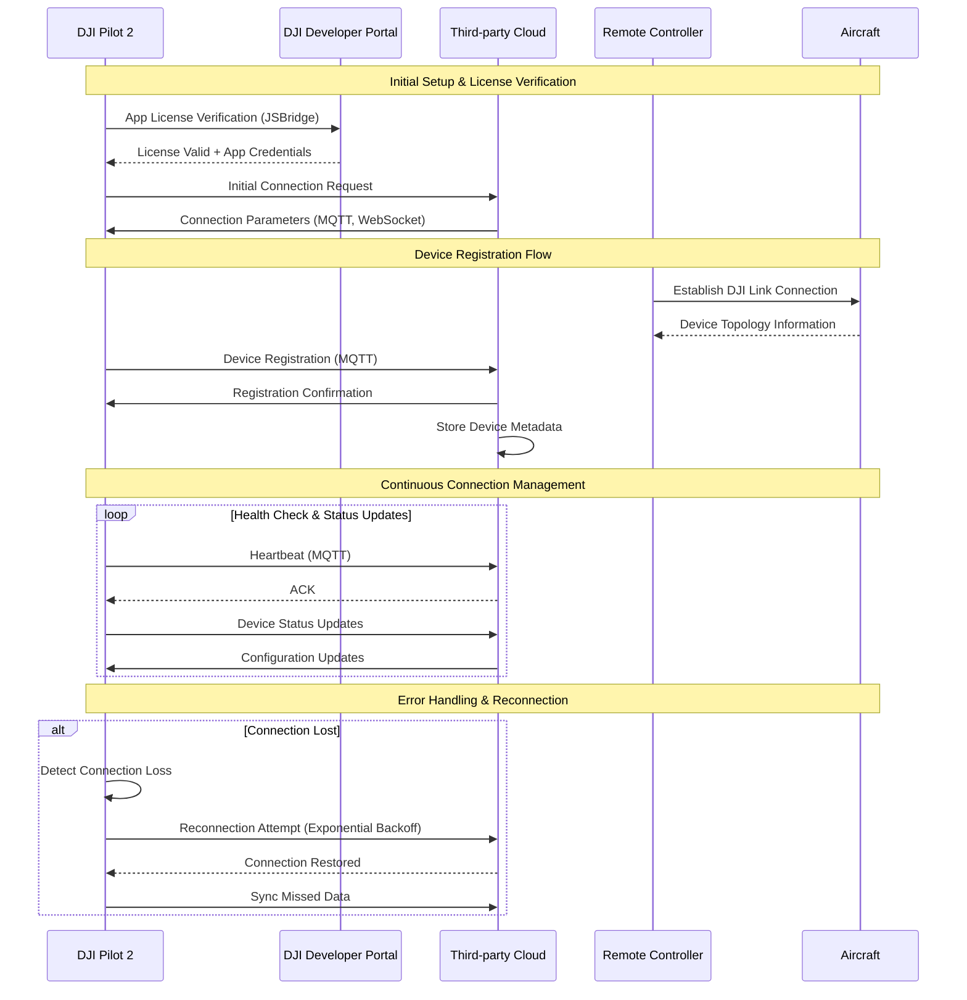
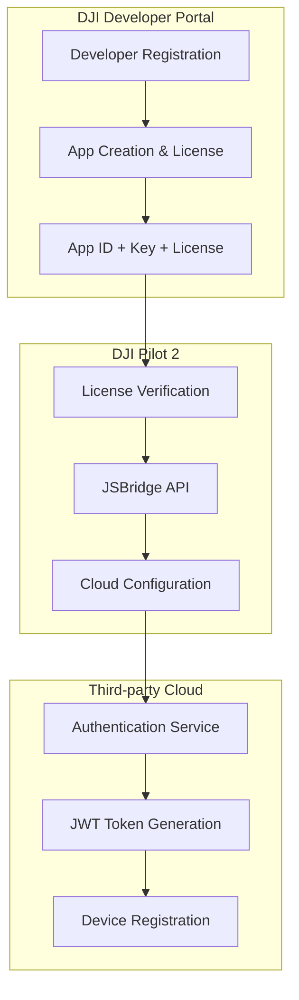

# Access to the Cloud Server - Pilot Function Set

## Overview

The Access to Cloud Server feature enables DJI Pilot 2 applications running on remote controllers to establish secure connections with third-party cloud platforms. This is the foundational capability that enables all subsequent cloud-based functionality.

## Supported Devices

| Device Type | Model | Gateway | Compatibility |
|-------------|-------|---------|---------------|
| Remote Controller | RC Plus | DJI Pilot 2 | ✅ Full Support |
| Remote Controller | RC Pro | DJI Pilot 2 | ✅ Full Support |
| Remote Controller | Smart Controller Enterprise | DJI Pilot 2 | ✅ Full Support |
| Aircraft | M350 RTK, M300 RTK, M30/30T, M3E Series | Via RC | ✅ Indirect Support |

## Architecture Flow



## Authentication Flow



## API Endpoints

### 1. Device Registration

**HTTP Endpoint:**
```http
POST /manage/api/v1/devices/bind
Authorization: Bearer {jwt_token}
Content-Type: application/json

{
    "device_sn": "1ZNDH7D0010078",
    "device_name": "RC-Survey-001",
    "workspace_id": "workspace_123",
    "device_type": 119,
    "domain": 0
}
```

**Response:**
```json
{
    "code": 0,
    "message": "Device bound successfully",
    "data": {
        "device_sn": "1ZNDH7D0010078",
        "bound_time": "2023-12-01T10:00:00Z",
        "mqtt_credentials": {
            "username": "device_user",
            "password": "device_password",
            "client_id": "1ZNDH7D0010078"
        }
    }
}
```

### 2. MQTT Connection Topics

**Device Status Topic:**
```
Topic: sys/product/{device_sn}/status
QoS: 1

# Device Online Message
{
    "bid": "req_001",
    "tid": "txn_001",
    "timestamp": 1701234567890,
    "data": {
        "domain": 0,
        "type": 119,
        "sub_type": 0,
        "device_secret": "device_hash",
        "ntp_server_host": "pool.ntp.org",
        "children": [
            {
                "domain": 1,
                "type": 89,
                "sub_type": 0,
                "device_secret": "aircraft_hash",
                "index": "3-0-0"
            }
        ]
    }
}
```

## Code Examples

### 1. Cloud SDK Service Implementation

```java
@Service
public class PilotCloudAccessService extends AbstractDeviceService {
    
    @Autowired
    private IDeviceService deviceService;
    
    @Autowired
    private IWebSocketMessageService webSocketService;
    
    @Override
    public TopicStatusResponse<MqttReply> updateTopoOnline(
            TopicStatusRequest<UpdateTopo> request, MessageHeaders headers) {
        
        UpdateTopo topology = request.getData();
        String deviceSn = topology.getGatewaySn();
        
        // Process RC registration
        DeviceDTO device = processRCRegistration(deviceSn, topology);
        
        // Process connected aircraft
        topology.getSubDevices().forEach(subDevice -> {
            processAircraftRegistration(deviceSn, subDevice);
        });
        
        // Broadcast connection status via WebSocket
        broadcastDeviceOnline(device);
        
        return TopicStatusResponse.<MqttReply>builder()
                .tid(request.getTid())
                .bid(request.getBid())
                .timestamp(System.currentTimeMillis())
                .data(MqttReply.success())
                .build();
    }
    
    private DeviceDTO processRCRegistration(String deviceSn, UpdateTopo topology) {
        DeviceDTO device = DeviceDTO.builder()
                .deviceSn(deviceSn)
                .deviceType(topology.getType())
                .subType(topology.getSubType())
                .domain(topology.getDomain())
                .status(true)
                .loginTime(new Date())
                .build();
                
        deviceService.saveDevice(device);
        return device;
    }
    
    private void broadcastDeviceOnline(DeviceDTO device) {
        WebSocketMessageResponse<?> message = WebSocketMessageResponse.builder()
                .bizCode(BizCodeEnum.DEVICE_ONLINE.getCode())
                .timestamp(System.currentTimeMillis())
                .data(device)
                .build();
                
        webSocketService.sendMessageToAll(message);
    }
}
```

### 2. Client-Side Connection Management

```java
@Component
public class CloudConnectionManager {
    
    private final MqttClient mqttClient;
    private final CloudApiProperties properties;
    private final RetryTemplate retryTemplate;
    
    @PostConstruct
    public void initializeConnection() {
        establishMqttConnection();
        scheduleHeartbeat();
    }
    
    private void establishMqttConnection() {
        try {
            MqttConnectOptions options = new MqttConnectOptions();
            options.setUserName(properties.getMqtt().getUsername());
            options.setPassword(properties.getMqtt().getPassword().toCharArray());
            options.setKeepAliveInterval(60);
            options.setConnectionTimeout(30);
            options.setAutomaticReconnect(true);
            
            // SSL Configuration
            if (properties.getMqtt().isSSLEnabled()) {
                SSLContext sslContext = createSSLContext();
                options.setSocketFactory(sslContext.getSocketFactory());
            }
            
            mqttClient.connect(options);
            subscribeToTopics();
            
        } catch (MqttException e) {
            log.error("MQTT connection failed", e);
            scheduleReconnection();
        }
    }
    
    private void subscribeToTopics() throws MqttException {
        // Subscribe to cloud commands
        mqttClient.subscribe("thing/product/+/services", 1);
        mqttClient.subscribe("thing/product/+/property/set", 1);
        
        // Subscribe to configuration updates
        mqttClient.subscribe("sys/product/+/config", 1);
    }
    
    @Scheduled(fixedDelay = 30000) // 30 seconds
    public void sendHeartbeat() {
        if (mqttClient.isConnected()) {
            HeartBeatRequest heartbeat = HeartBeatRequest.builder()
                    .timestamp(System.currentTimeMillis())
                    .build();
                    
            publishMessage("thing/product/" + deviceSn + "/heartbeat", heartbeat);
        }
    }
}
```

## Configuration Requirements

### application.yml
```yaml
# Cloud API Configuration
cloud-api:
  app:
    id: "your_app_id"
    key: "your_app_key" 
    license: "your_app_license"

# MQTT Configuration
mqtt:
  BASIC:
    protocol: MQTT # or MQTTS for SSL
    host: "your.mqtt.broker.com"
    port: 1883 # or 8883 for SSL
    username: "mqtt_username"
    password: "mqtt_password"
    client-id: "cloud_api_client"
    
# JWT Configuration  
jwt:
  issuer: "DJI"
  subject: "CloudApiDemo"
  secret: "your_jwt_secret"
  age: 86400 # 24 hours

# WebSocket Configuration
websocket:
  endpoint: "/api/v1/ws"
  allowed-origins: "*"
  heartbeat-interval: 30000
```

## Error Handling

### Common Error Codes

| Code | Message | Resolution |
|------|---------|------------|
| 100001 | Invalid App License | Verify license in DJI Developer Portal |
| 100002 | MQTT Authentication Failed | Check MQTT credentials |
| 100003 | Device Already Bound | Unbind device first or use different workspace |
| 311001 | Network Connection Failed | Check network connectivity and firewall |
| 324001 | SSL Certificate Invalid | Update SSL certificates |

### Error Handling Implementation

```java
@Component
public class CloudConnectionErrorHandler {
    
    @EventListener
    public void handleConnectionError(MqttConnectionErrorEvent event) {
        switch (event.getReasonCode()) {
            case MqttException.REASON_CODE_INVALID_CLIENT_ID:
                regenerateClientId();
                break;
            case MqttException.REASON_CODE_NOT_AUTHORIZED:
                refreshAuthCredentials();
                break;
            case MqttException.REASON_CODE_SERVER_CONNECT_ERROR:
                switchToBackupServer();
                break;
            default:
                scheduleReconnectionWithBackoff(event.getAttempt());
        }
    }
    
    private void scheduleReconnectionWithBackoff(int attempt) {
        long delay = Math.min(1000 * (long) Math.pow(2, attempt), 60000);
        scheduler.schedule(() -> attemptReconnection(), delay, TimeUnit.MILLISECONDS);
    }
}
```

## Security Considerations

1. **Transport Security**: Always use SSL/TLS for production deployments
2. **Certificate Validation**: Implement proper certificate validation
3. **Credential Rotation**: Regularly rotate MQTT credentials and JWT secrets
4. **Network Isolation**: Use VPN or private networks when possible
5. **Rate Limiting**: Implement connection rate limiting to prevent abuse

## Monitoring & Troubleshooting

### Health Check Endpoint
```http
GET /manage/api/v1/health
Response: 200 OK
{
    "status": "UP",
    "mqtt": {
        "status": "CONNECTED",
        "connected_devices": 5,
        "last_heartbeat": "2023-12-01T10:00:00Z"
    },
    "database": {
        "status": "UP"
    },
    "redis": {
        "status": "UP"
    }
}
```

### Connection Metrics
- Connection success rate
- Average connection establishment time
- Heartbeat response times
- Device registration counts
- Error rates by type

This foundational capability enables all other pilot function set features by establishing the secure, reliable connection between DJI Pilot 2 and the third-party cloud platform.