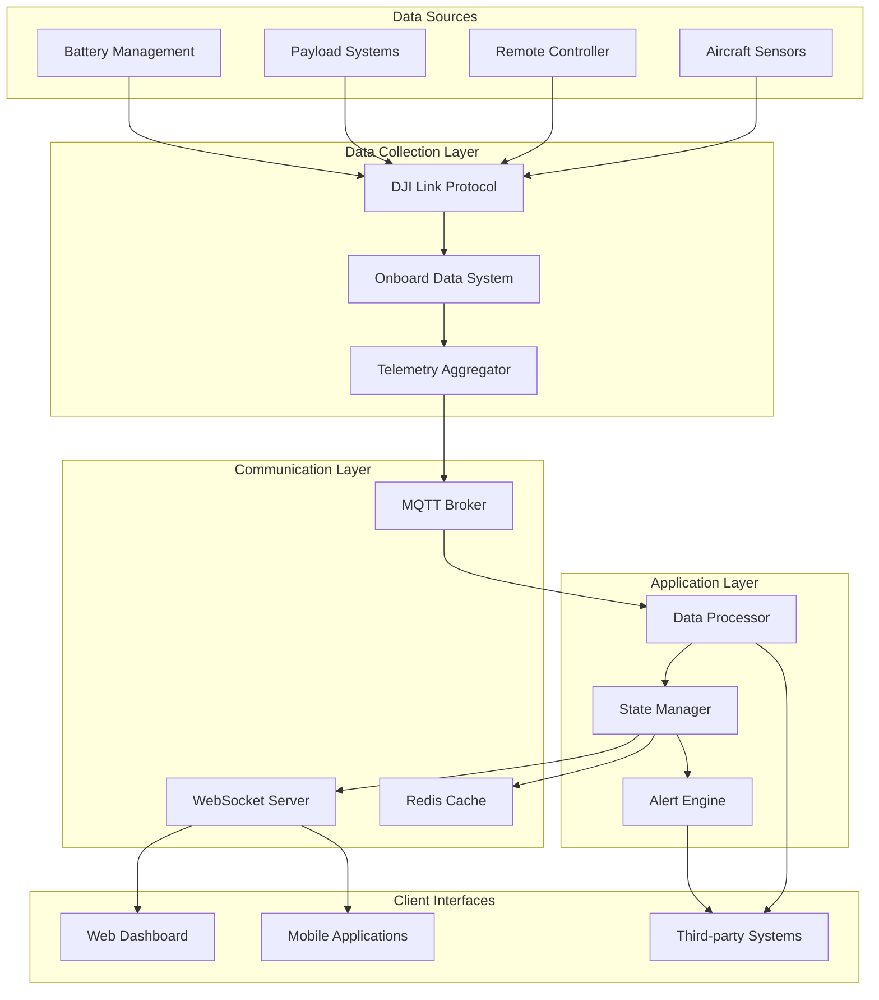
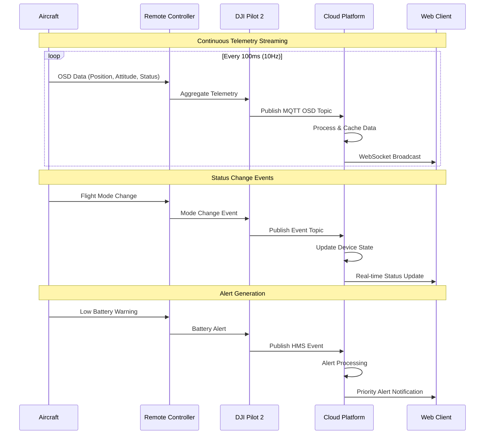

# Situation Awareness - Pilot Function Set

## Overview

Situation Awareness provides real-time monitoring and visualization of drone fleet status, enabling operators to maintain comprehensive oversight of all connected devices. This feature delivers live telemetry data, device topology, and operational status through multiple communication channels.

## Supported Devices

| Device Type | Model | Data Provided | Update Frequency |
|-------------|-------|---------------|------------------|
| Remote Controller | RC Plus, RC Pro, Smart Controller Enterprise | Connection status, battery, GPS | 1 Hz |
| Aircraft | M350 RTK, M300 RTK, M30/30T, M3E Series | Position, attitude, flight mode, sensors | 10 Hz |
| Payloads | H20/H20T, H20N, H30/H30T, Integrated cameras | Camera status, gimbal position, recording state | 5 Hz |
| Batteries | Intelligent Flight Batteries | Voltage, temperature, cell status, charge cycles | 1 Hz |

## System Architecture



## Real-time Data Flow



## MQTT Topics & Data Schemas

### 1. OSD (Operational Status Data) Topic

**Topic:** `thing/product/{device_sn}/osd`
**QoS:** 0 (High frequency, best effort)

```json
{
    "sn": "1ZNDH7D0010078",
    "timestamp": 1701234567890,
    "data": {
        "latitude": 40.123456,
        "longitude": -74.123456,
        "height": 120.5,
        "relative_height": 100.0,
        "attitude_head": 45.2,
        "attitude_pitch": -2.1,
        "attitude_roll": 1.3,
        "horizontal_speed": 8.5,
        "vertical_speed": 0.2,
        "mode_code": 6,
        "gear": 0,
        "flight_time": 1200,
        "battery": {
            "capacity_percent": 75,
            "voltage": 25200,
            "current": 2500,
            "temperature": 28.5
        },
        "home_point": {
            "latitude": 40.123000,
            "longitude": -74.123000,
            "height": 50.0
        },
        "rc_signal": {
            "quality": 5,
            "power": -45
        },
        "gimbal": {
            "pitch": -30.0,
            "roll": 0.0,
            "yaw": 45.0
        }
    }
}
```

### 2. Device Status Topic

**Topic:** `thing/product/{device_sn}/events`
**QoS:** 1 (Guaranteed delivery)

```json
{
    "bid": "status_001",
    "tid": "txn_001", 
    "timestamp": 1701234567890,
    "method": "device_status",
    "data": {
        "flight_mode": "auto",
        "flight_mode_code": 6,
        "armed": true,
        "in_air": true,
        "motors_on": true,
        "network_state": {
            "type": 1,
            "quality": 4,
            "rate": 100
        },
        "storage": [
            {
                "type": 1,
                "total": 64000000000,
                "used": 12800000000,
                "available": 51200000000
            }
        ]
    }
}
```

### 3. Device Topology Updates

**Topic:** `sys/product/{device_sn}/state`
**QoS:** 1

```json
{
    "bid": "topo_001",
    "tid": "txn_001",
    "timestamp": 1701234567890,
    "method": "update_topo",
    "data": {
        "sn": "1ZNDH7D0010078",
        "device_type": 119,
        "sub_devices": [
            {
                "sn": "1ZNBJ7J0010123",
                "device_type": 89,
                "index": "3-0-0",
                "payload_index": "52-0-0"
            }
        ]
    }
}
```

## REST API Endpoints

### 1. Get Device Topology

```http
GET /manage/api/v1/devices/topology
Authorization: Bearer {jwt_token}
Parameters:
- workspace_id: string (optional)
- online_only: boolean (default: false)

Response:
{
    "code": 0,
    "message": "success",
    "data": {
        "devices": [
            {
                "device_sn": "1ZNDH7D0010078",
                "device_name": "Survey RC-001",
                "device_type": 119,
                "online": true,
                "last_seen": "2023-12-01T10:30:00Z",
                "position": {
                    "latitude": 40.123456,
                    "longitude": -74.123456,
                    "height": 120.5
                },
                "children": [
                    {
                        "device_sn": "1ZNBJ7J0010123", 
                        "device_type": 89,
                        "payload_index": "52-0-0",
                        "status": "flying"
                    }
                ]
            }
        ],
        "total_devices": 1,
        "online_devices": 1
    }
}
```

### 2. Get Real-time Device Status

```http
GET /manage/api/v1/devices/{device_sn}/status
Authorization: Bearer {jwt_token}

Response:
{
    "code": 0,
    "message": "success",
    "data": {
        "basic_info": {
            "device_sn": "1ZNDH7D0010078",
            "online": true,
            "flight_mode": "auto",
            "armed": true,
            "in_air": true
        },
        "location": {
            "latitude": 40.123456,
            "longitude": -74.123456,
            "height": 120.5,
            "home_distance": 500.2
        },
        "battery": {
            "capacity_percent": 75,
            "voltage": 25.2,
            "temperature": 28.5,
            "estimated_flight_time": 1800
        },
        "sensors": {
            "gps_satellites": 12,
            "gps_signal_quality": 5,
            "vision_positioning": true,
            "obstacle_avoidance": true
        }
    }
}
```

## WebSocket Events

### Connection & Subscription

```javascript
// WebSocket connection
const ws = new WebSocket('ws://localhost:6789/api/v1/ws/' + token);

// Subscribe to device updates
ws.send(JSON.stringify({
    "type": "subscribe",
    "topics": ["device_status", "device_telemetry"],
    "device_sns": ["1ZNDH7D0010078"]
}));
```

### Real-time Events

**Device Status Update:**
```json
{
    "biz_code": "device_status_update",
    "timestamp": 1701234567890,
    "data": {
        "sn": "1ZNDH7D0010078",
        "online": true,
        "flight_mode": "auto",
        "battery_percent": 75,
        "position": {
            "lat": 40.123456,
            "lng": -74.123456,
            "alt": 120.5
        }
    }
}
```

**Live Telemetry Stream:**
```json
{
    "biz_code": "device_osd",
    "timestamp": 1701234567890,
    "data": {
        "sn": "1ZNDH7D0010078",
        "latitude": 40.123456,
        "longitude": -74.123456,
        "height": 120.5,
        "attitude_head": 45.2,
        "horizontal_speed": 8.5,
        "battery_percent": 75
    }
}
```

## Code Examples

### 1. Situation Awareness Service Implementation

```java
@Service
public class SituationAwarenessService extends AbstractDeviceService {
    
    @Autowired
    private IDeviceRedisService deviceRedisService;
    
    @Autowired
    private IWebSocketMessageService webSocketService;
    
    @Override
    public void osdRc(TopicOsdRequest<OsdRcDrone> request, MessageHeaders headers) {
        String deviceSn = (String) headers.get("sn");
        OsdRcDrone osdData = request.getData();
        
        // Update device state in Redis for real-time queries
        updateDeviceRealTimeState(deviceSn, osdData);
        
        // Process location data for geofencing
        processLocationUpdate(deviceSn, osdData);
        
        // Check for alerts and anomalies
        checkDeviceAlerts(deviceSn, osdData);
        
        // Broadcast to WebSocket clients
        broadcastTelemetryUpdate(deviceSn, osdData);
    }
    
    private void updateDeviceRealTimeState(String deviceSn, OsdRcDrone osdData) {
        DeviceRealTimeState state = DeviceRealTimeState.builder()
                .deviceSn(deviceSn)
                .timestamp(System.currentTimeMillis())
                .latitude(osdData.getLatitude())
                .longitude(osdData.getLongitude())
                .height(osdData.getHeight())
                .attitude(osdData.getAttitude())
                .flightMode(osdData.getModeCode())
                .battery(osdData.getBattery())
                .build();
                
        deviceRedisService.saveRealTimeState(deviceSn, state);
    }
    
    private void processLocationUpdate(String deviceSn, OsdRcDrone osdData) {
        // Check geofencing constraints
        GeofenceResult result = geofenceService.checkLocation(
            deviceSn, osdData.getLatitude(), osdData.getLongitude()
        );
        
        if (result.isViolation()) {
            publishGeofenceAlert(deviceSn, result);
        }
        
        // Update flight path tracking
        flightPathService.addWaypoint(deviceSn, osdData.getLatitude(), 
                                    osdData.getLongitude(), osdData.getHeight());
    }
    
    private void broadcastTelemetryUpdate(String deviceSn, OsdRcDrone osdData) {
        WebSocketMessageResponse<TelemetryData> message = 
            WebSocketMessageResponse.<TelemetryData>builder()
                .bizCode(BizCodeEnum.DEVICE_OSD.getCode())
                .timestamp(System.currentTimeMillis())
                .data(TelemetryData.fromOsd(deviceSn, osdData))
                .build();
                
        webSocketService.sendMessageByDeviceSn(deviceSn, message);
    }
}
```

### 2. Real-time Dashboard Implementation

```java
@RestController
@RequestMapping("/manage/api/v1/dashboard")
public class SituationAwarenessController {
    
    @Autowired
    private SituationAwarenessService situationService;
    
    @GetMapping("/fleet-overview")
    public HttpResultResponse<FleetOverview> getFleetOverview() {
        FleetOverview overview = situationService.getFleetOverview();
        return HttpResultResponse.success(overview);
    }
    
    @GetMapping("/devices/{deviceSn}/realtime")
    public HttpResultResponse<DeviceRealTimeState> getDeviceRealTimeState(
            @PathVariable String deviceSn) {
        
        DeviceRealTimeState state = situationService.getDeviceRealTimeState(deviceSn);
        return HttpResultResponse.success(state);
    }
    
    @GetMapping("/devices/map-view")
    public HttpResultResponse<List<DeviceMapData>> getMapViewData(
            @RequestParam(required = false) Double northEast_lat,
            @RequestParam(required = false) Double northEast_lng,
            @RequestParam(required = false) Double southWest_lat,
            @RequestParam(required = false) Double southWest_lng) {
        
        MapBounds bounds = MapBounds.builder()
                .northEast(northEast_lat, northEast_lng)
                .southWest(southWest_lat, southWest_lng)
                .build();
                
        List<DeviceMapData> devices = situationService.getDevicesInBounds(bounds);
        return HttpResultResponse.success(devices);
    }
}
```

### 3. Alert Processing System

```java
@Component
public class DeviceAlertProcessor {
    
    @Autowired
    private AlertService alertService;
    
    @EventListener
    public void processDeviceAlert(DeviceAlertEvent event) {
        switch (event.getAlertType()) {
            case LOW_BATTERY:
                handleLowBatteryAlert(event);
                break;
            case GPS_SIGNAL_LOST:
                handleGpsLostAlert(event);
                break;
            case GEOFENCE_VIOLATION:
                handleGeofenceAlert(event);
                break;
            case CONNECTION_LOST:
                handleConnectionLostAlert(event);
                break;
        }
    }
    
    private void handleLowBatteryAlert(DeviceAlertEvent event) {
        if (event.getBatteryPercent() < 20) {
            Alert alert = Alert.builder()
                    .deviceSn(event.getDeviceSn())
                    .alertType(AlertType.CRITICAL)
                    .title("Critical Battery Level")
                    .message("Battery level below 20% - immediate landing recommended")
                    .timestamp(System.currentTimeMillis())
                    .build();
                    
            alertService.publishAlert(alert);
            
            // Auto-trigger return to home if battery < 15%
            if (event.getBatteryPercent() < 15) {
                emergencyService.initiateReturnToHome(event.getDeviceSn());
            }
        }
    }
}
```

## Data Models

```java
@Data
@Builder
public class DeviceRealTimeState {
    private String deviceSn;
    private Long timestamp;
    private Double latitude;
    private Double longitude;
    private Double height;
    private AttitudeData attitude;
    private Integer flightMode;
    private BatteryData battery;
    private Integer gpsSignalQuality;
    private Boolean inAir;
    private Double horizontalSpeed;
    private Double verticalSpeed;
}

@Data
@Builder  
public class FleetOverview {
    private Integer totalDevices;
    private Integer onlineDevices;
    private Integer flyingDevices;
    private Integer chargingDevices;
    private List<DeviceStatusSummary> recentAlerts;
    private Map<String, Integer> devicesByType;
    private FleetStatistics statistics;
}

@Data
@Builder
public class DeviceMapData {
    private String deviceSn;
    private String deviceName;
    private Integer deviceType;
    private Double latitude;
    private Double longitude;
    private Double height;
    private String status;
    private Integer batteryPercent;
    private String lastUpdate;
}
```

## Performance Considerations

### Redis Caching Strategy
```yaml
redis:
  cache-ttl:
    realtime-state: 300 # 5 minutes
    device-status: 600 # 10 minutes
    fleet-overview: 60 # 1 minute
  
  key-patterns:
    realtime: "device:{sn}:realtime"
    status: "device:{sn}:status"  
    fleet: "fleet:overview:{workspace}"
```

### WebSocket Scaling
- Use Redis pub/sub for multi-instance deployments
- Implement client-side reconnection with exponential backoff
- Limit concurrent connections per client
- Use WebSocket compression for large payloads

## Monitoring & Alerts

### Key Metrics
- Telemetry message rate (messages/second)
- WebSocket connection count
- Alert generation rate
- Data processing latency
- Cache hit rates

### Health Checks
```http
GET /manage/api/v1/health/situation-awareness
{
    "status": "UP",
    "telemetry_rate": 150,
    "connected_devices": 5,
    "websocket_connections": 12,
    "last_update": "2023-12-01T10:30:00Z"
}
```

This situation awareness capability provides the foundation for fleet monitoring and operational oversight across all connected DJI devices.