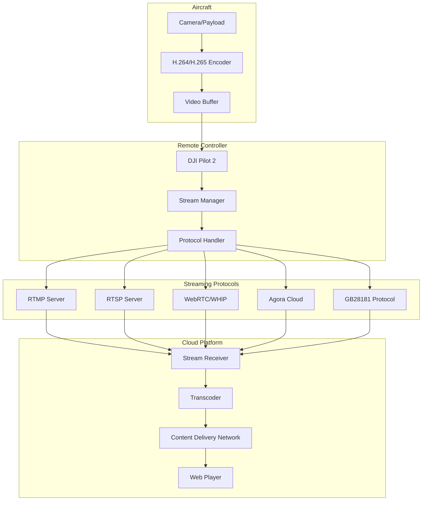
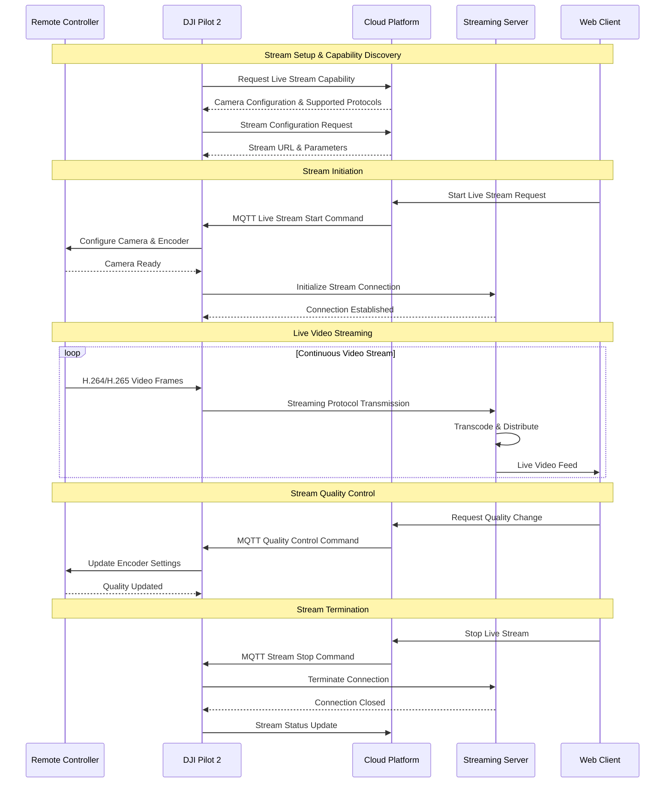

# Live Stream - Pilot Function Set

## Overview

The Live Stream feature enables real-time video transmission from DJI aircraft cameras to third-party cloud platforms. This capability supports multiple streaming protocols and provides low-latency video feeds for remote monitoring, inspection, and surveillance operations.

## Supported Devices & Cameras

| Aircraft | Camera/Payload | Video Capabilities | Max Resolution | Frame Rate |
|----------|---------------|-------------------|----------------|------------|
| **M350 RTK** | H20/H20T | Zoom + Thermal + Wide | 1920x1080 | 30fps |
| **M350 RTK** | H20N | Zoom + Wide + Starlight | 1920x1080 | 30fps |
| **M350 RTK** | H30/H30T | Zoom + Thermal + Wide | 1920x1080 | 30fps |
| **M300 RTK** | H20/H20T | Zoom + Thermal + Wide | 1920x1080 | 30fps |
| **M300 RTK** | H20N | Zoom + Wide + Starlight | 1920x1080 | 30fps |
| **M30/M30T** | Integrated | Zoom + Thermal (M30T) | 1920x1080 | 30fps |
| **M3E Series** | Integrated | 4K Mechanical Shutter | 3840x2160 | 30fps |

## Streaming Protocols & Architecture



## Live Streaming Workflow



## MQTT Commands & Events

### 1. Live Stream Start Command

**Topic:** `thing/product/{device_sn}/services`
**QoS:** 0

```json
{
    "bid": "stream_start_001",
    "tid": "txn_001",
    "timestamp": 1701234567890,
    "method": "live_start_push",
    "data": {
        "url_type": 0,
        "url": "rtmp://stream.example.com/live/stream_key_123",
        "video_id": "normal-0",
        "video_quality": 1
    }
}
```

**Response Topic:** `thing/product/{device_sn}/services_reply`
```json
{
    "bid": "stream_start_001",
    "tid": "txn_001", 
    "timestamp": 1701234567890,
    "data": {
        "result": 0,
        "output": {
            "status": "started",
            "stream_id": "stream_123"
        }
    }
}
```

### 2. Live Stream Quality Control

**Topic:** `thing/product/{device_sn}/services`
```json
{
    "bid": "quality_001",
    "tid": "txn_001",
    "timestamp": 1701234567890,
    "method": "live_set_quality",
    "data": {
        "video_id": "normal-0",
        "video_quality": 2
    }
}
```

**Quality Levels:**
- `0`: Low (720p, 1 Mbps)
- `1`: Medium (1080p, 2 Mbps)  
- `2`: High (1080p, 4 Mbps)
- `3`: Ultra (1080p, 8 Mbps)

### 3. Camera Lens Change

**Topic:** `thing/product/{device_sn}/services`
```json
{
    "bid": "lens_001",
    "tid": "txn_001",
    "timestamp": 1701234567890,
    "method": "live_lens_change",
    "data": {
        "video_index": "zoom-0",
        "video_type": "zoom"
    }
}
```

**Available Video Types:**
- `normal`: Wide angle camera
- `zoom`: Zoom camera
- `ir`: Thermal/infrared camera
- `night`: Night vision camera

## REST API Endpoints

### 1. Get Live Stream Capacity

```http
GET /manage/api/v1/devices/{device_sn}/livestream/capacity
Authorization: Bearer {jwt_token}

Response:
{
    "code": 0,
    "message": "success",
    "data": {
        "available_video_number": 1,
        "camera_list": [
            {
                "camera_index": "52-0-0",
                "camera_type": "zoom",
                "video_list": [
                    {
                        "video_index": "normal-0",
                        "video_type": "normal"
                    },
                    {
                        "video_index": "zoom-0", 
                        "video_type": "zoom"
                    },
                    {
                        "video_index": "ir-0",
                        "video_type": "ir"
                    }
                ]
            }
        ]
    }
}
```

### 2. Start Live Stream

```http
POST /manage/api/v1/livestream/start
Authorization: Bearer {jwt_token}
Content-Type: application/json

{
    "device_sn": "1ZNDH7D0010078",
    "camera_index": "52-0-0",
    "video_index": "normal-0", 
    "video_quality": 1,
    "url_type": 0,
    "custom_url": "rtmp://your.server.com/live/stream_key"
}

Response:
{
    "code": 0,
    "message": "Live stream started successfully",
    "data": {
        "stream_id": "stream_123",
        "status": "starting",
        "stream_url": "rtmp://your.server.com/live/stream_key"
    }
}
```

### 3. Stop Live Stream

```http
POST /manage/api/v1/livestream/stop
Authorization: Bearer {jwt_token}
Content-Type: application/json

{
    "device_sn": "1ZNDH7D0010078",
    "video_index": "normal-0"
}

Response:
{
    "code": 0,
    "message": "Live stream stopped successfully",
    "data": {
        "status": "stopped"
    }
}
```

### 4. Get Stream Status

```http
GET /manage/api/v1/devices/{device_sn}/livestream/status
Authorization: Bearer {jwt_token}

Response:
{
    "code": 0,
    "message": "success",
    "data": {
        "streams": [
            {
                "video_index": "normal-0",
                "status": "streaming",
                "quality": 1,
                "bitrate": 2048,
                "fps": 30,
                "duration": 1200,
                "viewers": 3
            }
        ]
    }
}
```

## Protocol Configurations

### 1. RTMP Configuration

```yaml
livestream:
  url:
    rtmp:
      url: "rtmp://stream.server.com/live/"
      stream_key: "your_stream_key"
      backup_url: "rtmp://backup.server.com/live/"
```

**RTMP URL Format:** `rtmp://{server}:{port}/{application}/{stream_key}`

### 2. RTSP Configuration

```yaml
livestream:
  url:
    rtsp:
      url: "rtsp://stream.server.com:554/live/stream"
      username: "rtsp_user"
      password: "rtsp_password"
      port: 8554
```

### 3. WebRTC/WHIP Configuration

```yaml
livestream:
  url:
    whip:
      url: "https://webrtc.server.com/whip/publish"
      bearer_token: "whip_auth_token"
      ice_servers:
        - "stun:stun.server.com:3478"
        - "turn:turn.server.com:3478"
```

### 4. Agora Configuration

```yaml
livestream:
  url:
    agora:
      app_id: "your_agora_app_id"
      channel: "live_channel_123"
      token: "agora_token"
      uid: 654321
```

### 5. GB28181 Configuration

```yaml
livestream:
  url:
    gb28181:
      server_ip: "192.168.1.100"
      server_port: 5060
      server_id: "34020000002000000001"
      agent_id: "34020000001320000001" 
      agent_password: "12345678"
      local_port: 5060
      channel: 1
```

## Code Examples

### 1. Live Stream Service Implementation

```java
@Service
public class LiveStreamService extends AbstractLivestreamService {
    
    @Autowired
    private IDeviceService deviceService;
    
    @Autowired
    private StreamingServerConfig serverConfig;
    
    public LiveStreamResponse startLiveStream(LiveStreamRequest request) {
        // Validate device and camera capabilities
        validateStreamCapabilities(request.getDeviceSn(), request.getCameraIndex());
        
        // Generate stream configuration
        StreamConfig config = generateStreamConfig(request);
        
        // Send MQTT command to device
        GatewayManager gateway = GatewayManager.getInstance(request.getDeviceSn());
        LiveStartPushRequest mqttRequest = LiveStartPushRequest.builder()
                .urlType(request.getUrlType())
                .url(config.getStreamUrl())
                .videoId(request.getVideoIndex())
                .videoQuality(request.getVideoQuality())
                .build();
        
        TopicServicesResponse<ServicesReplyData> response = 
            liveStartPush(gateway, mqttRequest);
        
        if (response.getData().getResult() == 0) {
            // Store stream session
            StreamSession session = createStreamSession(request, config);
            streamSessionService.saveSession(session);
            
            return LiveStreamResponse.success(session);
        } else {
            throw new LiveStreamException("Failed to start stream: " + 
                response.getData().getOutput());
        }
    }
    
    private StreamConfig generateStreamConfig(LiveStreamRequest request) {
        switch (request.getUrlType()) {
            case 0: // RTMP
                return generateRtmpConfig(request);
            case 1: // RTSP
                return generateRtspConfig(request);
            case 2: // WebRTC
                return generateWebRtcConfig(request);
            case 3: // Agora
                return generateAgoraConfig(request);
            case 4: // GB28181
                return generateGb28181Config(request);
            default:
                throw new IllegalArgumentException("Unsupported URL type: " + 
                    request.getUrlType());
        }
    }
    
    private StreamConfig generateRtmpConfig(LiveStreamRequest request) {
        String streamKey = generateStreamKey(request.getDeviceSn());
        String streamUrl = serverConfig.getRtmp().getUrl() + streamKey;
        
        return StreamConfig.builder()
                .protocol("RTMP")
                .streamUrl(streamUrl)
                .streamKey(streamKey)
                .build();
    }
}
```

### 2. Stream Quality Management

```java
@Component
public class StreamQualityManager {
    
    private final Map<String, QualityProfile> qualityProfiles = Map.of(
        "0", new QualityProfile(1280, 720, 1000, 25),    // Low
        "1", new QualityProfile(1920, 1080, 2000, 30),   // Medium
        "2", new QualityProfile(1920, 1080, 4000, 30),   // High
        "3", new QualityProfile(1920, 1080, 8000, 30)    // Ultra
    );
    
    public void adjustStreamQuality(String deviceSn, String videoId, int targetQuality) {
        QualityProfile profile = qualityProfiles.get(String.valueOf(targetQuality));
        
        if (profile == null) {
            throw new IllegalArgumentException("Invalid quality level: " + targetQuality);
        }
        
        // Send quality adjustment command
        GatewayManager gateway = GatewayManager.getInstance(deviceSn);
        LiveSetQualityRequest request = LiveSetQualityRequest.builder()
                .videoId(videoId)
                .videoQuality(targetQuality)
                .build();
        
        liveSetQuality(gateway, request);
        
        // Update stream session
        streamSessionService.updateQuality(deviceSn, videoId, profile);
    }
    
    @Data
    @AllArgsConstructor
    public static class QualityProfile {
        private int width;
        private int height; 
        private int bitrate; // kbps
        private int frameRate;
    }
}
```

### 3. Stream Monitoring & Analytics

```java
@Component
public class StreamMonitoringService {
    
    @Autowired
    private MeterRegistry meterRegistry;
    
    @EventListener
    public void onStreamStarted(StreamStartedEvent event) {
        // Increment stream start counter
        Counter.builder("livestream.started")
                .tag("device_sn", event.getDeviceSn())
                .tag("protocol", event.getProtocol())
                .register(meterRegistry)
                .increment();
        
        // Start stream quality monitoring
        startQualityMonitoring(event.getStreamId());
    }
    
    @Scheduled(fixedRate = 5000) // Every 5 seconds
    public void collectStreamMetrics() {
        List<StreamSession> activeSessions = streamSessionService.getActiveSessions();
        
        activeSessions.forEach(session -> {
            StreamMetrics metrics = getStreamMetrics(session.getStreamId());
            
            // Record bitrate
            Gauge.builder("livestream.bitrate")
                    .tag("stream_id", session.getStreamId())
                    .register(meterRegistry, metrics, StreamMetrics::getBitrate);
            
            // Record frame rate
            Gauge.builder("livestream.fps")
                    .tag("stream_id", session.getStreamId())
                    .register(meterRegistry, metrics, StreamMetrics::getFrameRate);
            
            // Record viewer count
            Gauge.builder("livestream.viewers")
                    .tag("stream_id", session.getStreamId())
                    .register(meterRegistry, metrics, StreamMetrics::getViewerCount);
        });
    }
}
```

### 4. Multi-Protocol Stream Handler

```java
@Component
public class MultiProtocolStreamHandler {
    
    @Autowired
    private RtmpStreamHandler rtmpHandler;
    
    @Autowired
    private RtspStreamHandler rtspHandler;
    
    @Autowired
    private WebRtcStreamHandler webRtcHandler;
    
    public StreamHandler getHandler(ProtocolType protocol) {
        switch (protocol) {
            case RTMP:
                return rtmpHandler;
            case RTSP:
                return rtspHandler;
            case WEBRTC:
                return webRtcHandler;
            case AGORA:
                return agoraHandler;
            case GB28181:
                return gb28181Handler;
            default:
                throw new UnsupportedOperationException("Protocol not supported: " + protocol);
        }
    }
    
    public void handleStreamData(String streamId, byte[] videoData) {
        StreamSession session = streamSessionService.getSession(streamId);
        StreamHandler handler = getHandler(session.getProtocol());
        
        // Process and forward stream data
        handler.processVideoFrame(videoData, session.getConfig());
        
        // Update stream statistics
        updateStreamStats(streamId, videoData.length);
    }
}
```

## Error Handling & Recovery

### Common Error Codes

| Code | Message | Cause | Resolution |
|------|---------|-------|------------|
| 345001 | Stream connection failed | Network connectivity | Check network and retry |
| 345002 | Invalid stream URL | Malformed URL | Validate URL format |
| 345003 | Camera not available | Camera in use or error | Check camera status |
| 345004 | Unsupported quality | Invalid quality level | Use supported quality levels |
| 345005 | Stream server unreachable | Server down/blocked | Check server status |

### Recovery Strategies

```java
@Component
public class StreamRecoveryService {
    
    @Retryable(value = StreamException.class, maxAttempts = 3, 
               backoff = @Backoff(delay = 5000, multiplier = 2))
    public void reconnectStream(String streamId) {
        StreamSession session = streamSessionService.getSession(streamId);
        
        try {
            // Attempt to restart stream
            restartStream(session);
            
        } catch (StreamException e) {
            if (session.getRetryCount() >= MAX_RETRY_ATTEMPTS) {
                // Mark stream as failed
                streamSessionService.markAsFailed(streamId);
                notifyStreamFailure(session);
            } else {
                // Schedule retry
                scheduleRetry(streamId, session.getRetryCount() + 1);
            }
        }
    }
    
    private void notifyStreamFailure(StreamSession session) {
        WebSocketMessageResponse<StreamFailureEvent> message = 
            WebSocketMessageResponse.<StreamFailureEvent>builder()
                .bizCode(BizCodeEnum.STREAM_FAILURE.getCode())
                .timestamp(System.currentTimeMillis())
                .data(StreamFailureEvent.builder()
                    .streamId(session.getStreamId())
                    .deviceSn(session.getDeviceSn())
                    .reason("Max retry attempts exceeded")
                    .build())
                .build();
                
        webSocketService.sendMessageByDeviceSn(session.getDeviceSn(), message);
    }
}
```

## Performance Optimization

### Encoding Settings
- **H.264 Profile:** Main or High profile for better compression
- **Keyframe Interval:** 2-4 seconds for live streaming
- **Buffer Size:** 1-2 seconds for low latency
- **Rate Control:** CBR (Constant Bitrate) for consistent quality

### Network Optimization
- **Adaptive Bitrate:** Adjust quality based on network conditions  
- **Buffer Management:** Minimize buffer size for low latency
- **Connection Redundancy:** Use backup streaming servers
- **Quality Monitoring:** Automatically adjust based on packet loss

### Resource Management
```java
@Configuration
public class StreamingResourceConfig {
    
    @Bean
    public ThreadPoolTaskExecutor streamingExecutor() {
        ThreadPoolTaskExecutor executor = new ThreadPoolTaskExecutor();
        executor.setCorePoolSize(10);
        executor.setMaxPoolSize(50);
        executor.setQueueCapacity(100);
        executor.setThreadNamePrefix("Stream-");
        return executor;
    }
    
    @Bean
    public CacheManager streamCacheManager() {
        return RedisCacheManager.builder(redisConnectionFactory)
                .cacheDefaults(cacheConfiguration())
                .build();
    }
}
```

This live streaming capability enables real-time video transmission from DJI aircraft to cloud platforms using multiple industry-standard protocols.