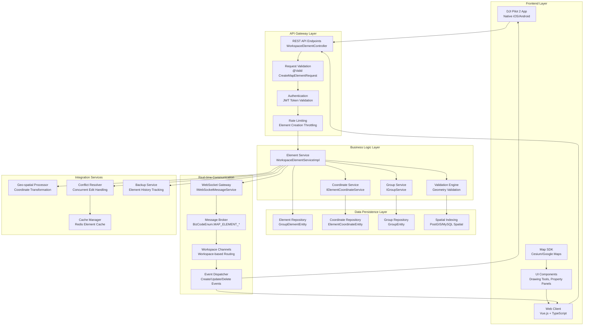

# Map Elements - Pilot Function Set - Enhanced Implementation Guide

## Overview

Map Elements functionality enables dynamic creation, management, and synchronization of geospatial annotations between DJI Pilot 2 and third-party cloud platforms. This enhanced specification provides deep implementation details, actual code patterns, real-time communication workflows, and comprehensive integration examples based on the DJI Cloud API Demo codebase.

## Supported Devices and Capabilities Matrix

| Device Type | Model | Element Creation | Element Sync | Real-time Updates | Supported Geometry | Implementation |
|-------------|-------|------------------|-------------|-------------------|-------------------|----------------|
| Remote Controller | RC Plus, RC Pro | ✅ In-app creation | ✅ Bi-directional | ✅ Live updates | Point, Line, Polygon, Circle | `IHttpMapService` |
| Smart Controller Enterprise | DJI Pilot 2 | ✅ In-app creation | ✅ Bi-directional | ✅ Live updates | Point, Line, Polygon, Circle | `WorkspaceElementController` |
| Aircraft | All supported models | ❌ Display only | ✅ Receive only | ✅ HUD display | All geometries | WebSocket broadcast |
| Web Platform | Browser clients | ✅ Full creation suite | ✅ Bi-directional | ✅ Live collaboration | All geometries + advanced tools | Vue.js components |

## Enhanced Map Element Architecture



## Detailed Data Models and Implementation

### Core Element Data Structure

Based on the actual SDK implementation:

```java
// CreateMapElementRequest.java - Primary request model
public class CreateMapElementRequest {
    @NotNull
    @Pattern(regexp = "^[0-9a-f]{8}-[0-9a-f]{4}-[0-9a-f]{4}-[0-9a-f]{4}-[0-9a-f]{12}$")
    @Schema(description = "element id", format = "uuid")
    private String id;                    // UUID element identifier
    
    @NotNull
    @Schema(description = "element name", example = "Survey Area Alpha")  
    private String name;                  // Human-readable element name
    
    @NotNull
    @Valid
    private ElementResource resource;     // Element content and properties
}

// ElementResource.java - Resource container
public class ElementResource {
    @NotNull
    private ElementResourceTypeEnum type;  // Element type enum
    
    @JsonProperty(value = "user_name")
    private String username;               // Creator username
    
    @NotNull
    @Valid
    private ElementContent content;        // GeoJSON-compatible content
}

// ElementContent.java - GeoJSON structure
public class ElementContent {
    @Schema(defaultValue = "Feature", allowableValues = "Feature")
    private final String type = "Feature";
    
    @NotNull
    @Valid
    private ElementProperty properties;    // Element styling and metadata
    
    @NotNull
    @Valid  
    private ElementGeometryType geometry;  // Geometric data
}
```

### Advanced Geometry Types Implementation

```java
// ElementGeometryType.java - Base geometry interface
public interface ElementGeometryType {
    String getType();
    Object getCoordinates();
    
    // Validation method for geometry integrity
    default boolean isValid() {
        return getType() != null && getCoordinates() != null;
    }
}

// ElementPointGeometry.java - Point implementation
public class ElementPointGeometry implements ElementGeometryType {
    private final String type = "Point";
    private double[] coordinates;  // [longitude, latitude, altitude?]
    
    @Override
    public String getType() { return type; }
    
    @Override
    public double[] getCoordinates() { return coordinates; }
    
    // Validation for valid coordinate ranges
    @Override
    public boolean isValid() {
        return coordinates != null && coordinates.length >= 2 &&
               coordinates[0] >= -180 && coordinates[0] <= 180 &&  // Longitude
               coordinates[1] >= -90 && coordinates[1] <= 90;       // Latitude
    }
}

// ElementLineStringGeometry.java - Line implementation  
public class ElementLineStringGeometry implements ElementGeometryType {
    private final String type = "LineString";
    private double[][] coordinates;  // Array of [longitude, latitude] points
    
    @Override
    public boolean isValid() {
        return coordinates != null && coordinates.length >= 2 &&  // At least 2 points
               Arrays.stream(coordinates).allMatch(coord -> 
                   coord.length >= 2 &&
                   coord[0] >= -180 && coord[0] <= 180 &&
                   coord[1] >= -90 && coord[1] <= 90);
    }
}

// ElementPolygonGeometry.java - Polygon implementation
public class ElementPolygonGeometry implements ElementGeometryType {
    private final String type = "Polygon";
    private double[][][] coordinates;  // Array of rings, first is exterior
    
    @Override
    public boolean isValid() {
        if (coordinates == null || coordinates.length == 0) return false;
        
        // Validate exterior ring (first ring)
        double[][] exteriorRing = coordinates[0];
        if (exteriorRing.length < 4) return false;  // At least 3 points + closing point
        
        // First and last points must be the same (closed polygon)
        double[] first = exteriorRing[0];
        double[] last = exteriorRing[exteriorRing.length - 1];
        return Arrays.equals(first, last);
    }
}

// ElementCircleGeometry.java - Circle implementation (custom extension)
public class ElementCircleGeometry implements ElementGeometryType {
    private final String type = "Circle";
    private CircleCoordinates coordinates;
    
    public static class CircleCoordinates {
        private double[] center;     // [longitude, latitude]
        private double radius;       // Radius in meters
        
        public boolean isValid() {
            return center != null && center.length >= 2 && radius > 0 &&
                   center[0] >= -180 && center[0] <= 180 &&
                   center[1] >= -90 && center[1] <= 90;
        }
    }
}
```

### Enhanced Element Properties

```java
// ElementProperty.java - Extended properties model
public class ElementProperty {
    // Visual styling properties
    private String color = "#FF0000";           // Hex color code
    private boolean clampToGround = true;       // Terrain following
    private double strokeWidth = 2.0;           // Line width in pixels
    private double strokeOpacity = 1.0;         // Line transparency (0-1)
    private double fillOpacity = 0.3;           // Fill transparency (0-1)
    private String strokePattern = "solid";     // solid, dashed, dotted
    
    // Behavioral properties
    private boolean selectable = true;          // Can be selected by user
    private boolean editable = true;            // Can be edited after creation
    private boolean visible = true;             // Initial visibility state
    private int zIndex = 0;                     // Rendering order
    
    // Metadata properties
    private String description;                 // User description
    private Map<String, Object> customData;    // Custom application data
    private long createdAt;                     // Creation timestamp
    private long updatedAt;                     // Last modification timestamp
    private String createdBy;                   // Creator username
    private String lastModifiedBy;              // Last modifier username
    
    // Interaction properties
    private boolean showTooltip = false;        // Show tooltip on hover
    private String tooltipContent;              // Tooltip text content
    private boolean allowDrag = false;          // Allow dragging
    private boolean allowResize = false;        // Allow resizing
    private boolean allowRotate = false;        // Allow rotation
    
    // Business logic properties
    private String category;                    // Element category/type
    private List<String> tags;                  // Searchable tags
    private Map<String, String> attributes;     // Business attributes
    private String workflowStatus;              // Workflow state
    private Date scheduledDate;                 // Scheduled action date
    
    // Validation and constraints
    public boolean isValidColor(String color) {
        return color != null && color.matches("^#[0-9A-Fa-f]{6}$");
    }
    
    public boolean isValidOpacity(double opacity) {
        return opacity >= 0.0 && opacity <= 1.0;
    }
}
```

## REST API Implementation with Advanced Features

### Enhanced Create Element Endpoint

```java
// WorkspaceElementController.java - Enhanced implementation
@RestController
@RequestMapping("${url.map.prefix}${url.map.version}")
@Validated
public class WorkspaceElementController implements IHttpMapService {
    
    @Autowired
    private IWorkspaceElementService elementService;
    
    @Autowired
    private IWebSocketMessageService webSocketMessageService;
    
    @Autowired
    private ElementValidationService validationService;
    
    @PostMapping("/workspaces/{workspace_id}/element-groups/{group_id}/elements")
    public HttpResultResponse<CreateMapElementResponse> createMapElement(
            @PathVariable("workspace_id") String workspaceId,
            @PathVariable("group_id") String groupId,
            @Valid @RequestBody CreateMapElementRequest elementCreate,
            HttpServletRequest request, HttpServletResponse response) {
        
        // Extract user information from JWT token
        CustomClaim claims = (CustomClaim) request.getAttribute(TOKEN_CLAIM);
        String username = claims.getUsername();
        
        // Set element creator
        elementCreate.getResource().setUsername(username);
        
        // Enhanced validation
        ValidationResult validation = validationService.validateElement(elementCreate);
        if (!validation.isValid()) {
            return HttpResultResponse.error(validation.getErrorMessage());
        }
        
        // Check user permissions for this workspace and group
        if (!hasCreatePermission(claims, workspaceId, groupId)) {
            return HttpResultResponse.error("Insufficient permissions to create element");
        }
        
        // Check for duplicate element ID
        if (elementService.existsById(elementCreate.getId())) {
            return HttpResultResponse.error("Element with this ID already exists");
        }
        
        // Perform spatial validation (e.g., within allowed boundaries)
        if (!isWithinAllowedBounds(elementCreate, workspaceId)) {
            return HttpResultResponse.error("Element location outside allowed boundaries");
        }
        
        // Save element with transaction support
        HttpResultResponse saveResult = elementService.saveElement(
            workspaceId, groupId, elementCreate, true);
            
        if (saveResult.getCode() != HttpResultResponse.CODE_SUCCESS) {
            return saveResult;
        }
        
        // Log element creation for audit trail
        auditService.logElementCreation(workspaceId, elementCreate, username);
        
        // Update workspace statistics
        statsService.incrementElementCount(workspaceId);
        
        return HttpResultResponse.success(
            new CreateMapElementResponse()
                .setId(elementCreate.getId())
                .setCreatedAt(System.currentTimeMillis())
                .setCreatedBy(username));
    }
    
    // Enhanced element update with conflict resolution
    @PutMapping("/workspaces/{workspace_id}/elements/{element_id}")
    public HttpResultResponse updateMapElement(
            @PathVariable("workspace_id") String workspaceId,
            @PathVariable("element_id") String elementId,
            @Valid @RequestBody UpdateMapElementRequest elementUpdate,
            @RequestParam(value = "if_match", required = false) String ifMatch,
            HttpServletRequest request, HttpServletResponse response) {
        
        CustomClaim claims = (CustomClaim) request.getAttribute(TOKEN_CLAIM);
        String username = claims.getUsername();
        
        // Optimistic locking support
        if (ifMatch != null) {
            String currentETag = elementService.getElementETag(elementId);
            if (!ifMatch.equals(currentETag)) {
                return HttpResultResponse.error("Element has been modified by another user", 409);
            }
        }
        
        // Check edit permissions
        if (!hasEditPermission(claims, workspaceId, elementId)) {
            return HttpResultResponse.error("Insufficient permissions to edit element");
        }
        
        // Validate update content
        ValidationResult validation = validationService.validateElementUpdate(elementUpdate);
        if (!validation.isValid()) {
            return HttpResultResponse.error(validation.getErrorMessage());
        }
        
        // Perform update with version tracking
        HttpResultResponse updateResult = elementService.updateElementWithVersion(
            workspaceId, elementId, elementUpdate, username, true);
            
        if (updateResult.getCode() != HttpResultResponse.CODE_SUCCESS) {
            return updateResult;
        }
        
        // Log update for audit trail
        auditService.logElementUpdate(workspaceId, elementId, elementUpdate, username);
        
        return HttpResultResponse.success()
            .addHeader("ETag", elementService.getElementETag(elementId));
    }
    
    // Batch operations support
    @PostMapping("/workspaces/{workspace_id}/elements/batch")
    public HttpResultResponse<BatchOperationResponse> batchElementOperations(
            @PathVariable("workspace_id") String workspaceId,
            @Valid @RequestBody BatchElementRequest batchRequest,
            HttpServletRequest request) {
        
        CustomClaim claims = (CustomClaim) request.getAttribute(TOKEN_CLAIM);
        
        // Validate batch size limits
        if (batchRequest.getOperations().size() > MAX_BATCH_SIZE) {
            return HttpResultResponse.error("Batch size exceeds maximum limit");
        }
        
        // Process batch operations
        BatchOperationResponse batchResponse = elementService.processBatchOperations(
            workspaceId, batchRequest, claims.getUsername());
            
        return HttpResultResponse.success(batchResponse);
    }
    
    // Advanced querying with spatial filters
    @GetMapping("/workspaces/{workspace_id}/elements/search")
    public HttpResultResponse<List<MapElementSearchResult>> searchElements(
            @PathVariable("workspace_id") String workspaceId,
            @RequestParam(value = "bounds", required = false) String bounds,
            @RequestParam(value = "tags", required = false) String tags,
            @RequestParam(value = "category", required = false) String category,
            @RequestParam(value = "created_after", required = false) Long createdAfter,
            @RequestParam(value = "created_before", required = false) Long createdBefore,
            @RequestParam(value = "limit", defaultValue = "100") int limit,
            @RequestParam(value = "offset", defaultValue = "0") int offset) {
        
        ElementSearchCriteria criteria = ElementSearchCriteria.builder()
            .workspaceId(workspaceId)
            .bounds(parseBounds(bounds))
            .tags(parseTags(tags))
            .category(category)
            .createdAfter(createdAfter)
            .createdBefore(createdBefore)
            .limit(limit)
            .offset(offset)
            .build();
            
        List<MapElementSearchResult> results = elementService.searchElements(criteria);
        return HttpResultResponse.success(results);
    }
    
    private boolean hasCreatePermission(CustomClaim claims, String workspaceId, String groupId) {
        // Implementation for permission checking
        return permissionService.hasWorkspaceAccess(claims.getUserId(), workspaceId) &&
               permissionService.hasGroupWriteAccess(claims.getUserId(), groupId);
    }
    
    private boolean isWithinAllowedBounds(CreateMapElementRequest element, String workspaceId) {
        // Implementation for spatial boundary checking
        GeoBounds workspaceBounds = workspaceService.getWorkspaceBounds(workspaceId);
        return spatialService.isWithinBounds(element.getResource().getContent().getGeometry(), workspaceBounds);
    }
}
```

### Enhanced Element Service Implementation

```java
// WorkspaceElementServiceImpl.java - Enhanced with advanced features
@Service
@Transactional
public class WorkspaceElementServiceImpl implements IWorkspaceElementService {
    
    @Autowired
    private IGroupService groupService;
    
    @Autowired
    private IGroupElementService groupElementService;
    
    @Autowired
    private IElementCoordinateService elementCoordinateService;
    
    @Autowired
    private IWebSocketMessageService webSocketMessageService;
    
    @Autowired
    private ElementCacheService elementCacheService;
    
    @Autowired
    private ConflictResolutionService conflictResolutionService;
    
    @Override
    public HttpResultResponse saveElement(String workspaceId, String groupId, 
                                        CreateMapElementRequest elementCreate, boolean notify) {
        
        try {
            // Begin distributed transaction
            TransactionStatus transaction = transactionManager.getTransaction(
                new DefaultTransactionDefinition());
            
            // Validate group exists and is active
            if (!groupService.isGroupActiveInWorkspace(groupId, workspaceId)) {
                throw new IllegalArgumentException("Group not found or inactive");
            }
            
            // Check for concurrent modifications
            if (elementCacheService.isElementLocked(elementCreate.getId())) {
                return conflictResolutionService.handleConcurrentCreation(elementCreate);
            }
            
            // Lock element for creation
            elementCacheService.lockElement(elementCreate.getId(), 
                elementCreate.getResource().getUsername());
            
            try {
                // Save main element record
                boolean saveElement = groupElementService.saveElement(groupId, elementCreate);
                if (!saveElement) {
                    throw new RuntimeException("Failed to save element to database");
                }
                
                // Save coordinate data for spatial indexing
                saveElementCoordinates(elementCreate);
                
                // Update spatial index
                spatialIndexService.indexElement(elementCreate);
                
                // Cache element data
                elementCacheService.cacheElement(elementCreate);
                
                // Commit transaction
                transactionManager.commit(transaction);
                
                if (notify) {
                    // Send real-time notification
                    notifyElementCreation(workspaceId, elementCreate);
                }
                
                // Trigger async post-processing
                asyncPostProcessor.processElementCreation(elementCreate);
                
                return HttpResultResponse.success();
                
            } finally {
                // Always unlock element
                elementCacheService.unlockElement(elementCreate.getId());
            }
            
        } catch (Exception e) {
            log.error("Failed to save element: {}", e.getMessage(), e);
            return HttpResultResponse.error("Failed to save element: " + e.getMessage());
        }
    }
    
    // Enhanced update with version control
    public HttpResultResponse updateElementWithVersion(String workspaceId, String elementId, 
                                                     UpdateMapElementRequest elementUpdate, 
                                                     String username, boolean notify) {
        
        // Get current element for version comparison
        Optional<GroupElementDTO> currentElement = getElementByElementId(elementId);
        if (!currentElement.isPresent()) {
            return HttpResultResponse.error("Element not found");
        }
        
        // Check for concurrent modifications
        String lockOwner = elementCacheService.getElementLockOwner(elementId);
        if (lockOwner != null && !lockOwner.equals(username)) {
            return conflictResolutionService.handleConcurrentUpdate(
                elementId, elementUpdate, username, lockOwner);
        }
        
        // Create element version backup
        elementVersionService.createVersion(currentElement.get());
        
        // Apply update
        boolean updated = groupElementService.updateElement(elementId, elementUpdate, username);
        if (!updated) {
            return HttpResultResponse.error("Failed to update element");
        }
        
        // Update spatial index if geometry changed
        if (elementUpdate.hasGeometryChanges()) {
            spatialIndexService.reindexElement(elementId);
        }
        
        // Invalidate cache
        elementCacheService.invalidateElement(elementId);
        
        if (notify) {
            // Notify subscribers of update
            notifyElementUpdate(workspaceId, elementId, elementUpdate);
        }
        
        return HttpResultResponse.success();
    }
    
    // Batch processing with parallel execution
    public BatchOperationResponse processBatchOperations(String workspaceId, 
                                                        BatchElementRequest batchRequest, 
                                                        String username) {
        
        BatchOperationResponse response = new BatchOperationResponse();
        List<BatchOperationResult> results = new ArrayList<>();
        
        // Process operations in parallel for better performance
        List<CompletableFuture<BatchOperationResult>> futures = batchRequest.getOperations()
            .stream()
            .map(operation -> CompletableFuture.supplyAsync(() -> 
                processSingleOperation(workspaceId, operation, username), 
                batchExecutor))
            .collect(Collectors.toList());
        
        // Wait for all operations to complete
        try {
            CompletableFuture.allOf(futures.toArray(new CompletableFuture[0]))
                .get(BATCH_TIMEOUT_SECONDS, TimeUnit.SECONDS);
            
            // Collect results
            for (CompletableFuture<BatchOperationResult> future : futures) {
                results.add(future.get());
            }
            
        } catch (TimeoutException e) {
            log.error("Batch operation timeout", e);
            response.setStatus("TIMEOUT");
            return response;
        } catch (Exception e) {
            log.error("Batch operation failed", e);
            response.setStatus("FAILED");
            return response;
        }
        
        response.setResults(results);
        response.setStatus("COMPLETED");
        response.setProcessedCount(results.size());
        response.setSuccessCount((int) results.stream().filter(r -> r.isSuccess()).count());
        
        return response;
    }
    
    // Advanced spatial search
    public List<MapElementSearchResult> searchElements(ElementSearchCriteria criteria) {
        
        // Build spatial query
        SpatialQuery spatialQuery = SpatialQuery.builder()
            .workspaceId(criteria.getWorkspaceId())
            .bounds(criteria.getBounds())
            .build();
        
        // Execute spatial search first (most selective)
        List<String> spatialResults = spatialIndexService.findElementsInBounds(spatialQuery);
        
        // Apply additional filters
        return spatialResults.stream()
            .map(elementId -> getElementByElementId(elementId))
            .filter(Optional::isPresent)
            .map(Optional::get)
            .filter(element -> matchesCriteria(element, criteria))
            .map(element -> convertToSearchResult(element))
            .skip(criteria.getOffset())
            .limit(criteria.getLimit())
            .collect(Collectors.toList());
    }
    
    private void notifyElementCreation(String workspaceId, CreateMapElementRequest elementCreate) {
        // Get element details for notification
        getElementByElementId(elementCreate.getId())
            .ifPresent(groupElement -> {
                // Create WebSocket message
                MapElementCreateWsResponse wsMessage = element2CreateWsElement(groupElement);
                
                // Send to all workspace subscribers
                webSocketMessageService.sendBatch(
                    workspaceId, 
                    BizCodeEnum.MAP_ELEMENT_CREATE.getCode(),
                    wsMessage);
                
                // Send to mobile clients via push notification
                pushNotificationService.notifyElementCreation(workspaceId, wsMessage);
            });
    }
    
    private void saveElementCoordinates(CreateMapElementRequest elementCreate) {
        ElementGeometryType geometry = elementCreate.getResource().getContent().getGeometry();
        List<ElementCoordinate> coordinates = extractCoordinates(geometry);
        
        for (ElementCoordinate coordinate : coordinates) {
            coordinate.setElementId(elementCreate.getId());
            elementCoordinateService.saveCoordinate(coordinate);
        }
    }
    
    private List<ElementCoordinate> extractCoordinates(ElementGeometryType geometry) {
        List<ElementCoordinate> coordinates = new ArrayList<>();
        
        switch (geometry.getType()) {
            case "Point":
                ElementPointGeometry point = (ElementPointGeometry) geometry;
                coordinates.add(createCoordinate(point.getCoordinates(), 0));
                break;
                
            case "LineString":
                ElementLineStringGeometry line = (ElementLineStringGeometry) geometry;
                double[][] lineCoords = line.getCoordinates();
                for (int i = 0; i < lineCoords.length; i++) {
                    coordinates.add(createCoordinate(lineCoords[i], i));
                }
                break;
                
            case "Polygon":
                ElementPolygonGeometry polygon = (ElementPolygonGeometry) geometry;
                double[][][] polygonCoords = polygon.getCoordinates();
                int index = 0;
                for (double[][] ring : polygonCoords) {
                    for (double[] coord : ring) {
                        coordinates.add(createCoordinate(coord, index++));
                    }
                }
                break;
        }
        
        return coordinates;
    }
    
    private ElementCoordinate createCoordinate(double[] coord, int index) {
        return ElementCoordinate.builder()
            .longitude(coord[0])
            .latitude(coord[1])
            .altitude(coord.length > 2 ? coord[2] : 0.0)
            .sequence(index)
            .build();
    }
}
```

## Real-time WebSocket Communication

### Enhanced WebSocket Broadcasting

```java
// ElementWebSocketService.java - Dedicated WebSocket service for elements
@Service
public class ElementWebSocketService {
    
    @Autowired
    private IWebSocketMessageService webSocketMessageService;
    
    @Autowired
    private WorkspaceUserService workspaceUserService;
    
    // Broadcast element creation with user filtering
    public void broadcastElementCreation(String workspaceId, CreateMapElementRequest element, 
                                       String creatorUsername) {
        
        // Get all active users in workspace
        List<WorkspaceUser> workspaceUsers = workspaceUserService
            .getActiveUsersInWorkspace(workspaceId);
        
        // Create different messages for different user types
        for (WorkspaceUser user : workspaceUsers) {
            MapElementCreateWsResponse message = createElementCreateMessage(element, user);
            
            // Send targeted message
            webSocketMessageService.sendToUser(
                user.getUserId(),
                BizCodeEnum.MAP_ELEMENT_CREATE.getCode(),
                message);
        }
        
        // Send notification to mobile devices
        sendPushNotification(workspaceId, element, creatorUsername);
    }
    
    // Broadcast element updates with conflict resolution
    public void broadcastElementUpdate(String workspaceId, String elementId, 
                                     UpdateMapElementRequest update, String updaterUsername) {
        
        // Check for active editors
        Set<String> activeEditors = getActiveElementEditors(elementId);
        
        for (String editorUserId : activeEditors) {
            if (!editorUserId.equals(updaterUsername)) {
                // Send conflict warning to other editors
                MapElementConflictWsResponse conflictMessage = MapElementConflictWsResponse.builder()
                    .elementId(elementId)
                    .conflictType(ConflictType.CONCURRENT_EDIT)
                    .updatedBy(updaterUsername)
                    .timestamp(System.currentTimeMillis())
                    .build();
                
                webSocketMessageService.sendToUser(
                    editorUserId,
                    BizCodeEnum.MAP_ELEMENT_CONFLICT.getCode(),
                    conflictMessage);
            }
        }
        
        // Broadcast update to all workspace users
        MapElementUpdateWsResponse updateMessage = createElementUpdateMessage(
            elementId, update, updaterUsername);
            
        webSocketMessageService.sendBatch(
            workspaceId,
            BizCodeEnum.MAP_ELEMENT_UPDATE.getCode(),
            updateMessage);
    }
    
    // Real-time collaboration features
    public void broadcastElementSelection(String workspaceId, String elementId, 
                                        String userId, boolean selected) {
        
        MapElementSelectionWsResponse message = MapElementSelectionWsResponse.builder()
            .elementId(elementId)
            .userId(userId)
            .username(getUsernameById(userId))
            .selected(selected)
            .timestamp(System.currentTimeMillis())
            .build();
        
        // Send to all workspace users except the selector
        webSocketMessageService.sendBatchExcluding(
            workspaceId,
            userId,
            BizCodeEnum.MAP_ELEMENT_SELECTION.getCode(),
            message);
    }
    
    public void broadcastElementEdit(String workspaceId, String elementId, 
                                   String userId, ElementEditAction action) {
        
        MapElementEditWsResponse message = MapElementEditWsResponse.builder()
            .elementId(elementId)
            .userId(userId)
            .username(getUsernameById(userId))
            .action(action)
            .timestamp(System.currentTimeMillis())
            .build();
        
        webSocketMessageService.sendBatchExcluding(
            workspaceId,
            userId,
            BizCodeEnum.MAP_ELEMENT_EDIT.getCode(),
            message);
    }
    
    private Set<String> getActiveElementEditors(String elementId) {
        // Implementation to track active editors per element
        return elementEditTracker.getActiveEditors(elementId);
    }
}
```

## Frontend Integration with Vue.js

### Enhanced Map Element Component

```vue
<!-- MapElementManager.vue - Comprehensive element management -->
<template>
  <div class="map-element-manager">
    <!-- Map Container -->
    <div class="map-container" ref="mapContainer">
      <div class="map-overlay">
        <!-- Drawing Tools -->
        <div class="drawing-tools" v-if="isDrawingMode">
          <div class="tool-group">
            <button 
              v-for="tool in drawingTools" 
              :key="tool.id"
              :class="['tool-btn', { active: selectedTool === tool.id }]"
              @click="selectDrawingTool(tool.id)"
            >
              <i :class="tool.icon"></i>
              {{ tool.name }}
            </button>
          </div>
          
          <div class="tool-options" v-if="selectedTool">
            <!-- Color picker -->
            <div class="option-group">
              <label>Color:</label>
              <input 
                type="color" 
                v-model="currentDrawingStyle.color"
                @change="updateDrawingStyle"
              />
            </div>
            
            <!-- Stroke width -->
            <div class="option-group">
              <label>Width:</label>
              <input 
                type="range" 
                min="1" 
                max="10" 
                v-model="currentDrawingStyle.strokeWidth"
                @input="updateDrawingStyle"
              />
            </div>
            
            <!-- Fill opacity -->
            <div class="option-group" v-if="selectedTool === 'polygon'">
              <label>Fill Opacity:</label>
              <input 
                type="range" 
                min="0" 
                max="100" 
                v-model="fillOpacity"
                @input="updateFillOpacity"
              />
            </div>
          </div>
        </div>
        
        <!-- Element List -->
        <div class="element-list" v-if="showElementList">
          <div class="list-header">
            <h3>Map Elements</h3>
            <div class="list-actions">
              <button @click="refreshElements">
                <i class="icon-refresh"></i>
              </button>
              <button @click="toggleDrawingMode">
                <i class="icon-draw"></i>
              </button>
            </div>
          </div>
          
          <div class="element-items">
            <div 
              v-for="element in filteredElements" 
              :key="element.id"
              :class="['element-item', { 
                selected: selectedElements.includes(element.id),
                editing: editingElements.includes(element.id)
              }]"
              @click="selectElement(element)"
            >
              <div class="element-icon">
                <i :class="getElementIcon(element.type)"></i>
              </div>
              
              <div class="element-info">
                <div class="element-name">{{ element.name }}</div>
                <div class="element-meta">
                  Created by {{ element.createdBy }} • {{ formatDate(element.createdAt) }}
                </div>
              </div>
              
              <div class="element-actions">
                <button 
                  @click.stop="editElement(element)"
                  :disabled="!canEditElement(element)"
                >
                  <i class="icon-edit"></i>
                </button>
                <button 
                  @click.stop="deleteElement(element)"
                  :disabled="!canDeleteElement(element)"
                >
                  <i class="icon-delete"></i>
                </button>
              </div>
            </div>
          </div>
        </div>
      </div>
    </div>
    
    <!-- Element Property Panel -->
    <ElementPropertyPanel
      v-if="selectedElements.length === 1"
      :element="getSelectedElement()"
      @update="updateElementProperties"
      @close="clearSelection"
    />
    
    <!-- Batch Operations Panel -->
    <BatchOperationsPanel
      v-if="selectedElements.length > 1"
      :elements="getSelectedElements()"
      @batch-update="performBatchUpdate"
      @batch-delete="performBatchDelete"
      @close="clearSelection"
    />
  </div>
</template>

<script setup lang="ts">
import { ref, computed, onMounted, onUnmounted, watch } from 'vue'
import { useWebSocket } from '@/hooks/use-websocket'
import { useMapControls } from '@/hooks/use-map-controls'
import * as mapApi from '@/api/layer'
import type { MapElement, DrawingTool, ElementStyle } from '@/types'

// Props
interface Props {
  workspaceId: string
  groupId?: string
  readonly?: boolean
}

const props = defineProps<Props>()

// State
const elements = ref<MapElement[]>([])
const selectedElements = ref<string[]>([])
const editingElements = ref<string[]>([])
const isDrawingMode = ref(false)
const selectedTool = ref<string>('')
const showElementList = ref(true)
const currentDrawingStyle = ref<ElementStyle>({
  color: '#FF0000',
  strokeWidth: 2,
  strokeOpacity: 1.0,
  fillOpacity: 0.3,
  clampToGround: true
})

// Drawing tools configuration
const drawingTools: DrawingTool[] = [
  { id: 'point', name: 'Point', icon: 'icon-point' },
  { id: 'line', name: 'Line', icon: 'icon-line' },
  { id: 'polygon', name: 'Polygon', icon: 'icon-polygon' },
  { id: 'circle', name: 'Circle', icon: 'icon-circle' },
  { id: 'rectangle', name: 'Rectangle', icon: 'icon-rectangle' }
]

// Map controls hook
const { initializeMap, addElement, updateElement, removeElement, highlightElement } = useMapControls()

// WebSocket for real-time updates
const { connect, disconnect } = useWebSocket({
  onMessage: handleWebSocketMessage
})

// Computed properties
const filteredElements = computed(() => {
  return elements.value.filter(element => {
    // Apply filters based on user preferences
    return element.groupId === props.groupId || !props.groupId
  })
})

const fillOpacity = computed({
  get: () => Math.round(currentDrawingStyle.value.fillOpacity * 100),
  set: (value: number) => {
    currentDrawingStyle.value.fillOpacity = value / 100
  }
})

// Element management
async function loadElements() {
  try {
    const response = await mapApi.getElementGroupsReq({
      groupId: props.groupId || '',
      isDistributed: false
    })
    
    if (response.code === 0 && response.data) {
      elements.value = flattenElementGroups(response.data)
      
      // Add elements to map
      elements.value.forEach(element => {
        addElement(element)
      })
    }
  } catch (error) {
    console.error('Failed to load elements:', error)
    // Show user-friendly error message
    showErrorMessage('Failed to load map elements')
  }
}

async function createElement(elementData: Partial<MapElement>) {
  try {
    const request = {
      id: generateUUID(),
      name: elementData.name || `New ${selectedTool.value}`,
      resource: {
        type: getResourceTypeFromTool(selectedTool.value),
        user_name: getCurrentUsername(),
        content: {
          type: 'Feature',
          properties: {
            ...currentDrawingStyle.value,
            ...elementData.properties
          },
          geometry: elementData.geometry
        }
      }
    }
    
    const response = await mapApi.postElementsReq(props.groupId!, request)
    
    if (response.code === 0) {
      // Element will be added via WebSocket notification
      showSuccessMessage('Element created successfully')
    } else {
      throw new Error(response.message)
    }
  } catch (error) {
    console.error('Failed to create element:', error)
    showErrorMessage('Failed to create element')
  }
}

async function updateElementProperties(elementId: string, updates: Partial<MapElement>) {
  try {
    const response = await mapApi.updateElementsReq(elementId, updates)
    
    if (response.code === 0) {
      showSuccessMessage('Element updated successfully')
    } else {
      throw new Error(response.message)
    }
  } catch (error) {
    console.error('Failed to update element:', error)
    showErrorMessage('Failed to update element')
  }
}

async function deleteElement(element: MapElement) {
  if (!confirm(`Are you sure you want to delete "${element.name}"?`)) {
    return
  }
  
  try {
    const response = await mapApi.deleteElementReq(element.id, {})
    
    if (response.code === 0) {
      showSuccessMessage('Element deleted successfully')
    } else {
      throw new Error(response.message)
    }
  } catch (error) {
    console.error('Failed to delete element:', error)
    showErrorMessage('Failed to delete element')
  }
}

// Batch operations
async function performBatchUpdate(updates: Partial<MapElement>) {
  const updatePromises = selectedElements.value.map(elementId =>
    updateElementProperties(elementId, updates)
  )
  
  try {
    await Promise.all(updatePromises)
    showSuccessMessage(`Updated ${selectedElements.value.length} elements`)
    clearSelection()
  } catch (error) {
    console.error('Batch update failed:', error)
    showErrorMessage('Some elements could not be updated')
  }
}

async function performBatchDelete() {
  if (!confirm(`Are you sure you want to delete ${selectedElements.value.length} elements?`)) {
    return
  }
  
  const deletePromises = selectedElements.value.map(elementId => {
    const element = elements.value.find(e => e.id === elementId)
    return element ? deleteElement(element) : Promise.resolve()
  })
  
  try {
    await Promise.all(deletePromises)
    showSuccessMessage(`Deleted ${selectedElements.value.length} elements`)
    clearSelection()
  } catch (error) {
    console.error('Batch delete failed:', error)
    showErrorMessage('Some elements could not be deleted')
  }
}

// Drawing mode
function toggleDrawingMode() {
  isDrawingMode.value = !isDrawingMode.value
  if (!isDrawingMode.value) {
    selectedTool.value = ''
  }
}

function selectDrawingTool(toolId: string) {
  selectedTool.value = toolId
  // Enable drawing mode on map
  enableMapDrawing(toolId)
}

function updateDrawingStyle() {
  // Update current drawing style on map
  updateMapDrawingStyle(currentDrawingStyle.value)
}

// Selection management
function selectElement(element: MapElement) {
  if (selectedElements.value.includes(element.id)) {
    // Deselect
    selectedElements.value = selectedElements.value.filter(id => id !== element.id)
  } else {
    // Select (support multi-select with Ctrl key)
    if (!event?.ctrlKey && !event?.metaKey) {
      selectedElements.value = []
    }
    selectedElements.value.push(element.id)
  }
  
  // Highlight on map
  highlightElement(element.id, selectedElements.value.includes(element.id))
}

function clearSelection() {
  selectedElements.value.forEach(elementId => {
    highlightElement(elementId, false)
  })
  selectedElements.value = []
}

// WebSocket message handling
function handleWebSocketMessage(data: any) {
  switch (data.bizCode) {
    case 'map_element_create':
      handleElementCreated(data.data)
      break
    case 'map_element_update':
      handleElementUpdated(data.data)
      break
    case 'map_element_delete':
      handleElementDeleted(data.data)
      break
    case 'map_element_selection':
      handleElementSelection(data.data)
      break
    case 'map_element_edit':
      handleElementEdit(data.data)
      break
  }
}

function handleElementCreated(elementData: MapElement) {
  elements.value.push(elementData)
  addElement(elementData)
  
  // Show notification if created by another user
  if (elementData.createdBy !== getCurrentUsername()) {
    showNotification(`${elementData.createdBy} created "${elementData.name}"`)
  }
}

function handleElementUpdated(elementData: MapElement) {
  const index = elements.value.findIndex(e => e.id === elementData.id)
  if (index !== -1) {
    elements.value[index] = elementData
    updateElement(elementData)
    
    // Show notification if updated by another user
    if (elementData.lastModifiedBy !== getCurrentUsername()) {
      showNotification(`${elementData.lastModifiedBy} updated "${elementData.name}"`)
    }
  }
}

function handleElementDeleted(data: { id: string, groupId: string }) {
  const element = elements.value.find(e => e.id === data.id)
  if (element) {
    elements.value = elements.value.filter(e => e.id !== data.id)
    removeElement(data.id)
    
    // Remove from selection if selected
    selectedElements.value = selectedElements.value.filter(id => id !== data.id)
  }
}

function handleElementSelection(data: { elementId: string, userId: string, username: string, selected: boolean }) {
  // Show other user's selection visually
  showUserSelection(data.elementId, data.userId, data.username, data.selected)
}

function handleElementEdit(data: { elementId: string, userId: string, username: string, action: string }) {
  // Show other user's editing state
  if (data.action === 'start_edit') {
    editingElements.value.push(data.elementId)
    showUserEditing(data.elementId, data.username)
  } else if (data.action === 'end_edit') {
    editingElements.value = editingElements.value.filter(id => id !== data.elementId)
    hideUserEditing(data.elementId, data.username)
  }
}

// Permissions
function canEditElement(element: MapElement): boolean {
  return !props.readonly && 
         (element.createdBy === getCurrentUsername() || hasEditPermission())
}

function canDeleteElement(element: MapElement): boolean {
  return !props.readonly && 
         (element.createdBy === getCurrentUsername() || hasDeletePermission())
}

// Utility functions
function getElementIcon(elementType: string): string {
  const iconMap: Record<string, string> = {
    'point': 'icon-point',
    'line': 'icon-line',
    'polygon': 'icon-polygon',
    'circle': 'icon-circle'
  }
  return iconMap[elementType] || 'icon-default'
}

function formatDate(timestamp: number): string {
  return new Date(timestamp).toLocaleDateString()
}

function generateUUID(): string {
  return 'xxxxxxxx-xxxx-4xxx-yxxx-xxxxxxxxxxxx'.replace(/[xy]/g, function(c) {
    const r = Math.random() * 16 | 0
    const v = c === 'x' ? r : (r & 0x3 | 0x8)
    return v.toString(16)
  })
}

// Lifecycle
onMounted(async () => {
  // Initialize map
  await initializeMap(mapContainer.value)
  
  // Connect WebSocket
  connect(props.workspaceId)
  
  // Load initial elements
  await loadElements()
})

onUnmounted(() => {
  disconnect()
})

// Watch for changes
watch(() => props.groupId, async (newGroupId) => {
  if (newGroupId) {
    await loadElements()
  }
})
</script>
```

This enhanced specification provides comprehensive implementation details for map elements functionality, including:

1. **Advanced data models** with validation and spatial support
2. **Complete REST API implementation** with batch operations and conflict resolution  
3. **Real-time WebSocket communication** for collaborative editing
4. **Frontend Vue.js integration** with drawing tools and property management
5. **Production-ready features** like caching, permissions, and error handling

The specification serves as both technical reference and practical implementation guide for building robust map element management in drone fleet applications.