# Map Elements - Pilot Function Set

## Overview

Map Elements functionality enables dynamic creation, management, and synchronization of geospatial annotations between DJI Pilot 2 and third-party cloud platforms. This feature supports various geometric elements like points, lines, polygons, and circles for mission planning, area marking, and situational awareness.

## Supported Devices

| Device Type | Model | Element Creation | Element Sync | Real-time Updates |
|-------------|-------|------------------|-------------|-------------------|
| Remote Controller | RC Plus, RC Pro | ✅ In-app creation | ✅ Bi-directional | ✅ Live updates |
| Smart Controller Enterprise | DJI Pilot 2 | ✅ In-app creation | ✅ Bi-directional | ✅ Live updates |
| Aircraft | All supported models | ❌ Display only | ✅ Receive only | ✅ HUD display |

## Map Element Types & Geometry

```mermaid
graph TB
    subgraph "Map Element Types"
        Point[Point Elements<br/>• Waypoints<br/>• POI Markers<br/>• Alert Locations]
        Line[Line Elements<br/>• Flight Paths<br/>• Boundaries<br/>• Routes]
        Polygon[Polygon Elements<br/>• Areas of Interest<br/>• No-fly Zones<br/>• Work Areas]
        Circle[Circle Elements<br/>• Radius Zones<br/>• Buffer Areas<br/>• Alert Perimeters]
    end
    
    subgraph "Element Properties"
        Geometry[Geometry Data<br/>• Coordinates<br/>• Dimensions<br/>• Elevation]
        Style[Style Properties<br/>• Colors<br/>• Line Width<br/>• Fill Patterns]
        Metadata[Metadata<br/>• Name/Description<br/>• Creation Time<br/>• Creator Info]
        Behavior[Behavior Settings<br/>• Visibility Rules<br/>• Interaction Type<br/>• Persistence]
    end
    
    Point --> Geometry
    Line --> Geometry
    Polygon --> Geometry
    Circle --> Geometry
    
    Geometry --> Style
    Style --> Metadata
    Metadata --> Behavior
```



## Element Synchronization Workflow


## REST API Endpoints

### 1. Create Map Element

```http
POST /map/api/v1/elements
Authorization: Bearer {jwt_token}
Content-Type: application/json

{
    "name": "Survey Area Alpha",
    "type": 2,
    "sub_type": 1,
    "content": {
        "geometry": {
            "type": "Polygon",
            "coordinates": [
                [
                    [120.123456, 30.123456, 100.0],
                    [120.124456, 30.123456, 100.0],
                    [120.124456, 30.124456, 100.0],
                    [120.123456, 30.124456, 100.0],
                    [120.123456, 30.123456, 100.0]
                ]
            ]
        },
        "style": {
            "stroke_color": "#FF0000",
            "stroke_width": 3,
            "fill_color": "#FF000033",
            "stroke_style": 1
        }
    },
    "property": {
        "description": "Primary survey area for infrastructure inspection",
        "priority": 1,
        "visible": true,
        "editable": true
    }
}

Response:
{
    "code": 0,
    "message": "Element created successfully",
    "data": {
        "element_id": "elem_123456",
        "create_time": "2023-12-01T10:00:00Z",
        "update_time": "2023-12-01T10:00:00Z"
    }
}
```

### 2. Get Map Elements

```http
GET /map/api/v1/elements
Authorization: Bearer {jwt_token}
Parameters:
- workspace_id: string (optional)
- group_id: string (optional)  
- element_type: integer (optional)
- bbox: string (optional, format: "west,south,east,north")

Response:
{
    "code": 0,
    "message": "success",
    "data": [
        {
            "element_id": "elem_123456",
            "name": "Survey Area Alpha",
            "type": 2,
            "sub_type": 1,
            "content": {
                "geometry": {
                    "type": "Polygon",
                    "coordinates": [...],
                    "elevation": 100.0
                },
                "style": {
                    "stroke_color": "#FF0000",
                    "stroke_width": 3,
                    "fill_color": "#FF000033"
                }
            },
            "property": {
                "description": "Primary survey area",
                "priority": 1,
                "visible": true,
                "create_time": "2023-12-01T10:00:00Z",
                "creator": "user_123"
            }
        }
    ]
}
```

### 3. Update Map Element

```http
PUT /map/api/v1/elements/{element_id}
Authorization: Bearer {jwt_token}
Content-Type: application/json

{
    "name": "Survey Area Alpha - Updated",
    "content": {
        "style": {
            "stroke_color": "#00FF00",
            "stroke_width": 4
        }
    },
    "property": {
        "description": "Updated survey area with new boundaries",
        "priority": 2
    }
}

Response:
{
    "code": 0,
    "message": "Element updated successfully",
    "data": {
        "element_id": "elem_123456",
        "update_time": "2023-12-01T10:30:00Z"
    }
}
```

### 4. Delete Map Element

```http
DELETE /map/api/v1/elements/{element_id}
Authorization: Bearer {jwt_token}

Response:
{
    "code": 0,
    "message": "Element deleted successfully"
}
```

## WebSocket Real-time Updates

### Element Creation Event
```json
{
    "biz_code": "element_create",
    "timestamp": 1701234567890,
    "data": {
        "element_id": "elem_123456",
        "workspace_id": "workspace_123",
        "action": "create",
        "element": {
            "name": "New Survey Point",
            "type": 1,
            "geometry": {
                "type": "Point",
                "coordinates": [120.123456, 30.123456, 100.0]
            }
        }
    }
}
```

### Element Update Event
```json
{
    "biz_code": "element_update",
    "timestamp": 1701234567890,
    "data": {
        "element_id": "elem_123456",
        "workspace_id": "workspace_123", 
        "action": "update",
        "changes": {
            "style": {
                "stroke_color": "#00FF00"
            },
            "property": {
                "priority": 2
            }
        }
    }
}
```

### Batch Element Sync Event
```json
{
    "biz_code": "elements_refresh",
    "timestamp": 1701234567890,
    "data": {
        "workspace_id": "workspace_123",
        "total_elements": 15,
        "elements": [...] // Full element list
    }
}
```

## Map Element Data Models

### Geometry Types

**Point Geometry:**
```json
{
    "type": "Point",
    "coordinates": [longitude, latitude, altitude]
}
```

**LineString Geometry:**
```json
{
    "type": "LineString",
    "coordinates": [
        [longitude1, latitude1, altitude1],
        [longitude2, latitude2, altitude2],
        [longitude3, latitude3, altitude3]
    ]
}
```

**Polygon Geometry:**
```json
{
    "type": "Polygon", 
    "coordinates": [
        [
            [lon1, lat1, alt1],
            [lon2, lat2, alt2],
            [lon3, lat3, alt3],
            [lon1, lat1, alt1]
        ]
    ]
}
```

**Circle Geometry:**
```json
{
    "type": "Circle",
    "coordinates": [center_longitude, center_latitude, altitude],
    "radius": 500.0
}
```

### Element Types Enumeration

| Type | Sub Type | Description | Use Case |
|------|----------|-------------|----------|
| 1 | 0 | Point - Marker | General waypoints, POI |
| 1 | 1 | Point - Warning | Alert locations, hazards |
| 1 | 2 | Point - Home | Home points, landing zones |
| 2 | 0 | Line - Path | Flight routes, boundaries |
| 2 | 1 | Line - Pipeline | Infrastructure lines |
| 3 | 0 | Polygon - Area | Work areas, regions |
| 3 | 1 | Polygon - No-fly | Restricted zones |
| 4 | 0 | Circle - Buffer | Radius zones |
| 4 | 1 | Circle - Search | Search patterns |

## Code Examples

### 1. Map Elements Service Implementation

```java
@Service
public class MapElementsService implements IHttpMapService {
    
    @Autowired
    private IElementCoordinateService coordinateService;
    
    @Autowired
    private IGroupElementService groupService;
    
    @Autowired
    private IWebSocketMessageService webSocketService;
    
    @Override
    public HttpResultResponse<CreateMapElementResponse> createElement(
            CreateMapElementRequest request) {
        
        // Validate geometry and properties
        validateElementGeometry(request.getContent().getGeometry());
        validateElementProperties(request);
        
        // Create element entity
        GroupElementEntity element = GroupElementEntity.builder()
                .name(request.getName())
                .type(request.getType())
                .subType(request.getSubType())
                .workspaceId(getCurrentWorkspaceId())
                .createTime(new Date())
                .updateTime(new Date())
                .build();
        
        groupService.save(element);
        
        // Save geometry coordinates
        saveElementGeometry(element.getId(), request.getContent().getGeometry());
        
        // Broadcast creation event
        broadcastElementCreated(element);
        
        return HttpResultResponse.success(
            CreateMapElementResponse.builder()
                .elementId(element.getId())
                .createTime(element.getCreateTime())
                .build()
        );
    }
    
    private void saveElementGeometry(String elementId, ElementGeometry geometry) {
        List<ElementCoordinateEntity> coordinates = new ArrayList<>();
        
        switch (geometry.getType()) {
            case POINT:
                coordinates.add(createCoordinateEntity(elementId, geometry.getCoordinates().get(0), 0));
                break;
                
            case LINE_STRING:
                for (int i = 0; i < geometry.getCoordinates().size(); i++) {
                    coordinates.add(createCoordinateEntity(elementId, geometry.getCoordinates().get(i), i));
                }
                break;
                
            case POLYGON:
                List<List<Double>> ring = geometry.getCoordinates().get(0); // Outer ring
                for (int i = 0; i < ring.size(); i++) {
                    coordinates.add(createCoordinateEntity(elementId, ring.get(i), i));
                }
                break;
                
            case CIRCLE:
                List<Double> center = geometry.getCoordinates().get(0);
                ElementCoordinateEntity centerPoint = createCoordinateEntity(elementId, center, 0);
                centerPoint.setRadius(geometry.getRadius());
                coordinates.add(centerPoint);
                break;
        }
        
        coordinateService.saveBatch(coordinates);
    }
    
    private void broadcastElementCreated(GroupElementEntity element) {
        MapElementCreateWsResponse wsResponse = MapElementCreateWsResponse.builder()
                .elementId(element.getId())
                .workspaceId(element.getWorkspaceId())
                .action("create")
                .element(convertToElementData(element))
                .build();
        
        WebSocketMessageResponse<MapElementCreateWsResponse> message = 
            WebSocketMessageResponse.<MapElementCreateWsResponse>builder()
                .bizCode(BizCodeEnum.ELEMENT_CREATE.getCode())
                .timestamp(System.currentTimeMillis())
                .data(wsResponse)
                .build();
        
        webSocketService.sendMessageByWorkspaceId(element.getWorkspaceId(), message);
    }
}
```

### 2. Element Geometry Validator

```java
@Component
public class ElementGeometryValidator {
    
    private static final double MAX_COORDINATE_PRECISION = 1e-6;
    private static final double MIN_LATITUDE = -90.0;
    private static final double MAX_LATITUDE = 90.0;
    private static final double MIN_LONGITUDE = -180.0;
    private static final double MAX_LONGITUDE = 180.0;
    
    public void validateGeometry(ElementGeometry geometry) {
        switch (geometry.getType()) {
            case POINT:
                validatePoint(geometry);
                break;
            case LINE_STRING:
                validateLineString(geometry);
                break;
            case POLYGON:
                validatePolygon(geometry);
                break;
            case CIRCLE:
                validateCircle(geometry);
                break;
            default:
                throw new IllegalArgumentException("Unsupported geometry type: " + geometry.getType());
        }
    }
    
    private void validatePoint(ElementGeometry geometry) {
        if (geometry.getCoordinates().size() != 1) {
            throw new ValidationException("Point must have exactly one coordinate");
        }
        
        List<Double> coord = geometry.getCoordinates().get(0);
        validateCoordinate(coord);
    }
    
    private void validateLineString(ElementGeometry geometry) {
        if (geometry.getCoordinates().size() < 2) {
            throw new ValidationException("LineString must have at least 2 coordinates");
        }
        
        geometry.getCoordinates().forEach(this::validateCoordinate);
    }
    
    private void validatePolygon(ElementGeometry geometry) {
        if (geometry.getCoordinates().size() < 1) {
            throw new ValidationException("Polygon must have at least one ring");
        }
        
        List<List<Double>> ring = geometry.getCoordinates();
        if (ring.size() < 4) {
            throw new ValidationException("Polygon ring must have at least 4 coordinates");
        }
        
        // Validate closed ring (first and last coordinates must be the same)
        List<Double> first = ring.get(0);
        List<Double> last = ring.get(ring.size() - 1);
        if (!coordinatesEqual(first, last)) {
            throw new ValidationException("Polygon ring must be closed");
        }
        
        ring.forEach(this::validateCoordinate);
    }
    
    private void validateCircle(ElementGeometry geometry) {
        validatePoint(geometry); // Center point validation
        
        if (geometry.getRadius() == null || geometry.getRadius() <= 0) {
            throw new ValidationException("Circle radius must be positive");
        }
        
        if (geometry.getRadius() > 50000) { // 50km max radius
            throw new ValidationException("Circle radius cannot exceed 50km");
        }
    }
    
    private void validateCoordinate(List<Double> coordinate) {
        if (coordinate.size() < 2 || coordinate.size() > 3) {
            throw new ValidationException("Coordinate must have 2 or 3 dimensions [lon, lat, alt?]");
        }
        
        double longitude = coordinate.get(0);
        double latitude = coordinate.get(1);
        
        if (longitude < MIN_LONGITUDE || longitude > MAX_LONGITUDE) {
            throw new ValidationException("Invalid longitude: " + longitude);
        }
        
        if (latitude < MIN_LATITUDE || latitude > MAX_LATITUDE) {
            throw new ValidationException("Invalid latitude: " + latitude);
        }
        
        // Optional altitude validation
        if (coordinate.size() == 3) {
            double altitude = coordinate.get(2);
            if (altitude < -1000 || altitude > 10000) { // Reasonable altitude bounds
                throw new ValidationException("Invalid altitude: " + altitude);
            }
        }
    }
}
```

### 3. Element Group Management

```java
@Service
public class ElementGroupService {
    
    @Autowired
    private IGroupService groupService;
    
    @Autowired
    private IGroupElementService groupElementService;
    
    public GroupDTO createElementGroup(CreateGroupRequest request) {
        GroupEntity group = GroupEntity.builder()
                .name(request.getName())
                .description(request.getDescription())
                .workspaceId(getCurrentWorkspaceId())
                .type(request.getGroupType())
                .createTime(new Date())
                .updateTime(new Date())
                .build();
        
        groupService.save(group);
        
        // Add initial elements to group if specified
        if (!CollectionUtils.isEmpty(request.getElementIds())) {
            addElementsToGroup(group.getId(), request.getElementIds());
        }
        
        return convertToGroupDTO(group);
    }
    
    public void addElementsToGroup(String groupId, List<String> elementIds) {
        elementIds.forEach(elementId -> {
            GroupElementEntity element = groupElementService.getById(elementId);
            if (element != null) {
                element.setGroupId(groupId);
                element.setUpdateTime(new Date());
                groupElementService.updateById(element);
            }
        });
        
        // Broadcast group update
        broadcastGroupRefresh(groupId);
    }
    
    private void broadcastGroupRefresh(String groupId) {
        List<GroupElementEntity> elements = groupElementService.getElementsByGroupId(groupId);
        
        MapGroupRefreshWsResponse wsResponse = MapGroupRefreshWsResponse.builder()
                .groupId(groupId)
                .elements(elements.stream()
                    .map(this::convertToElementData)
                    .collect(Collectors.toList()))
                .build();
        
        WebSocketMessageResponse<MapGroupRefreshWsResponse> message = 
            WebSocketMessageResponse.<MapGroupRefreshWsResponse>builder()
                .bizCode(BizCodeEnum.GROUP_REFRESH.getCode())
                .timestamp(System.currentTimeMillis())
                .data(wsResponse)
                .build();
        
        webSocketService.sendMessageToAll(message);
    }
}
```

### 4. Spatial Query Service

```java
@Service
public class SpatialQueryService {
    
    @Autowired
    private IElementCoordinateService coordinateService;
    
    public List<GroupElementEntity> findElementsInBounds(BoundingBox bounds) {
        return coordinateService.findElementsInBounds(
            bounds.getWest(), bounds.getSouth(),
            bounds.getEast(), bounds.getNorth()
        );
    }
    
    public List<GroupElementEntity> findElementsWithinRadius(
            double centerLat, double centerLon, double radiusMeters) {
        
        return coordinateService.findElementsWithinRadius(
            centerLat, centerLon, radiusMeters
        );
    }
    
    public boolean isPointInPolygon(double lat, double lon, String polygonElementId) {
        List<ElementCoordinateEntity> coordinates = 
            coordinateService.getCoordinatesByElementId(polygonElementId);
        
        return GeometryUtils.pointInPolygon(lat, lon, coordinates);
    }
    
    @Data
    @Builder
    public static class BoundingBox {
        private double north;
        private double south;
        private double east;
        private double west;
    }
}
```

## Element Styling & Visualization

### Style Properties

```java
@Data
@Builder
public class ElementStyle {
    private String strokeColor;     // Hex color code (e.g., "#FF0000")
    private Integer strokeWidth;    // Line width in pixels
    private Integer strokeStyle;    // Line style: 0=solid, 1=dashed, 2=dotted
    private String fillColor;       // Fill color with alpha (e.g., "#FF000033")
    private Integer fillPattern;    // Fill pattern: 0=solid, 1=hatched, 2=cross
    private String iconUrl;         // Icon URL for point elements
    private Double iconScale;       // Icon scale factor
    private Integer zIndex;         // Drawing order priority
}
```

### Default Styles by Element Type

| Element Type | Default Stroke | Default Fill | Icon |
|-------------|----------------|--------------|------|
| Point - Marker | `#3388FF` | N/A | 📍 |
| Point - Warning | `#FF4444` | N/A | ⚠️ |
| Point - Home | `#00AA00` | N/A | 🏠 |
| Line - Path | `#3388FF` | N/A | N/A |
| Polygon - Area | `#3388FF` | `#3388FF33` | N/A |
| Polygon - No-fly | `#FF4444` | `#FF444433` | N/A |
| Circle - Buffer | `#FFAA00` | `#FFAA0033` | N/A |

## Performance & Optimization

### Efficient Element Loading
```java
@Service
public class ElementLoadingOptimizer {
    
    @Cacheable(value = "mapElements", key = "#workspaceId + '_' + #bounds")
    public List<GroupElementEntity> getElementsInViewport(
            String workspaceId, BoundingBox bounds) {
        
        // Load only elements visible in current viewport
        return elementService.findElementsInBounds(bounds)
                .stream()
                .filter(element -> element.getWorkspaceId().equals(workspaceId))
                .limit(MAX_ELEMENTS_PER_VIEWPORT)
                .collect(Collectors.toList());
    }
    
    @Async
    public CompletableFuture<Void> preloadAdjacentAreas(BoundingBox currentBounds) {
        // Preload elements in adjacent areas for smooth map panning
        List<BoundingBox> adjacentBounds = calculateAdjacentBounds(currentBounds);
        
        adjacentBounds.forEach(bounds -> {
            elementService.findElementsInBounds(bounds);
        });
        
        return CompletableFuture.completedFuture(null);
    }
}
```

### WebSocket Message Batching
```java
@Component
public class ElementUpdateBatcher {
    
    private final Map<String, List<ElementUpdate>> pendingUpdates = new ConcurrentHashMap<>();
    
    @Scheduled(fixedDelay = 500) // Batch updates every 500ms
    public void flushPendingUpdates() {
        pendingUpdates.forEach((workspaceId, updates) -> {
            if (!updates.isEmpty()) {
                sendBatchedUpdate(workspaceId, updates);
                updates.clear();
            }
        });
    }
    
    public void queueElementUpdate(String workspaceId, ElementUpdate update) {
        pendingUpdates.computeIfAbsent(workspaceId, k -> new ArrayList<>()).add(update);
        
        // Send immediately if batch size threshold reached
        if (pendingUpdates.get(workspaceId).size() >= BATCH_SIZE_THRESHOLD) {
            sendBatchedUpdate(workspaceId, pendingUpdates.get(workspaceId));
            pendingUpdates.get(workspaceId).clear();
        }
    }
}
```

This Map Elements feature provides comprehensive geospatial annotation capabilities with real-time synchronization between DJI Pilot 2 and cloud platforms.