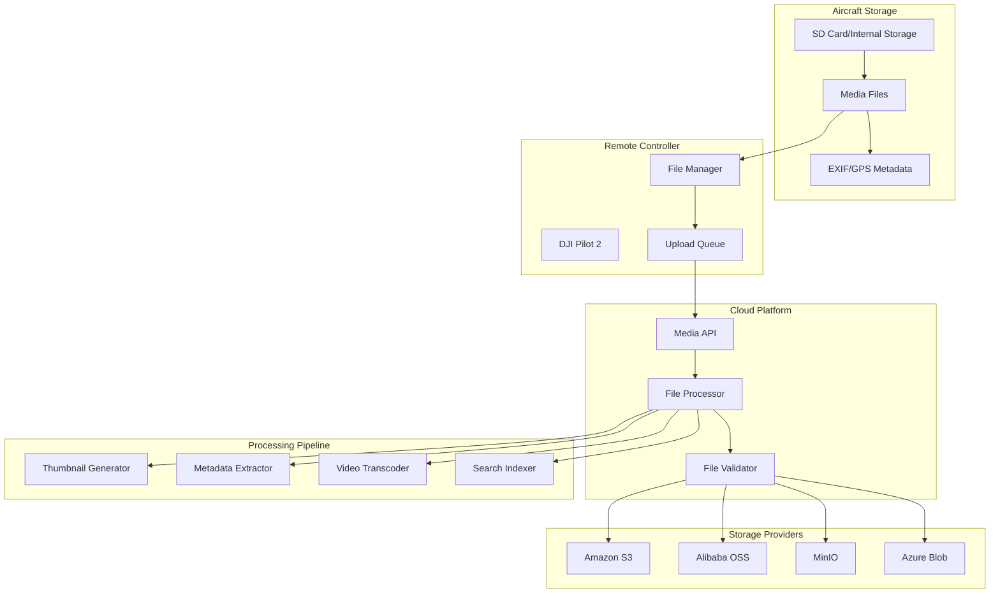
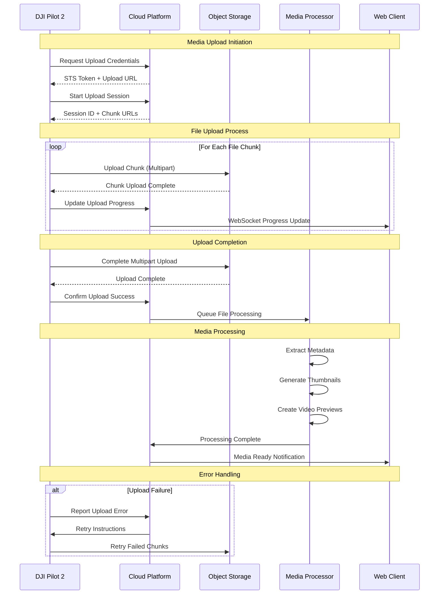

# Media Management - Pilot Function Set

## Overview

Media Management enables automated and on-demand upload of photos, videos, and other media files captured by DJI aircraft to third-party cloud storage platforms. This feature supports various storage providers, file types, and upload strategies with progress tracking and metadata management.

## Supported Devices & Media Types

| Aircraft | Camera/Payload | Photo Formats | Video Formats | Max File Size |
|----------|---------------|---------------|---------------|---------------|
| **M350 RTK** | H20/H20T | JPEG, DNG | MP4, MOV | 4GB |
| **M350 RTK** | H20N | JPEG, DNG | MP4, MOV | 4GB |
| **M350 RTK** | H30/H30T | JPEG, DNG | MP4, MOV | 4GB |
| **M300 RTK** | H20/H20T | JPEG, DNG | MP4, MOV | 4GB |
| **M30/M30T** | Integrated | JPEG, DNG | MP4, MOV | 4GB |
| **M3E Series** | Integrated | JPEG, DNG | MP4, MOV | 4GB |

### Supported File Types

| Category | Extensions | Description |
|----------|------------|-------------|
| **Images** | .jpg, .jpeg, .dng, .tiff | Photos and raw images |
| **Videos** | .mp4, .mov, .avi | Video recordings |
| **Thermal** | .rjpeg, .r.jpg | Thermal imaging files |
| **Panorama** | .jpg (composite) | Panoramic photos |
| **Timelapse** | .mp4 | Time-lapse videos |
| **Hyperlapse** | .mp4 | Hyperlapse videos |

## Media Upload Architecture



## Upload Workflow & Process



## REST API Endpoints

### 1. Get Upload Credentials

```http
GET /media/api/v1/sts/credentials
Authorization: Bearer {jwt_token}
Parameters:
- file_count: integer (number of files to upload)
- total_size: integer (total size in bytes)

Response:
{
    "code": 0,
    "message": "success",
    "data": {
        "access_key_id": "STS_ACCESS_KEY",
        "access_key_secret": "STS_SECRET_KEY",
        "security_token": "STS_TOKEN",
        "expire": 3600,
        "region": "us-east-1",
        "bucket": "media-upload-bucket",
        "object_key_prefix": "workspace_123/device_456/"
    }
}
```

### 2. Fast Upload Check (Deduplication)

```http
POST /media/api/v1/fast-upload
Authorization: Bearer {jwt_token}
Content-Type: application/json

{
    "files": [
        {
            "fingerprint": "md5:abc123def456",
            "filename": "IMG_001.jpg",
            "path": "DCIM/Camera/IMG_001.jpg",
            "size": 2048576
        }
    ]
}

Response:
{
    "code": 0,
    "message": "success", 
    "data": {
        "results": [
            {
                "fingerprint": "md5:abc123def456",
                "exist": true,
                "object_key": "workspace_123/device_456/IMG_001.jpg",
                "skip_upload": true
            }
        ]
    }
}
```

### 3. Upload Status Report

```http
POST /media/api/v1/upload/report
Authorization: Bearer {jwt_token}
Content-Type: application/json

{
    "files": [
        {
            "fingerprint": "md5:abc123def456",
            "object_key": "workspace_123/device_456/IMG_001.jpg",
            "filename": "IMG_001.jpg",
            "path": "DCIM/Camera/IMG_001.jpg",
            "size": 2048576,
            "uploaded_time": "2023-12-01T10:30:00Z",
            "metadata": {
                "width": 4000,
                "height": 3000,
                "camera_model": "DJI H20T",
                "iso": 100,
                "focal_length": "24mm",
                "gps": {
                    "latitude": 40.123456,
                    "longitude": -74.123456,
                    "altitude": 120.5
                }
            }
        }
    ]
}

Response:
{
    "code": 0,
    "message": "Upload report processed successfully"
}
```

### 4. Get Media Files

```http
GET /media/api/v1/files
Authorization: Bearer {jwt_token}
Parameters:
- workspace_id: string (optional)
- device_sn: string (optional)
- file_type: string (photo|video|thermal)
- start_time: string (ISO 8601)
- end_time: string (ISO 8601)
- page: integer (default: 1)
- page_size: integer (default: 50, max: 100)

Response:
{
    "code": 0,
    "message": "success",
    "data": {
        "files": [
            {
                "file_id": "file_123456",
                "filename": "IMG_001.jpg",
                "file_type": "photo",
                "file_size": 2048576,
                "device_sn": "1ZNDH7D0010078",
                "captured_time": "2023-12-01T10:00:00Z",
                "uploaded_time": "2023-12-01T10:30:00Z",
                "thumbnail_url": "https://cdn.example.com/thumbnails/thumb_123.jpg",
                "download_url": "https://cdn.example.com/media/IMG_001.jpg",
                "metadata": {
                    "camera": "H20T",
                    "resolution": "4000x3000",
                    "gps_location": {
                        "lat": 40.123456,
                        "lng": -74.123456,
                        "alt": 120.5
                    }
                }
            }
        ],
        "pagination": {
            "page": 1,
            "page_size": 50,
            "total": 150,
            "total_pages": 3
        }
    }
}
```

### 5. Delete Media Files

```http
DELETE /media/api/v1/files/{file_id}
Authorization: Bearer {jwt_token}

Response:
{
    "code": 0,
    "message": "File deleted successfully"
}
```

## MQTT Upload Events

### Upload Progress Event

**Topic:** `thing/product/{device_sn}/events`
**QoS:** 1

```json
{
    "bid": "upload_progress_001",
    "tid": "txn_001",
    "timestamp": 1701234567890,
    "method": "file_upload_progress",
    "data": {
        "session_id": "upload_session_123",
        "files": [
            {
                "filename": "IMG_001.jpg",
                "size": 2048576,
                "uploaded": 1024288,
                "progress": 50,
                "status": "uploading"
            }
        ],
        "total_progress": 30,
        "upload_rate": 512000
    }
}
```

### Upload Completion Event

```json
{
    "bid": "upload_complete_001", 
    "tid": "txn_001",
    "timestamp": 1701234567890,
    "method": "file_upload_complete",
    "data": {
        "session_id": "upload_session_123",
        "total_files": 10,
        "successful_files": 9,
        "failed_files": 1,
        "total_size": 52428800,
        "upload_duration": 300,
        "failures": [
            {
                "filename": "VID_002.mp4",
                "error_code": 336001,
                "error_message": "Network timeout"
            }
        ]
    }
}
```

## Code Examples

### 1. Media Upload Service Implementation

```java
@Service
public class MediaUploadService extends AbstractMediaService {
    
    @Autowired
    private IOssService ossService;
    
    @Autowired
    private IFileService fileService;
    
    @Autowired
    private MediaProcessingService processingService;
    
    public StsCredentialsResponse getUploadCredentials(String workspaceId, 
                                                      int fileCount, long totalSize) {
        // Generate STS credentials for secure upload
        StsCredentialsResponse credentials = ossService.generateStsCredentials(
            workspaceId, fileCount, totalSize);
        
        // Log credential generation for audit
        auditService.logCredentialGeneration(workspaceId, fileCount, totalSize);
        
        return credentials;
    }
    
    public FastUploadResponse checkFastUpload(FastUploadRequest request) {
        List<FastUploadResult> results = new ArrayList<>();
        
        for (FastUploadFile file : request.getFiles()) {
            // Check if file already exists in storage
            boolean exists = fileService.existsByFingerprint(file.getFingerprint());
            
            FastUploadResult result = FastUploadResult.builder()
                    .fingerprint(file.getFingerprint())
                    .exist(exists)
                    .skipUpload(exists)
                    .build();
            
            if (exists) {
                // Get existing file metadata
                MediaFileEntity existingFile = fileService.getByFingerprint(file.getFingerprint());
                result.setObjectKey(existingFile.getObjectKey());
            }
            
            results.add(result);
        }
        
        return FastUploadResponse.builder().results(results).build();
    }
    
    @Async
    public CompletableFuture<Void> processUploadReport(UploadReportRequest request) {
        for (UploadReportFile file : request.getFiles()) {
            try {
                // Save file metadata
                MediaFileEntity fileEntity = createFileEntity(file);
                fileService.save(fileEntity);
                
                // Queue for processing (thumbnail generation, metadata extraction)
                processingService.queueFileProcessing(fileEntity);
                
                // Send upload success notification
                sendUploadSuccessNotification(file);
                
            } catch (Exception e) {
                log.error("Failed to process upload report for file: {}", 
                    file.getFilename(), e);
                sendUploadErrorNotification(file, e.getMessage());
            }
        }
        
        return CompletableFuture.completedFuture(null);
    }
    
    private MediaFileEntity createFileEntity(UploadReportFile file) {
        return MediaFileEntity.builder()
                .filename(file.getFilename())
                .objectKey(file.getObjectKey())
                .fingerprint(file.getFingerprint())
                .size(file.getSize())
                .deviceSn(getCurrentDeviceSn())
                .workspaceId(getCurrentWorkspaceId())
                .capturedTime(parseTimeFromFilename(file.getFilename()))
                .uploadedTime(file.getUploadedTime())
                .fileType(determineFileType(file.getFilename()))
                .metadata(convertMetadata(file.getMetadata()))
                .build();
    }
}
```

### 2. Media Processing Service

```java
@Service
public class MediaProcessingService {
    
    @Autowired
    private ThumbnailGenerator thumbnailGenerator;
    
    @Autowired
    private MetadataExtractor metadataExtractor;
    
    @Autowired
    private VideoTranscoder videoTranscoder;
    
    @Async("mediaProcessingExecutor")
    public CompletableFuture<Void> processMediaFile(MediaFileEntity file) {
        try {
            // Download file from storage for processing
            byte[] fileData = ossService.downloadFile(file.getObjectKey());
            
            if (isImageFile(file)) {
                processImageFile(file, fileData);
            } else if (isVideoFile(file)) {
                processVideoFile(file, fileData);
            }
            
            // Update processing status
            file.setProcessingStatus("completed");
            file.setProcessedTime(new Date());
            fileService.updateById(file);
            
            // Send processing completion notification
            sendProcessingCompleteNotification(file);
            
        } catch (Exception e) {
            log.error("Failed to process media file: {}", file.getFilename(), e);
            
            file.setProcessingStatus("failed");
            file.setErrorMessage(e.getMessage());
            fileService.updateById(file);
        }
        
        return CompletableFuture.completedFuture(null);
    }
    
    private void processImageFile(MediaFileEntity file, byte[] imageData) {
        // Generate thumbnail
        byte[] thumbnail = thumbnailGenerator.generateThumbnail(imageData, 200, 200);
        String thumbnailKey = file.getObjectKey().replace("media/", "thumbnails/");
        ossService.uploadFile(thumbnailKey, thumbnail);
        file.setThumbnailUrl(ossService.getFileUrl(thumbnailKey));
        
        // Extract detailed metadata
        ImageMetadata metadata = metadataExtractor.extractImageMetadata(imageData);
        file.setWidth(metadata.getWidth());
        file.setHeight(metadata.getHeight());
        file.setCameraModel(metadata.getCameraModel());
        file.setIso(metadata.getIso());
        file.setFocalLength(metadata.getFocalLength());
        
        // Extract GPS data if available
        if (metadata.hasGpsData()) {
            file.setLatitude(metadata.getLatitude());
            file.setLongitude(metadata.getLongitude());
            file.setAltitude(metadata.getAltitude());
        }
    }
    
    private void processVideoFile(MediaFileEntity file, byte[] videoData) {
        // Generate video thumbnail (first frame)
        byte[] thumbnail = videoTranscoder.extractFrame(videoData, 0);
        String thumbnailKey = file.getObjectKey().replace("media/", "thumbnails/")
                                                .replace(".mp4", ".jpg");
        ossService.uploadFile(thumbnailKey, thumbnail);
        file.setThumbnailUrl(ossService.getFileUrl(thumbnailKey));
        
        // Generate preview video (lower resolution)
        byte[] previewVideo = videoTranscoder.transcode(videoData, 
            VideoTranscodeOptions.builder()
                .width(1280)
                .height(720)
                .bitrate(2000)
                .build());
        
        String previewKey = file.getObjectKey().replace("media/", "previews/");
        ossService.uploadFile(previewKey, previewVideo);
        file.setPreviewUrl(ossService.getFileUrl(previewKey));
        
        // Extract video metadata
        VideoMetadata metadata = metadataExtractor.extractVideoMetadata(videoData);
        file.setDuration(metadata.getDuration());
        file.setFrameRate(metadata.getFrameRate());
        file.setCodec(metadata.getCodec());
    }
}
```

### 3. Upload Progress Tracking

```java
@Component
public class UploadProgressTracker {
    
    private final Map<String, UploadSession> activeSessions = new ConcurrentHashMap<>();
    
    @Autowired
    private IWebSocketMessageService webSocketService;
    
    public void trackUploadProgress(String deviceSn, UploadProgressEvent event) {
        String sessionId = event.getSessionId();
        
        UploadSession session = activeSessions.computeIfAbsent(sessionId, 
            k -> new UploadSession(sessionId, deviceSn));
        
        // Update session progress
        session.updateProgress(event);
        
        // Broadcast progress update via WebSocket
        broadcastProgressUpdate(session);
        
        // Check if upload is complete
        if (session.isComplete()) {
            handleUploadCompletion(session);
            activeSessions.remove(sessionId);
        }
    }
    
    private void broadcastProgressUpdate(UploadSession session) {
        UploadProgressData progressData = UploadProgressData.builder()
                .sessionId(session.getSessionId())
                .deviceSn(session.getDeviceSn())
                .totalFiles(session.getTotalFiles())
                .completedFiles(session.getCompletedFiles())
                .totalProgress(session.getOverallProgress())
                .uploadRate(session.getUploadRate())
                .estimatedTimeRemaining(session.getEstimatedTimeRemaining())
                .build();
        
        WebSocketMessageResponse<UploadProgressData> message = 
            WebSocketMessageResponse.<UploadProgressData>builder()
                .bizCode(BizCodeEnum.UPLOAD_PROGRESS.getCode())
                .timestamp(System.currentTimeMillis())
                .data(progressData)
                .build();
        
        webSocketService.sendMessageByDeviceSn(session.getDeviceSn(), message);
    }
    
    private void handleUploadCompletion(UploadSession session) {
        // Generate upload completion report
        UploadCompletionReport report = UploadCompletionReport.builder()
                .sessionId(session.getSessionId())
                .deviceSn(session.getDeviceSn())
                .totalFiles(session.getTotalFiles())
                .successfulFiles(session.getSuccessfulFiles())
                .failedFiles(session.getFailedFiles())
                .totalSize(session.getTotalSize())
                .uploadDuration(session.getDuration())
                .averageUploadRate(session.getAverageUploadRate())
                .build();
        
        // Store completion report
        uploadReportService.saveCompletionReport(report);
        
        // Send completion notification
        sendUploadCompletionNotification(report);
    }
    
    @Data
    public static class UploadSession {
        private final String sessionId;
        private final String deviceSn;
        private final long startTime;
        private final Map<String, FileUploadProgress> fileProgress = new ConcurrentHashMap<>();
        
        private int totalFiles;
        private long totalSize;
        private long uploadedSize;
        
        public void updateProgress(UploadProgressEvent event) {
            event.getFiles().forEach(fileProgress -> {
                this.fileProgress.put(fileProgress.getFilename(), fileProgress);
            });
            
            // Recalculate overall progress
            calculateOverallProgress();
        }
        
        public double getOverallProgress() {
            if (totalSize == 0) return 0.0;
            return (double) uploadedSize / totalSize * 100.0;
        }
        
        public boolean isComplete() {
            return uploadedSize >= totalSize;
        }
    }
}
```

### 4. File Deduplication Service

```java
@Service
public class FileDeduplicationService {
    
    @Autowired
    private IFileService fileService;
    
    public String calculateFingerprint(byte[] fileData) {
        try {
            MessageDigest md = MessageDigest.getInstance("MD5");
            byte[] hash = md.digest(fileData);
            return "md5:" + bytesToHex(hash);
        } catch (NoSuchAlgorithmException e) {
            throw new RuntimeException("MD5 algorithm not available", e);
        }
    }
    
    public boolean isDuplicateFile(String fingerprint) {
        return fileService.existsByFingerprint(fingerprint);
    }
    
    public MediaFileEntity getDuplicateFile(String fingerprint) {
        return fileService.getByFingerprint(fingerprint);
    }
    
    @Scheduled(cron = "0 0 2 * * ?") // Daily at 2 AM
    public void cleanupOrphanedFiles() {
        // Find files in storage that don't have database records
        List<String> storageFiles = ossService.listAllFiles("media/");
        List<String> databaseFiles = fileService.getAllObjectKeys();
        
        Set<String> orphanedFiles = storageFiles.stream()
                .filter(file -> !databaseFiles.contains(file))
                .collect(Collectors.toSet());
        
        if (!orphanedFiles.isEmpty()) {
            log.info("Found {} orphaned files, cleaning up...", orphanedFiles.size());
            
            orphanedFiles.forEach(file -> {
                try {
                    ossService.deleteFile(file);
                    log.debug("Deleted orphaned file: {}", file);
                } catch (Exception e) {
                    log.error("Failed to delete orphaned file: {}", file, e);
                }
            });
        }
    }
}
```

## Storage Configuration

### Multi-Provider Storage Setup

```yaml
oss:
  enable: true
  provider: ALIYUN # Options: ALIYUN, AWS, MINIO
  
  # Alibaba Cloud OSS
  endpoint: https://oss-cn-hangzhou.aliyuncs.com
  access-key: ${OSS_ACCESS_KEY}
  secret-key: ${OSS_SECRET_KEY}
  bucket: media-storage-bucket
  region: cn-hangzhou
  
  # AWS S3 Configuration  
  # endpoint: https://s3.amazonaws.com
  # region: us-east-1
  
  # MinIO Configuration
  # endpoint: http://minio.local:9000
  
  # Common settings
  expire: 3600 # STS token expiration in seconds
  object-dir-prefix: media/
  max-file-size: 4294967296 # 4GB
  allowed-extensions: jpg,jpeg,png,dng,mp4,mov,avi
```

### Upload Performance Tuning

```yaml
media:
  upload:
    # Multipart upload settings
    multipart-threshold: 104857600 # 100MB
    chunk-size: 10485760 # 10MB
    max-concurrent-chunks: 5
    
    # Retry settings
    max-retries: 3
    retry-delay: 5000 # 5 seconds
    
    # Processing settings
    processing-queue-size: 100
    thumbnail-size: 200x200
    preview-video-quality: 720p
    
    # Cleanup settings
    temp-file-retention: 24 # hours
    failed-upload-retention: 7 # days
```

## Performance Monitoring

### Key Metrics

```java
@Component
public class MediaUploadMetrics {
    
    @Autowired
    private MeterRegistry meterRegistry;
    
    @EventListener
    public void onUploadStarted(UploadStartedEvent event) {
        Counter.builder("media.upload.started")
                .tag("device_sn", event.getDeviceSn())
                .tag("file_type", event.getFileType())
                .register(meterRegistry)
                .increment();
    }
    
    @EventListener
    public void onUploadCompleted(UploadCompletedEvent event) {
        // Upload success rate
        Counter.builder("media.upload.completed")
                .tag("status", event.isSuccess() ? "success" : "failed")
                .register(meterRegistry)
                .increment();
        
        // Upload duration
        Timer.builder("media.upload.duration")
                .tag("file_type", event.getFileType())
                .register(meterRegistry)
                .record(event.getDuration(), TimeUnit.MILLISECONDS);
        
        // File size distribution
        DistributionSummary.builder("media.file.size")
                .tag("file_type", event.getFileType())
                .register(meterRegistry)
                .record(event.getFileSize());
    }
}
```

This Media Management feature provides comprehensive file upload, processing, and storage capabilities with support for multiple cloud storage providers and automated media processing pipelines.