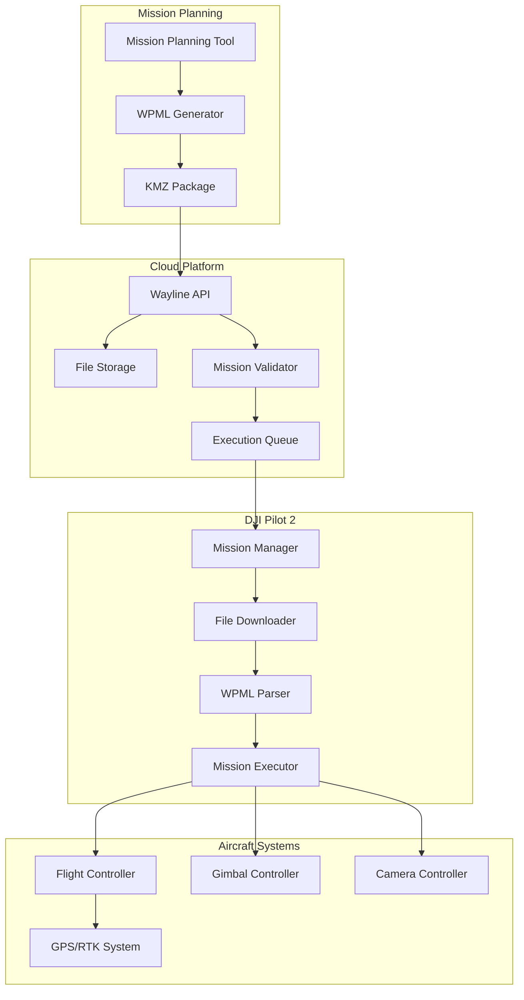
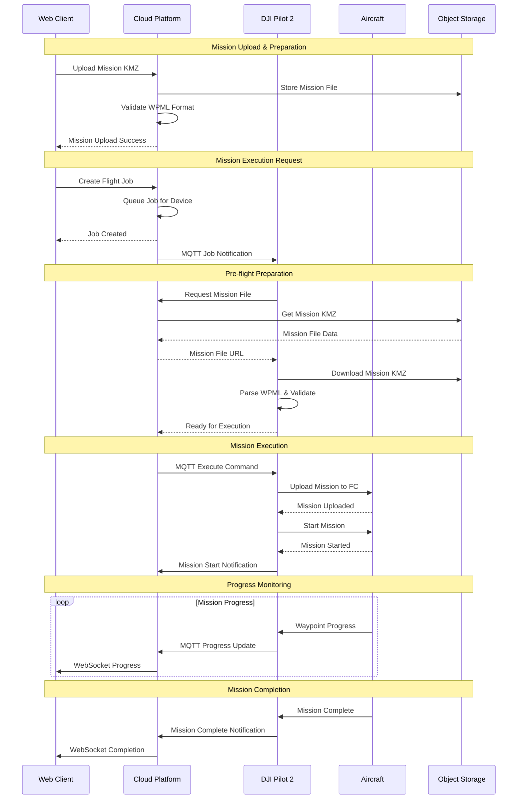

# Wayline Management - Pilot Function Set

## Overview

Wayline Management enables the creation, upload, synchronization, and execution of flight missions between DJI Pilot 2 and third-party cloud platforms. This feature supports DJI WPML (Waypoint Mission Language) format for standardized mission planning and automated flight operations.

## Supported Devices & Mission Types

| Aircraft | Mission Types | Max Waypoints | Flight Modes | Auto Actions |
|----------|---------------|---------------|--------------|-------------|
| **M350 RTK** | Survey, Inspection, Mapping | 999 | Waypoint, Orbit, Mapping | Photo, Video, Hover |
| **M300 RTK** | Survey, Inspection, Mapping | 999 | Waypoint, Orbit, Mapping | Photo, Video, Hover |
| **M30/M30T** | Patrol, Inspection | 500 | Waypoint, Orbit | Photo, Video, Hover |
| **M3E Series** | Survey, Mapping | 500 | Waypoint, Mapping | Photo, Video |

### WPML Mission Components

| Component | Description | Format |
|-----------|-------------|--------|
| **Mission File** | Overall mission definition | `.wpml` XML |
| **Template** | Waypoint template with actions | KML-based |
| **Waylines** | Flight path definitions | KML coordinates |
| **Actions** | Camera/gimbal operations | XML actions |

## Wayline Architecture & Workflow



## Mission Execution Flow



## WPML File Structure

### Mission File Format (mission.wpml)
```xml
<?xml version="1.0" encoding="UTF-8"?>
<kml xmlns="http://www.opengis.net/kml/2.2" 
     xmlns:wpml="http://www.dji.com/wpmz/1.0.6">
    <Document>
        <wpml:author>Cloud API Demo</wpml:author>
        <wpml:createTime>1701234567890</wpml:createTime>
        <wpml:updateTime>1701234567890</wpml:updateTime>
        <wpml:missionConfig>
            <wpml:flyToWaylineMode>safely</wpml:flyToWaylineMode>
            <wpml:finishAction>goHome</wpml:finishAction>
            <wpml:exitOnRCLost>executeLostAction</wpml:exitOnRCLost>
            <wpml:executeRCLostAction>goBack</wpml:executeRCLostAction>
            <wpml:takeOffSecurityHeight>20</wpml:takeOffSecurityHeight>
            <wpml:globalTransitionalSpeed>8</wpml:globalTransitionalSpeed>
        </wpml:missionConfig>
        
        <Folder>
            <name>Waypoint Template</name>
            <Placemark>
                <name>Waypoint1</name>
                <Point>
                    <coordinates>120.123456,30.123456,100</coordinates>
                </Point>
                <wpml:index>0</wpml:index>
                <wpml:executeHeight>100</wpml:executeHeight>
                <wpml:waypointSpeed>5</wpml:waypointSpeed>
                <wpml:waypointHeadingParam>
                    <wpml:waypointHeadingMode>smoothTransition</wpml:waypointHeadingMode>
                </wpml:waypointHeadingParam>
                <wpml:actionGroup>
                    <wpml:action>
                        <wpml:actionType>takePhoto</wpml:actionType>
                        <wpml:actionParam>
                            <wpml:payloadIndex>0</wpml:payloadIndex>
                        </wpml:actionParam>
                    </wpml:action>
                </wpml:actionGroup>
            </Placemark>
        </Folder>
    </Document>
</kml>
```

## REST API Endpoints

### 1. Upload Wayline File

```http
POST /wayline/api/v1/waylines
Authorization: Bearer {jwt_token}
Content-Type: multipart/form-data

Form Data:
- file: mission.kmz (binary)
- name: "Survey Mission Alpha"
- description: "Automated survey mission for area inspection"

Response:
{
    "code": 0,
    "message": "Wayline uploaded successfully",
    "data": {
        "wayline_id": "wayline_123456",
        "name": "Survey Mission Alpha", 
        "file_size": 2048576,
        "waypoint_count": 25,
        "estimated_duration": 1800,
        "upload_time": "2023-12-01T10:00:00Z"
    }
}
```

### 2. Get Wayline List

```http
GET /wayline/api/v1/waylines
Authorization: Bearer {jwt_token}
Parameters:
- order_by: create_time|update_time|name (default: create_time)
- is_asc: true|false (default: false)
- page: integer (default: 1)
- page_size: integer (default: 50)

Response:
{
    "code": 0,
    "message": "success",
    "data": {
        "list": [
            {
                "wayline_id": "wayline_123456",
                "name": "Survey Mission Alpha",
                "description": "Automated survey mission",
                "waypoint_count": 25,
                "distance": 2500.5,
                "duration": 1800,
                "file_size": 2048576,
                "file_url": "https://storage.example.com/waylines/mission_123.kmz",
                "create_time": "2023-12-01T10:00:00Z",
                "update_time": "2023-12-01T10:00:00Z"
            }
        ],
        "pagination": {
            "page": 1,
            "page_size": 50,
            "total": 10
        }
    }
}
```

### 3. Create Flight Job

```http
POST /wayline/api/v1/jobs
Authorization: Bearer {jwt_token}
Content-Type: application/json

{
    "name": "Morning Survey Job",
    "wayline_id": "wayline_123456",
    "device_sn": "1ZNDH7D0010078",
    "execute_time": "2023-12-01T14:00:00Z",
    "task_type": 0,
    "conditional_wayline_job": {
        "is_enable": true,
        "conditions": {
            "battery_capacity": {
                "min": 50
            },
            "weather": {
                "max_wind_speed": 12,
                "min_visibility": 3000
            }
        }
    },
    "executable_conditions": {
        "max_wind_speed": 12,
        "min_battery_capacity": 50,
        "max_temperature": 45,
        "min_temperature": -10
    }
}

Response:
{
    "code": 0,
    "message": "Flight job created successfully",
    "data": {
        "job_id": "job_789012",
        "status": "pending",
        "create_time": "2023-12-01T12:00:00Z",
        "execute_time": "2023-12-01T14:00:00Z"
    }
}
```

### 4. Get Job Status

```http
GET /wayline/api/v1/jobs/{job_id}
Authorization: Bearer {jwt_token}

Response:
{
    "code": 0,
    "message": "success",
    "data": {
        "job_id": "job_789012",
        "name": "Morning Survey Job",
        "status": "in_progress",
        "wayline_id": "wayline_123456",
        "device_sn": "1ZNDH7D0010078",
        "progress": {
            "current_waypoint": 12,
            "total_waypoints": 25,
            "progress_rate": 0.48,
            "estimated_remaining_time": 900
        },
        "create_time": "2023-12-01T12:00:00Z",
        "start_time": "2023-12-01T14:00:00Z",
        "estimated_end_time": "2023-12-01T14:30:00Z"
    }
}
```

## MQTT Commands & Events

### 1. Mission Execution Command

**Topic:** `thing/product/{device_sn}/services`
**QoS:** 0

```json
{
    "bid": "mission_exec_001",
    "tid": "txn_001",
    "timestamp": 1701234567890,
    "method": "flighttask_execute",
    "data": {
        "flight_id": "job_789012",
        "execute_time": 1701267600,
        "task_type": 0,
        "wayline_type": 0,
        "file": {
            "url": "https://storage.example.com/waylines/mission_123.kmz",
            "fingerprint": "md5:abc123def456"
        },
        "executable_conditions": {
            "max_wind_speed": 12.0,
            "min_battery_capacity": 50,
            "max_temperature": 45.0,
            "min_temperature": -10.0
        }
    }
}
```

**Response Topic:** `thing/product/{device_sn}/services_reply`
```json
{
    "bid": "mission_exec_001",
    "tid": "txn_001",
    "timestamp": 1701234567890,
    "data": {
        "result": 0,
        "output": {
            "status": "accepted",
            "flight_id": "job_789012"
        }
    }
}
```

### 2. Mission Progress Event

**Topic:** `thing/product/{device_sn}/events`
**QoS:** 1

```json
{
    "bid": "mission_progress_001",
    "tid": "txn_001",
    "timestamp": 1701234567890,
    "method": "flighttask_progress",
    "data": {
        "flight_id": "job_789012",
        "status": 1,
        "waypoint_index": 12,
        "progress_rate": 0.48,
        "current_step": "executing",
        "break_point": {
            "index": 12,
            "state": 1,
            "progress_rate": 0.48,
            "wayline_id": 0
        },
        "media_count": 35
    }
}
```

### 3. Mission Completion Event

```json
{
    "bid": "mission_complete_001",
    "tid": "txn_001",
    "timestamp": 1701234567890,
    "method": "flighttask_ready",
    "data": {
        "flight_id": "job_789012",
        "status": 2,
        "result": 0,
        "media_count": 50,
        "flight_time": 1800,
        "flight_distance": 2500.5
    }
}
```

## Code Examples

### 1. Wayline Management Service

```java
@Service
public class WaylineManagementService extends AbstractWaylineService {
    
    @Autowired
    private IWaylineFileService waylineFileService;
    
    @Autowired
    private IWaylineJobService jobService;
    
    @Autowired
    private WaylineValidator waylineValidator;
    
    public WaylineUploadResponse uploadWayline(MultipartFile file, 
                                             WaylineUploadRequest request) {
        // Validate file format and size
        validateUploadFile(file);
        
        // Extract and validate WPML content
        WaylineContent content = extractWaylineContent(file);
        waylineValidator.validateWayline(content);
        
        // Store wayline file
        String objectKey = generateWaylineObjectKey();
        String fileUrl = ossService.uploadFile(objectKey, file.getBytes());
        
        // Save wayline metadata
        WaylineFileEntity waylineFile = WaylineFileEntity.builder()
                .name(request.getName())
                .description(request.getDescription())
                .fileName(file.getOriginalFilename())
                .fileSize(file.getSize())
                .objectKey(objectKey)
                .fileUrl(fileUrl)
                .waypointCount(content.getWaypointCount())
                .estimatedDistance(content.getDistance())
                .estimatedDuration(content.getDuration())
                .workspaceId(getCurrentWorkspaceId())
                .createTime(new Date())
                .build();
        
        waylineFileService.save(waylineFile);
        
        return WaylineUploadResponse.builder()
                .waylineId(waylineFile.getWaylineId())
                .name(waylineFile.getName())
                .waypointCount(waylineFile.getWaypointCount())
                .estimatedDuration(waylineFile.getEstimatedDuration())
                .uploadTime(waylineFile.getCreateTime())
                .build();
    }
    
    public JobCreationResponse createFlightJob(CreateJobRequest request) {
        // Validate wayline exists and accessible
        WaylineFileEntity wayline = waylineFileService.getById(request.getWaylineId());
        if (wayline == null) {
            throw new WaylineNotFoundException("Wayline not found: " + request.getWaylineId());
        }
        
        // Validate device availability
        DeviceDTO device = deviceService.getByDeviceSn(request.getDeviceSn());
        if (device == null || !device.getStatus()) {
            throw new DeviceNotAvailableException("Device not available: " + request.getDeviceSn());
        }
        
        // Create job entity
        WaylineJobEntity job = WaylineJobEntity.builder()
                .name(request.getName())
                .waylineId(request.getWaylineId())
                .deviceSn(request.getDeviceSn())
                .taskType(request.getTaskType())
                .executeTime(request.getExecuteTime())
                .status(WaylineJobStatusEnum.PENDING.getValue())
                .executableConditions(convertConditions(request.getExecutableConditions()))
                .workspaceId(getCurrentWorkspaceId())
                .createTime(new Date())
                .build();
        
        jobService.save(job);
        
        // Schedule job execution
        scheduleJobExecution(job);
        
        return JobCreationResponse.builder()
                .jobId(job.getJobId())
                .status(job.getStatus())
                .createTime(job.getCreateTime())
                .executeTime(job.getExecuteTime())
                .build();
    }
    
    @Override
    public TopicEventsResponse<MqttReply> flighttaskProgress(
            TopicEventsRequest<FlighttaskProgress> request, MessageHeaders headers) {
        
        FlighttaskProgress progress = request.getData();
        String deviceSn = (String) headers.get("sn");
        
        // Update job progress
        WaylineJobEntity job = jobService.getByFlightId(progress.getFlightId());
        if (job != null) {
            job.setStatus(convertProgressStatus(progress.getStatus()));
            job.setCurrentWaypoint(progress.getWaypointIndex());
            job.setProgressRate(progress.getProgressRate());
            job.setUpdateTime(new Date());
            jobService.updateById(job);
            
            // Broadcast progress update
            broadcastJobProgress(job, progress);
        }
        
        return TopicEventsResponse.<MqttReply>builder()
                .tid(request.getTid())
                .bid(request.getBid())
                .timestamp(System.currentTimeMillis())
                .data(MqttReply.success())
                .build();
    }
    
    private void broadcastJobProgress(WaylineJobEntity job, FlighttaskProgress progress) {
        JobProgressData progressData = JobProgressData.builder()
                .jobId(job.getJobId())
                .deviceSn(job.getDeviceSn())
                .status(job.getStatus())
                .currentWaypoint(progress.getWaypointIndex())
                .totalWaypoints(job.getTotalWaypoints())
                .progressRate(progress.getProgressRate())
                .estimatedRemainingTime(calculateRemainingTime(progress))
                .build();
        
        WebSocketMessageResponse<JobProgressData> message = 
            WebSocketMessageResponse.<JobProgressData>builder()
                .bizCode(BizCodeEnum.JOB_PROGRESS.getCode())
                .timestamp(System.currentTimeMillis())
                .data(progressData)
                .build();
        
        webSocketService.sendMessageByDeviceSn(job.getDeviceSn(), message);
    }
}
```

### 2. WPML Parser & Validator

```java
@Component
public class WpmlParser {
    
    public WaylineContent parseWayline(InputStream kmzInputStream) throws Exception {
        // Extract KMZ contents
        Map<String, byte[]> files = extractKmzContents(kmzInputStream);
        
        // Find mission WPML file
        byte[] wpmlContent = files.get("mission.wpml");
        if (wpmlContent == null) {
            throw new InvalidWaylineException("mission.wpml not found in KMZ package");
        }
        
        // Parse XML content
        DocumentBuilderFactory factory = DocumentBuilderFactory.newInstance();
        factory.setNamespaceAware(true);
        DocumentBuilder builder = factory.newDocumentBuilder();
        Document document = builder.parse(new ByteArrayInputStream(wpmlContent));
        
        return parseWpmlDocument(document);
    }
    
    private WaylineContent parseWpmlDocument(Document document) {
        WaylineContent.WaylineContentBuilder builder = WaylineContent.builder();
        
        // Parse mission configuration
        Element missionConfig = getElement(document, "wpml:missionConfig");
        if (missionConfig != null) {
            builder.flyToWaylineMode(getElementText(missionConfig, "wpml:flyToWaylineMode"))
                   .finishAction(getElementText(missionConfig, "wpml:finishAction"))
                   .exitOnRcLost(getElementText(missionConfig, "wpml:exitOnRCLost"))
                   .globalSpeed(Double.parseDouble(
                       getElementText(missionConfig, "wpml:globalTransitionalSpeed", "8")));
        }
        
        // Parse waypoints
        List<Waypoint> waypoints = parseWaypoints(document);
        builder.waypoints(waypoints);
        
        // Calculate mission statistics
        double distance = calculateTotalDistance(waypoints);
        int duration = calculateEstimatedDuration(waypoints, builder.build());
        
        builder.distance(distance)
               .duration(duration)
               .waypointCount(waypoints.size());
        
        return builder.build();
    }
    
    private List<Waypoint> parseWaypoints(Document document) {
        List<Waypoint> waypoints = new ArrayList<>();
        
        NodeList placemarks = document.getElementsByTagName("Placemark");
        for (int i = 0; i < placemarks.getLength(); i++) {
            Element placemark = (Element) placemarks.item(i);
            
            // Skip if not a waypoint
            if (getElement(placemark, "wpml:index") == null) {
                continue;
            }
            
            Waypoint waypoint = parseWaypoint(placemark);
            waypoints.add(waypoint);
        }
        
        // Sort waypoints by index
        waypoints.sort(Comparator.comparing(Waypoint::getIndex));
        
        return waypoints;
    }
    
    private Waypoint parseWaypoint(Element placemark) {
        Waypoint.WaypointBuilder builder = Waypoint.builder();
        
        // Basic properties
        builder.index(Integer.parseInt(getElementText(placemark, "wpml:index")))
               .name(getElementText(placemark, "name"))
               .executeHeight(Double.parseDouble(getElementText(placemark, "wpml:executeHeight")))
               .speed(Double.parseDouble(getElementText(placemark, "wpml:waypointSpeed", "5")));
        
        // Coordinates
        String coordinates = getElementText(placemark, "coordinates");
        if (coordinates != null) {
            String[] coords = coordinates.trim().split(",");
            builder.longitude(Double.parseDouble(coords[0]))
                   .latitude(Double.parseDouble(coords[1]));
            
            if (coords.length > 2) {
                builder.altitude(Double.parseDouble(coords[2]));
            }
        }
        
        // Parse actions
        List<WaypointAction> actions = parseWaypointActions(placemark);
        builder.actions(actions);
        
        return builder.build();
    }
    
    private List<WaypointAction> parseWaypointActions(Element placemark) {
        List<WaypointAction> actions = new ArrayList<>();
        
        Element actionGroup = getElement(placemark, "wpml:actionGroup");
        if (actionGroup != null) {
            NodeList actionNodes = actionGroup.getElementsByTagName("wpml:action");
            
            for (int i = 0; i < actionNodes.getLength(); i++) {
                Element actionElement = (Element) actionNodes.item(i);
                WaypointAction action = parseAction(actionElement);
                actions.add(action);
            }
        }
        
        return actions;
    }
    
    private WaypointAction parseAction(Element actionElement) {
        String actionType = getElementText(actionElement, "wpml:actionType");
        
        WaypointAction.WaypointActionBuilder builder = WaypointAction.builder()
                .actionType(actionType);
        
        // Parse action parameters based on type
        Element actionParam = getElement(actionElement, "wpml:actionParam");
        if (actionParam != null) {
            Map<String, String> parameters = new HashMap<>();
            
            NodeList paramNodes = actionParam.getChildNodes();
            for (int i = 0; i < paramNodes.getLength(); i++) {
                if (paramNodes.item(i) instanceof Element) {
                    Element param = (Element) paramNodes.item(i);
                    parameters.put(param.getNodeName(), param.getTextContent());
                }
            }
            
            builder.parameters(parameters);
        }
        
        return builder.build();
    }
}
```

### 3. Mission Execution Scheduler

```java
@Component
public class MissionExecutionScheduler {
    
    @Autowired
    private IWaylineJobService jobService;
    
    @Autowired
    private FlightTaskService flightTaskService;
    
    @Scheduled(fixedRate = 30000) // Check every 30 seconds
    public void checkPendingJobs() {
        List<WaylineJobEntity> pendingJobs = jobService.getPendingJobs();
        
        pendingJobs.forEach(job -> {
            if (isJobReadyForExecution(job)) {
                executeJob(job);
            } else if (isJobExpired(job)) {
                markJobAsExpired(job);
            }
        });
    }
    
    private boolean isJobReadyForExecution(WaylineJobEntity job) {
        // Check execution time
        if (job.getExecuteTime().after(new Date())) {
            return false;
        }
        
        // Check device availability
        DeviceDTO device = deviceService.getByDeviceSn(job.getDeviceSn());
        if (device == null || !device.getStatus()) {
            return false;
        }
        
        // Check executable conditions
        if (job.getExecutableConditions() != null) {
            return checkExecutableConditions(job.getDeviceSn(), job.getExecutableConditions());
        }
        
        return true;
    }
    
    private boolean checkExecutableConditions(String deviceSn, ExecutableConditions conditions) {
        // Get current device state
        DeviceRealTimeState deviceState = deviceRedisService.getRealTimeState(deviceSn);
        
        if (deviceState == null) {
            return false;
        }
        
        // Check battery level
        if (conditions.getMinBatteryCapacity() != null && 
            deviceState.getBatteryPercent() < conditions.getMinBatteryCapacity()) {
            return false;
        }
        
        // Check wind conditions (if available)
        if (conditions.getMaxWindSpeed() != null) {
            Double windSpeed = getCurrentWindSpeed(deviceSn);
            if (windSpeed != null && windSpeed > conditions.getMaxWindSpeed()) {
                return false;
            }
        }
        
        // Check temperature conditions
        if (conditions.getMaxTemperature() != null || conditions.getMinTemperature() != null) {
            Double temperature = getCurrentTemperature(deviceSn);
            if (temperature != null) {
                if (conditions.getMaxTemperature() != null && temperature > conditions.getMaxTemperature()) {
                    return false;
                }
                if (conditions.getMinTemperature() != null && temperature < conditions.getMinTemperature()) {
                    return false;
                }
            }
        }
        
        return true;
    }
    
    private void executeJob(WaylineJobEntity job) {
        try {
            // Update job status
            job.setStatus(WaylineJobStatusEnum.EXECUTING.getValue());
            job.setStartTime(new Date());
            jobService.updateById(job);
            
            // Send execution command to device
            FlighttaskExecuteRequest request = buildExecutionRequest(job);
            GatewayManager gateway = GatewayManager.getInstance(job.getDeviceSn());
            
            TopicServicesResponse<ServicesReplyData> response = 
                flightTaskService.flighttaskExecute(gateway, request);
            
            if (response.getData().getResult() == 0) {
                log.info("Mission execution started successfully for job: {}", job.getJobId());
                notifyJobStarted(job);
            } else {
                // Handle execution failure
                job.setStatus(WaylineJobStatusEnum.FAILED.getValue());
                job.setErrorMessage("Execution failed: " + response.getData().getOutput());
                jobService.updateById(job);
                notifyJobFailed(job);
            }
            
        } catch (Exception e) {
            log.error("Failed to execute job: {}", job.getJobId(), e);
            job.setStatus(WaylineJobStatusEnum.FAILED.getValue());
            job.setErrorMessage("Execution exception: " + e.getMessage());
            jobService.updateById(job);
            notifyJobFailed(job);
        }
    }
    
    private FlighttaskExecuteRequest buildExecutionRequest(WaylineJobEntity job) {
        WaylineFileEntity waylineFile = waylineFileService.getById(job.getWaylineId());
        
        return FlighttaskExecuteRequest.builder()
                .flightId(job.getJobId())
                .executeTime(job.getExecuteTime().getTime() / 1000)
                .taskType(job.getTaskType())
                .file(FlighttaskFile.builder()
                    .url(waylineFile.getFileUrl())
                    .fingerprint(waylineFile.getFingerprint())
                    .build())
                .executableConditions(job.getExecutableConditions())
                .build();
    }
}
```

### 4. Mission Analytics Service

```java
@Service
public class MissionAnalyticsService {
    
    @Autowired
    private IWaylineJobService jobService;
    
    public MissionStatistics getMissionStatistics(String workspaceId, DateRange dateRange) {
        List<WaylineJobEntity> jobs = jobService.getJobsByWorkspaceAndDateRange(
            workspaceId, dateRange.getStartDate(), dateRange.getEndDate());
        
        return MissionStatistics.builder()
                .totalJobs(jobs.size())
                .completedJobs(countByStatus(jobs, WaylineJobStatusEnum.COMPLETED))
                .failedJobs(countByStatus(jobs, WaylineJobStatusEnum.FAILED))
                .totalFlightTime(calculateTotalFlightTime(jobs))
                .totalDistance(calculateTotalDistance(jobs))
                .averageJobDuration(calculateAverageJobDuration(jobs))
                .successRate(calculateSuccessRate(jobs))
                .deviceUtilization(calculateDeviceUtilization(jobs))
                .build();
    }
    
    public List<JobPerformanceMetric> getJobPerformanceMetrics(String deviceSn, 
                                                              DateRange dateRange) {
        List<WaylineJobEntity> jobs = jobService.getJobsByDeviceAndDateRange(
            deviceSn, dateRange.getStartDate(), dateRange.getEndDate());
        
        return jobs.stream()
                .filter(job -> job.getStatus() == WaylineJobStatusEnum.COMPLETED.getValue())
                .map(this::calculateJobPerformance)
                .collect(Collectors.toList());
    }
    
    private JobPerformanceMetric calculateJobPerformance(WaylineJobEntity job) {
        long plannedDuration = job.getEstimatedDuration() != null ? job.getEstimatedDuration() : 0;
        long actualDuration = calculateActualDuration(job);
        double efficiency = plannedDuration > 0 ? (double) actualDuration / plannedDuration : 0;
        
        return JobPerformanceMetric.builder()
                .jobId(job.getJobId())
                .jobName(job.getName())
                .plannedDuration(plannedDuration)
                .actualDuration(actualDuration)
                .efficiency(efficiency)
                .waypointCount(job.getTotalWaypoints())
                .mediaCount(job.getMediaCount())
                .completionTime(job.getEndTime())
                .build();
    }
}
```

## Error Handling & Recovery

### Common Error Codes

| Code | Message | Cause | Resolution |
|------|---------|-------|------------|
| 324001 | Mission file invalid | Corrupted WPML/KMZ | Re-upload valid mission file |
| 324002 | Waypoint limit exceeded | Too many waypoints | Reduce waypoint count |
| 324003 | Device not ready | Device offline/busy | Wait for device availability |
| 324004 | Mission execution failed | Flight controller error | Check aircraft status |
| 324005 | Conditions not met | Weather/battery constraints | Wait for suitable conditions |

### Retry & Recovery Strategies

```java
@Component
public class MissionRecoveryService {
    
    @Retryable(value = MissionExecutionException.class, maxAttempts = 3,
               backoff = @Backoff(delay = 60000, multiplier = 2))
    public void retryFailedMission(String jobId) {
        WaylineJobEntity job = jobService.getById(jobId);
        
        if (job != null && job.getStatus() == WaylineJobStatusEnum.FAILED.getValue()) {
            // Reset job status
            job.setStatus(WaylineJobStatusEnum.PENDING.getValue());
            job.setRetryCount(job.getRetryCount() + 1);
            job.setUpdateTime(new Date());
            jobService.updateById(job);
            
            // Attempt re-execution
            missionScheduler.executeJob(job);
        }
    }
    
    @EventListener
    public void handleMissionBreakpoint(MissionBreakpointEvent event) {
        // Handle mission interruption and resume capability
        WaylineJobEntity job = jobService.getByFlightId(event.getFlightId());
        
        if (job != null) {
            // Save breakpoint information
            job.setBreakpointData(event.getBreakpointData());
            job.setStatus(WaylineJobStatusEnum.PAUSED.getValue());
            jobService.updateById(job);
            
            // Check if mission can be resumed
            if (canResumeMission(job)) {
                scheduleMissionResume(job);
            }
        }
    }
}
```

This Wayline Management feature provides comprehensive mission planning, scheduling, and execution capabilities with support for DJI WPML format and automated flight operations.