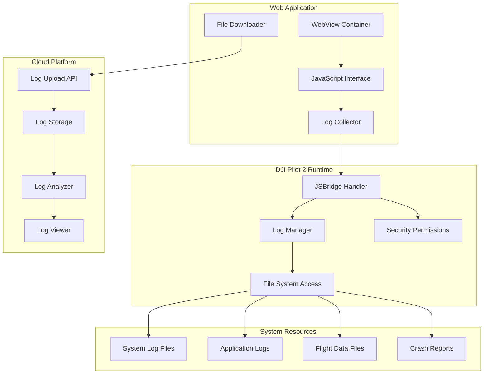
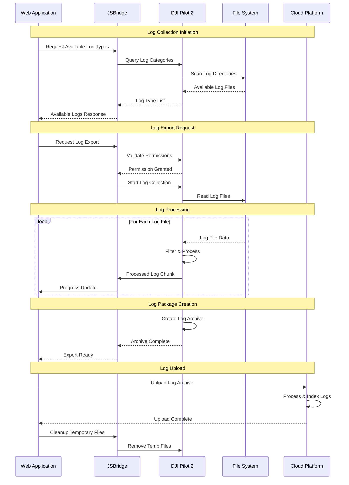

# Obtain Log via JSBridge - Pilot Function Set

## Overview

The Obtain Log via JSBridge feature enables third-party cloud platforms to programmatically extract system logs, flight logs, and diagnostic data from DJI Pilot 2 applications. This capability uses JavaScript Bridge (JSBridge) technology to facilitate secure communication between web-based applications and the DJI Pilot 2 runtime environment.

## Supported Devices & Log Types

| Device Type | Model | Log Categories | Export Formats | Max Log Size |
|-------------|-------|---------------|----------------|--------------|
| **Remote Controller** | RC Plus, RC Pro | System, Application, Network | .txt, .log, .zip | 100MB |
| **Smart Controller Enterprise** | DJI Pilot 2 | System, Application, Network | .txt, .log, .zip | 100MB |
| **Aircraft** | All supported models | Flight, IMU, GPS, Camera | .DAT, .txt, .csv | 500MB |
| **Payloads** | H20/H20T, H20N, H30/H30T | Camera, Gimbal, Thermal | .txt, .csv | 50MB |

### Log Categories

| Category | Description | Content |
|----------|-------------|---------|
| **System Logs** | Operating system events | Boot, shutdown, errors, hardware events |
| **Application Logs** | DJI Pilot 2 application logs | App lifecycle, user actions, API calls |
| **Flight Logs** | Flight-specific data | Flight path, telemetry, commands, responses |
| **Network Logs** | Communication logs | MQTT messages, HTTP requests, connectivity |
| **Debug Logs** | Development/debugging info | Stack traces, performance metrics, memory usage |

## JSBridge Architecture



## Log Collection Workflow



## JSBridge API Interface

### 1. Log Query Interface

**JavaScript Function:**
```javascript
// Get available log types
window.djiBridge.getAvailableLogTypes()
    .then(response => {
        console.log('Available log types:', response.data);
    })
    .catch(error => {
        console.error('Error getting log types:', error);
    });

// Response format
{
    "code": 0,
    "message": "success",
    "data": {
        "log_types": [
            {
                "type": "system",
                "name": "System Logs",
                "description": "Operating system events and errors",
                "size": 10485760,
                "last_modified": "2023-12-01T10:00:00Z",
                "file_count": 5
            },
            {
                "type": "flight",
                "name": "Flight Logs", 
                "description": "Flight data and telemetry",
                "size": 52428800,
                "last_modified": "2023-12-01T09:30:00Z",
                "file_count": 12
            }
        ],
        "total_size": 104857600
    }
}
```

### 2. Log Export Interface

**JavaScript Function:**
```javascript
// Export logs with options
const exportOptions = {
    log_types: ['system', 'flight', 'application'],
    date_range: {
        start: '2023-11-01T00:00:00Z',
        end: '2023-12-01T23:59:59Z'
    },
    format: 'zip',
    include_metadata: true,
    max_size: 104857600 // 100MB
};

window.djiBridge.exportLogs(exportOptions)
    .then(response => {
        console.log('Export started:', response.data);
        // Start monitoring export progress
        monitorExportProgress(response.data.export_id);
    })
    .catch(error => {
        console.error('Export failed:', error);
    });

// Response format
{
    "code": 0,
    "message": "Export started",
    "data": {
        "export_id": "export_123456",
        "estimated_duration": 300,
        "estimated_size": 50331648
    }
}
```

### 3. Export Progress Monitoring

**JavaScript Function:**
```javascript
// Monitor export progress
function monitorExportProgress(exportId) {
    const progressInterval = setInterval(() => {
        window.djiBridge.getExportProgress(exportId)
            .then(response => {
                const progress = response.data;
                
                updateProgressUI(progress);
                
                if (progress.status === 'completed') {
                    clearInterval(progressInterval);
                    handleExportComplete(progress);
                } else if (progress.status === 'failed') {
                    clearInterval(progressInterval);
                    handleExportError(progress);
                }
            })
            .catch(error => {
                console.error('Progress check failed:', error);
                clearInterval(progressInterval);
            });
    }, 2000); // Check every 2 seconds
}

// Progress response format
{
    "code": 0,
    "message": "success",
    "data": {
        "export_id": "export_123456",
        "status": "processing", // queued, processing, completed, failed
        "progress": 65,
        "processed_files": 8,
        "total_files": 12,
        "current_file": "flight_log_20231201.DAT",
        "estimated_remaining": 120
    }
}
```

### 4. Log Download Interface

**JavaScript Function:**
```javascript
// Download completed export
window.djiBridge.downloadExport(exportId)
    .then(response => {
        const downloadUrl = response.data.download_url;
        const fileName = response.data.filename;
        
        // Create download link
        const link = document.createElement('a');
        link.href = downloadUrl;
        link.download = fileName;
        link.click();
        
        // Upload to cloud platform
        uploadLogToCloud(downloadUrl, fileName);
    })
    .catch(error => {
        console.error('Download failed:', error);
    });

// Download response format
{
    "code": 0,
    "message": "Download ready",
    "data": {
        "download_url": "file:///temp/logs/export_123456.zip",
        "filename": "pilot2_logs_20231201.zip",
        "file_size": 50331648,
        "expires_at": "2023-12-01T12:00:00Z"
    }
}
```

## REST API Integration

### 1. Upload Log Archive

```http
POST /manage/api/v1/logs/upload
Authorization: Bearer {jwt_token}
Content-Type: multipart/form-data

Form Data:
- file: pilot2_logs_20231201.zip (binary)
- device_sn: "1ZNDH7D0010078"  
- log_type: "system,flight,application"
- collection_date: "2023-12-01T10:00:00Z"
- metadata: {
    "pilot_version": "2.4.10",
    "aircraft_model": "M350 RTK",
    "export_options": {...}
}

Response:
{
    "code": 0,
    "message": "Log archive uploaded successfully",
    "data": {
        "log_id": "log_789012",
        "processing_status": "queued",
        "estimated_processing_time": 180
    }
}
```

### 2. Get Log Processing Status

```http
GET /manage/api/v1/logs/{log_id}/status
Authorization: Bearer {jwt_token}

Response:
{
    "code": 0,
    "message": "success",
    "data": {
        "log_id": "log_789012",
        "status": "processing", // queued, processing, completed, failed
        "progress": 75,
        "processed_files": 9,
        "total_files": 12,
        "errors": [],
        "warnings": [
            "Some flight log entries have incomplete GPS data"
        ]
    }
}
```

### 3. Query Processed Logs

```http
GET /manage/api/v1/logs
Authorization: Bearer {jwt_token}
Parameters:
- device_sn: string (optional)
- log_type: string (optional)
- start_date: string (ISO 8601)
- end_date: string (ISO 8601)
- status: string (optional: processing, completed, failed)

Response:
{
    "code": 0,
    "message": "success",
    "data": {
        "logs": [
            {
                "log_id": "log_789012",
                "device_sn": "1ZNDH7D0010078",
                "log_types": ["system", "flight", "application"],
                "collection_date": "2023-12-01T10:00:00Z",
                "upload_date": "2023-12-01T10:30:00Z",
                "status": "completed",
                "file_count": 12,
                "total_size": 50331648,
                "summary": {
                    "flight_hours": 8.5,
                    "error_count": 3,
                    "warning_count": 12
                }
            }
        ]
    }
}
```

## Code Examples

### 1. JSBridge Log Service Implementation

```java
@Service
public class LogExportService {
    
    @Autowired
    private IDeviceLogsService deviceLogsService;
    
    @Autowired
    private LogProcessingService logProcessingService;
    
    public LogUploadResponse uploadLogArchive(MultipartFile logFile, 
                                            LogUploadRequest request) {
        // Validate log file
        validateLogFile(logFile);
        
        // Store log file
        String objectKey = generateLogObjectKey(request.getDeviceSn());
        String fileUrl = ossService.uploadFile(objectKey, logFile.getBytes());
        
        // Create log record
        DeviceLogsEntity logEntity = DeviceLogsEntity.builder()
                .deviceSn(request.getDeviceSn())
                .logTypes(request.getLogTypes())
                .fileName(logFile.getOriginalFilename())
                .fileSize(logFile.getSize())
                .objectKey(objectKey)
                .fileUrl(fileUrl)
                .collectionDate(request.getCollectionDate())
                .uploadDate(new Date())
                .status(DeviceLogsStatusEnum.PROCESSING.getValue())
                .metadata(convertMetadata(request.getMetadata()))
                .workspaceId(getCurrentWorkspaceId())
                .build();
        
        deviceLogsService.save(logEntity);
        
        // Queue for processing
        logProcessingService.queueLogProcessing(logEntity);
        
        return LogUploadResponse.builder()
                .logId(logEntity.getLogId())
                .processingStatus("queued")
                .estimatedProcessingTime(calculateProcessingTime(logFile.getSize()))
                .build();
    }
    
    private void validateLogFile(MultipartFile logFile) {
        // Check file size
        if (logFile.getSize() > MAX_LOG_FILE_SIZE) {
            throw new LogValidationException("Log file too large: " + logFile.getSize());
        }
        
        // Check file format
        String filename = logFile.getOriginalFilename();
        if (!isValidLogFile(filename)) {
            throw new LogValidationException("Invalid log file format: " + filename);
        }
        
        // Check file integrity
        if (!validateFileIntegrity(logFile)) {
            throw new LogValidationException("Log file appears to be corrupted");
        }
    }
    
    private boolean validateFileIntegrity(MultipartFile logFile) {
        try {
            // For ZIP files, try to read archive structure
            if (logFile.getOriginalFilename().endsWith(".zip")) {
                try (ZipInputStream zis = new ZipInputStream(logFile.getInputStream())) {
                    ZipEntry entry = zis.getNextEntry();
                    return entry != null; // At least one entry exists
                }
            }
            return true;
        } catch (IOException e) {
            return false;
        }
    }
}
```

### 2. Log Processing Service

```java
@Service
public class LogProcessingService {
    
    @Autowired
    private LogParser logParser;
    
    @Autowired
    private LogAnalyzer logAnalyzer;
    
    @Async("logProcessingExecutor")
    public CompletableFuture<Void> processLogArchive(DeviceLogsEntity logEntity) {
        try {
            // Update status to processing
            logEntity.setStatus(DeviceLogsStatusEnum.PROCESSING.getValue());
            logEntity.setProcessStartTime(new Date());
            deviceLogsService.updateById(logEntity);
            
            // Download and extract log archive
            byte[] logData = ossService.downloadFile(logEntity.getObjectKey());
            Map<String, byte[]> extractedFiles = extractLogArchive(logData);
            
            // Process each log file
            List<LogAnalysisResult> analysisResults = new ArrayList<>();
            int processedCount = 0;
            
            for (Map.Entry<String, byte[]> entry : extractedFiles.entrySet()) {
                String filename = entry.getKey();
                byte[] fileData = entry.getValue();
                
                try {
                    LogAnalysisResult result = processLogFile(filename, fileData, logEntity);
                    analysisResults.add(result);
                    
                    processedCount++;
                    updateProcessingProgress(logEntity, processedCount, extractedFiles.size());
                    
                } catch (Exception e) {
                    log.warn("Failed to process log file: {}", filename, e);
                    // Continue with other files
                }
            }
            
            // Generate summary report
            LogSummaryReport summary = generateSummaryReport(analysisResults);
            logEntity.setSummary(convertSummaryToJson(summary));
            
            // Mark as completed
            logEntity.setStatus(DeviceLogsStatusEnum.COMPLETED.getValue());
            logEntity.setProcessEndTime(new Date());
            logEntity.setProcessedFileCount(processedCount);
            
            deviceLogsService.updateById(logEntity);
            
            // Send completion notification
            sendProcessingCompleteNotification(logEntity, summary);
            
        } catch (Exception e) {
            log.error("Log processing failed for log: {}", logEntity.getLogId(), e);
            
            // Mark as failed
            logEntity.setStatus(DeviceLogsStatusEnum.FAILED.getValue());
            logEntity.setErrorMessage(e.getMessage());
            logEntity.setProcessEndTime(new Date());
            
            deviceLogsService.updateById(logEntity);
            
            sendProcessingErrorNotification(logEntity, e);
        }
        
        return CompletableFuture.completedFuture(null);
    }
    
    private LogAnalysisResult processLogFile(String filename, byte[] fileData, 
                                           DeviceLogsEntity logEntity) {
        // Determine log type from filename
        LogType logType = determineLogType(filename);
        
        // Parse log content
        List<LogEntry> logEntries = logParser.parseLogFile(fileData, logType);
        
        // Analyze log entries
        LogAnalysisResult analysisResult = logAnalyzer.analyzeLogEntries(logEntries, logType);
        
        // Store analysis results
        storeLogAnalysis(logEntity.getLogId(), filename, analysisResult);
        
        return analysisResult;
    }
    
    private LogSummaryReport generateSummaryReport(List<LogAnalysisResult> analysisResults) {
        LogSummaryReport.LogSummaryReportBuilder builder = LogSummaryReport.builder();
        
        // Aggregate statistics
        int totalErrors = analysisResults.stream()
                .mapToInt(LogAnalysisResult::getErrorCount)
                .sum();
        
        int totalWarnings = analysisResults.stream()
                .mapToInt(LogAnalysisResult::getWarningCount)
                .sum();
        
        double totalFlightHours = analysisResults.stream()
                .filter(result -> result.getLogType() == LogType.FLIGHT)
                .mapToDouble(LogAnalysisResult::getFlightHours)
                .sum();
        
        // Extract key issues
        List<LogIssue> keyIssues = analysisResults.stream()
                .flatMap(result -> result.getIssues().stream())
                .filter(issue -> issue.getSeverity() == IssueSeverity.HIGH)
                .collect(Collectors.toList());
        
        return builder
                .totalFiles(analysisResults.size())
                .totalErrors(totalErrors)
                .totalWarnings(totalWarnings)
                .flightHours(totalFlightHours)
                .keyIssues(keyIssues)
                .processingTime(System.currentTimeMillis())
                .build();
    }
}
```

### 3. WebView JSBridge Implementation

```javascript
// JavaScript side implementation
class LogExportManager {
    constructor() {
        this.activeExports = new Map();
        this.setupEventHandlers();
    }
    
    async getAvailableLogTypes() {
        try {
            const response = await window.djiBridge.invoke('getAvailableLogTypes', {});
            return this.handleBridgeResponse(response);
        } catch (error) {
            console.error('Failed to get log types:', error);
            throw new Error('Unable to retrieve available log types');
        }
    }
    
    async exportLogs(options) {
        // Validate export options
        this.validateExportOptions(options);
        
        try {
            const response = await window.djiBridge.invoke('exportLogs', options);
            const result = this.handleBridgeResponse(response);
            
            // Start monitoring progress
            this.startProgressMonitoring(result.export_id);
            
            return result;
        } catch (error) {
            console.error('Log export failed:', error);
            throw new Error('Failed to start log export');
        }
    }
    
    validateExportOptions(options) {
        if (!options.log_types || options.log_types.length === 0) {
            throw new Error('At least one log type must be specified');
        }
        
        if (options.max_size && options.max_size > 104857600) { // 100MB
            throw new Error('Maximum export size cannot exceed 100MB');
        }
        
        if (options.date_range) {
            const start = new Date(options.date_range.start);
            const end = new Date(options.date_range.end);
            
            if (start >= end) {
                throw new Error('Invalid date range: start date must be before end date');
            }
            
            // Limit to maximum 30 days
            const maxRange = 30 * 24 * 60 * 60 * 1000; // 30 days in milliseconds
            if (end.getTime() - start.getTime() > maxRange) {
                throw new Error('Date range cannot exceed 30 days');
            }
        }
    }
    
    startProgressMonitoring(exportId) {
        const progressTracker = {
            exportId: exportId,
            startTime: Date.now(),
            interval: null
        };
        
        progressTracker.interval = setInterval(async () => {
            try {
                const progress = await this.getExportProgress(exportId);
                
                // Emit progress event
                this.emitProgressEvent(exportId, progress);
                
                // Check if completed
                if (progress.status === 'completed') {
                    this.handleExportComplete(exportId, progress);
                    this.stopProgressMonitoring(exportId);
                } else if (progress.status === 'failed') {
                    this.handleExportError(exportId, progress);
                    this.stopProgressMonitoring(exportId);
                }
                
                // Timeout check (max 10 minutes)
                if (Date.now() - progressTracker.startTime > 600000) {
                    this.handleExportTimeout(exportId);
                    this.stopProgressMonitoring(exportId);
                }
                
            } catch (error) {
                console.error('Progress monitoring error:', error);
                this.stopProgressMonitoring(exportId);
            }
        }, 2000); // Check every 2 seconds
        
        this.activeExports.set(exportId, progressTracker);
    }
    
    async getExportProgress(exportId) {
        try {
            const response = await window.djiBridge.invoke('getExportProgress', {
                export_id: exportId
            });
            return this.handleBridgeResponse(response);
        } catch (error) {
            console.error('Failed to get export progress:', error);
            throw error;
        }
    }
    
    async downloadExport(exportId) {
        try {
            const response = await window.djiBridge.invoke('downloadExport', {
                export_id: exportId
            });
            const result = this.handleBridgeResponse(response);
            
            // Upload to cloud platform
            await this.uploadToCloud(result.download_url, result.filename);
            
            return result;
        } catch (error) {
            console.error('Export download failed:', error);
            throw new Error('Failed to download log export');
        }
    }
    
    async uploadToCloud(filePath, filename) {
        try {
            // Read file data (implementation depends on platform capabilities)
            const fileData = await this.readLocalFile(filePath);
            
            // Create form data for upload
            const formData = new FormData();
            formData.append('file', new Blob([fileData]), filename);
            formData.append('device_sn', this.getDeviceSerialNumber());
            formData.append('log_type', 'mixed');
            formData.append('collection_date', new Date().toISOString());
            
            // Upload to cloud platform
            const response = await fetch('/manage/api/v1/logs/upload', {
                method: 'POST',
                headers: {
                    'Authorization': `Bearer ${this.getAuthToken()}`
                },
                body: formData
            });
            
            if (!response.ok) {
                throw new Error(`Upload failed: ${response.statusText}`);
            }
            
            const result = await response.json();
            console.log('Log upload successful:', result);
            
            // Clean up local file
            await this.cleanupLocalFile(filePath);
            
            return result;
        } catch (error) {
            console.error('Cloud upload failed:', error);
            throw error;
        }
    }
    
    handleBridgeResponse(response) {
        if (response.code !== 0) {
            throw new Error(response.message || 'JSBridge call failed');
        }
        return response.data;
    }
    
    emitProgressEvent(exportId, progress) {
        const event = new CustomEvent('logExportProgress', {
            detail: {
                exportId: exportId,
                progress: progress
            }
        });
        document.dispatchEvent(event);
    }
    
    handleExportComplete(exportId, progress) {
        console.log(`Log export ${exportId} completed successfully`);
        
        const event = new CustomEvent('logExportComplete', {
            detail: {
                exportId: exportId,
                progress: progress
            }
        });
        document.dispatchEvent(event);
    }
    
    handleExportError(exportId, progress) {
        console.error(`Log export ${exportId} failed:`, progress.error_message);
        
        const event = new CustomEvent('logExportError', {
            detail: {
                exportId: exportId,
                error: progress.error_message,
                progress: progress
            }
        });
        document.dispatchEvent(event);
    }
    
    stopProgressMonitoring(exportId) {
        const tracker = this.activeExports.get(exportId);
        if (tracker && tracker.interval) {
            clearInterval(tracker.interval);
            this.activeExports.delete(exportId);
        }
    }
}

// Usage example
const logExporter = new LogExportManager();

// Export logs with options
async function exportSystemLogs() {
    try {
        const availableTypes = await logExporter.getAvailableLogTypes();
        console.log('Available log types:', availableTypes);
        
        const exportResult = await logExporter.exportLogs({
            log_types: ['system', 'application'],
            date_range: {
                start: '2023-11-01T00:00:00Z',
                end: '2023-12-01T23:59:59Z'
            },
            format: 'zip',
            include_metadata: true,
            max_size: 52428800 // 50MB
        });
        
        console.log('Export started:', exportResult);
        
    } catch (error) {
        console.error('Export failed:', error);
    }
}

// Listen for progress events
document.addEventListener('logExportProgress', (event) => {
    const { exportId, progress } = event.detail;
    updateProgressUI(progress);
});

document.addEventListener('logExportComplete', (event) => {
    const { exportId } = event.detail;
    console.log('Export completed, starting download...');
    logExporter.downloadExport(exportId);
});
```

## Security & Permissions

### Permission Model
- **Read System Logs**: Requires elevated permissions
- **Read Flight Logs**: Standard user permissions
- **Export Sensitive Data**: Admin approval required
- **File System Access**: Sandboxed to log directories only

### Data Privacy
- Automatic PII scrubbing in system logs
- GPS coordinate anonymization options
- User consent required for full diagnostic exports
- Automatic cleanup of temporary files

### Audit Trail
```java
@Component
public class LogExportAuditService {
    
    @EventListener
    public void auditLogExport(LogExportEvent event) {
        AuditLogEntry entry = AuditLogEntry.builder()
                .action("LOG_EXPORT")
                .deviceSn(event.getDeviceSn())
                .logTypes(event.getLogTypes())
                .exportSize(event.getFileSize())
                .userId(event.getUserId())
                .timestamp(System.currentTimeMillis())
                .build();
                
        auditService.logAction(entry);
    }
}
```

This JSBridge log export feature provides secure, programmatic access to device logs with comprehensive processing and analysis capabilities.