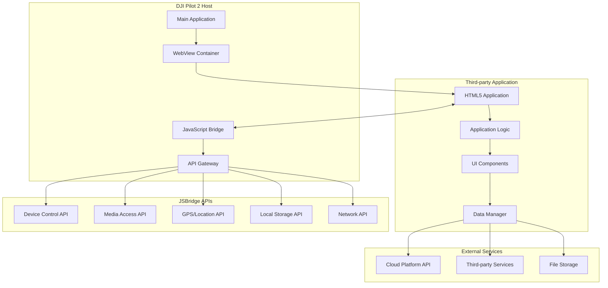
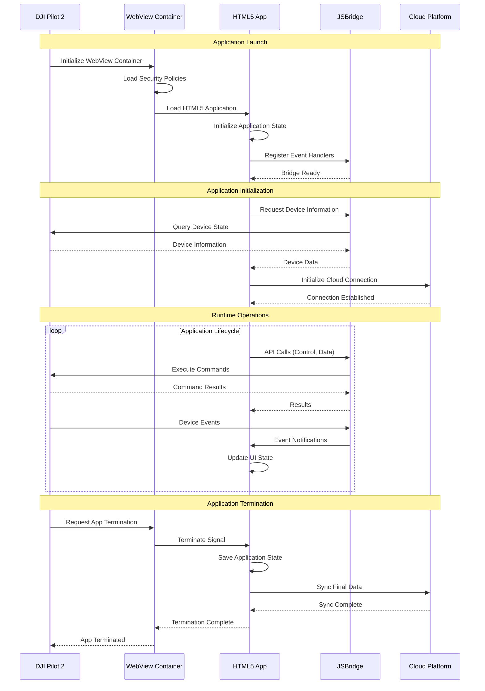

# Pilot Launch Third-party App - Pilot Function Set

## Overview

The Pilot Launch Third-party App feature enables DJI Pilot 2 to host and launch custom HTML5 applications through an integrated WebView container. This capability allows developers to create custom interfaces, specialized tools, and business-specific applications that run seamlessly within the DJI Pilot 2 environment while maintaining access to device APIs and JSBridge functionality.

## Supported Devices & Capabilities

| Device Type | Model | WebView Engine | JavaScript APIs | Custom UI Support |
|-------------|-------|----------------|-----------------|-------------------|
| **RC Plus** | DJI Pilot 2 | Chromium-based | Full JSBridge API | ✅ Responsive design |
| **RC Pro** | DJI Pilot 2 | Chromium-based | Full JSBridge API | ✅ Touch-optimized |
| **Smart Controller Enterprise** | DJI Pilot 2 | Chromium-based | Full JSBridge API | ✅ High-resolution |

### Application Types

| App Category | Description | Use Cases | Technical Requirements |
|-------------|-------------|-----------|----------------------|
| **Data Collection** | Custom data entry forms | Inspection reports, surveys | HTML forms, local storage |
| **Visualization** | Custom dashboards | Real-time monitoring, analytics | Canvas/WebGL, WebSocket |
| **Workflow Tools** | Business process apps | Task management, checklists | Progressive Web App features |
| **Integration Apps** | Third-party service connectors | CRM, ERP, field service | REST API integration |
| **Specialized Tools** | Domain-specific utilities | Agriculture, construction, security | Sensor APIs, GPS integration |

## Application Architecture



## Application Lifecycle



## JSBridge API Reference

### 1. Device Information API

**Get Device Information:**
```javascript
// Get basic device information
window.djiBridge.getDeviceInfo()
    .then(response => {
        const deviceInfo = response.data;
        console.log('Device SN:', deviceInfo.device_sn);
        console.log('Aircraft Model:', deviceInfo.aircraft_model);
        console.log('Firmware Version:', deviceInfo.firmware_version);
    })
    .catch(error => {
        console.error('Failed to get device info:', error);
    });

// Response format
{
    "code": 0,
    "message": "success",
    "data": {
        "device_sn": "1ZNDH7D0010078",
        "device_type": 119,
        "aircraft_model": "M350 RTK",
        "aircraft_sn": "1ZNBJ7J0010123",
        "firmware_version": "07.01.0100",
        "pilot_version": "2.4.10",
        "connection_status": "connected",
        "battery_level": 85,
        "gps_status": "fixed"
    }
}
```

### 2. Real-time Telemetry API

**Subscribe to Telemetry Updates:**
```javascript
// Subscribe to real-time telemetry
window.djiBridge.subscribeTelemetry(['position', 'attitude', 'battery'])
    .then(response => {
        console.log('Telemetry subscription active');
    })
    .catch(error => {
        console.error('Telemetry subscription failed:', error);
    });

// Handle telemetry events
window.djiBridge.onTelemetryUpdate = function(telemetryData) {
    updateDashboard(telemetryData);
};

// Telemetry data format
{
    "timestamp": 1701234567890,
    "position": {
        "latitude": 40.123456,
        "longitude": -74.123456,
        "altitude": 120.5,
        "relative_height": 100.0
    },
    "attitude": {
        "pitch": -2.1,
        "roll": 1.3,
        "yaw": 45.2
    },
    "battery": {
        "voltage": 25.2,
        "current": 2.5,
        "capacity": 85,
        "temperature": 28.5
    },
    "flight_mode": "auto",
    "armed": true,
    "in_air": true
}
```

### 3. Camera Control API

**Take Photo:**
```javascript
// Take photo with custom settings
const photoOptions = {
    camera_index: "52-0-0",
    photo_mode: 1, // Single photo
    photo_format: 0, // JPEG
    iso: 100,
    shutter_speed: "1/60",
    aperture: "f/2.8"
};

window.djiBridge.takePhoto(photoOptions)
    .then(response => {
        console.log('Photo taken:', response.data);
        handlePhotoResult(response.data);
    })
    .catch(error => {
        console.error('Photo capture failed:', error);
    });

// Response format
{
    "code": 0,
    "message": "Photo captured successfully",
    "data": {
        "photo_id": "photo_123456",
        "filename": "DJI_0001.jpg",
        "file_size": 5242880,
        "capture_time": "2023-12-01T10:30:00Z",
        "gps_location": {
            "lat": 40.123456,
            "lng": -74.123456,
            "alt": 120.5
        }
    }
}
```

### 4. Flight Control API

**Execute Custom Flight Command:**
```javascript
// Fly to specific coordinates
const flyToOptions = {
    latitude: 40.124456,
    longitude: -74.124456,
    altitude: 150.0,
    heading: 90.0,
    speed: 5.0,
    coordinate_system: "wgs84"
};

window.djiBridge.flyTo(flyToOptions)
    .then(response => {
        console.log('Flight command executed:', response.data);
        monitorFlightProgress(response.data.command_id);
    })
    .catch(error => {
        console.error('Flight command failed:', error);
    });

// Monitor flight progress
window.djiBridge.onFlightProgress = function(progressData) {
    updateFlightProgress(progressData);
};
```

### 5. Data Storage API

**Local Data Storage:**
```javascript
// Save application data locally
const appData = {
    inspection_results: [...],
    user_preferences: {...},
    offline_data: [...]
};

window.djiBridge.saveLocalData('inspection_app', appData)
    .then(response => {
        console.log('Data saved successfully');
    })
    .catch(error => {
        console.error('Data save failed:', error);
    });

// Load application data
window.djiBridge.loadLocalData('inspection_app')
    .then(response => {
        const savedData = response.data;
        restoreApplicationState(savedData);
    })
    .catch(error => {
        console.error('Data load failed:', error);
    });
```

## Application Development Framework

### 1. HTML5 Application Template

```html
<!DOCTYPE html>
<html lang="en">
<head>
    <meta charset="UTF-8">
    <meta name="viewport" content="width=device-width, initial-scale=1.0">
    <title>Custom Inspection App</title>
    <link rel="stylesheet" href="styles/app.css">
    <link rel="manifest" href="manifest.json">
</head>
<body>
    <div id="app">
        <header class="app-header">
            <h1>Inspection Dashboard</h1>
            <div class="device-status" id="deviceStatus">
                <span class="status-indicator"></span>
                <span class="device-info" id="deviceInfo">Connecting...</span>
            </div>
        </header>
        
        <main class="app-main">
            <section class="telemetry-panel">
                <div class="telemetry-card">
                    <h3>Position</h3>
                    <div id="positionData">--</div>
                </div>
                <div class="telemetry-card">
                    <h3>Battery</h3>
                    <div id="batteryData">--</div>
                </div>
                <div class="telemetry-card">
                    <h3>Flight Mode</h3>
                    <div id="flightModeData">--</div>
                </div>
            </section>
            
            <section class="controls-panel">
                <button id="takePhotoBtn" class="control-btn">Take Photo</button>
                <button id="startVideoBtn" class="control-btn">Start Recording</button>
                <button id="exportDataBtn" class="control-btn">Export Data</button>
            </section>
            
            <section class="data-panel">
                <h3>Inspection Data</h3>
                <div id="inspectionList" class="data-list">
                    <!-- Dynamic content -->
                </div>
            </section>
        </main>
        
        <footer class="app-footer">
            <div class="progress-bar" id="progressBar" style="display: none;">
                <div class="progress-fill"></div>
                <span class="progress-text">Processing...</span>
            </div>
        </footer>
    </div>
    
    <script src="js/djiBridge.js"></script>
    <script src="js/app.js"></script>
</body>
</html>
```

### 2. Application JavaScript Framework

```javascript
class InspectionApp {
    constructor() {
        this.deviceInfo = null;
        this.telemetryData = null;
        this.inspectionData = [];
        this.isConnected = false;
        
        this.initializeApp();
    }
    
    async initializeApp() {
        try {
            // Wait for JSBridge to be ready
            await this.waitForBridge();
            
            // Initialize device connection
            await this.initializeDevice();
            
            // Setup event handlers
            this.setupEventHandlers();
            
            // Subscribe to telemetry
            await this.subscribeToTelemetry();
            
            // Restore app state
            await this.restoreAppState();
            
            console.log('Inspection app initialized successfully');
            
        } catch (error) {
            console.error('App initialization failed:', error);
            this.showError('Failed to initialize application');
        }
    }
    
    async waitForBridge() {
        return new Promise((resolve, reject) => {
            if (window.djiBridge && window.djiBridge.ready) {
                resolve();
                return;
            }
            
            let attempts = 0;
            const maxAttempts = 50; // 5 seconds timeout
            
            const checkBridge = () => {
                attempts++;
                
                if (window.djiBridge && window.djiBridge.ready) {
                    resolve();
                } else if (attempts >= maxAttempts) {
                    reject(new Error('JSBridge not available'));
                } else {
                    setTimeout(checkBridge, 100);
                }
            };
            
            checkBridge();
        });
    }
    
    async initializeDevice() {
        try {
            const response = await window.djiBridge.getDeviceInfo();
            this.deviceInfo = response.data;
            this.isConnected = true;
            
            this.updateDeviceStatus();
            console.log('Device connected:', this.deviceInfo);
            
        } catch (error) {
            console.error('Device initialization failed:', error);
            this.isConnected = false;
            throw error;
        }
    }
    
    setupEventHandlers() {
        // JSBridge event handlers
        window.djiBridge.onTelemetryUpdate = (data) => {
            this.handleTelemetryUpdate(data);
        };
        
        window.djiBridge.onDeviceDisconnected = () => {
            this.handleDeviceDisconnection();
        };
        
        window.djiBridge.onPhotoTaken = (data) => {
            this.handlePhotoTaken(data);
        };
        
        // UI event handlers
        document.getElementById('takePhotoBtn').addEventListener('click', () => {
            this.takePhoto();
        });
        
        document.getElementById('startVideoBtn').addEventListener('click', () => {
            this.toggleVideoRecording();
        });
        
        document.getElementById('exportDataBtn').addEventListener('click', () => {
            this.exportInspectionData();
        });
        
        // App lifecycle handlers
        window.addEventListener('beforeunload', () => {
            this.saveAppState();
        });
        
        document.addEventListener('visibilitychange', () => {
            if (document.hidden) {
                this.saveAppState();
            }
        });
    }
    
    async subscribeToTelemetry() {
        try {
            await window.djiBridge.subscribeTelemetry([
                'position', 'attitude', 'battery', 'flight_mode'
            ]);
            console.log('Telemetry subscription active');
        } catch (error) {
            console.error('Telemetry subscription failed:', error);
        }
    }
    
    handleTelemetryUpdate(data) {
        this.telemetryData = data;
        this.updateTelemetryDisplay();
    }
    
    updateTelemetryDisplay() {
        if (!this.telemetryData) return;
        
        // Update position display
        const positionEl = document.getElementById('positionData');
        if (this.telemetryData.position) {
            const pos = this.telemetryData.position;
            positionEl.innerHTML = `
                <div>Lat: ${pos.latitude.toFixed(6)}</div>
                <div>Lng: ${pos.longitude.toFixed(6)}</div>
                <div>Alt: ${pos.altitude.toFixed(1)}m</div>
            `;
        }
        
        // Update battery display
        const batteryEl = document.getElementById('batteryData');
        if (this.telemetryData.battery) {
            const bat = this.telemetryData.battery;
            batteryEl.innerHTML = `
                <div class="battery-level">${bat.capacity}%</div>
                <div>Voltage: ${bat.voltage}V</div>
                <div>Temp: ${bat.temperature}°C</div>
            `;
            
            // Update battery indicator color
            const indicator = batteryEl.querySelector('.battery-level');
            if (bat.capacity < 20) {
                indicator.className = 'battery-level low';
            } else if (bat.capacity < 50) {
                indicator.className = 'battery-level medium';
            } else {
                indicator.className = 'battery-level high';
            }
        }
        
        // Update flight mode display
        const flightModeEl = document.getElementById('flightModeData');
        flightModeEl.textContent = this.telemetryData.flight_mode || 'Unknown';
    }
    
    async takePhoto() {
        try {
            this.showProgress('Taking photo...');
            
            const photoOptions = {
                camera_index: "52-0-0",
                photo_mode: 1,
                photo_format: 0
            };
            
            const response = await window.djiBridge.takePhoto(photoOptions);
            
            // Create inspection record
            const inspectionRecord = {
                id: Date.now(),
                type: 'photo',
                timestamp: new Date().toISOString(),
                location: this.telemetryData?.position,
                photo_data: response.data,
                notes: ''
            };
            
            this.inspectionData.push(inspectionRecord);
            this.updateInspectionList();
            
            this.hideProgress();
            this.showSuccess('Photo captured successfully');
            
        } catch (error) {
            console.error('Photo capture failed:', error);
            this.hideProgress();
            this.showError('Failed to take photo');
        }
    }
    
    async exportInspectionData() {
        try {
            this.showProgress('Exporting data...');
            
            const exportData = {
                device_info: this.deviceInfo,
                inspection_records: this.inspectionData,
                export_timestamp: new Date().toISOString(),
                app_version: '1.0.0'
            };
            
            // Upload to cloud platform
            const response = await fetch('/api/v1/inspections/export', {
                method: 'POST',
                headers: {
                    'Content-Type': 'application/json',
                    'Authorization': `Bearer ${await this.getAuthToken()}`
                },
                body: JSON.stringify(exportData)
            });
            
            if (response.ok) {
                const result = await response.json();
                this.showSuccess(`Data exported successfully. Export ID: ${result.export_id}`);
            } else {
                throw new Error(`Export failed: ${response.statusText}`);
            }
            
            this.hideProgress();
            
        } catch (error) {
            console.error('Data export failed:', error);
            this.hideProgress();
            this.showError('Failed to export data');
        }
    }
    
    async saveAppState() {
        try {
            const appState = {
                inspection_data: this.inspectionData,
                last_save: new Date().toISOString()
            };
            
            await window.djiBridge.saveLocalData('inspection_app_state', appState);
        } catch (error) {
            console.error('Failed to save app state:', error);
        }
    }
    
    async restoreAppState() {
        try {
            const response = await window.djiBridge.loadLocalData('inspection_app_state');
            
            if (response.data) {
                this.inspectionData = response.data.inspection_data || [];
                this.updateInspectionList();
            }
        } catch (error) {
            // First run or no saved state
            console.log('No saved app state found');
        }
    }
    
    updateInspectionList() {
        const listEl = document.getElementById('inspectionList');
        listEl.innerHTML = '';
        
        this.inspectionData.forEach(record => {
            const recordEl = document.createElement('div');
            recordEl.className = 'inspection-record';
            recordEl.innerHTML = `
                <div class="record-header">
                    <span class="record-type">${record.type.toUpperCase()}</span>
                    <span class="record-time">${new Date(record.timestamp).toLocaleString()}</span>
                </div>
                <div class="record-location">
                    ${record.location ? 
                        `Lat: ${record.location.latitude.toFixed(6)}, Lng: ${record.location.longitude.toFixed(6)}` :
                        'Location not available'
                    }
                </div>
                <div class="record-actions">
                    <button onclick="app.viewRecord('${record.id}')">View</button>
                    <button onclick="app.deleteRecord('${record.id}')">Delete</button>
                </div>
            `;
            listEl.appendChild(recordEl);
        });
    }
    
    // Utility methods for UI feedback
    showProgress(message) {
        const progressEl = document.getElementById('progressBar');
        progressEl.style.display = 'block';
        progressEl.querySelector('.progress-text').textContent = message;
    }
    
    hideProgress() {
        document.getElementById('progressBar').style.display = 'none';
    }
    
    showSuccess(message) {
        // Implement success notification
        console.log('Success:', message);
    }
    
    showError(message) {
        // Implement error notification
        console.error('Error:', message);
    }
}

// Initialize application when DOM is ready
document.addEventListener('DOMContentLoaded', () => {
    window.app = new InspectionApp();
});
```

### 3. Application Manifest

```json
{
    "name": "DJI Inspection App",
    "short_name": "Inspection",
    "description": "Custom inspection application for DJI aircraft",
    "version": "1.0.0",
    "manifest_version": 2,
    
    "icons": [
        {
            "src": "icons/icon-192.png",
            "sizes": "192x192",
            "type": "image/png"
        },
        {
            "src": "icons/icon-512.png", 
            "sizes": "512x512",
            "type": "image/png"
        }
    ],
    
    "start_url": "index.html",
    "display": "standalone",
    "orientation": "landscape",
    "theme_color": "#2196F3",
    "background_color": "#ffffff",
    
    "permissions": [
        "device_control",
        "camera_access",
        "gps_location",
        "file_storage",
        "network_access"
    ],
    
    "dji_bridge_api_version": "2.0",
    "min_pilot_version": "2.4.0",
    
    "app_config": {
        "auto_start": false,
        "full_screen": false,
        "hardware_acceleration": true,
        "offline_capable": true
    }
}
```

## Cloud Platform Integration

### 1. App Registration API

```http
POST /manage/api/v1/apps/register
Authorization: Bearer {jwt_token}
Content-Type: application/json

{
    "app_name": "Custom Inspection App",
    "app_version": "1.0.0",
    "app_package": "com.company.inspection",
    "app_url": "https://apps.company.com/inspection/",
    "permissions": ["device_control", "camera_access", "gps_location"],
    "supported_devices": ["M350", "M300", "M30"],
    "manifest_url": "https://apps.company.com/inspection/manifest.json"
}

Response:
{
    "code": 0,
    "message": "Application registered successfully",
    "data": {
        "app_id": "app_123456",
        "registration_time": "2023-12-01T10:00:00Z",
        "approval_status": "pending"
    }
}
```

### 2. App Launch API

```http
POST /manage/api/v1/devices/{device_sn}/launch-app
Authorization: Bearer {jwt_token}
Content-Type: application/json

{
    "app_id": "app_123456",
    "launch_params": {
        "workspace_id": "workspace_123",
        "mission_id": "mission_456",
        "custom_config": {}
    }
}

Response:
{
    "code": 0,
    "message": "App launch request sent",
    "data": {
        "launch_id": "launch_789",
        "status": "launching"
    }
}
```

This Third-party App feature enables developers to create custom HTML5 applications that run within DJI Pilot 2 with full access to aircraft control and data APIs.