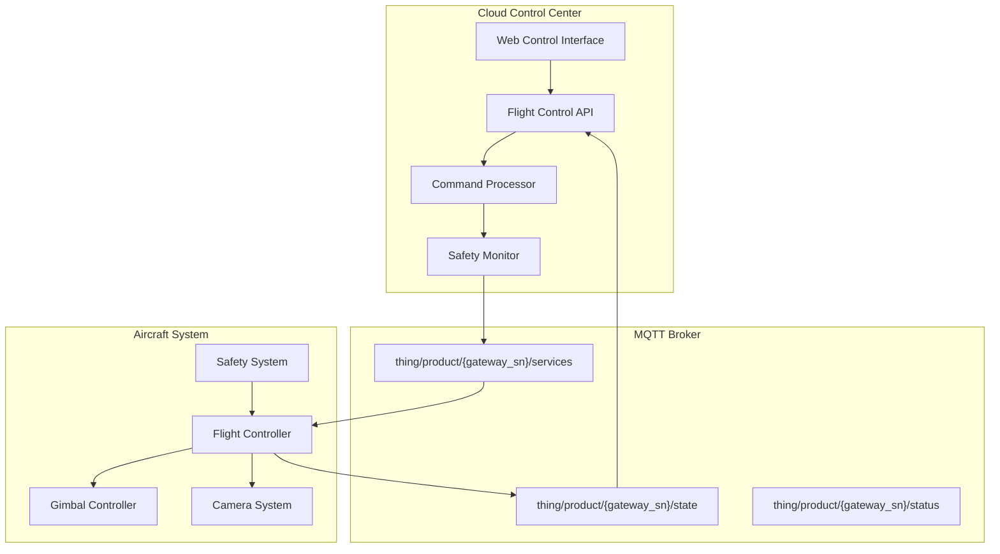
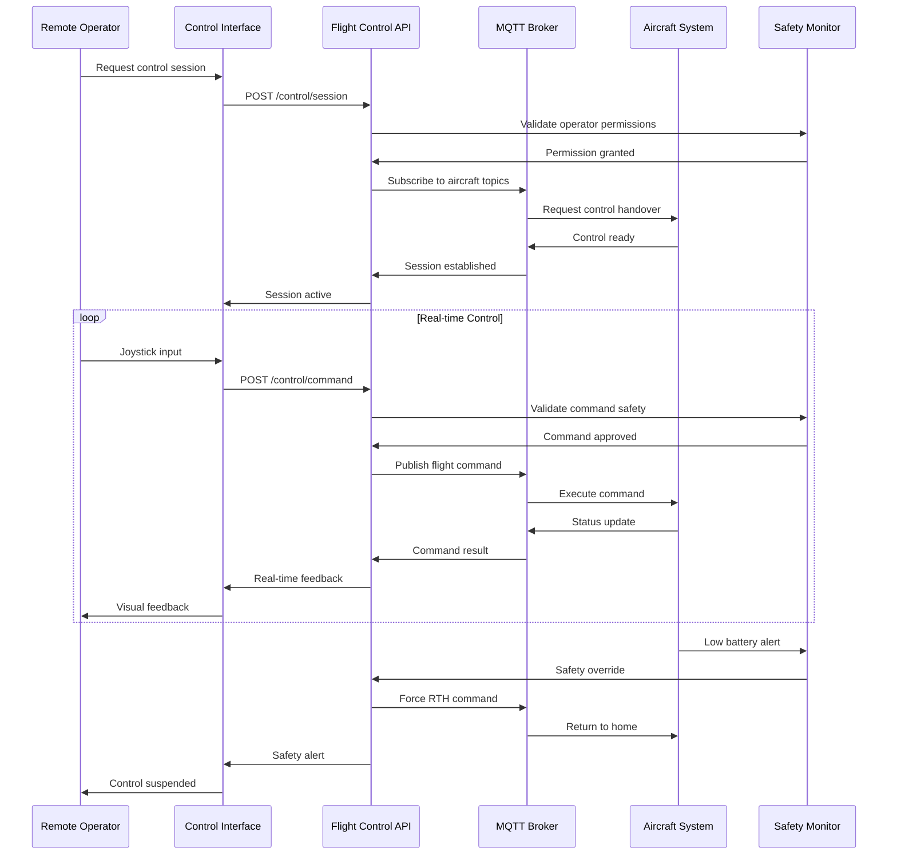

# Live Flight Controls / Remote Control

## Overview

The Live Flight Controls functionality enables real-time remote control of DJI aircraft through the cloud platform. This feature allows operators to control aircraft remotely via MQTT commands, providing direct flight control capabilities when traditional RC connections are not available or when centralized control is required.

## Supported Devices

| Device Model | Remote Control Support | Control Range | Latency | Notes |
|--------------|----------------------|---------------|---------|-------|
| DJI Mini 3 | ✅ Full | 15km | <200ms | Standard controls |
| DJI Air 2S | ✅ Full | 18km | <150ms | Enhanced precision |
| DJI Mavic 3 | ✅ Full | 20km | <100ms | Professional grade |
| DJI M30/M30T | ✅ Full | 25km | <100ms | Enterprise features |
| DJI M300 RTK | ✅ Full | 30km | <80ms | RTK precision |
| DJI Matrice 30 | ✅ Full | 25km | <100ms | Industrial grade |
| DJI M400 RTK | ✅ Full | 35km | <80ms | Survey precision |

## Architecture Overview



## Control Commands

### Flight Control Commands

| Command | Method | Parameters | Description |
|---------|---------|------------|-------------|
| Takeoff | `flight_takeoff` | `height`: float | Automated takeoff to specified height |
| Landing | `flight_landing` | `force`: boolean | Land aircraft (emergency if forced) |
| Go Home | `flight_go_home` | - | Return to home point |
| Joystick Control | `flight_joystick` | `x`, `y`, `z`, `yaw` | Manual flight control |
| Emergency Stop | `flight_emergency_stop` | - | Immediate motor shutdown |

### Gimbal Control Commands

| Command | Method | Parameters | Description |
|---------|---------|------------|-------------|
| Gimbal Rotation | `gimbal_rotate` | `pitch`, `roll`, `yaw`, `time` | Rotate gimbal to position |
| Gimbal Reset | `gimbal_reset` | - | Reset gimbal to center |
| Follow Mode | `gimbal_follow_mode` | `mode`: enum | Set follow mode (FPV/Follow/Free) |

### Camera Control Commands

| Command | Method | Parameters | Description |
|---------|---------|------------|-------------|
| Take Photo | `camera_take_photo` | `mode`: enum | Capture photo (single/burst/interval) |
| Start Recording | `camera_start_record` | `resolution`, `fps` | Begin video recording |
| Stop Recording | `camera_stop_record` | - | End video recording |
| Zoom Control | `camera_zoom` | `factor`: float | Digital/optical zoom |

## MQTT Topic Structure

### Command Topics
```
# Flight Control Commands
thing/product/{gateway_sn}/services
├── flight_takeoff
├── flight_landing  
├── flight_go_home
├── flight_joystick
└── flight_emergency_stop

# Gimbal Control Commands
thing/product/{gateway_sn}/services
├── gimbal_rotate
├── gimbal_reset
└── gimbal_follow_mode

# Camera Control Commands  
thing/product/{gateway_sn}/services
├── camera_take_photo
├── camera_start_record
├── camera_stop_record
└── camera_zoom
```

### Status Topics
```
# Flight Status
thing/product/{gateway_sn}/state
├── flight_status
├── position_info
├── battery_info
└── signal_quality

# Control Feedback
thing/product/{gateway_sn}/events
├── command_result
├── safety_alert
└── control_takeover
```

## API Endpoints

### Flight Control API

#### Initiate Remote Control Session
```http
POST /api/v1/aircraft/{sn}/control/session
Content-Type: application/json

{
  "operator_id": "operator_123",
  "control_mode": "remote", 
  "timeout": 300,
  "safety_limits": {
    "max_altitude": 120,
    "max_distance": 500,
    "no_fly_zones": true
  }
}
```

#### Send Flight Command
```http
POST /api/v1/aircraft/{sn}/control/command
Content-Type: application/json

{
  "command": "flight_joystick",
  "parameters": {
    "x": 0.5,
    "y": -0.3, 
    "z": 0.1,
    "yaw": 0.2
  },
  "timestamp": 1640995200000
}
```

#### Emergency Control Override
```http
POST /api/v1/aircraft/{sn}/control/emergency
Content-Type: application/json

{
  "action": "emergency_stop",
  "reason": "obstacle_detected",
  "operator_id": "operator_123"
}
```

## Message Schemas

### Flight Control Command
```json
{
  "tid": "flight_cmd_001",
  "bid": "12345678-1234-1234-1234-123456789012",
  "timestamp": 1640995200000,
  "method": "flight_joystick",
  "data": {
    "x": 0.5,
    "y": -0.3,
    "z": 0.1, 
    "yaw": 0.2,
    "mode": 1
  }
}
```

### Control Status Response
```json
{
  "tid": "flight_cmd_001",
  "bid": "12345678-1234-1234-1234-123456789012", 
  "timestamp": 1640995201000,
  "method": "flight_joystick",
  "result": 0,
  "output": {
    "status": "executing",
    "position": {
      "lat": 40.123456,
      "lng": 116.123456,
      "alt": 50.5,
      "heading": 90
    },
    "speed": {
      "vx": 2.5,
      "vy": -1.2,
      "vz": 0.3
    }
  }
}
```

## WebSocket Events

### Control Session Events
```javascript
// Session started
{
  "event": "control_session_started",
  "sn": "aircraft_001", 
  "operator": "operator_123",
  "timestamp": 1640995200000
}

// Control command executed
{
  "event": "control_command_executed",
  "sn": "aircraft_001",
  "command": "flight_joystick", 
  "result": "success",
  "timestamp": 1640995201000
}

// Safety alert
{
  "event": "safety_alert",
  "sn": "aircraft_001",
  "alert_type": "low_battery",
  "severity": "warning",
  "message": "Battery level below 20%"
}
```

## Control Flow Sequence



## Safety Systems

### Pre-flight Safety Checks
- Operator authentication and authorization
- Aircraft system health verification
- GPS signal strength validation
- Battery level minimum requirements
- No-fly zone boundary checks
- Weather condition assessment

### Real-time Safety Monitoring
- Signal quality monitoring
- Obstacle detection integration
- Geofence boundary enforcement
- Battery level tracking
- Emergency landing protocols
- Control takeover procedures

### Emergency Procedures
- Automatic return-to-home on signal loss
- Emergency stop with motor shutdown
- Force landing in critical situations
- Control handover to local operator
- Flight data logging for analysis

## Code Example

```java
@Service
@Slf4j
public class RemoteFlightControlService extends AbstractDeviceService {
    
    @Autowired
    private SafetyMonitorService safetyMonitor;
    
    @Autowired
    private FlightDataLogger flightLogger;
    
    @Value("${flight.control.max-session-duration:1800}")
    private int maxSessionDuration;
    
    private final Map<String, ControlSession> activeSessions = new ConcurrentHashMap<>();
    
    /**
     * Initiate remote control session
     */
    public ControlSessionResponse initiateControlSession(String deviceSn, 
                                                       ControlSessionRequest request) {
        
        // Validate operator permissions
        if (!safetyMonitor.validateOperatorPermissions(request.getOperatorId(), deviceSn)) {
            throw new UnauthorizedException("Insufficient permissions for remote control");
        }
        
        // Check aircraft readiness
        DeviceStatusInfo deviceStatus = getDeviceStatus(deviceSn);
        if (!deviceStatus.isControlReady()) {
            throw new DeviceNotReadyException("Aircraft not ready for remote control");
        }
        
        // Create control session
        ControlSession session = ControlSession.builder()
                .sessionId(UUID.randomUUID().toString())
                .deviceSn(deviceSn)
                .operatorId(request.getOperatorId())
                .startTime(Instant.now())
                .timeout(Duration.ofSeconds(request.getTimeout()))
                .safetyLimits(request.getSafetyLimits())
                .build();
        
        // Request control handover from aircraft
        requestControlHandover(deviceSn, session);
        
        activeSessions.put(deviceSn, session);
        
        log.info("Remote control session initiated for device: {}, operator: {}", 
                deviceSn, request.getOperatorId());
        
        return ControlSessionResponse.builder()
                .sessionId(session.getSessionId())
                .status("active")
                .expiresAt(session.getStartTime().plus(session.getTimeout()))
                .build();
    }
    
    /**
     * Execute flight control command
     */
    public ControlCommandResponse executeFlightCommand(String deviceSn, 
                                                     FlightControlCommand command) {
        
        ControlSession session = activeSessions.get(deviceSn);
        if (session == null || session.isExpired()) {
            throw new InvalidSessionException("No active control session");
        }
        
        // Safety validation
        SafetyValidationResult validation = safetyMonitor.validateCommand(
                deviceSn, command, session.getSafetyLimits());
        
        if (!validation.isValid()) {
            log.warn("Flight command rejected by safety monitor: {}", validation.getReason());
            return ControlCommandResponse.rejected(validation.getReason());
        }
        
        // Build MQTT message
        CommonTopicResponse mqttMessage = buildFlightControlMessage(command);
        
        // Send command via MQTT
        String topic = TopicConst.THING_MODEL_PRE + deviceSn + TopicConst.SERVICES_SUF;
        
        try {
            publishWithReply(topic, mqttMessage, (reply, isSuccess) -> {
                handleCommandResponse(deviceSn, command, reply, isSuccess);
            });
            
            // Log flight command
            flightLogger.logCommand(deviceSn, command, session.getOperatorId());
            
            return ControlCommandResponse.success("Command executed");
            
        } catch (Exception e) {
            log.error("Failed to execute flight command for device: {}", deviceSn, e);
            return ControlCommandResponse.error("Command execution failed");
        }
    }
    
    /**
     * Emergency control override
     */
    public void emergencyOverride(String deviceSn, EmergencyAction action, String reason) {
        
        log.warn("Emergency override initiated for device: {}, action: {}, reason: {}", 
                deviceSn, action, reason);
        
        CommonTopicResponse emergencyMessage = CommonTopicResponse.builder()
                .tid(UUID.randomUUID().toString())
                .method(action.getMethodName())
                .data(Map.of(
                    "force", true,
                    "reason", reason,
                    "timestamp", System.currentTimeMillis()
                ))
                .build();
        
        String topic = TopicConst.THING_MODEL_PRE + deviceSn + TopicConst.SERVICES_SUF;
        publish(topic, emergencyMessage);
        
        // Terminate control session
        ControlSession session = activeSessions.remove(deviceSn);
        if (session != null) {
            flightLogger.logEmergencyOverride(deviceSn, action, reason, session.getOperatorId());
        }
        
        // Notify WebSocket clients
        webSocketManager.sendToDevice(deviceSn, Map.of(
            "event", "emergency_override",
            "action", action.name(),
            "reason", reason,
            "timestamp", System.currentTimeMillis()
        ));
    }
    
    /**
     * Build flight control MQTT message
     */
    private CommonTopicResponse buildFlightControlMessage(FlightControlCommand command) {
        return CommonTopicResponse.builder()
                .tid(UUID.randomUUID().toString())
                .method(command.getMethod())
                .data(command.getParameters())
                .timestamp(System.currentTimeMillis())
                .build();
    }
    
    /**
     * Handle command response from aircraft
     */
    private void handleCommandResponse(String deviceSn, FlightControlCommand command, 
                                     CommonTopicReceiver reply, boolean isSuccess) {
        
        if (isSuccess && reply.getResult() == 0) {
            log.debug("Flight command executed successfully: {}", command.getMethod());
            
            // Update telemetry data
            if (reply.getOutput() != null) {
                updateDeviceTelemetry(deviceSn, reply.getOutput());
            }
            
        } else {
            log.error("Flight command failed: {}, error: {}", 
                    command.getMethod(), reply.getResult());
            
            // Handle command failure
            handleCommandFailure(deviceSn, command, reply);
        }
        
        // Send WebSocket update
        webSocketManager.sendToDevice(deviceSn, Map.of(
            "event", "control_command_result",
            "command", command.getMethod(),
            "result", isSuccess ? "success" : "failure",
            "timestamp", System.currentTimeMillis()
        ));
    }
    
    /**
     * Request control handover from aircraft
     */
    private void requestControlHandover(String deviceSn, ControlSession session) {
        
        CommonTopicResponse handoverMessage = CommonTopicResponse.builder()
                .tid(UUID.randomUUID().toString())
                .method("control_handover")
                .data(Map.of(
                    "session_id", session.getSessionId(),
                    "operator_id", session.getOperatorId(),
                    "timeout", session.getTimeout().getSeconds(),
                    "safety_limits", session.getSafetyLimits()
                ))
                .build();
        
        String topic = TopicConst.THING_MODEL_PRE + deviceSn + TopicConst.SERVICES_SUF;
        
        publishWithReply(topic, handoverMessage, (reply, isSuccess) -> {
            if (isSuccess && reply.getResult() == 0) {
                log.info("Control handover accepted for device: {}", deviceSn);
            } else {
                log.error("Control handover rejected for device: {}, reason: {}", 
                        deviceSn, reply.getResult());
                activeSessions.remove(deviceSn);
            }
        });
    }
    
    @Scheduled(fixedRate = 30000) // Check every 30 seconds
    public void cleanupExpiredSessions() {
        activeSessions.entrySet().removeIf(entry -> {
            ControlSession session = entry.getValue();
            if (session.isExpired()) {
                log.info("Control session expired for device: {}", entry.getKey());
                return true;
            }
            return false;
        });
    }
}

/**
 * Control session data model
 */
@Data
@Builder
public class ControlSession {
    private String sessionId;
    private String deviceSn;
    private String operatorId;
    private Instant startTime;
    private Duration timeout;
    private SafetyLimits safetyLimits;
    
    public boolean isExpired() {
        return Instant.now().isAfter(startTime.plus(timeout));
    }
}

/**
 * Flight control command model
 */
@Data
@Builder
public class FlightControlCommand {
    private String method;
    private Map<String, Object> parameters;
    private long timestamp;
    private String operatorId;
}

/**
 * Safety limits configuration
 */
@Data
@Builder
public class SafetyLimits {
    private double maxAltitude;
    private double maxDistance;
    private boolean noFlyZonesEnabled;
    private double minBatteryLevel;
    private List<GeofenceArea> geofenceAreas;
}
```

## Performance Optimization

### Command Latency Reduction
- Dedicated MQTT connections for control commands
- Command prioritization and queuing
- Predictive command caching
- Network path optimization

### Safety Response Time
- Real-time safety monitoring threads
- Pre-computed emergency responses
- Instant override capability
- Hardware-level safety integration

### Bandwidth Management
- Command data compression
- Efficient telemetry streaming
- Quality of service prioritization
- Network condition adaptation

## Error Handling

### Connection Failures
- Automatic retry mechanisms
- Fallback communication channels
- Graceful degradation strategies
- Emergency protocols activation

### Command Execution Errors
- Detailed error classification
- Recovery action suggestions
- Automatic error correction
- Operator notification systems

### Safety Violations
- Immediate command rejection
- Safety override activation
- Incident logging and reporting
- Post-event analysis tools